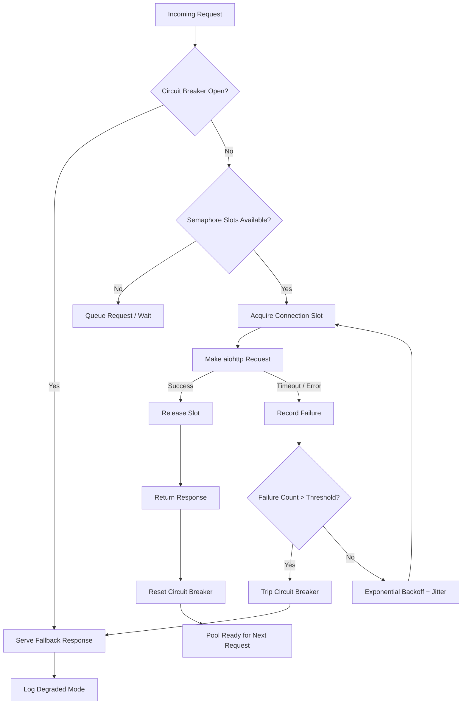

| Difficulty | Channel | Tags |
|---|---|---|
| advanced | backend | asyncio, aiohttp, concurrency |

At 3am on an ordinary Tuesday, Netflix's API gateway started hammering the database directly, bypassing every cache layer that stood between it and catastrophe [1]. The circuit breaker tripped instantly. 157 out of 200 server instances seamlessly degraded, serving fallback responses from a local query cache. Members kept streaming. Nobody noticed. That same pattern evolved into Hystrix, now processing over 200 billion semaphore-isolated command executions per day [1]. The lesson? Your connection pool isn't just plumbing — it's the difference between a quiet night and a war room.

---

> ### Real-World Case — Netflix
>
> Netflix's API gateway calls ~60 downstream service dependencies. A bug caused the API to bypass a shared cache and hammer the database directly, triggering database throttling. The circuit breaker automatically tripped, serving fallback responses from a local query cache—157 of 200 server instances seamlessly degraded while video views remained virtually unaffected.
>
> | | |
> |---|---|
> | **Challenge** | When a shared cache was disabled to work around a bug, all database traffic flooded the database, which began throttling. Without isolation, this would have caused cascading failures across all API servers, potentially preventing members from streaming content. |
> | **Solution** | Netflix built a service dependency decorator layer implementing the circuit breaker pattern (inspired by Michael Nygard's 'Release It!'). It tracks request results over a 10-second rolling window per service dependency. When error rates exceed a threshold, the circuit 'trips' and immediately serves fallback responses (custom fallback, fail-silent, or fail-fast) without contacting the failing service. A dashboard provides real-time visibility into circuit states across all ~60 dependencies. |
> | **Outcome** | During the cache-bypass incident, the circuit breaker automatically tripped for database selects. 157 of 200 API server instances served fallback responses from a local query cache. Overall video views showed minimal impact—members continued streaming without noticing the infrastructure issue. This same pattern evolved into Hystrix, which processes 10+ billion thread-isolated and 200+ billion semaphore-isolated command executions per day across Netflix's infrastructure. |
> | **Lesson** | Every service dependency should have a fallback strategy. Circuit breakers prevent cascade failures by failing fast when downstream services are unhealthy, and the system should degrade gracefully (stale data, cached responses, defaults) rather than collapse entirely. The key insight: fallbacks must be simpler than the primary path, and they must be exercised regularly. |

---

## Hook — When Your Connection Pool Becomes a Loaded Gun

Picture this: your Python microservice calls 60 downstream dependencies. One day, a misconfigured cache layer stops responding. Suddenly, every connection slot in your pool is occupied waiting for a timeout that will never resolve. New requests pile up. Your event loop freezes. Users see a spinning wheel that never stops. This is not hypothetical — it is the exact failure mode that Netflix faced, and it is one of the most common cascading failures in async Python services today. The culprit is almost never the downstream service. It is the connection pool that refused to say 'no' when it should have.

## Problem — The Silent Killer of Async Services

When you build an aiohttp-based service, the default behavior is dangerously optimistic. You create a `ClientSession`, fire off requests, and trust that everything will work. But consider what happens under load: your service opens 100 concurrent connections. A downstream dependency slows from 50ms to 5 seconds. Each connection now holds a slot for 100x longer than expected. Within seconds, your pool is completely saturated. New requests cannot proceed. The event loop is still running, but nothing is getting through. This is the classic connection pool exhaustion problem, and it is deceptively hard to detect until users start complaining. Moreover, without a circuit breaker, your service keeps hammering the failing dependency, making the problem worse for everyone — not just you. You are now actively contributing to the cascade failure that could take down the entire system. The four critical gaps in most naive aiohttp implementations are: no semaphore-based concurrency limiting, no exponential backoff on retries, no circuit breaker to stop hammering failing services, and no graceful degradation that serves stale data instead of errors.

## Real-World Case — Netflix's Circuit Breaker Saves 157 Servers

Netflix's API gateway calls approximately 60 downstream service dependencies. A bug caused the API to bypass a shared cache and hammer the database directly, triggering database throttling [1]. The circuit breaker automatically tripped, serving fallback responses from a local query cache. 157 out of 200 server instances seamlessly degraded while video views remained virtually unaffected. Members continued streaming without noticing the infrastructure issue. This incident demonstrates that the circuit breaker pattern is not theoretical — it is battle-tested at one of the world's largest streaming platforms. The key insight from Netflix's experience is that the circuit breaker does not just protect your service; it protects the entire ecosystem. By refusing to send requests to a failing dependency, it gives that dependency room to recover instead of being overwhelmed by retry storms [1]. This same pattern evolved into Hystrix, which Netflix later open-sourced. Today, Hystrix processes 10+ billion thread-isolated and 200+ billion semaphore-isolated command executions per day across Netflix's infrastructure.

## Deep Dive — The Four Pillars of a Bulletproof Connection Pool

Building on Netflix's lesson, a production-grade aiohttp connection pool manager rests on four interconnected patterns that work together to create resilience.

**Semaphore-Based Concurrency Limiting**: A semaphore acts as a gatekeeper, allowing only a fixed number of concurrent connections at any time. When all slots are occupied, new requests wait instead of overwhelming the system. In Python's asyncio, `asyncio.Semaphore` provides this natively and integrates cleanly with async context managers [2]. The critical decision here is choosing the right pool size — too small and you starve your service of throughput, too large and you risk overwhelming downstream services.

**Exponential Backoff with Jitter**: When a connection fails, simply retrying immediately creates a thundering herd effect. Exponential backoff introduces increasing delays between retries (1s, 2s, 4s, 8s...), while jitter adds randomness to prevent synchronized retries from all clients. AWS recommends this approach explicitly in their architecture best practices [6]. Without jitter, all clients retry at the same intervals, creating periodic load spikes that can be worse than the original failure.

**Circuit Breaker Pattern**: The circuit breaker monitors failure rates and trips when they exceed a threshold, temporarily stopping all requests to the failing service. It has three states: closed (normal operation), open (requests blocked), and half-open (testing recovery). This prevents cascade failures by giving failing services room to breathe. The pattern originated in electrical engineering and was popularized in software by Michael Nygard's 'Release It!' [4].

**Graceful Degradation**: Instead of returning errors when the circuit is open, a well-designed pool serves stale data from a local cache or returns a default response. Netflix calls this 'fallback responses' — degraded but functional service is always better than complete failure [1].

Here is how these four pillars interact under load:

## Workflow — The Request Lifecycle Under Stress

The following diagram illustrates how a request flows through the connection pool manager, showing decision points for each resilience pattern:

## Code Example — Building the Connection Pool Manager

Here is a complete, production-oriented implementation that combines all four pillars into a single `ConnectionPoolManager` class. Each section is annotated to explain the design decisions:

## Lessons Learned — What Netflix's War Story Teaches You

After tracing through the problem, the real-world case, and the implementation, here are the actionable takeaways:

**Always set a pool size limit.** The default aiohttp behavior of unlimited connections is a trap. Start with a semaphore size of 100 and tune based on your actual downstream dependency capacity [2].

**Never retry without backoff.** Immediate retries under load create thundering herd effects that can be worse than the original failure. Always use exponential backoff with jitter [6].

**Implement circuit breakers before you need them.** By the time you are debugging a cascade failure at 3am, it is too late. Netflix's circuit breaker saved 157 servers because it was already in place before the incident occurred [1].

**Serve stale data over no data.** A fallback response from a local cache is infinitely better than a 503 error. Design your degradation strategy before building your happy path.

**Monitor connection pool metrics.** Track pool utilization, wait times, circuit breaker state transitions, and retry rates. Without metrics, you are flying blind. Python's asyncio provides `loop.time()` for precise timing without wall-clock drift [5].

**Clean up on shutdown.** One of the most common pitfalls is connection leaks during application shutdown. Always call `await session.close()` in a finally block or shutdown hook [2].

The moral of the story is simple: resilience is not a feature you bolt on after a incident. It is an architectural decision you make from day one. Netflix did not build their circuit breaker after the cache-bypass incident — it was already there, waiting to save them. Build your connection pool with the assumption that things will go wrong, because they will.

---

## Connection Pool Request Lifecycle Under Stress

<strong>Original Interview Question</strong>

**Q:** How would you implement a connection pool manager for aiohttp that handles graceful degradation under high load and connection timeouts?

**A:** Implement a connection pool manager for aiohttp using a semaphore to limit concurrent connections, exponential backoff for retrying failed requests, and circuit breaker pattern to gracefully degrade under high load and connection timeouts.

## Conclusion

Netflix's cache-bypass incident is a reminder that resilience is not a feature — it is an architecture. The connection pool manager you build today determines whether your service degrades gracefully at 3am or cascades into a full outage. Start with a semaphore to cap concurrent connections, add exponential backoff with jitter to prevent retry storms, wire in a circuit breaker to stop hammering failing services, and always — always — have a fallback response ready. The code is not complicated. The hard part is building it before you need it. Do that, and your next incident will be a non-event.

---

## References

1. [Netflix incident report — Making Netflix API more resilient](http://kamalua07.blogspot.com/2011/12/making-netflix-api-more-resilient.html) — blog
2. [aiohttp documentation — Client session and connection pooling](https://docs.aiohttp.org/en/stable/client_quickstart.html) — documentation
3. [Wikipedia — Circuit breaker (software pattern)](https://en.wikipedia.org/wiki/Circuit_breaker_pattern) — documentation
4. [Release It! by Michael Nygard — Circuit Breaker chapter](https://pragprog.com/titles/mnee2/release-it-second-edition/) — blog
5. [Python asyncio — Semaphore and event loop documentation](https://docs.python.org/3/library/asyncio-sync.html) — documentation
6. [AWS Architecture Blog — Exponential backoff and jitter](https://docs.aws.amazon.com/general/latest/gr/exponential-backoff.html) — documentation
7. [MDN Web Docs — Exponential backoff algorithm](https://developer.mozilla.org/en-US/docs/Web/HTTP/Guides/Exponential_backoff) — documentation
8. [Wikipedia — Connection pool](https://en.wikipedia.org/wiki/Connection_pool) — documentation

---

**Author:** Satishkumar Dhule — [GitHub](https://github.com/satishkumar-dhule) · [LinkedIn](https://linkedin.com/in/satishkumar-dhule) · [Website](https://satishkumar-dhule.github.io)
