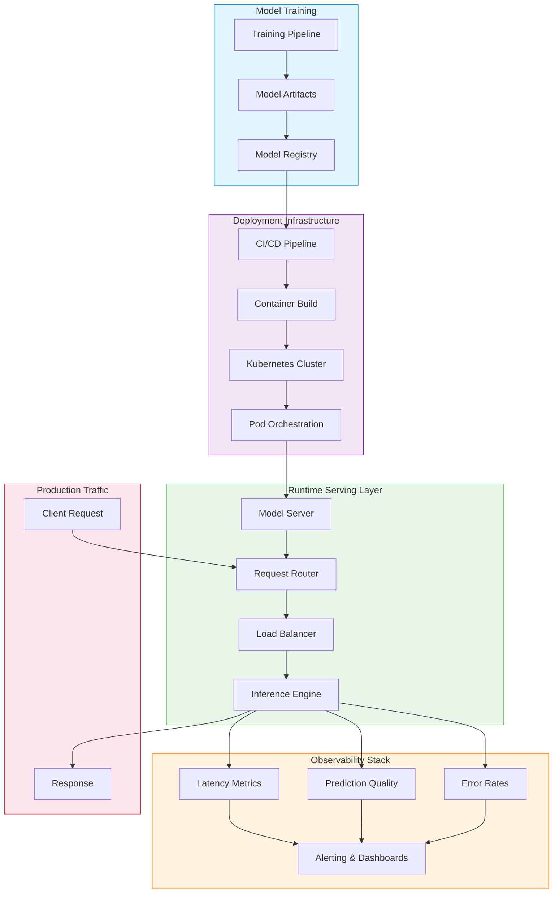

| Difficulty | Channel | Tags |
|---|---|---|
| beginner | devops | mlops, deployment |

Everyone says deployment and serving are the same thing. They're wrong. When Netflix's ML platform hit 1 million requests per second across hundreds of model types for 250M+ users, their centralized routing layer—Switchboard—was adding 10-20ms latency to every single request. The architecture had a single point of failure that could cascade across their entire ML ecosystem [1]. The fix wasn't just a configuration change. It revealed a fundamental misunderstanding that most teams carry into production: confusing deployment with serving, and paying for it in milliseconds that compound into millions.

---

> ### Real-World Case — Netflix
>
> Netflix's ML platform serves 1 million requests per second across hundreds of model types for 250M+ users. They built Switchboard, a centralized routing layer that acted as the single entry point for all ML inference traffic, handling A/B testing, model versioning, and traffic splitting. However, as scale increased, Switchboard became a single point of failure and added 10-20ms latency to every request.
>
> | | |
> |---|---|
> | **Challenge** | The core challenge was distinguishing between model deployment (CI/CD, infrastructure, routing rules) and model serving (real-time inference, request handling). Switchboard solved deployment concerns—decoupling clients from model sharding, enabling safe rollouts, and managing experimentation config—but created serving bottlenecks by inserting itself in the critical request path, deserializing large payloads, and becoming a shared dependency whose failure would disable multiple ML-powered experiences. |
> | **Solution** | Netflix evolved from Switchboard to Lightbulb architecture. Lightbulb is a lightweight metadata service that resolves request context to routing keys and model configurations, while delegating actual request routing to Envoy proxy (already used for all egress at Netflix). The key insight was separating routing metadata from the data plane: Lightbulb runs outside the request path, only adding a header with routingKey that Envoy uses to route directly to the serving cluster. This preserved the deployment benefits (single integration point, A/B testing, traffic splitting) while eliminating the serving latency overhead and single point of failure. |
> | **Outcome** | The architecture successfully serves 1M+ RPS with hundreds of model types while maintaining the ability to do shadow testing, instant rollback, and canary deployments. By moving routing out of the request path, they eliminated the 10-20ms latency penalty and reduced tail latency amplification. The decoupled design also enabled better tenant isolation—one tenant's problematic requests can no longer cascade failures to other users. |
> | **Lesson** | The key insight is that deployment infrastructure (CI/CD, routing rules, versioning, traffic management) and serving infrastructure (inference engines, request handling, response optimization) have fundamentally different scaling characteristics and failure modes. Collapsing them together makes both worse. Netflix's journey shows that what looks like a clean deployment abstraction (Switchboard) can become a serving bottleneck at scale, and the solution is to keep deployment concerns out of the hot path while maintaining the same API contract for clients. |

---

## Hook — The Latency Killer Hiding in Your ML Pipeline

Picture this: your team just shipped a recommendation model to production. The deploy looks green. The dashboards are healthy. Then your users start complaining about slow load times. You dig into the metrics and discover something unsettling—your model is fast, but something in between your API gateway and the actual inference is eating 10-20ms on every request. Multiply that by a million requests per second, and you've got a bottleneck that doesn't show up in your model benchmarks [2]. This is the exact scenario Netflix faced. Their Switchboard routing layer was doing critical work—A/B testing, versioning, traffic splitting—but it was in the request path. Every millisecond of routing logic added up. The real question wasn't 'Is our model fast enough?' It was 'Did we accidentally put a speed bump in front of our inference?'

## Problem — Why Teams Confuse Deployment and Serving

Here is the thing though—most teams treat deployment and serving as one monolithic step. Push the container, expose an endpoint, call it done. But deployment is everything before the request hits your model: CI/CD pipelines, infrastructure provisioning, container orchestration, monitoring setup, rollback strategies [3]. Serving is what happens when that request actually arrives: loading the model into memory, routing to the right version, batching inputs, returning a response under strict latency constraints. The problem? If you optimize for deployment speed but ignore serving architecture, you get green deploys that perform terribly in production. If you optimize for serving latency but treat deployment as an afterthought, you get fast inference that you can't safely update. Many developers discover this the hard way—after a failed rollout or a latency spike that no one can trace back to a root cause.

## Real-World Case — Netflix's Switchboard Architecture

Netflix's journey perfectly illustrates this distinction and its consequences. As their ML platform grew to serve 1M+ requests per second across hundreds of model types for 250M+ subscribers, they needed a centralized routing layer. Switchboard became that layer—handling A/B testing, model versioning, traffic splitting, and shadow testing. It was the single entry point for all ML inference traffic [1].

But here is the plot twist: the very thing that made Switchboard powerful—its centralization—became its Achilles' heel. It was in the request path, adding 10-20ms latency to every inference call. For a real-time recommendation system, that's catastrophic. Moreover, it became a single point of failure. One tenant's problematic requests could cascade failures to other users. The architecture that was supposed to solve routing became the bottleneck that threatened the entire ML ecosystem.

The fix? Netflix decoupled routing from the request path. By moving routing decisions out of the critical latency path, they eliminated the 10-20ms penalty, reduced tail latency amplification, and improved tenant isolation [1]. This wasn't just an infrastructure optimization—it was a fundamental shift in how they thought about the relationship between deployment infrastructure and serving runtime.

## Deep Dive — The Technical Anatomy of Model Serving vs Deployment

Let's break down what each layer actually does and where the trade-offs live.

**Deployment** encompasses the full lifecycle infrastructure:
- **CI/CD Pipelines**: GitHub Actions, Jenkins, or GitLab CI that build, test, and push model artifacts
- **Infrastructure as Code**: Terraform, CloudFormation, or Pulumi that provision compute, networking, and storage
- **Container Orchestration**: Kubernetes manages pod scheduling, resource allocation, and self-healing [4]
- **Model Registries**: MLflow, SageMaker Model Registry, or Vertex AI Model Registry track versions, lineage, and approval gates
- **Monitoring Setup**: Prometheus, Grafana, and CloudWatch configured to track both infrastructure and model metrics [5]

**Serving** is the runtime layer that handles inference:
- **Model Servers**: TensorFlow Serving, TorchServe, or Triton Inference Server load models and expose inference endpoints [6]
- **API Frameworks**: FastAPI, Flask, or gRPC interfaces that accept requests and format responses
- **Request Routing**: Load balancers (NGINX, Envoy) and service meshes that distribute traffic across model instances
- **Model Versioning**: Canary deployments, shadow testing, and A/B testing infrastructure [7]
- **Autoscaling**: Horizontal Pod Autoscalers or custom scalers that adjust compute based on request volume

The critical insight? Deployment infrastructure determines how reliably you can get a model into production. Serving infrastructure determines how well that model performs once it's there. You need both, but optimizing one doesn't compensate for weaknesses in the other.

## Workflow — From Code to Production Inference

Here is the step-by-step journey your model takes from training to serving production traffic:

1. **Training & Validation**: Your model trains, passes validation metrics, and gets versioned in a model registry
2. **Containerization**: The model gets packaged with its dependencies into a Docker image [3]
3. **Deployment Pipeline**: CI/CD runs tests, builds the image, pushes to a registry, and triggers infrastructure provisioning
4. **Infrastructure Provisioning**: Kubernetes or cloud services spin up compute resources (GPUs, memory, networking) [4]
5. **Model Loading**: The serving framework loads the model into GPU/CPU memory and warms up inference caches
6. **Traffic Routing**: Load balancers distribute requests across model instances, respecting version constraints
7. **Inference Execution**: The model processes inputs, performs forward passes, and returns predictions
8. **Monitoring & Feedback**: Latency, throughput, error rates, and model quality metrics flow back to dashboards [5]

See the Mermaid diagram below for a visual representation of this flow.

## Code Example — Building a Production-Ready Serving Layer

Let's look at a concrete implementation that separates deployment concerns from serving logic. This FastAPI example demonstrates model versioning, health checks, and graceful degradation—the patterns that make serving robust in production.

## Lessons Learned — Battle Scars from Production ML Systems

After debugging this pattern across many production systems, here are the hard-won insights:

**Battle Scar #1: Cold starts kill.** Loading a 2GB model into GPU memory takes 30-60 seconds. If your autoscaler spins up new pods during traffic spikes, users hit 500s. Pre-warm model instances or use keep-alive strategies.

**Battle Scar #2: Monitoring model quality, not just latency.** Your API returns 200 OK, but is the prediction actually good? Track data drift, prediction distribution shifts, and business metrics alongside infrastructure metrics [5].

**Battle Scar #3: Version rollback is not deployment rollback.** Rolling back a container doesn't automatically roll back the model. You need separate versioning for infrastructure and model artifacts. Netflix learned this the hard way [1].

**Battle Scar #4: Latency vs throughput is a real trade-off.** Batch inference (process 100 inputs at once) is 5-10x cheaper but adds 50-200ms latency. Real-time inference (one input at a time) is fast but expensive. Choose based on your SLA, not your benchmark.

**🎯 Key Point**: The teams that win at ML in production aren't the ones with the best models—they're the ones with the best infrastructure around their models.

---

## Model Deployment vs Serving Architecture Flow

<strong>Original Interview Question</strong>

**Q:** Explain the key differences between model serving and model deployment in ML systems, including specific technologies, scaling considerations, and real-world implementation patterns?

**A:** Deployment encompasses CI/CD pipelines, infrastructure setup, and monitoring using tools like Kubernetes, MLflow, and SageMaker. Serving focuses on runtime inference APIs with frameworks like TensorFlow Serving, TorchServe, or BentoML, handling request routing, model versioning, and autoscaling. Key trade-offs include latency vs throughput, batch vs real-time inference, and cold start optimization.

## Conclusion

Netflix's Switchboard story isn't just a cautionary tale about centralized routing—it's a masterclass in understanding the boundary between deployment and serving. Deployment infrastructure gets your model to production. Serving infrastructure determines how well it performs once it's there. The teams that thrive in production ML are the ones who treat these as distinct layers with distinct trade-offs: deployment optimizes for reliability, rollback speed, and infrastructure efficiency; serving optimizes for latency, throughput, and inference quality. Tomorrow, audit your own ML stack. Ask two questions: Where does deployment end and serving begin in your architecture? And where are you paying hidden latency costs because you've blurred that boundary? The answer might save you from becoming the next team that discovers a 20ms bottleneck after it's already costing you users.

---

## References

1. [Netflix State of Routing in Model Serving](https://netflixtechblog.com/state-of-routing-in-model-serving-16e22fe18741) — blog
2. [TensorFlow Serving Architecture](https://www.tensorflow.org/tfx/guide/serving) — documentation
3. [Docker Documentation - Get Started](https://docs.docker.com/get-started/) — documentation
4. [Kubernetes Documentation - Concepts](https://kubernetes.io/docs/concepts/) — documentation
5. [MLflow Documentation - Models](https://mlflow.org/docs/latest/models.html) — documentation
6. [PyTorch TorchServe Documentation](https://pytorch.org/serve/) — documentation
7. [AWS SageMaker - Model Deployment](https://docs.aws.amazon.com/sagemaker/latest/dg/deploy-model.html) — documentation
8. [BentoML Documentation - Getting Started](https://docs.bentoml.com/en/latest/quickstart.html) — documentation

---

**Author:** Satishkumar Dhule — [GitHub](https://github.com/satishkumar-dhule) · [LinkedIn](https://linkedin.com/in/satishkumar-dhule) · [Website](https://satishkumar-dhule.github.io)
