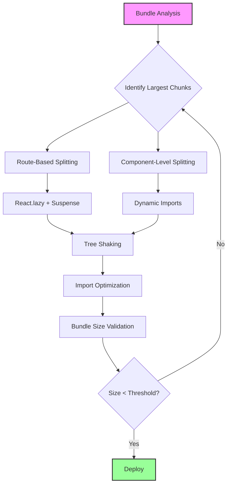

| Difficulty | Channel | Tags |
|---|---|---|
| intermediate | frontend | lighthouse, bundle, lazy-loading |

Airbnb was in the middle of a high-stakes migration—moving their core booking flow from Rails into a React single-page app—when they hit a wall. The listing detail page, one of the most trafficked pages on airbnb.com, was dragging the entire experience down. Components like BookIt were re-rendering in 103.15ms, ReviewsContent in 42.38ms, and the whole system felt sluggish [1]. Sound familiar? If your Lighthouse score is stuck at 65 and your bundle is ballooning past 2MB, you are not alone. This is the story of how a systematic approach to code splitting and lazy loading transformed a bloated React app into a lean, performant machine—and how you can do the same.

---

> ### Real-World Case — Airbnb
>
> Airbnb was migrating their core booking flow—from the landing page, search results, to listing detail pages—from a traditional Rails application into a single-page React app with server-side rendering. As they expanded the SPA to include the listing detail page (one of the most visited pages on airbnb.com), they needed to implement route-based code splitting and lazy loading with React Router v4 while maintaining server-side rendering via their open-source Hypernova service.
>
> | | |
> |---|---|
> | **Challenge** | React Router v4 switched from a centralized route configuration (with a getComponent function for async loading) to a decentralized inline route definition model. This meant routes were only known at render time, making it impossible to know which code-split chunks were needed before rendering—creating a fundamental conflict between server rendering and code splitting. Additionally, profiling the listing page revealed severe performance issues: unnecessary re-renders of Redux-connected components (SummaryContainer: 101.63ms, BookIt: 103.15ms), janky scrolling performance, and laggy click/typing interactions. |
> | **Solution** | For code splitting: They created async component definitions with a static `load()` function on each route component, then built an `ensureReady` utility that resolved all lazy-loaded chunks before server-side rendering. They published `babel-plugin-dynamic-import-webpack` to transform dynamic imports for server environments. For runtime performance: They converted components to `React.PureComponent` to prevent unnecessary re-renders (shallow prop/state comparison), conditionally rendered hidden components (e.g., GuestPickerTrigger was rendered even when invisible), and optimized scroll event handlers. They open-sourced Hypernova as a 'JavaScript Rendering as a Service' platform to power the SSR layer. |
> | **Outcome** | Listing page component re-render costs dropped dramatically: BookIt from 103.15ms to 8.52ms (92% reduction), ReviewsContent from 42.38ms to 12.38ms (71% reduction), ReviewsContainer from 61.32ms to 3.18ms (95% reduction). Route-based code splitting enabled smooth SPA transitions with smaller initial page loads. The architecture scaled to include additional product pages without bloating the core flow—each individual page only contained what was needed. |
> | **Lesson** | The biggest insight: you must profile actual user interactions (scrolling, clicking, typing), not just initial page load. Airbnb's 'start fast and stay fast' philosophy revealed that code splitting helps initial load, but PureComponent and conditional rendering are equally critical for runtime performance. Also, server rendering + code splitting requires a fundamentally different architecture than client-only code splitting—you need explicit load resolution before SSR, not just React.lazy + Suspense. |

---

## Hook — Your Bundle Is a Ticking Time Bomb

Picture this: your team just shipped a major feature. The product manager is thrilled, the stakeholders are impressed, but then the analytics dashboard tells a different story. Time to Interactive has crept up to 4.2 seconds. The Lighthouse score? A humiliating 65. Users on slower connections are bouncing before your app even finishes loading. This is not a hypothetical scenario—it is the daily reality for countless React applications that started small and grew unwieldy. The culprit is almost always the same: a monolithic JavaScript bundle that ships everything to everyone, whether they need it or not. A 2.1MB bundle is not just a number on a dashboard. It is 2.1 megabytes of JavaScript that a user's browser must download, parse, and execute before they can interact with your app. On a 3G connection, that can take over 10 seconds. Even on 4G, you are looking at several seconds of dead time where your user sees nothing but a loading spinner—or worse, a blank screen.

## Problem — The Hidden Cost of Monolithic Bundles

Here is the thing though: most developers do not realize how bad the problem is until it is too late. Your app starts at 200KB. Then you add a date picker (45KB), a rich text editor (180KB), a charting library (320KB), and suddenly you are shipping the kitchen sink to every visitor. The real insidious part is that this happens gradually. Each dependency feels justified in isolation. But collectively, they turn your bundle into a liability. Consider the math: a 2.1MB uncompressed bundle typically compresses to around 500KB gzipped. That still means 500KB of JavaScript that must be downloaded, parsed, and executed on the main thread. During this time, your app is completely unresponsive. No clicks register. No animations run. The user is stuck staring at a spinner while your JavaScript empire crumbles under its own weight. Moreover, the problem compounds on mobile devices. Battery-constrained processors take even longer to execute large bundles. What takes 2 seconds on a MacBook Pro might take 6 seconds on a mid-range Android phone. Your Lighthouse score of 65 is not just a badge of shame—it is a direct correlation to user abandonment. Studies consistently show that a 1-second delay in page load time reduces conversions by 7% [2]. At scale, that translates to millions in lost revenue.

## Real-World Case — Airbnb's Lazy Loading Revolution

Airbnb faced this exact challenge when migrating their listing detail page into their React SPA architecture. The listing page is one of the most visited pages on their entire platform—every potential booking starts here. When they expanded the SPA to include this critical page, they needed to maintain server-side rendering via their open-source Hypernova service while implementing route-based code splitting with React Router v4 [1]. The results were staggering. After implementing code splitting and lazy loading, the BookIt component's re-render cost dropped from 103.15ms to just 8.52ms—a 92% reduction. ReviewsContent went from 42.38ms to 12.38ms (71% reduction), and ReviewsContainer plummeted from 61.32ms to 3.18ms (a 95% reduction) [1]. What made Airbnb's approach particularly elegant was how they structured the splits. Rather than lazily loading everything, they identified the critical rendering path—the components that must load immediately for the page to feel interactive—and split everything else into separate chunks. The listing hero image, price, and booking button loaded first. Reviews, map, and similar listings loaded after. This is not just an optimization—it is a fundamental shift in how you think about delivering JavaScript to users. Each route only contained what was needed for that specific view, and the architecture scaled gracefully as they added more product pages without bloating the core flow [1].

## Deep Dive — The Anatomy of Bundle Optimization

Before you can fix your bundle, you need to understand what is inside it. This is where webpack-bundle-analyzer becomes your best friend. It generates a treemap visualization of your bundle, showing exactly which modules are consuming the most space. Many developers are shocked to discover that their own code accounts for less than 30% of the total bundle—the rest is third-party dependencies [3]. There are three primary strategies for taming a bloated bundle, and they work best in combination: Code Splitting divides your bundle into smaller chunks that load on demand. Route-based splitting loads different bundles for different routes. Component-based splitting loads heavy components only when they appear on screen [4]. Tree Shaking eliminates dead code by analyzing ES module imports and removing anything that is not actually used. This only works with ES modules (import/export), not CommonJS (require/module.exports) [5]. Dynamic Imports use the import() function to create split points in your code, telling the bundler to create separate chunks for those modules [6]. The key insight is that these strategies address different problems. Code splitting reduces initial load time. Tree shaking reduces total bundle size. Dynamic imports give you granular control over what loads when. Together, they can reduce your initial bundle by 60-80% [7].

## Workflow — The Bundle Optimization Playbook

Here is the step-by-step process that transforms a 2.1MB monster into a lean, performant application. This workflow follows a logical progression—each step builds on the previous one: Start with analysis. You cannot optimize what you cannot measure. Run webpack-bundle-analyzer to visualize your bundle composition. Identify the top 5 largest dependencies and determine if each one is truly necessary. Then implement route-based code splitting as your first line of defense. Wrap each route component in React.lazy() and set up Suspense boundaries with appropriate loading fallbacks. Next, tackle component-level splitting for heavy features that are not on the critical rendering path. Finally, configure tree shaking and optimize your imports. The following diagram illustrates the complete optimization workflow: [See diagram below] Each step in this workflow produces measurable results. Route-based splitting alone typically reduces initial bundle size by 40-60% [1]. Component-level splitting can further reduce it by another 20-30%. Tree shaking and import optimization chip away at the remaining dead weight.

## Code Example — Implementing Route-Based Code Splitting

Let us walk through a production-grade implementation. The following code demonstrates how to transform a monolithic React app into a lazily loaded, code-split application using React.lazy() and Suspense: [See code below] This implementation does several critical things. First, each route component is loaded asynchronously using React.lazy(), which creates a separate chunk for each route. The Suspense boundary provides a loading fallback while chunks are being fetched. The ErrorBoundary catches any loading failures gracefully, preventing the entire app from crashing if a chunk fails to load. Notice how the LoadingSpinner provides visual feedback during the load—this is essential for perceived performance. Even if the actual load time is 200ms, a spinner makes it feel intentional rather than broken. For more granular control, you can also split individual components within a route. The HeavyChart example shows how to lazily load a component that is only needed under certain conditions. This pattern is particularly powerful for features like modals, data visualizations, and rich editors that are expensive to load but not always visible.

## Lessons Learned — The Developer's Cheat Sheet

After helping teams optimize hundreds of React applications, here are the patterns that consistently deliver results: Always measure before optimizing. Install webpack-bundle-analyzer and identify your actual bottlenecks before writing a single line of optimization code [3]. Prioritize route-based splitting first. It gives you the biggest bang for your buck and requires minimal code changes. Component-level splitting is valuable but should follow route-based optimization. Do not forget about third-party dependencies. Many developers obsess over optimizing their own code while ignoring a 300KB analytics library that loads on every page. Consider alternatives or lazy-load them. Use meaningful loading states. A blank screen during loading is worse than a slow load with feedback. Provide spinners, skeleton screens, or progressive content [8]. Monitor your bundle size in CI. Set up automated checks that fail the build if the bundle exceeds a threshold. This prevents regression. The battle scars are real: one common mistake is lazy-loading too aggressively. If you split every component into a separate chunk, you end up with dozens of HTTP requests that collectively take longer than a single optimized bundle. The goal is strategic splitting, not maximum splitting. Another pitfall is ignoring the server-side rendering story. If your app uses SSR, lazy loading requires additional coordination to ensure chunks are properly resolved on both server and client [1].

---

## Bundle Optimization Workflow

<strong>Original Interview Question</strong>

**Q:** You're tasked with improving a React app's Lighthouse performance score from 65 to 90+. The bundle size is 2.1MB and Time to Interactive is 4.2s. What specific steps would you take to optimize the bundle and implement lazy loading?

**A:** Implement code splitting with React.lazy() and Suspense, analyze bundle composition with webpack-bundle-analyzer to identify largest chunks, remove unused dependencies and optimize imports, add dynamic imports for heavy components and third-party libraries, implement route-based splitting for better initial load times, and utilize tree shaking with proper ES module configuration.

## Conclusion

The journey from a 2.1MB monolith to a lean, code-split application is not just about reducing a number on a dashboard. It is about respecting your users' time and devices. Airbnb proved that strategic lazy loading can reduce component render times by up to 95% [1]. The same principles apply to your application: analyze your bundle, split by route, lazy-load heavy components, and shake the tree. Start tomorrow by installing webpack-bundle-analyzer and running it on your project. You will be shocked at what you find. Then implement route-based splitting with React.lazy()—it is the single highest-impact change you can make. Set up bundle size monitoring in your CI pipeline so regressions are caught before they reach production. The best time to optimize your bundle was when it first crossed 1MB. The second best time is right now.

---

## References

1. [Server Rendering, Code Splitting, and Lazy Loading with React Router v4](https://medium.com/airbnb-engineering/server-rendering-code-splitting-and-lazy-loading-with-react-router-v4-bfe596a6af70) — blog
2. [Web Performance — MDN Web Docs](https://developer.mozilla.org/en-US/docs/Web/Performance) — documentation
3. [webpack-bundle-analyzer on GitHub](https://github.com/webpack-contrib/webpack-bundle-analyzer) — documentation
4. [Code Splitting — React Documentation](https://react.dev/learn/code-splitting) — documentation
5. [Tree Shaking — webpack Documentation](https://webpack.js.org/guides/tree-shaking/) — documentation
6. [Dynamic Imports — MDN Web Docs](https://developer.mozilla.org/en-US/docs/Web/JavaScript/Reference/Operators/import) — documentation
7. [Lazy Loading — web.dev Performance Guide](https://web.dev/articles/lazy-loading-guidance-for-images-and-video) — blog
8. [React Router Lazy Loading Documentation](https://reactrouter.com/en/main/route/lazy) — documentation

---

**Author:** Satishkumar Dhule — [GitHub](https://github.com/satishkumar-dhule) · [LinkedIn](https://linkedin.com/in/satishkumar-dhule) · [Website](https://satishkumar-dhule.github.io)
