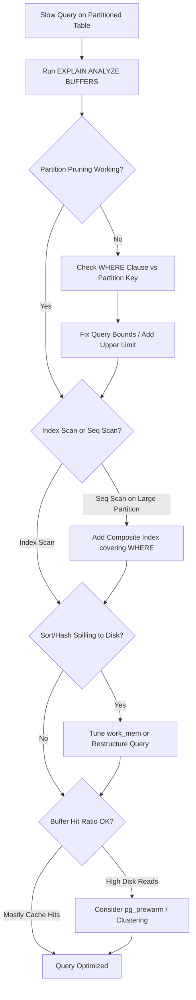

| Difficulty | Channel | Tags |
|---|---|---|
| intermediate | database | explain, query-plan, partitioning |

A 1TB PostgreSQL table storing hourly crypto price data was killing CoinGecko's p99 latency at over 4 seconds, spiking IOPS to 24,000 daily and threatening SLO commitments [1]. Adding indexes? Ruled out — the JSONB column with variable currency keys made that impractical. Sound familiar? Partitioning sounds like the silver bullet, yet many teams implement it and still watch queries crawl. The secret isn't in whether you partition — it's in how you read the EXPLAIN plan afterward.

---

> ### Real-World Case — CoinGecko
>
> CoinGecko's 8-year-old PostgreSQL 'prices' table storing hourly crypto price data grew to 1TB+, with queries averaging 30+ seconds. IOPS spiked to 24K daily, causing replica lag, Apdex degradation, and threatened SLO/SLA commitments. Adding indexes was rejected because the JSONB column with variable currency keys made indexing impractical.
>
> | | |
> |---|---|
> | **Challenge** | Queries on a 1TB+ table were too slow, IOPS were unsustainable at 24K daily, and replica lag was impacting availability. They needed to reduce query latency and IOPS without sacrificing data access patterns. |
> | **Solution** | Implemented monthly range partitioning on the timestamp column. Created a new partitioned table, migrated 1.2TB of data using Foreign Data Wrappers (to avoid cold-cache on production), and performed an atomic table rename swap with dual-write triggers for rollback safety. The critical discovery: after switching, one query lacked an upper date bound ('created_at > ?') causing it to scan ALL partitions including empty future ones — the same query ran fine on the unpartitioned table. Fixed by adding upper bounds and removing unnecessary future partitions. |
> | **Outcome** | p99 response time dropped from 4.13s to 578ms (86% reduction). IOPS reduced by 20% (savings multiplied across replicas). Replica lag completely eliminated. Prewarming partitioned table took 3 hours vs 10 hours for original table. 6-8x query performance improvement on benchmarked queries. |
> | **Lesson** | Partition pruning can regress if queries lack proper bounds — a query that worked fine on an unpartitioned table can scan all partitions after partitioning if it doesn't constrain both sides of the range. Always verify partition pruning with EXPLAIN ANALYZE after partitioning, and check for queries with missing upper/lower bounds on the partition key. |

---

## Hook — When 100 Million Rows Laugh at Your WHERE Clause

Picture this: your PostgreSQL table has 100 million rows, neatly partitioned by date. You filter on a specific date range, expecting the planner to skip irrelevant partitions like a well-trained bloodhound. Instead, the query takes 30+ seconds. IOPS spike. Replicas lag. Your Apdex score starts nosediving.

This isn't hypothetical. CoinGecko lived this exact nightmare with their `prices` table — 8 years of hourly crypto data, 1TB+ of pure grief. The table was partitioned (conceptually), the queries had date filters, and yet performance was catastrophic [1]. The question every database engineer eventually faces is deceptively simple: your table is partitioned, your query has a date range — so why is it still slow?

The answer lies in what EXPLAIN is actually whispering to you. Most developers glance at the query plan, see an index scan, and call it a day. But partition pruning failures, hidden sequential scans, and memory-gobbling sort operations lurk beneath the surface. Learning to read these signals is the difference between a 4-second p99 and a 578ms one.

## Problem — The Partition Pruning Illusion

Here is the core trap: partitioning does not automatically make your queries fast. It makes some queries fast and others actively worse. PostgreSQL's partition pruning — the mechanism that eliminates irrelevant partitions from the query plan — only works when your WHERE clause directly references the partition key with compatible operators [2].

Many developers assume that putting `event_date` in a `BETWEEN` clause is enough. It usually is. But what happens when you write `WHERE event_date > ?` without an upper bound? PostgreSQL will scan every partition from that point forward — including future partitions that contain zero rows [1]. This is the exact regression CoinGecko experienced after their migration: a query missing an upper date limit scanned all partitions, actually performing worse than on the unpartitioned table.

The problem compounds when you consider index utilization. PostgreSQL may choose not to use your index at all if it estimates that a sequential scan of the relevant partitions is cheaper. After partitioning, the per-partition table is smaller, which can flip the planner's cost calculation from 'index scan wins' to 'seq scan wins' — but only if the partition is large enough relative to the index [3]. You end up in a strange paradox where partitioning makes some queries faster and others slower.

Then there are the silent killers: sort operations that spill to disk because `work_mem` is too small for the result set, hash aggregates that consume more memory than expected, and nested loop joins that multiply partition scans. Each of these shows up in EXPLAIN output, but only if you know what to look for.

## Real-World Case — CoinGecko's 1TB PostgreSQL Rescue

CoinGecko's engineering team faced a slow-motion crisis. Their `prices` table — the backbone of crypto price data across all applications — had grown to over 1TB after 8 years of hourly data ingestion. Average query time exceeded 30 seconds. Daily IOPS hit 24,000 and kept breaching thresholds, causing replica lag that threatened their SLO/SLA commitments [1].

The initial instinct was to add indexes. However, the table contained a JSONB column with dynamically-keyed currencies. Indexing different currency keys for different applications was deemed impractical — an index might only benefit a single application while adding write overhead across the board [1]. So the team pivoted to table partitioning, despite its complexity.

The migration was anything but smooth. During the go-live day, the original table was so degraded that copying even one day's worth of data couldn't complete within 15 minutes. The solution? Foreign data wrappers — reading from a pre-warmed replica and writing to the partitioned table on the production host, avoiding IOPS contention on the primary [1]. They also discovered that warming up the partitioned table took only 3 hours versus 10 hours for the original, and that replicas needed prewarming too — an oversight caught only on go-live day.

The results were dramatic: p99 response time dropped from 4.13s to 578ms (an 86% reduction), IOPS decreased by 20% (savings multiplied across all replicas), and replica lag was completely eliminated [1]. But the journey exposed a critical insight — without the correct query patterns, partitioning can actually be detrimental.

## Deep Dive — Reading the EXPLAIN Plan Like a Seasoned DBA

When a partitioned query is slow, EXPLAIN (ANALYZE, BUFFERS) is your primary diagnostic tool. But you need to know exactly what to look for. PostgreSQL's EXPLAIN output is a tree of plan nodes, each with cost estimates and — with ANALYZE — actual execution metrics [3]. Here are the critical signals:

**1. Partition Pruning Effectiveness**
The first thing to verify is whether partitions are actually being pruned. With `enable_partition_pruning` on (the default), the planner should eliminate partitions that cannot contain matching rows. In EXPLAIN output, you will see an `Append` node with only the relevant child scans — not every partition. If you see scans on partitions outside your date range, pruning has failed. This often happens with parameterized queries where the value is unknown at plan time [2].

**2. Index vs Sequential Scan**
After partitioning, the planner may switch from index scans to sequential scans on individual partitions. This is not necessarily bad — if a partition is small enough, a seq scan is faster than an index scan due to reduced random I/O. However, if you see `Seq Scan` on a partition that contains millions of rows, something is wrong. Check whether a composite index exists that covers your WHERE clause columns [4].

**3. Sort and Hash Operations**
Expensive sorts (especially those spilling to disk) show up as `Sort` nodes with `Sort Method: external merge` and disk usage statistics. Hash aggregates with `Batches: greater than 1` indicate memory spills. Both are signals that `work_mem` may need tuning, or that the query pattern should be redesigned to avoid unnecessary sorting.

**4. Buffer Statistics**
The `Buffers: shared hit` and `Buffers: shared read` lines tell you the I/O story. High `read` counts mean data is coming from disk rather than cache — exactly the pattern that caused CoinGecko's IOPS crisis. After partitioning, you want to see most buffers coming from `hit` (cache) rather than `read` (disk) [1].

## Workflow — A Systematic Approach to Partitioned Query Optimization

Here is a battle-tested workflow for diagnosing and fixing slow queries on partitioned PostgreSQL tables. Each step builds on the previous one, and skipping steps is how regressions happen.

First, capture the baseline. Run `EXPLAIN (ANALYZE, BUFFERS, FORMAT JSON)` on the slow query and save the output. This gives you both the planner's estimates and actual execution metrics, including I/O statistics [3]. Without a baseline, you cannot measure improvement.

Next, verify partition pruning. Examine the `Append` node in the plan. Count how many child scans appear versus how many partitions exist. If the number of scans matches the total partition count, pruning has failed entirely — check your WHERE clause against the partition key [2].

Then, check index utilization per partition. Each child scan should show either an `Index Scan`, `Bitmap Heap Scan`, or a justified `Seq Scan`. If you see `Seq Scan` on a large partition without a corresponding index, create a composite index that covers your most common filter columns [4].

After that, evaluate sort and hash operations. Look for `Sort Method: external merge Disk` or `Hash Batches: greater than 1`. These indicate the planner is spilling to disk because `work_mem` is insufficient for the result set size.

Finally, measure the impact. Re-run `EXPLAIN (ANALYZE, BUFFERS)` and compare buffer statistics, execution time, and partition scan count against your baseline.

## Code Example — From Diagnosis to Optimization in Practice

Here is a practical walkthrough demonstrating how to diagnose and optimize a slow partitioned query. The code covers the full cycle: capturing the plan, identifying pruning failures, adding composite indexes, and verifying improvement.

## Lessons Learned — What CoinGecko's Mistakes Teach You

CoinGecko's journey offers several hard-won lessons that apply far beyond crypto price tables:

**Lesson 1: Partitioning is not index replacement.** The team initially considered indexes as the quick fix, but the JSONB structure made them impractical. Partitioning worked because it reduced the data scanned per query — but it required careful query design to realize the benefits [1].

**Lesson 2: Missing upper bounds destroy pruning.** The most damaging regression came from a query using `WHERE created_at > ?` without an upper limit. This forced PostgreSQL to scan all partitions — including empty future ones. Always provide bounded date ranges on partitioned tables [1].

**Lesson 3: Cold cache kills performance.** A new partitioned table has no buffer cache. CoinGecko's dry run revealed that warming the original table took 10 hours, while the partitioned table took 3 hours. Use `pg_prewarm` before cutting over [5].

**Lesson 4: Block deployments during migration.** Two unrelated deployments on go-live day caused confusion about whether performance regressions came from the partitioning or the new code. Isolate your migration from other changes [1].

**Lesson 5: Warm up replicas too.** The team focused exclusively on the primary database and discovered on go-live day that replicas also needed prewarming — adding unexpected work to an already stressful migration [1].

The overarching takeaway: partitioning delivers massive gains, but only when paired with correct query patterns, proper index design, and thorough pre-production testing. EXPLAIN is your compass — learn to read it deeply, and the performance will follow.

---

## Partitioned Query Optimization Workflow

<strong>Original Interview Question</strong>

**Q:** You have a PostgreSQL table with 100M rows partitioned by date. A query filtering on a specific date range is still slow. What would you check in the EXPLAIN plan and how would you optimize it?

**A:** Check partition pruning effectiveness, index utilization patterns, and expensive sort operations. Create composite indexes on (date, filtered_columns) and evaluate clustering strategies for optimal data access.

## Conclusion

Partitioning your PostgreSQL table is not the finish line — it is the starting line. The real optimization happens in the EXPLAIN plan: verifying partition pruning, ensuring composite indexes cover your WHERE clauses, catching sort spills, and warming up buffer caches. CoinGecko's 86% p99 improvement came not just from partitioning, but from reading the signals their query plans were sending and acting on each one. Your next step: run EXPLAIN (ANALYZE, BUFFERS) on your slowest partitioned query right now. Count the child scans under the Append node. If the number equals your total partition count, pruning has failed. Fix the WHERE clause bounds first — that alone can turn a 30-second query into a sub-second one.

---

## References

1. [CoinGecko incident report](https://amree.dev/2025/06/13/scaling-postgresql-performance-with-table-partitioning/) — blog
2. [PostgreSQL 18 Documentation — Table Partitioning](https://www.postgresql.org/docs/current/ddl-partitioning.html) — documentation
3. [PostgreSQL 18 Documentation — Using EXPLAIN](https://www.postgresql.org/docs/current/using-explain.html) — documentation
4. [PostgreSQL 18 Documentation — Indexes](https://www.postgresql.org/docs/current/indexes.html) — documentation
5. [PostgreSQL 18 Documentation — pg_prewarm Extension](https://www.postgresql.org/docs/current/pgprewarm.html) — documentation
6. [PostgreSQL 18 Documentation — Partition Pruning](https://www.postgresql.org/docs/current/ddl-partitioning.html#DDL-PARTITION-PRUNING) — documentation
7. [PostgreSQL 18 Documentation — Foreign Data Wrappers](https://www.postgresql.org/docs/current/ddl-foreign-data.html) — documentation
8. [DigitalOcean — PostgreSQL Performance Tuning Guide](https://www.digitalocean.com/community/tutorials/how-to-tune-postgresql-for-optimization-and-performance) — blog

---

**Author:** Satishkumar Dhule — [GitHub](https://github.com/satishkumar-dhule) · [LinkedIn](https://linkedin.com/in/satishkumar-dhule) · [Website](https://satishkumar-dhule.github.io)
