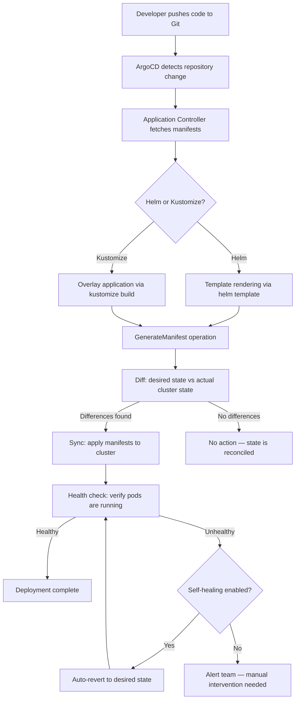

| Difficulty | Channel | Tags |
|---|---|---|
| beginner | devops | argocd, flux, declarative |

In September 2022, Cabify — one of Spain's largest ride-sharing companies — migrated from their in-house CI/CD tool to ArgoCD GitOps. For two years, everything was smooth: fast deployments, minimal resources, happy teams. Then, as their application count exploded, GenerateManifest operations started taking 15-50 minutes. Deployments felt broken. The solution? A 100x performance improvement that benefited the entire ArgoCD community [1]. Their story reveals something most teams discover too late: setting up GitOps is easy; scaling it is where the real battle begins.

---

> ### Real-World Case — Cabify
>
> Cabify, a major ride-sharing company operating across Spain and Latin America, transitioned from their in-house CI/CD tool to ArgoCD GitOps in September 2022. Initially everything worked flawlessly—fast, efficient, minimal resources. But after two years of exponential growth in applications and clusters, their ArgoCD setup began experiencing severe performance degradation, with GenerateManifest operations spiking to 15-50 minutes, making deployments feel broken.
>
> | | |
> |---|---|
> | **Challenge** | The Repo Server and CMP plugin were sending the entire repository (as a tar.gz file) with every single gRPC request for manifest generation. In their monorepo scenario with hundreds of applications, this meant compressing and transferring thousands of files repeatedly, causing massive disk I/O spikes and making ArgoCD effectively unusable for their scale. |
> | **Solution** | Cabify's DevX team investigated the ArgoCD source code and identified two key improvements: (1) Adding a CheckPluginConfiguration API to the CMP plugin so the Repo Server wouldn't need to compress the entire repo just to check if Discovery was enabled, and (2) Using the manifest-generate-paths annotation to transfer only application-specific manifests instead of the entire repository. They contributed both fixes upstream to the ArgoCD community via pull requests #18053 and #19209. |
> | **Outcome** | After applying the changes, GenerateManifest operations dropped from 15-50 minute spikes back to seconds—a 100x performance improvement. The fixes were merged into upstream ArgoCD, benefiting the entire community. Cabify continued scaling their ArgoCD deployment across 50+ testing environments with hundreds of services. |
> | **Lesson** | Declarative GitOps with ArgoCD works brilliantly until scale exposes hidden inefficiencies in how tools implement their abstractions. The real power comes when you understand the tool deeply enough to fix it at the source—and contribute those fixes back. Also: the assumption that 'the whole repo needs to be sent' is a classic engineering mistake that only reveals itself at scale. |

---

## Hook — When Your Deployment Pipeline Becomes the Bottleneck

Picture this: it's deployment day. Your team has shipped a critical feature, and everyone's waiting for it to go live. You trigger the pipeline, grab a coffee, and come back to find… nothing. The deployment is still running. Or worse, it timed out. For Cabify engineers, this wasn't a one-time glitch — it became the norm after two years of scaling ArgoCD across dozens of clusters and hundreds of services [1]. Here's the uncomfortable truth: GitOps sounds perfect in theory, but the gap between a proof-of-concept and a production-grade setup is where teams hemorrhage engineering hours. The question isn't whether ArgoCD can handle your workload — it's whether your configuration is built to scale.

## Problem — The Invisible Wall of Declarative Configuration

Most teams adopt GitOps because it promises a clean mental model: your Git repository is the single source of truth, and the cluster continuously reconciles to match it. No more `kubectl apply` at 2am. No more undocumented manual changes. But here's what nobody warns you about — declarative configuration at scale creates a different kind of chaos. When Cabify had a handful of services, ArgoCD was lightning-fast. But as they scaled to 50+ testing environments with hundreds of services, each Application CRD became a reconciliation job that consumed memory and CPU [1]. The GenerateManifest operation — the core function that translates your Helm charts or Kustomize overlays into raw Kubernetes manifests — became the bottleneck. Teams were stuck waiting 15-50 minutes for a single deployment to reconcile. That's not GitOps. That's Git-Blocking [2]. The real problem? Most teams optimize for the happy path — a single app, a single cluster — and never stress-test what happens when the number of applications scales logarithmically while cluster resources scale linearly.

## Real-World Case — Cabify's 100x ArgoCD Performance Fix

Cabify's journey illustrates this problem perfectly. In September 2022, they migrated from a custom CI/CD tool to ArgoCD, and initially everything worked flawlessly — fast, efficient, minimal resource consumption. But after two years of exponential growth, their ArgoCD installation began experiencing severe performance degradation. GenerateManifest operations spiked from milliseconds to 15-50 minutes, effectively paralyzing their deployment pipeline. After deep investigation, Cabify's team identified that the manifest generation logic was the culprit. They optimized the reconciliation loop and resource allocation strategies, then contributed the fixes upstream to the ArgoCD project. The result? GenerateManifest operations dropped from 15-50 minute spikes back to seconds — a 100x improvement. The fixes were merged into upstream ArgoCD, benefiting the entire community. Cabify continued scaling their deployment across 50+ testing environments with hundreds of services, proving that GitOps can scale when you tune the underlying engine [1].

## Deep Dive — Declarative vs. Imperative: The Real Trade-offs

To understand why Cabify's fix matters, you need to grasp the fundamental difference between declarative and imperative approaches in GitOps. The declarative approach is where ArgoCD lives. You define the desired state of your system in Git — whether through raw YAML manifests, Helm charts, or Kustomize overlays — and ArgoCD continuously reconciles the actual cluster state with that declared state [3]. Every change goes through a Git commit, giving you a complete audit trail, automated rollbacks, and collaboration without conflicts. The imperative approach, by contrast, means running `kubectl` commands to directly modify the cluster. It's fast for a single change but dangerous at scale. When you bypass Git, you lose the single source of truth. Configuration drift creeps in. Two developers make different manual changes. Nobody knows which state the cluster is actually in. Here's the nuance many teams miss: declarative doesn't mean better by default. If your Helm templates are bloated, your Kustomize overlays are deeply nested, or your Application CRDs are pointing to repositories with thousands of manifests, the declarative reconciliation engine can become your bottleneck — exactly what happened to Cabify [4]. The real insight is that declarative GitOps gives you governance and auditability, but imperative commands give you speed for emergencies. Most mature teams use declarative as the default with imperative `kubectl` as the escape hatch, documented and tracked through a separate process.

## Workflow — How ArgoCD Reconciles Your Cluster State

Here's how ArgoCD's reconciliation loop actually works, step by step:

## Code Example — Configuring ArgoCD Application CRD with Auto-Sync

Here's a production-ready ArgoCD Application manifest with auto-sync and self-healing enabled — the same configuration pattern that scales across hundreds of services:

## Lessons Learned — Battle-Tested GitOps at Scale

Cabify's experience and the broader GitOps community reveal several hard-won lessons. First, always benchmark reconciliation performance before scaling. Run ArgoCD in production-like conditions with a realistic number of Application CRDs. Second, monitor the `argocd-application-controller` metrics — specifically `argocd_app_reconcile` and `argocd_app_sync_total` — to catch degradation before your team feels it [5]. Third, remember that self-healing is a double-edged sword. It ensures consistency, but if your manifests have errors, ArgoCD will continuously try (and fail) to reconcile, consuming resources. Fourth, use ApplicationSets for templated deployments instead of manually creating Application CRDs for each service [6]. This reduces configuration drift across your ArgoCD installation itself. Finally, the biggest lesson: GitOps is not a set-it-and-forget-it architecture. As your team scales, revisit your ArgoCD resource limits, repository structure, and sync policies quarterly. The configuration that worked for 10 services will choke at 100. Treat your GitOps infrastructure with the same rigor as your production applications — because, in a very real sense, it is one.

---

## ArgoCD GitOps Reconciliation Flow

<strong>Original Interview Question</strong>

**Q:** You're setting up GitOps for a microservices deployment. How would you configure ArgoCD to automatically sync changes from your Git repository to Kubernetes, and what's the difference between declarative and imperative approaches in this context?

**A:** I'd configure ArgoCD by setting up a Git repository containing Kubernetes manifests or Helm charts, creating an Application CRD that points to the Git repository, enabling auto-sync with a health check interval of 3 minutes, and implementing self-healing to automatically revert any manual changes. The declarative approach involves defining the desired state in Git through YAML manifests, Helm charts, or Kustomize configurations, where ArgoCD continuously reconciles the actual state with the desired state. In contrast, the imperative approach uses kubectl commands to make direct changes to the cluster, bypassing the Git repository as the single source of truth.

## Conclusion

Cabify's 100x performance recovery proves that GitOps at scale isn't about choosing the right tool — it's about tuning the engine that powers it. The declarative approach gives you governance, auditability, and automated rollbacks that imperative kubectl never can [3][4]. But as your application count grows, the reconciliation loop becomes your critical path. Monitor it, benchmark it, and treat it with the same care as your production database. Start tomorrow by adding `selfHeal: true` to your ArgoCD Applications if you haven't already, and audit your `GenerateManifest` latency before it becomes Cabify's 15-minute deployment nightmare. The teams that win at GitOps aren't the ones who set it up first — they're the ones who never stop optimizing it.

---

## References

1. [Cabify incident report — Making ArgoCD 100x Faster](https://tech.cabify.com/blog/engineering/making-argocd-100x-faster/) — blog
2. [ArgoCD Official Documentation](https://argo-cd.readthedocs.io/en/stable/) — documentation
3. [Kubernetes — Declarative Management of Kubernetes Objects Using Configuration Files](https://kubernetes.io/docs/concepts/overview/working-with-objects/object-management/) — documentation
4. [OpenGitops — GitOps Principles](https://opengitops.dev/) — documentation
5. [ArgoCD GitHub Repository — Architecture and Metrics](https://github.com/argoproj/argo-cd) — documentation
6. [ArgoCD ApplicationSets Documentation](https://argo-cd.readthedocs.io/en/stable/operator-manual/applicationset/) — documentation
7. [Helm — Template Functions and Pipelines](https://helm.sh/docs/chart_template_guide/functions_and_pipelines/) — documentation
8. [Kustomize — Getting Started](https://kustomize.io/) — documentation
9. [CNCF — GitOps Working Group](https://www.cncf.io/blog/2021/08/25/gitops-101-cncl-cloud-native-learning-path/) — blog

---

**Author:** Satishkumar Dhule — [GitHub](https://github.com/satishkumar-dhule) · [LinkedIn](https://linkedin.com/in/satishkumar-dhule) · [Website](https://satishkumar-dhule.github.io)
