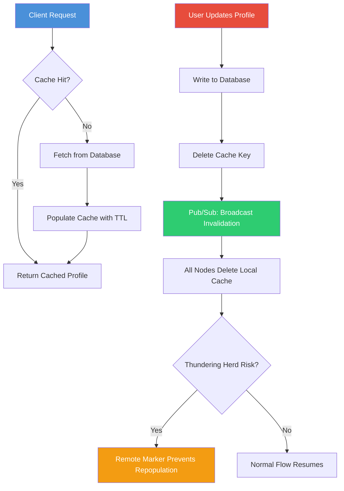

| Difficulty | Channel | Tags |
|---|---|---|
| beginner | backend | redis, memcached, cache-invalidation |

In 2013, Meta was serving over 1 billion users and each page load fanned out to hundreds of cache lookups across thousands of Memcached servers. They faced cascading failure modes that only emerge at extreme scale: thundering herds after invalidation, stale data races, and cross-region consistency gaps that no textbook addressed [1]. This wasn't just a caching problem — it was an existential threat to a platform billions of people relied on every day. What Meta discovered about cache invalidation changed how the industry thinks about distributed systems, and the lessons apply whether you're building a profile service or a global social network.

---

> ### Real-World Case — Meta (Facebook)
>
> By 2013, Facebook was serving over 1 billion users with each page load fanning out to hundreds of cache lookups across thousands of Memcached servers. They faced cascading failure modes that only emerge at extreme scale: thundering herds after invalidation, stale data races, and cross-region consistency gaps that no textbook addressed.
>
> | | |
> |---|---|
> | **Challenge** | Keeping a massive distributed Memcached fleet consistent with MySQL databases while serving billions of requests per second — specifically solving cache invalidation across regions without sacrificing low-latency reads or hammering the database with stampedes. |
> | **Solution** | Facebook built several novel mechanisms on top of Memcached: (1) Lease tokens — on a cache miss, the server issues a 64-bit lease token that the client must present to write back, preventing stale-set races and controlling thundering herds. (2) Gutter pool — a small ~1% standby pool absorbs traffic when any Memcached host fails, preventing stampedes on MySQL. (3) mcsqueal daemons — extract deletes from MySQL commit logs and broadcast batched invalidations via mcrouter, achieving 18x fewer packets than naive approaches. (4) Cross-region invalidation piggybacked on MySQL replication — invalidation packets embedded in the binlog stream so they arrive after the replicated write, preventing stale reads from replication lag. (5) Sliding-window flow control to fix incast congestion when 500+ servers reply simultaneously and overwhelm the NIC. |
> | **Outcome** | The system handles >1 billion requests per second at peak with median fan-out of 24 keys per request (p95 >500 keys), end-to-end p95 latency in single-digit milliseconds, and holds trillions of items. The techniques reduced regional invalidation packets by 18x, cold cluster recovery from days to hours, and prevented database meltdowns during cache failures. |
> | **Lesson** | Cache invalidation at scale is not about the cache itself — it's about the emergent failure modes between cache, database, and network. The biggest surprise was incast congestion: when hundreds of Memcached servers reply simultaneously, they DDoS their own callers. The lease mechanism proved that sometimes the most elegant solution is letting the cache server itself control who gets to write back, rather than trusting clients to coordinate. |

---

## Hook — The 3 AM Pager That Changed Everything

Picture this: your user profile service is humming along, serving millions of profile lookups per second through a cache layer. Then a user updates their avatar. Within seconds, cache miss rates spike. The database, which was comfortably handling 10% of traffic, suddenly sees a surge of full-profile queries it never prepared for. Requests time out. The thundering herd begins. By morning, your on-call engineer has a war story — and your CTO has questions about your architecture. This scenario plays out daily across the industry. The tricky part isn't caching — it's invalidation. Phil Karlton's famous quip about there being only two hard things in computer science has never felt more relevant. Cache invalidation is hard because it sits at the intersection of consistency, availability, and performance. Get it wrong, and you serve stale data to users. Get it too aggressive, and you hammer your database into submission.

## Problem — Why Cache Invalidation Breaks at Scale

At its core, cache invalidation is simple: when the source of truth changes, you need the cache to reflect that change. But simple doesn't mean easy. Consider a user profile service. Every read hits the cache first. If the profile exists in cache, you return it instantly — no database query needed. If it's missing, you fetch from the database, populate the cache, and serve the request. The cache-aside (lazy loading) pattern works beautifully until someone updates their profile. Now you have a race condition. Two requests might read the same stale data before either writes the fresh version. Or worse, you delete the cache key but a concurrent read repopulates it with old data before the database write completes. The problem compounds across multiple servers, multiple regions, and multiple database replicas. Invalidation packets must propagate across a distributed system where network partitions are not a matter of if but when. This is where most teams hit their first wall. They discover that naive TTL-based expiration leaves a window where stale data is served, while immediate invalidation can cause thundering herds — thousands of servers simultaneously missing cache and flooding the database with queries.

## Real-World Case — Meta's Cache Infrastructure at Scale

Meta's experience with Memcached is perhaps the most well-documented cache infrastructure study in the industry [1]. By 2013, their deployment spanned thousands of servers holding trillions of items. Each page load required a median of 24 cache lookups, with p95 exceeding 500 keys. The system handled over 1 billion requests per second at peak, with end-to-end p95 latency in the single-digit milliseconds. The challenges they faced were unprecedented. When a cache server failed, the thundering herd of requests would flood the database, potentially causing cascading failures. They had to develop remote markers — lightweight tokens that prevent cache repopulation during invalidation — and batch invalidation to reduce the volume of packets crossing regions by 18x. Their cold cluster recovery time dropped from days to hours through careful engineering of warm-up sequences and staggered traffic ramping. The key insight from Meta's journey is that cache invalidation at scale isn't a single problem — it's a system of interconnected failure modes that each require their own solution.

## Deep Dive — Redis vs Memcached and the Invalidation Spectrum

Building on Meta's lessons, the choice between Redis and Memcached isn't just a technology decision — it's an architectural commitment that shapes your invalidation strategy. Redis offers built-in pub/sub capabilities that enable automatic distributed invalidation. When a profile updates, you publish an invalidation event on a channel, and every server subscribed to that channel can purge its local cache. This eliminates the need for manual coordination across nodes. Memcached, by contrast, is a simpler key-value store with no built-in pub/sub. Each node is independent, which is both its strength and its limitation. To achieve distributed invalidation, you must implement your own broadcast mechanism or accept that invalidation happens only on the node that served the write. Redis also provides data persistence, meaning your cache can survive restarts — a significant advantage if cold-starting is expensive. Memcached prioritizes simplicity and raw throughput for pure caching workloads. The trade-off matrix looks like this:

**Feature | Redis | Memcached**
Pub/Sub for invalidation | Built-in | Manual implementation required
Persistence | Yes (RDB/AOF) | No
Data structures | Rich (lists, sets, sorted sets) | String only
Memory overhead | Higher | Lower
Horizontal scaling | Cluster mode | Client-side sharding
Latency | Sub-millisecond | Sub-millisecond
Max item size | 512 MB | 1 MB

Many developers choose Redis by default because of its feature richness, but Memcached can be the better choice for simple, high-throughput caching where the added complexity of Redis's features isn't needed. The plot twist here is that simplicity can be a feature — fewer moving parts means fewer failure modes.

## Workflow — The Write-Through Invalidation Pipeline

Here's how a robust write-through invalidation workflow operates step by step:

**Step 1: Read Path** — The application first checks the cache for the profile. On a hit, return the cached data. On a miss, fetch from the database, populate the cache with a TTL, and return.

**Step 2: Write Path** — When a user updates their profile, the application writes the new data to the database first (the source of truth), then invalidates the cache by deleting the key. Optionally, it writes the new data to the cache as well.

**Step 3: Distributed Invalidation** — If using Redis, publish an invalidation message to a pub/sub channel. All application servers subscribed to that channel delete their local cache entries for the affected key.

**Step 4: Protection Against Thundering Herds** — Implement a probabilistic early expiration or remote marker to prevent thousands of concurrent reads from simultaneously hitting the database after invalidation.

**Step 5: Monitoring** — Track cache hit rates, invalidation latency, and database load to detect anomalies before they become incidents.

The following diagram illustrates this complete flow:

## Code Example — Implementing Write-Through Cache Invalidation with Redis Pub/Sub

Below is a production-style Python implementation that demonstrates write-through caching with distributed invalidation using Redis. This pattern directly applies to a user profile service:

## Lessons Learned — What Cache Invalidation Teaches You About System Design

The journey from naive caching to production-grade invalidation teaches several profound lessons:

**1. TTLs Are a Safety Net, Not a Strategy** — Setting a 5-30 minute TTL on profile data ensures eventual consistency, but it's not your primary invalidation mechanism. Always delete keys on write. The TTL catches edge cases where invalidation messages are lost.

**2. Thundering Herds Are Real and Expensive** — When a popular key is invalidated, every server that had a miss simultaneously hits the database. Meta's solution was remote markers that prevent repopulation for a brief window. You can implement a similar pattern with probabilistic early expiration (PEE) or distributed locks.

**3. Consistency Guarantees Exist on a Spectrum** — Strong consistency (write-through + immediate invalidation) trades latency for correctness. Eventual consistency (TTL-based) trades correctness for performance. Choose based on your use case: user profiles often tolerate 30 seconds of staleness; financial data cannot.

**4. Monitor Everything** — Cache hit rates, miss rates, invalidation latency, database QPS, and P99 response times. Without monitoring, you're flying blind. Meta's engineers attribute much of their success to rigorous observability.

**5. Start with the Simplest Solution** — Begin with cache-aside + TTL. Add write-through invalidation when you need stronger consistency. Layer on pub/sub only when you have multiple servers. Premature optimization of cache architecture is a real tax on velocity.

**6. Test Failure Scenarios** — What happens when the cache server dies? When the pub/sub channel is partitioned? When the database is slow? Chaos engineering isn't just for Netflix — it's essential for any distributed cache.

The ultimate insight is that cache invalidation is a distributed systems problem masquerading as a caching problem. The techniques you develop — pub/sub, remote markers, probabilistic expiration, monitoring — are the same ones used in consensus algorithms, event sourcing, and CRDTs. Mastering cache invalidation means mastering a fundamental class of distributed computing challenges.

---

## Write-Through Cache Invalidation Flow

<strong>Original Interview Question</strong>

**Q:** You're building a user profile service that caches frequently accessed profiles. How would you implement cache invalidation when a user updates their profile, and what trade-offs would you consider between Redis and Memcached?

**A:** Implement write-through caching with TTL-based expiration. On profile update, invalidate the cache by deleting the key and writing new data to both the database and cache. Redis offers pub/sub for automatic distributed invalidation, while Memcached requires manual coordination across nodes.

## Conclusion

Meta's cache infrastructure journey reveals that cache invalidation isn't just a technical challenge — it's a systems design philosophy. The techniques they pioneered — remote markers, batch invalidation, staggered ramping — reduced invalidation traffic by 18x and turned days-long recovery into hours [1]. For your user profile service, the path forward is clear: implement write-through caching with TTL-based expiration, choose Redis if you need distributed invalidation via pub/sub, and always write to the database before invalidating the cache. Start with the simplest solution and add complexity only when your scale demands it. The next time you update a user profile, remember — you're not just writing data, you're orchestrating a distributed consensus across your entire infrastructure. That's the hidden complexity behind every cache key deletion.

---

## References

1. [Scaling Memcache at Facebook (NSDI 2013)](https://www.usenix.org/conference/nsdi13/technical-sessions/presentation/nishtala) — paper
2. [Redis Documentation — Pub/Sub](https://redis.io/docs/latest/develop/interact/pubsub/) — documentation
3. [Memcached Wiki — FAQ](https://github.com/memcached/memcached/wiki/FAQ) — documentation
4. [AWS ElastiCache for Redis Documentation](https://docs.aws.amazon.com/AmazonElastiCache/latest/red-ug/WhatIs.html) — documentation
5. [Cache Invalidation — Wikipedia](https://en.wikipedia.org/wiki/Cache_invalidation) — documentation
6. [Martin Kleppmann — Designing Data-Intensive Applications](https://dataintensive.net/) — book
7. [Redis Persistence Documentation](https://redis.io/docs/latest/operate/oss_and_stack/management/persistence/) — documentation
8. [DigitalOcean — How To Cache Data Using Redis in Python](https://www.digitalocean.com/community/tutorials/how-to-cache-data-using-redis-in-python-3) — blog

---

**Author:** Satishkumar Dhule — [GitHub](https://github.com/satishkumar-dhule) · [LinkedIn](https://linkedin.com/in/satishkumar-dhule) · [Website](https://satishkumar-dhule.github.io)
