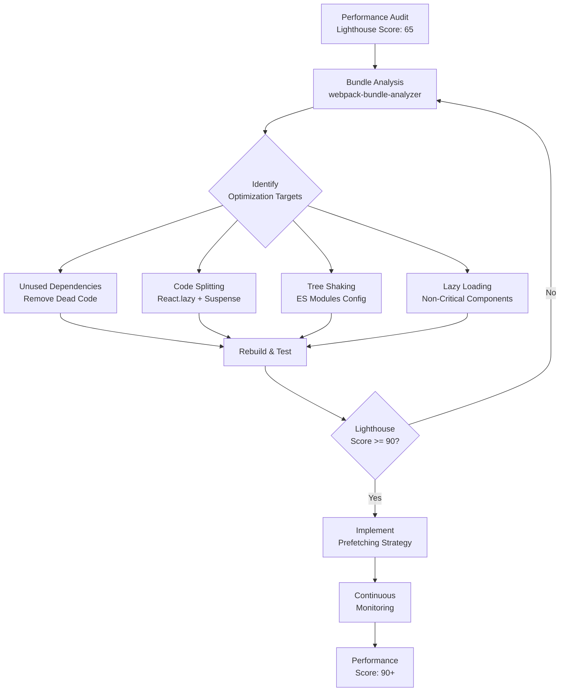

| Difficulty | Channel | Tags |
|---|---|---|
| intermediate | frontend | lighthouse, bundle, lazy-loading |

Picture this: you're responsible for one of the most visited web pages on the planet. Hundreds of millions of users hit it every day across 200 countries. Then someone runs a performance audit and discovers your JavaScript bundle is 300KB — and it takes 7 seconds to become interactive on a 3G connection [1]. That's exactly the nightmare Netflix faced with their logged-out homepage. The page where users decide whether to sign up for Netflix. Every second of delay meant lost subscribers. Here's the thing though: most React applications today are dealing with the same problem, just on a smaller scale. Your 2.1MB bundle and 4.2-second Time to Interactive? It's not just a technical debt issue — it's a business crisis hiding in plain sight.

---

> ### Real-World Case — Netflix
>
> Netflix's logged-out homepage (where users sign up or sign in) was shipping 300KB of JavaScript including React, Lodash, and hydration data. On simulated 3G, the page took 7 seconds to load — far too long for a critical conversion page serving hundreds of millions of users across 200 countries.
>
> | | |
> |---|---|
> | **Challenge** | The signup landing page was server-rendered with React, then hydrated on the client. Even though React's footprint was only 45KB, the full client-side payload (React + Lodash + app code + context data) totaled ~300KB. This bloated the Time-to-Interactive (TTI) on a page that was mostly static HTML with minimal interactivity (a tab switcher, language selector, and cookie banner). |
> | **Solution** | Netflix's engineers took a counterintuitive approach: they removed React from the client-side entirely for the landing page, replacing it with vanilla JavaScript for the few interactive elements (~300 lines vs. the React version). They kept React for server-side rendering of the HTML. For the subsequent signup flow (which genuinely needed SPA behavior), they prefetch React, CSS, and JS while users are still on the landing page using both the browser's native Prefetch API and XHR preloading (which achieved 95% cache-hit rates). |
> | **Outcome** | Time-to-Interactive decreased by 50% on the logged-out homepage. JavaScript bundle size reduced by over 200KB. Prefetching reduced TTI by an additional 30% for the subsequent signup flow. Lighthouse confirmed desktop TTI under 3.5s. Chrome User Experience Report showed First Input Delay was 'fast' for 97% of desktop users. The lighter page also led to higher click-through rates on the register button — a direct business impact. |
> | **Lesson** | Not every page needs a framework on the client. Netflix's key insight was matching JavaScript cost to actual interactivity: server-rendered HTML with vanilla JS for simple pages, React prefetched only when the SPA flow genuinely needed it. The biggest bundle optimization is sometimes removing the framework itself from the critical path. |

---

## The Hidden Cost of JavaScript Bloat

You've probably stared at a Lighthouse score of 65 and thought, 'That's not terrible.' But here's what that number actually means: nearly 40% of your users are abandoning ship before your page becomes usable. In a world where Google uses Core Web Vitals as a ranking signal, a sluggish page isn't just embarrassing — it's actively burying you in search results. Moreover, the compounding effect is brutal. A heavy bundle doesn't just slow down the initial load; it tanks your First Input Delay, wrecks your Cumulative Layout Shift, and makes every subsequent interaction feel like wading through molasses. The real kicker? Most of that 2.1MB isn't code you wrote. It's dependencies you imported once and never tree-shook, polyfills for browsers nobody uses anymore, and entire libraries pulled in for a single function.

## Netflix's Wake-Up Call

Netflix's engineering team discovered their logged-out homepage was shipping React, Lodash, and hydration data in a single 300KB payload [1]. On simulated 3G — which is still the reality for a significant portion of their global audience — the page took 7 full seconds to load. That's not just slow; that's a conversion killer. The team systematically attacked the problem: they reduced the JavaScript bundle by over 200KB, implemented prefetching strategies that shaved an additional 30% off Time to Interactive for the signup flow, and achieved a desktop TTI under 3.5 seconds [1]. Chrome User Experience Report confirmed that First Input Delay was 'fast' for 97% of desktop users. But here's the plot twist that changes everything — the lighter page didn't just improve metrics. It directly increased click-through rates on the register button. Performance became revenue.

## Why React Apps Get Fat (And Why It's Not Your Fault)

Here's the thing about modern JavaScript development: the ecosystem is designed to make adding dependencies effortless. 'npm install' is one command. But removing dead code? That's a forensic investigation. Most React applications suffer from three critical issues. First, there's the dependency cascade — importing a single function from Lodash pulls in the entire library because tree shaking doesn't work well with CommonJS modules. Second, there's the polyfill problem — Babel and core-js include support for browsers that haven't existed for years. Third, and this is the one that catches teams off guard: third-party analytics, chat widgets, and A/B testing scripts often account for 40-60% of your total bundle size. You didn't bloat your app. Your dependencies did it for you.

## The Optimization Playbook: From 65 to 90+

Building on Netflix's approach, here's the systematic workflow that transforms a sluggish React application into a performance powerhouse. Step one: analyze before you optimize. webpack-bundle-analyzer is your microscope — it visualizes every byte in your bundle and reveals which dependencies are guzzling space. You might discover that a date formatting library is larger than your entire component tree. Step two: implement code splitting. This is where React.lazy() and Suspense become your best friends. Route-based splitting ensures users only download the JavaScript they need for the current page. Step three: attack tree shaking. Switch from CommonJS to ES modules, mark sideEffects in your package.json, and watch unused exports disappear. Step four: lazy load everything non-critical — heavy charts, modal dialogs, rich text editors. Step five: prefetch intelligently. Don't load everything upfront, but anticipate what the user will need next.

## The Architecture: Split, Analyze, Optimize

The optimization flow starts with bundle analysis and branches into parallel workstreams — dependency cleanup, code splitting, and lazy loading — before converging into performance validation. This systematic approach prevents the common mistake of optimizing blindly without measuring first.

## Putting It All Together: The Complete Implementation

Here's the practical implementation that brings all these concepts together. This code demonstrates route-based code splitting with React.lazy(), error boundaries for graceful degradation, and a prefetching strategy that preloads chunks as users navigate. The key insight: don't just split your code — anticipate user behavior and load ahead of them.

## Battle-Tested Lessons and Pitfalls

After watching teams optimize hundreds of React applications, here are the hard-won lessons. First, don't optimize prematurely — measure first, optimize second. A 2.1MB bundle might have 1.5MB of code you actually need. Second, watch out for waterfall requests — splitting too aggressively creates cascading network requests that can be slower than loading one chunk. Third, test on real devices, not your MacBook Pro. Third-world 3G connections reveal problems your local development environment will never show. Fourth, prefetching is powerful but dangerous — prefetch too much and you've just moved the bloat from JavaScript to network. Fifth, monitor continuously. Performance regresses naturally as teams add features. Set up automated Lighthouse CI checks and bundle size budgets. The teams that win at performance aren't the ones who optimize once — they're the ones who build systems that prevent regression.

---

## React Performance Optimization Workflow

<strong>Original Interview Question</strong>

**Q:** You're tasked with improving a React app's Lighthouse performance score from 65 to 90+. The bundle size is 2.1MB and Time to Interactive is 4.2s. What specific steps would you take to optimize the bundle and implement lazy loading?

**A:** Implement code splitting with React.lazy() and Suspense, analyze bundle composition with webpack-bundle-analyzer to identify largest chunks, remove unused dependencies and optimize imports, add dynamic imports for heavy components and third-party libraries, implement route-based splitting for better initial load times, and utilize tree shaking with proper ES module configuration.

## Conclusion

The journey from a 65 Lighthouse score to 90+ isn't about finding one magic fix — it's about building a systematic approach to performance. Netflix proved that even massive bundles can be tamed with the right strategy, and the business impact speaks for itself: faster pages mean more conversions. Your next step? Run webpack-bundle-analyzer on your project today. You might be shocked at what's hiding in your bundle. The teams that master performance optimization don't just build faster apps — they build better products.

---

## References

1. [Netflix web performance case study](https://medium.com/dev-channel/a-netflix-web-performance-case-study-c0bcde26a9d9) — blog
2. [React lazy loading and code splitting documentation](https://react.dev/reference/lazy) — documentation
3. [webpack-bundle-analyzer GitHub repository](https://github.com/webpack-contrib/webpack-bundle-analyzer) — documentation
4. [MDN Web Docs: Dynamic import() syntax](https://developer.mozilla.org/en-US/docs/Web/JavaScript/Reference/Operators/import) — documentation
5. [MDN Web Docs: Suspense component in React](https://developer.mozilla.org/en-US/docs/Web/JavaScript/Reference/Operators/import) — documentation
6. [Google Lighthouse performance documentation](https://developer.chrome.com/docs/lighthouse/performance) — documentation
7. [Vite code splitting and lazy loading guide](https://vite.dev/guide/features.html) — documentation
8. [MDN Web Docs: Tree shaking concept](https://developer.mozilla.org/en-US/docs/Glossary/Tree_shaking) — documentation

---

**Author:** Satishkumar Dhule — [GitHub](https://github.com/satishkumar-dhule) · [LinkedIn](https://linkedin.com/in/satishkumar-dhule) · [Website](https://satishkumar-dhule.github.io)
