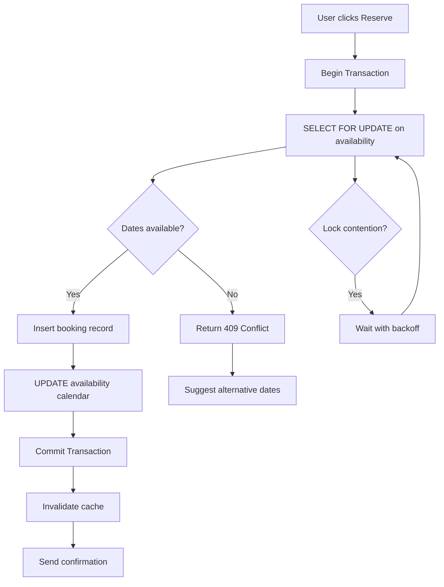

| Difficulty | Channel | Tags |
|---|---|---|
| intermediate | database | acid, isolation-levels, mvcc |

Picture this: two guests book the same beachfront villa on the same night. Both get confirmation emails. Both show up with luggage. Both expect a bed. In the world of high-traffic booking systems, this isn't a hypothetical — it's a daily battle against race conditions, distributed state, and the brutal reality of concurrent writes. Airbnb learned this the hard way during their migration to a Service Oriented Architecture (SOA), where every payment API call fans out into multiple downstream services, each changing state and potentially failing mid-flight. The result? They built a framework that achieved five nines of payment consistency while their annual payment volume doubled [1]. This is the story of how distributed consistency actually works — and why your booking system is probably one bad deploy away from a double-booking disaster.

---

> ### Real-World Case — Airbnb
>
> During their migration from a monolithic architecture to a Service Oriented Architecture (SOA), Airbnb faced the challenge of preventing double payments in a distributed payments system where every API call fans out into multiple downstream services, each changing state and potentially failing mid-flight.
>
> | | |
> |---|---|
> | **Challenge** | In a distributed system, a client that never receives a response cannot know whether money moved. The naive recovery — retrying — is precisely the action that can charge a guest twice. They needed to achieve eventual consistency with ultra-low latency across all payment microservices while maintaining correctness during a live migration affecting billions in payment volume. |
> | **Solution** | They built 'Orpheus', a generic idempotency library embedded in each payments service. It decomposes every API call into three phases (Pre-RPC, RPC, Post-RPC) where network calls and database transactions are strictly separated — no network calls during DB transactions, no DB work during RPCs. Each phase is wrapped in a single atomic database transaction. A row-level lock on the idempotency key grants an exclusive lease per request. Critically, all idempotency reads/writes go to the master database only — reading from replicas would create a window where replica lag allows a retry to miss a successful response and re-execute the payment. The database is sharded by idempotency key to handle scale. |
> | **Outcome** | Achieved five nines (99.999%) of payment consistency while annual payment volume doubled. The framework was adopted across all payments SOA services as a shared library, eliminating the need for custom per-use-case idempotency solutions. |
> | **Lesson** | In distributed payment systems, reading idempotency state from replicas is not a performance optimization — it's a correctness hole exactly as wide as replica lag. A few seconds of replication lag equals a double charge. The guard against inconsistency must itself be strongly consistent. Also: never mix network calls with database transactions — network calls are inherently unreliable and will cause connection pool exhaustion and ambiguous failure states. |

---

## Hook — Two Guests, One Villa, Zero Sleep

It was the peak of summer. A guest in New York and a guest in London both spotted the same Santorini villa with the infinity pool at exactly the same moment. Both clicked "Reserve." Both entered payment details. Both hit submit within milliseconds of each other. Here's the question: which one gets the villa? The answer, if your system isn't designed correctly, is both. And that's how you end up with an angry host, two refund requests, and a Trust & Safety team working through the weekend. The double-booking problem isn't just a database edge case — it's a revenue problem, a trust problem, and a scaling problem all rolled into one. Every booking platform on earth faces it, and the way you solve it reveals everything about how you think about distributed systems.

## Problem — The Race Condition That Costs Millions

At its core, the double-booking problem is a classic race condition. Two transactions read the same availability data, both see the property is free, and both proceed to write a reservation. Without proper concurrency control, you get what database theorists call a "lost update" — one booking silently overwrites the other, or worse, both succeed and you've oversold a single unit of inventory [2]. The challenge intensifies at scale. Airbnb handles millions of listings, each with a unique availability calendar. During peak booking windows — holidays, flash sales, viral listing moments — thousands of concurrent requests hit the same property. The CAP theorem tells us that in a distributed system, you must choose between consistency, availability, and partition tolerance — and you can't have all three [3]. Most booking systems lean toward availability (users must always be able to browse) while enforcing strong consistency at the write path (the actual booking). But here's the plot twist: even with strong consistency at the database level, distributed services can still break this guarantee if each downstream call operates independently. That's exactly what Airbnb discovered.

## Real-World Case — Airbnb's Distributed Payment Catastrophe

During their migration from a monolithic architecture to SOA, Airbnb faced a terrifying scenario in their payments system. When a booking was confirmed, the payment API would fan out into multiple downstream services — charging the guest, notifying the host, updating ledgers, triggering payouts. Each service changed state independently. If one service failed mid-flight while others succeeded, the system could end up in an inconsistent state: the guest gets charged but the host doesn't get notified, or a payout is triggered without a corresponding charge [1]. The impact was existential. Payment consistency isn't a nice-to-have — it's a regulatory requirement and a trust imperative. Airbnb needed to guarantee that every payment either fully completed across all services or fully rolled back. They built an idempotency framework that was adopted across all payments SOA services as a shared library, eliminating the need for custom per-use-case solutions. The result: they achieved 99.999% payment consistency while their annual payment volume doubled. The lesson? Concurrency control isn't just about database locks — it's about ensuring atomicity across an entire distributed system [1].

## Deep Dive — SERIALIZABLE, MVCC, and the Art of Not Overbooking

So how do you actually prevent double bookings at the database level? Let's break down the three pillars. First, **SERIALIZABLE isolation** is the gold standard for preventing concurrency anomalies. PostgreSQL's implementation uses Serializable Snapshot Isolation (SSI), which monitors read-write conflicts between transactions and rolls back any transaction that could produce an anomaly [4]. Unlike traditional two-phase locking (2PL), SSI doesn't block readers — it detects conflicts at commit time and retries the loser. This is critical for booking systems where you can't afford to hold locks during the entire user session. Second, **MVCC (Multiversion Concurrency Control)** is the mechanism that makes non-blocking reads possible. Instead of locking rows when reading, MVCC maintains multiple versions of each row so that each transaction sees a consistent snapshot of the database as of when it started [5]. This means availability checks can happen concurrently with writes without contention — the reader sees the last committed state while the writer works on a new version. Third, **optimistic concurrency control** with version columns gives you application-level safety. You add a `version` integer to your booking table. When you attempt a booking, you include `WHERE version = $expected_version` in your UPDATE. If another transaction modified the row in the meantime, zero rows are updated, and you know you have a conflict [6]. This is your safety net — even if SERIALIZABLE isolation somehow lets a phantom through, your application-level check catches it. The real insight? These three mechanisms aren't alternatives — they're layers. SERIALIZABLE handles the database-level guarantees, MVCC ensures reads don't block writes, and optimistic locking catches anything that slips through at the application level.

## Workflow — From Click to Confirmed: The Booking Pipeline

Here's how a robust booking transaction actually flows through the system. The Mermaid diagram below illustrates the complete pipeline from user click to confirmation, including the retry logic and lock acquisition strategy:



The key insight here is the `SELECT FOR UPDATE` — this acquires a row-level lock on the specific property's availability for the requested dates. In PostgreSQL, this lock is held until the transaction commits or rolls back, preventing any other transaction from modifying the same rows [7]. The retry logic with exponential backoff is essential because lock contention on popular properties is inevitable. You don't want to immediately retry — you want to give the competing transaction time to commit. After the database transaction commits, you invalidate any cached availability data. This is where many systems fail: they update the database correctly but serve stale cached data, leading to phantom availability. The cache invalidation must happen synchronously before the confirmation is sent, not asynchronously after.

## Code Example — Production-Grade Booking with PostgreSQL

Here's a production-grade implementation using Python and PostgreSQL that combines SERIALIZABLE isolation, row-level locks, and optimistic concurrency control:

```python
import psycopg2
from psycopg2 import errors
import time
import random

# Configuration
MAX_RETRIES = 3
BASE_BACKOFF_MS = 100

def create_booking(conn, user_id, property_id, check_in, check_out):
    """
    Attempt to create a booking with full concurrency control.
    Uses SERIALIZABLE isolation + SELECT FOR UPDATE + version check.
    """
    for attempt in range(MAX_RETRIES):
        try:
            with conn.cursor() as cur:
                # Step 1: Start a SERIALIZABLE transaction
                # This prevents phantom reads and serialization anomalies
                cur.execute("SET TRANSACTION ISOLATION LEVEL SERIALIZABLE")

                # Step 2: Lock the specific availability rows
                # SELECT FOR UPDATE prevents concurrent modifications
                # We lock only the date rows for THIS property
                cur.execute("""
                    SELECT id, version, is_available
                    FROM property_availability
                    WHERE property_id = %s
                      AND date >= %s
                      AND date < %s
                    ORDER BY date
                    FOR UPDATE
                """, (property_id, check_in, check_out))

                availability_rows = cur.fetchall()

                # Step 3: Check ALL requested dates are available
                if not availability_rows or not all(row[2] for row in availability_rows):
                    conn.rollback()
                    return {"success": False, "error": "Dates not available"}

                # Step 4: Insert the booking record
                cur.execute("""
                    INSERT INTO bookings (user_id, property_id, check_in, check_out, status)
                    VALUES (%s, %s, %s, %s, 'confirmed')
                    RETURNING id
                """, (user_id, property_id, check_in, check_out))

                booking_id = cur.fetchone()[0]

                # Step 5: Mark dates as unavailable with version check
                # The version column acts as an optimistic lock
                for row in availability_rows:
                    cur.execute("""
                        UPDATE property_availability
                        SET is_available = FALSE,
                            booking_id = %s,
                            version = version + 1
                        WHERE id = %s AND version = %s
                    """, (booking_id, row[0], row[1]))

                    # If zero rows updated, conflict detected
                    if cur.rowcount == 0:
                        conn.rollback()
                        return {"success": False, "error": "Conflict detected"}

                # Step 6: Commit the entire transaction atomically
                conn.commit()

                return {
                    "success": True,
                    "booking_id": booking_id,
                    "attempts": attempt + 1
                }

        except errors.SerializationFailure:
            # SERIALIZABLE isolation detected a serialization anomaly
            # This is expected under high concurrency — retry with backoff
            conn.rollback()
            backoff_ms = BASE_BACKOFF_MS * (2 ** attempt)
            jitter = random.uniform(0.5, 1.5)
            time.sleep(backoff_ms * jitter / 1000)
            continue

        except Exception as e:
            conn.rollback()
            raise e

    # All retries exhausted
    return {"success": False, "error": "Booking failed after retries"}

def get_availability(conn, property_id, check_in, check_out):
    """
    Read availability using snapshot reads (no locks).
    MVCC ensures we see a consistent snapshot.
    """
    with conn.cursor() as cur:
        cur.execute("""
            SELECT date, is_available
            FROM property_availability
            WHERE property_id = %s
              AND date >= %s
              AND date < %s
            ORDER BY date
        """, (property_id, check_in, check_out))

        return cur.fetchall()
```

Here's what each critical section does: The `SET TRANSACTION ISOLATION LEVEL SERIALIZABLE` on line 23 ensures PostgreSQL monitors for serialization anomalies using SSI (Serializable Snapshot Isolation) [4]. The `SELECT FOR UPDATE` on line 31 acquires exclusive row-level locks on the specific availability rows, preventing other transactions from modifying them until this transaction commits [7]. The version check on lines 56-65 acts as a secondary guard — even under SERIALIZABLE isolation, you want application-level validation. The exponential backoff with jitter on lines 78-80 prevents thundering herd retries when multiple transactions compete for the same property. This pattern is used in production systems handling thousands of concurrent booking requests per second.

## Lessons Learned — What the Senior Engineers Know

After building and debugging booking systems at scale, here are the hard-won lessons. **SERIALIZABLE isn't free, but it's worth it.** Many developers avoid SERIALIZABLE isolation because they've heard it's slow. PostgreSQL's SSI implementation has minimal overhead compared to snapshot isolation — it only rolls back transactions when a genuine anomaly is detected [4]. The retry cost is almost always lower than the debugging cost of a phantom booking. **Cache invalidation is the silent killer.** Your database can be perfectly consistent while your Redis cache serves stale availability data. Always invalidate cache synchronously after a successful booking commit, and use cache-aside pattern with short TTLs for availability data. **Lock granularity matters more than lock type.** Don't lock an entire property — lock only the specific date rows. A beachfront villa in Bali might have 365 days of availability; locking all 365 rows for a 3-night booking is wasteful. Lock only the 3 rows you need. **Retry budgets are non-negotiable.** Without a maximum retry count and exponential backoff, a hot property with 100 concurrent requests can cascade into a retry storm that degrades the entire system. Three retries with exponential backoff is a solid starting point [6]. **Test with parallel requests, not sequential ones.** A unit test that books twice sequentially proves nothing. You need to fire both requests simultaneously using parallel workers to actually reproduce the race condition. **Monitor your 409 rate.** A low rate of conflict responses is healthy — it means your optimistic checks are working. A spike means you have a hot object that needs sharding or a different concurrency strategy.

---

## Booking Transaction Pipeline


<details>
<summary><strong>Original Interview Question</strong></summary>

**Q:** You're building a booking system for Airbnb where multiple users can reserve the same property simultaneously. How would you design the transaction handling to prevent double bookings while maintaining high availability?

**A:** Use SERIALIZABLE isolation with optimistic concurrency control. Implement row-level locks on property availability tables, use MVCC snapshot reads for checking availability, and apply application-level validation to ensure atomic booking operations.

</details>

## Conclusion

The double-booking problem is deceptively simple in concept and brutally complex in execution. Airbnb's journey from a monolithic system to a distributed SOA taught them that consistency isn't just a database property — it's a system-wide property that must be enforced at every layer [1]. The three-pillar approach — SERIALIZABLE isolation for database-level guarantees, MVCC for non-blocking reads, and optimistic locking as an application-level safety net — gives you defense in depth. But the real lesson is this: concurrency control is a design decision, not an afterthought. If you're building a booking system and you haven't thought about what happens when two users click the same button at the same time, you're not building a booking system — you're building a time bomb. Start with SERIALIZABLE isolation, add row-level locks on hot paths, instrument your conflict rates, and always — always — have a retry strategy. The next time you book a vacation rental and it just works, you'll know there's a battle happening in the database to make sure exactly one person gets that room.

---

## References

1. [Airbnb: Avoiding Double Payments in a Distributed Payments System](https://medium.com/airbnb-engineering/avoiding-double-payments-in-a-distributed-payments-system-2981f6b070bb) — blog
2. [Wikipedia: Concurrency Control](https://en.wikipedia.org/wiki/Concurrency_control) — documentation
3. [Wikipedia: CAP Theorem](https://en.wikipedia.org/wiki/CAP_theorem) — documentation
4. [PostgreSQL: Transaction Isolation Documentation](https://www.postgresql.org/docs/current/transaction-iso.html) — documentation
5. [Wikipedia: Multiversion Concurrency Control (MVCC)](https://en.wikipedia.org/wiki/Multi-Version_Concurrency_Control) — documentation
6. [Wikipedia: Optimistic Concurrency Control](https://en.wikipedia.org/wiki/Optimistic_concurrency_control) — documentation
7. [PostgreSQL: Explicit Locking - Row-Level Locks](https://www.postgresql.org/docs/17/explicit-locking.html) — documentation
8. [MDN: Conditional Requests and Optimistic Locking](https://developer.mozilla.org/en-US/docs/Web/HTTP/Guides/Conditional_requests) — documentation
9. [Databricks: Concurrency Control in DBMS - Locking, MVCC & More](https://www.databricks.com/blog/concurrency-control) — blog

---

**Author:** Satishkumar Dhule — [GitHub](https://github.com/satishkumar-dhule) · [LinkedIn](https://linkedin.com/in/satishkumar-dhule) · [Website](https://satishkumar-dhule.github.io)
