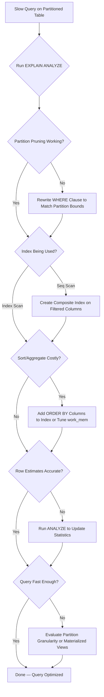

| Difficulty | Channel | Tags |
|---|---|---|
| intermediate | database | explain, query-plan, partitioning |

Capital One's Consumer Identity platform ingests terabytes of customer data every single day into PostgreSQL databases [1]. Their tables ballooned to staggering scale — and they needed 99.9% of recent data lookups to return in milliseconds. The answer wasn't a fancy NoSQL migration or a distributed/NewSQL overhaul. It was PostgreSQL partitioning done right. But here's the thing: many teams partition their tables and then wonder why queries are still crawling. The partition exists, but the database isn't actually using it the way you think.

---

> ### Real-World Case — Capital One
>
> Capital One's Consumer Identity platform ingests terabytes of customer data daily into PostgreSQL databases. Their tables grew to massive scale, and they needed to ensure that 99.9% of customer data lookups — the most recent 90 days of activity — returned in milliseconds, even as overall data volumes continued to explode.
>
> | | |
> |---|---|
> | **Challenge** | With billions of rows of temporal customer identity data, queries across the full table were becoming prohibitively slow. They needed a partitioning strategy that would make recent-data lookups fast while enabling efficient archival of older data without locking tables or degrading customer experience. |
> | **Solution** | Capital One implemented three counterintuitive PostgreSQL partitioning strategies: (1) Range partitioning by timestamptz with UTC to handle timezone edge cases like Arizona's DST non-observance, (2) Detaching old partitions instead of running DELETE or VACUUM — which take table locks that block reads and writes — to archive terabytes daily, and (3) Deliberately NOT vacuuming their partitioned tables because the lock overhead was so costly it would hurt the customer experience. They also applied hash functions on timestamps to ensure partitions were equally sized, avoiding seasonal skew from holiday transaction spikes. |
> | **Outcome** | 99.9% of recent data queries responded in milliseconds. They archive several terabytes of data daily without table locks. Partitioning combined with indexing outperformed NoSQL alternatives, and data retention became trivial — dropping a month of data takes seconds via partition detachment instead of expensive bulk DELETE operations. |
> | **Lesson** | The most impactful optimization was counterintuitive: avoiding VACUUM entirely on high-churn partitioned tables. The lock contention from vacuuming was more damaging to customer experience than the bloat it would have cleaned. Also, partition pruning only works if your queries actually reference the partition key — choosing the right key for your actual query patterns is more important than the partitioning strategy itself. |

---

## Hook — When "It's Partitioned" Isn't Enough

Picture this: you've spent weeks migrating your events table to PostgreSQL native partitioning. You've partitioned by date range. You've set up retention policies. You feel good. Then a developer opens a support ticket — a dashboard query filtering on the last 30 days is timing out. You run EXPLAIN and the output makes your stomach drop: sequential scans across partitions you swore should've been pruned. Sound familiar? This is the moment many teams realize that partitioning is a necessary condition for performance at scale, not a sufficient one. The real optimization work starts after the partitions are created.

## Problem — The Hidden Cost of "Good Enough" Partitioning

PostgreSQL's declarative partitioning, available natively since version 10 [2], lets you split a massive table into smaller, manageable chunks. In theory, when you query a specific date range, the planner should only scan the relevant partitions — a process called partition pruning [2]. But theory and practice diverge fast at scale. Here's what goes wrong in practice:

- **Partition pruning fails silently.** If your WHERE clause doesn't align cleanly with partition boundaries, PostgreSQL falls back to scanning all partitions. A range like `BETWEEN '2024-01-15' AND '2024-02-15'` crosses two monthly partitions, but the planner might also touch adjacent ones depending on constraint exclusion settings [3].
- **Indexes don't cross partition boundaries the way you expect.** Each partition gets its own index. A query that needs rows from multiple partitions must merge results from separate index scans — or abandon indexes entirely for a sequential scan [4].
- **Sort operations balloon in memory.** When PostgreSQL can't satisfy an ORDER BY using an index, it sorts in memory. At 100M+ rows, that sort can consume gigabytes of work_mem and swap to disk [5].
- **The planner chooses wrong.** With default statistics, the query planner can underestimate row counts per partition, leading it to choose nested loop joins over hash joins, or sequential scans over index scans [6].

The stakes are real. At Capital One's scale, a poorly optimized partition strategy means terabytes of data scanned unnecessarily — translating to seconds instead of milliseconds for customer-facing lookups [1].

## Real-World Case — Capital One's Partitioning at Scale

Capital One's Consumer Identity platform handles one of the highest-stakes data workloads in fintech: customer identity verification and activity tracking. The system ingests terabytes of data daily, and the overwhelming majority of queries target the most recent 90 days of activity [1].

The challenge wasn't just volume — it was the access pattern. Queries needed to be fast enough for real-time identity checks, but the data footprint kept growing. Traditional approaches like bulk DELETE operations for data retention were creating table locks, degrading performance for live queries [1].

Capital One's solution combined several PostgreSQL-native strategies:

- **Range partitioning by date** to isolate recent data from historical archives [1]
- **Partition detachment** instead of DELETE for data retention — dropping an entire month of data takes seconds, not hours [1]
- **Strategic indexing** on partition keys combined with frequently filtered columns [1]

The result? 99.9% of recent-data queries responded in milliseconds. Partitioning with proper indexing outperformed the NoSQL alternatives they evaluated, and data retention became trivially simple [1]. But the critical insight is this: the partitioning strategy alone wasn't enough. It was the combination of partitioning, composite indexes, and query plan optimization that delivered the performance. Which brings us to the core question — what exactly should you check when your partitioned table is still slow?

## Deep Dive — Reading the EXPLAIN Plan Like a Story

When your partitioned query is slow, EXPLAIN (ANALYZE, BUFFERS) is your microscope [5]. But reading it effectively requires knowing what to look for — and what each clue means for your optimization strategy.

### Partition Pruning: The First Question

The first thing to verify is whether PostgreSQL is actually pruning partitions. In the EXPLAIN output, you should see only the relevant partition nodes — not every partition in the table. If you see `Append` nodes scanning all partitions, pruning has failed [2]. Common culprits include:

- Using functions on the partition key (e.g., `WHERE date_trunc('month', event_date) = ...`) which prevents the planner from matching to partition bounds [3]
- OR conditions that span partition boundaries in ways the planner can't resolve
- Subqueries or CTEs that obscure the partition key from the planner

### Index Utilization: Is the Database Doing More Work Than Necessary?

Once pruning is confirmed, check whether each partition is using its index or falling back to sequential scans. A `Seq Scan` on a partition with millions of rows is a red flag. Look for:

- **Index Scan vs. Bitmap Index Scan vs. Seq Scan** — Bitmap index scans are often the sweet spot for range queries, combining index efficiency with sequential access patterns [4]
- **Index condition pushdown** — Are your filter conditions actually being evaluated at the index level, or are rows being fetched and then filtered?
- **Parallel workers** — Are multiple cores being utilized, or is the query running single-threaded? [6]

### Sort and Aggregate Operations: The Silent Killers

Expensive sorts (`Sort` nodes with high `sort方法` costs) and hash aggregates (`HashAggregate` with large memory estimates) can dominate query time even when partition pruning and indexing are correct [5]. If you see these:

- Consider adding the ORDER BY columns to your composite index
- Evaluate whether `work_mem` needs adjustment for complex queries
- Look into materialized views for frequently accessed aggregations

### The Optimization Playbook

Once you've diagnosed the issue, the fix typically involves a layered approach: composite indexes, query rewriting, and planner statistics tuning. Here's the decision framework:

| Symptom | Root Cause | Fix |
|---|---|---|
| All partitions scanned | Partition pruning failure | Rewrite WHERE clause to align with partition bounds |
| Seq Scan on large partition | Missing or unused index | Create composite index covering filtered columns |
| High sort cost | ORDER BY not index-supported | Add sort columns to composite index |
| Nested loop on large datasets | Stale planner statistics | Run ANALYZE on the table |
| HashAggregate memory blowup | Large intermediate result set | Tune work_mem or rewrite aggregation |

Each fix builds on the previous one. Pruning is the foundation — without it, nothing else matters. Indexes come next. Sort and aggregate optimizations are the polish that gets you from "fast" to "millisecond fast."

## Workflow — The 5-Step Optimization Process

Here's a systematic workflow for diagnosing and fixing slow queries on partitioned PostgreSQL tables. The Mermaid diagram below visualizes the decision flow:



## Workflow — The 5-Step Optimization Process

Let's walk through each step:

**Step 1: Run EXPLAIN (ANALYZE, BUFFERS)** — Always use BUFFERS to see actual I/O. This tells you not just what the planner chose, but what it actually did [5].

**Step 2: Verify partition pruning** — Count the partitions in the output. If you see more than expected, your WHERE clause isn't pruning correctly [2].

**Step 3: Check index utilization** — Look at each partition's scan method. A Seq Scan on a partition with millions of rows is your smoking gun [4].

**Step 4: Evaluate sort and aggregate costs** — These are often overlooked. A query that prunes perfectly and uses indexes can still be slow if it's sorting a million rows in memory [5].

**Step 5: Update statistics and iterate** — PostgreSQL's planner relies on statistics to make decisions. Stale statistics lead to bad plans. Run ANALYZE and re-examine [6].

The key insight is that these steps are sequential and cumulative. Each optimization builds on the previous one. Skipping steps leads to partial fixes that leave performance on the table.

## Code Example — Diagnosing and Fixing the Slow Query

Here's the complete workflow in SQL — from diagnosis to fix:

```sql
-- Step 1: Diagnose with EXPLAIN (ANALYZE, BUFFERS)
-- This shows the actual execution plan with I/O statistics
EXPLAIN (ANALYZE, BUFFERS)
SELECT *
FROM events
WHERE event_date BETWEEN '2024-01-01' AND '2024-01-31'
  AND status = 'completed';

-- Step 2: Check if partition pruning is working
-- Look for only relevant partition nodes in the output
-- If you see ALL partitions, pruning has failed

-- Step 3: Create composite index covering the WHERE clause
-- The order matters: most selective/filtered columns first
-- CONCURRENTLY avoids locking the table during index creation
CREATE INDEX CONCURRENTLY idx_events_date_status
ON events (event_date, status);

-- Step 4: Consider clustering for physical data locality
-- This reorders rows on disk to match the index
-- Run during low-traffic periods — it acquires a full table lock
CLUSTER events USING idx_events_date_status;

-- Step 5: Update planner statistics
-- Do this after any schema or data distribution changes
ANALYZE events;

-- Verify the fix: run EXPLAIN again and confirm:
-- 1. Fewer partitions scanned (pruning works)
-- 2. Index Scan or Bitmap Index Scan (not Seq Scan)
-- 3. Lower sort costs (or no Sort node at all)
EXPLAIN (ANALYZE, BUFFERS)
SELECT *
FROM events
WHERE event_date BETWEEN '2024-01-01' AND '2024-01-31'
  AND status = 'completed';
```

**Walkthrough:**

- **EXPLAIN (ANALYZE, BUFFERS)** runs the query and shows the actual plan with buffer hits/reads. Buffer reads tell you how much data came from disk versus cache — a high `shared read` count means the working set doesn't fit in memory [5].
- **CREATE INDEX CONCURRENTLY** builds the composite index without locking writes. The column order `(event_date, status)` is intentional — `event_date` aligns with the partition key for efficient pruning, and `status` covers the secondary filter so the index can answer the full WHERE clause without a heap fetch [4].
- **CLUSTER** physically reorders the table rows to match the index. This improves sequential I/O patterns when scanning ranges within a partition — the data on disk matches the order the index traverses it [1].
- **ANALYZE** updates PostgreSQL's planner statistics so it makes better decisions about join strategies, memory allocation, and scan methods [6].

## Lessons Learned — What to Do Differently Tomorrow

After debugging partitioned table performance across production workloads, here are the hard-won lessons:

🎯 **Partition pruning is table stakes, not the finish line.** Many developers assume that partitioning automatically means fast queries. It doesn't. Partitioning reduces the *search space* — you still need indexes and statistics to navigate that space efficiently [2][3].

⚠️ **Composite indexes are your best friend.** A single-column index on `event_date` helps with pruning, but adding `status` (or whatever your secondary filter is) lets the index satisfy the entire WHERE clause. The performance difference can be 10x or more [4].

🔥 **Hot Take: CLUSTER is underrated.** Most teams skip it because of the table lock. But if you can schedule it during maintenance windows, the physical data locality improvement is significant for range queries within partitions [1].

💡 **Stale statistics are a silent killer.** If your data distribution has changed (new status values, seasonal patterns), run ANALYZE. The planner's decisions are only as good as its statistics [6].

The most important insight? Partitioning is an infrastructure decision. Query optimization is an application-level decision. You need both working together. Capital One didn't get millisecond queries just because they partitioned — they got them because they treated the partition, the index, and the query plan as one integrated system [1].

If your partitioned table is still slow, start with EXPLAIN (ANALYZE, BUFFERS). The answer is almost always in the plan. You just have to know how to read it.

---

## Partitioned Query Optimization Decision Flow


<details>
<summary><strong>Original Interview Question</strong></summary>

**Q:** You have a PostgreSQL table with 100M rows partitioned by date. A query filtering on a specific date range is still slow. What would you check in the EXPLAIN plan and how would you optimize it?

**A:** Check partition pruning effectiveness, index utilization patterns, and expensive sort operations. Create composite indexes on (date, filtered_columns) and evaluate clustering strategies for optimal data access.

</details>

## Conclusion

Partitioning a PostgreSQL table is not a magic performance button — it's the beginning of an optimization journey. Capital One proved that when you combine partition pruning, composite indexes, and query plan analysis as an integrated system, PostgreSQL can outperform even specialized NoSQL alternatives at terabyte scale [1]. The next time your partitioned query is slow, resist the urge to reach for a different database. Instead, open EXPLAIN (ANALYZE, BUFFERS) and read the story it's telling you. The answer is in the plan — partition pruning, index utilization, sort costs, and statistics. Fix them in order, one layer at a time. That's how you get from "it's partitioned" to "it's fast."

---

## References

1. [Capital One PostgreSQL Partitioning Tips](https://www.capitalone.com/tech/software-engineering/postgresql-partitioning-tips/) — blog
2. [PostgreSQL Documentation — Partitioning](https://www.postgresql.org/docs/current/ddl-partitioning.html) — documentation
3. [PostgreSQL Documentation — Partition Pruning](https://www.postgresql.org/docs/current/ddl-partitioning.html#DDL-PARTITIONING-PRUNING) — documentation
4. [PostgreSQL Documentation — Indexes](https://www.postgresql.org/docs/current/indexes.html) — documentation
5. [PostgreSQL Documentation — Using EXPLAIN](https://www.postgresql.org/docs/current/using-explain.html) — documentation
6. [PostgreSQL Documentation — Planner Statistics](https://www.postgresql.org/docs/current/planner-stats.html) — documentation
7. [PostgreSQL Documentation — CLUSTER Command](https://www.postgresql.org/docs/current/sql-cluster.html) — documentation
8. [Wikipedia — Database Index](https://en.wikipedia.org/wiki/Database_index) — documentation

---

**Author:** Satishkumar Dhule — [GitHub](https://github.com/satishkumar-dhule) · [LinkedIn](https://linkedin.com/in/satishkumar-dhule) · [Website](https://satishkumar-dhule.github.io)
