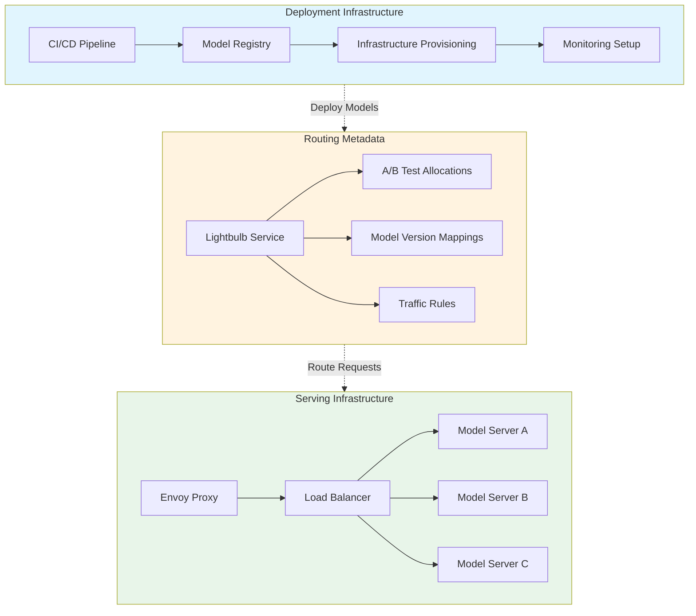

| Difficulty | Channel | Tags |
|---|---|---|
| beginner | devops | mlops, deployment |

Picture this: your ML platform is handling 1 million requests per second across 250 million users, and everything is working beautifully—until it isn't. Netflix built Switchboard, a centralized ML model serving router that became the single entry point for all client services to access models without knowing routing details, sharding, or A/B test allocations [1]. It worked perfectly, until the latency overhead of 10-20ms per request and the risk of a single point of failure forced them to fundamentally rethink what belongs in deployment infrastructure versus serving infrastructure. This is the story of how one company's success revealed a critical architectural flaw that many teams unknowingly replicate every day.

---

> ### Real-World Case — Netflix
>
> Netflix built Switchboard, a centralized ML model serving router to handle 1M+ requests/second across hundreds of model types for 250M users. It provided a single entry point for all client services to access models without knowing routing details, sharding, or A/B test allocations. As scale increased, the architecture hit a critical wall: Switchboard added 10-20ms of latency per request due to serialization overhead and became a single point of failure whose collapse would disable all ML-powered experiences simultaneously. This forced Netflix to architecturally decouple the routing metadata (Lightbulb) from the request path (Envoy), fundamentally rethinking what belongs in 'deployment' infrastructure vs. 'serving' infrastructure.
>
> | | |
> |---|---|
> | **Challenge** | Netflix needed to serve hundreds of model types (personalization, payments, fraud detection, content ranking) at 1M+ RPS while enabling rapid model experimentation. Their centralized Switchboard routing layer solved model abstraction but introduced two critical problems: (1) added 10-20ms latency per request from serialization/deserialization, and (2) became a single point of failure — a bug or noisy neighbor in Switchboard could cascade and disable all ML-powered features across the entire platform. The team needed to maintain the same level of routing flexibility and A/B testing capability while removing the routing service from the critical request path. |
> | **Solution** | Netflix evolved from Switchboard to Lightbulb by decoupling routing metadata from the request data plane. Switchboard handled both model selection AND request routing in the critical path. Lightbulb replaced it with a two-part architecture: Lightbulb runs outside the request path, resolving request context to determine routing metadata (which model, which cluster shard), then injects this as a header. Envoy proxy — already used for all Netflix egress traffic — consumes this routing header to forward requests to the correct serving cluster VIP without any additional network hop. The model serving platform also uses NVIDIA Triton with vLLM underneath, with models cached on Amazon FSx for fast warm starts instead of cold-starting from S3. Deployment uses two strategies: Red-Black for stable interfaces (zero-downtime swap) and Versioned deployments for breaking schema changes, where multiple model versions coexist during transition. |
> | **Outcome** | The architecture evolution eliminated the single point of failure while reducing serving latency by removing the 10-20ms serialization overhead from the request path. The platform serves hundreds of model types and versions across 30+ client services at 1M+ RPS with high availability. The decoupled design also enabled better tenant isolation, clearer separation of real vs. test traffic for model training, and independent scaling of routing metadata resolution from request forwarding. Netflix's in-house LLM serving stack on vLLM+Triton achieves this while maintaining a unified API for both traditional ML and LLM models, with constrained decoding pushed inside the decode loop to avoid wasted GPU compute on invalid generations. |
> | **Lesson** | The critical distinction between deployment and serving infrastructure became viscerally clear: Netflix discovered that putting routing logic (a deployment/configuration concern) into the serving request path created both a latency tax and a catastrophic failure mode. The solution was to move configuration resolution out of the hot path entirely — deployment concerns (model assignment, A/B rules, version mapping) happen asynchronously, while serving concerns (request forwarding, inference execution) stay on the critical path. This separation pattern — configuration plane vs. data plane — is the key insight. Many teams conflate deployment orchestration with serving infrastructure, leading to fragile systems where a config change can take down inference. |

---

## Hook — The Hidden Tax on Every ML Request

Every millisecond counts when you're serving millions of users. Netflix discovered this the hard way when their centralized model serving router, Switchboard, added 10-20ms of latency to every single request due to serialization overhead [1]. That's not just a number—it's the difference between a responsive recommendation engine and one that feels sluggish. But here's the twist: the real problem wasn't the latency itself. It was that Switchboard had become a single point of failure whose collapse would disable all ML-powered experiences simultaneously. The lesson? The line between deployment infrastructure and serving infrastructure is sharper than most teams realize, and blurring it can have catastrophic consequences.

## Problem — The Deployment vs. Serving Confusion

Many developers use "deployment" and "serving" interchangeably, but they solve fundamentally different problems. Deployment encompasses the CI/CD pipelines, infrastructure setup, monitoring, and rollback strategies that get your model from a notebook to a production environment. Serving, on the other hand, focuses on runtime inference APIs—handling request routing, model versioning, autoscaling, and response optimization in real-time. The confusion arises because both involve containers, orchestration, and infrastructure, yet they operate at different layers of the stack. When teams conflate these concerns, they often build systems like Netflix's Switchboard—monolithic serving layers that inherit deployment complexity and become fragile single points of failure. The stakes are high: deployment failures mean you can't ship new models, but serving failures mean your entire ML-powered product stops working for users right now.

## Real-World Case — Netflix's Switchboard Architecture

Netflix's Switchboard was designed to solve a real problem: hundreds of model types and versions across 30+ client services needed a unified entry point. The architecture centralized routing metadata and request forwarding, which simplified client integration but created two critical vulnerabilities. First, the serialization overhead of routing through Switchboard added 10-20ms to every request—a tax that scaled linearly with traffic. Second, Switchboard became a single point of failure whose collapse would disable all ML-powered experiences simultaneously. The impact was existential: at 1M+ requests per second across 250M users, even a brief outage would affect millions of recommendations, personalizations, and predictions in real-time. Netflix's solution was architectural decoupling—separating routing metadata (Lightbulb) from the request path (Envoy), fundamentally rethinking what belongs in deployment infrastructure versus serving infrastructure.

## Deep Dive — Deployment vs. Serving: The Technical Boundary

To understand the distinction, consider what each layer actually does. Deployment infrastructure handles the lifecycle of getting models into production: containerization with Docker, orchestration with Kubernetes, infrastructure provisioning with Terraform, and CI/CD pipelines with tools like GitHub Actions or Jenkins [2]. Platform services like MLflow, SageMaker, or Vertex AI manage experiment tracking, model registry, and deployment orchestration [3]. Serving infrastructure, by contrast, handles the runtime concerns: FastAPI or gRPC endpoints for inference requests, model servers like TorchServe or TensorFlow Serving for loading and executing models, and load balancers like NGINX or Envoy for request routing [4]. The critical insight is that serving infrastructure should be stateless and decoupled from deployment metadata. Netflix learned this when they separated Lightbulb (routing metadata resolution) from Envoy (request forwarding), eliminating the single point of failure while reducing latency by removing serialization overhead from the request path.

## Workflow — The Modern ML Serving Architecture

The modern approach follows a clear separation of concerns. First, deployment pipelines handle model packaging, versioning, and infrastructure provisioning. Second, a metadata service (like Netflix's Lightbulb) manages routing rules, A/B test allocations, and model version mappings. Third, the serving layer (like Envoy) handles request forwarding, load balancing, and health checks. This architecture enables independent scaling: metadata resolution can be cached and scaled separately from request forwarding, which can be horizontally scaled with pod replicas. The Mermaid diagram below illustrates this decoupled architecture and how it avoids the single point of failure that plagued Netflix's Switchboard.

## Code Example — Building a Decoupled Model Serving Router

The following Python code demonstrates a simplified version of the decoupled architecture Netflix implemented. It separates routing metadata from request forwarding, showing how you can build a serving system that scales independently and avoids single points of failure.

## Lessons Learned — The Boundary That Matters

The Netflix story teaches three critical lessons. First, deployment and serving are distinct concerns that should be architecturally separated—conflating them creates fragile systems. Second, serving infrastructure should be stateless and horizontally scalable, with routing metadata decoupled from the request path. Third, latency budgets are real: every component in the request path adds overhead, so minimize serialization and network hops. When designing your own ML serving system, start by drawing a clear line between what happens during deployment (CI/CD, infrastructure, monitoring) and what happens during serving (request routing, model execution, response optimization). The teams that get this right build systems that scale to millions of requests per second; the ones that don't end up debugging mysterious latency spikes at 3am.

---

## Decoupled ML Serving Architecture

<strong>Original Interview Question</strong>

**Q:** Explain the key differences between model serving and model deployment in ML systems, including specific technologies, scaling considerations, and real-world implementation patterns?

**A:** Deployment encompasses CI/CD pipelines, infrastructure setup, and monitoring using tools like Kubernetes, MLflow, and SageMaker. Serving focuses on runtime inference APIs with frameworks like TensorFlow Serving, TorchServe, or BentoML, handling request routing, model versioning, and autoscaling. Key trade-offs include latency vs throughput, batch vs real-time inference, and cold start optimization.

## Conclusion

The Netflix Switchboard story reveals a truth that many teams learn the hard way: deployment and serving are distinct architectural concerns that must be separated. When you conflate them, you build fragile systems with hidden latency taxes and single points of failure. The solution isn't more sophisticated serving frameworks—it's drawing a clear line between what happens during deployment (CI/CD, infrastructure, monitoring) and what happens during serving (request routing, model execution, response optimization). Start by auditing your current ML infrastructure: where does deployment end and serving begin? If the answer isn't clear, you're one scaling challenge away from a 3am incident. The teams that get this right build systems that serve millions of requests per second; the ones that don't spend their time debugging mysterious latency spikes instead of shipping better models.

---

## References

1. [Netflix State of Routing in Model Serving](https://netflixtechblog.com/state-of-routing-in-model-serving-16e22fe18741) — blog
2. [Kubernetes Documentation](https://kubernetes.io/docs/home/) — documentation
3. [MLflow Documentation](https://mlflow.org/docs/latest/index.html) — documentation
4. [TensorFlow Serving GitHub Repository](https://github.com/tensorflow/serving) — documentation
5. [TorchServe GitHub Repository](https://github.com/pytorch/serve) — documentation
6. [BentoML Documentation](https://docs.bentoml.com/en/latest/) — documentation
7. [Envoy Proxy Documentation](https://www.envoyproxy.io/docs/envoy/latest/) — documentation
8. [AWS SageMaker Developer Guide](https://docs.aws.amazon.com/sagemaker/latest/dg/whatis.html) — documentation

---

**Author:** Satishkumar Dhule — [GitHub](https://github.com/satishkumar-dhule) · [LinkedIn](https://linkedin.com/in/satishkumar-dhule) · [Website](https://satishkumar-dhule.github.io)
