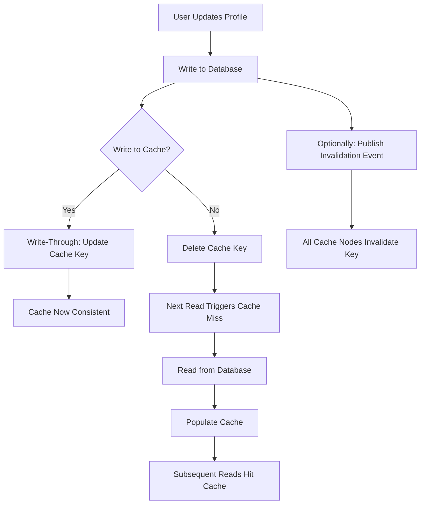

| Difficulty | Channel | Tags |
|---|---|---|
| beginner | backend | redis, memcached, cache-invalidation |

What if one architectural decision could slash your infrastructure costs by 95% while tripling your read throughput? That's exactly what happened at Uber when they built CacheFront, an integrated Redis caching layer that scaled from 40 million to over 150 million reads per second [1]. The twist? Their biggest challenge wasn't performance — it was the age-old nemesis of every distributed systems engineer: cache invalidation. If you've ever stared at stale user data and wondered "why didn't this update?", you're about to discover why even the world's most sophisticated engineering teams struggle with this problem — and the counterintuitive pattern that made it work at massive scale.

---

> ### Real-World Case — Uber
>
> Uber built CacheFront, an integrated Redis caching layer for their Docstore online storage, to serve reads at massive scale. They initially relied on TTL expiration and CDC-based invalidation (via their Flux service tailing MySQL binlogs), but as they scaled to 40M+ reads/sec, service owners demanded both higher cache hit rates and stronger consistency — goals that directly conflict, since higher TTLs mean more stale data.
>
> | | |
> |---|---|
> | **Challenge** | Cache invalidation was eventually consistent: TTL + CDC lag meant read-own-writes and read-own-inserts could serve stale or incorrect data. Engineers wanted to increase TTLs for higher hit rates, but this made staleness worse. Conditional database updates (e.g., UPDATE ... WHERE) made it impossible to know which rows changed, so synchronous invalidation seemed infeasible. |
> | **Solution** | Uber evolved through three generations of invalidation: (1) TTL-only, (2) CDC via Flux tailing MySQL binlogs with invalidation markers (not deletes — markers prevent cache stampedes), and (3) synchronous write-through invalidation after modifying their storage engine to return the exact set of row keys affected by each transaction. They also built Cache Inspector, a staleness measurement tool that compares binlog events against cached values with a 1-minute delay to detect inconsistencies. Using database-assigned session timestamps for deduplication between the three invalidation paths was critical. |
> | **Outcome** | CacheFront scaled from 40M to 150M+ reads per second. Cache hit rate pushed above 99.9% with TTLs extended to 24 hours (previously limited to 5 minutes due to consistency concerns). P75 latency dropped 75% and P99.9 latency dropped 67%. The same workload that would have required 60K CPU cores from direct database access was served by only 3K Redis cores. |
> | **Lesson** | The key insight: cache invalidation is not just a protocol problem — it's a measurement problem. You can't improve what you can't measure. Uber built Cache Inspector to quantitatively assess staleness, which gave them the confidence to extend TTLs from 5 minutes to 24 hours. Also, using invalidation markers instead of DELETE prevents cache stampedes, and database-assigned timestamps (not application clocks) are essential for deduplication across multiple invalidation paths. |

---

## Hook — The $60,000 Cores That Could

Picture this: your service is handling millions of reads per second, and every single one hits the database directly. You're burning through 60,000 CPU cores just to serve reads. Meanwhile, your infrastructure bill is climbing faster than your user growth. Then your team deploys a caching layer and suddenly 3,000 cores do the same work — a 20x reduction in compute [1]. But here's the catch that nobody warns you about: caching is easy; cache invalidation is where engineers lose their weekend sleep. You delete a user's profile picture, but for the next 5 minutes, thousands of users still see the old one. Sound familiar? This is the paradox at the heart of every caching system — the tension between speed and freshness that has tripped up teams from startups to companies like Uber.

## Problem — Why Cache Invalidation Breaks Everything

At its core, the cache invalidation problem comes down to a deceptively simple question: when data changes in the database, how do you make sure every cached copy reflects that change — instantly, everywhere, at scale? Consider a user profile service. A user updates their bio, changes their profile picture, or modifies their email. Those writes go to the database, but thousands of read requests are still pulling from cache. If the cache isn't invalidated correctly, users see stale data. Miss the invalidation entirely, and you've got a data consistency nightmare. The challenge compounds in distributed systems: if you have multiple application servers, each with its own cache instance, a write on Server A needs to propagate to caches on Servers B through Z. Many developers assume they can rely on TTL-based expiration — "just set a short TTL and it'll sort itself out." But here's the real-world tension: short TTLs mean more cache misses and more database load, while long TTLs mean more stale data. Uber's experience showed this trade-off perfectly — their original 5-minute TTLs provided consistency but capped cache hit rates at around 95% [1]. To push above 99.9% hit rates, they had to extend TTLs to 24 hours, but that required a fundamentally different invalidation strategy. This is why understanding write-through, write-behind, and cache-aside patterns isn't just academic — it's the difference between a service that handles 40M reads/sec and one that crumbles under 1M.

## Real-World Case — How Uber Rebuilt Their Entire Caching Architecture

Uber's journey with CacheFront is a masterclass in scaling cache invalidation. Their Docstore service — an online storage layer for MySQL — needed to serve reads at enormous scale. They built an integrated Redis caching layer that leveraged two invalidation mechanisms: TTL-based expiration and change data capture (CDC) through their Flux service, which tailed MySQL binlogs to detect writes and invalidate the corresponding cache keys [1]. Initially, the system worked, but with a ceiling. Cache hit rates plateaued around 95% because the consistency requirements forced TTLs to stay below 5 minutes. Every service owner wanted both higher hit rates and stronger consistency — goals that directly conflict. Uber's solution was counterintuitive: they extended TTLs to 24 hours while building a robust CDC-based invalidation pipeline that could reliably propagate changes across the entire distributed cache. The result was transformative. Cache hit rates climbed above 99.9%, P75 latency dropped 75%, and P99.9 latency dropped 67% [1]. The infrastructure footprint shrank dramatically — the same workload went from requiring 60,000 CPU cores of direct database access to just 3,000 Redis cores. This case study reveals a critical insight: cache invalidation isn't just about deleting keys — it's about designing an entire event propagation system that can handle the realities of distributed, high-throughput systems.

## Deep Dive — Redis vs Memcached: The Trade-offs That Actually Matter

When choosing between Redis and Memcached for profile caching, many developers fixate on speed benchmarks and miss the architectural implications that determine success or failure at scale. Redis brings pub/sub messaging to the table, which fundamentally changes how you approach distributed cache invalidation [2]. When a profile is updated, a Redis pub/sub message can automatically notify all cache nodes to invalidate their local copies. Memcached has no built-in pub/sub capability — you must coordinate invalidation manually across all nodes, typically through application-level logic or an external message broker [3]. This isn't just a convenience difference; it's an architectural gap that widens as you scale. Redis also supports persistence through RDB snapshots and AOF logging [4], which means cache warm-up after a restart is fast. Memcached treats all data as ephemeral — a restart means cold caches and a thundering herd of database queries [5]. However, Memcached's simplicity is its superpower for straightforward use cases. Its slab-based memory allocator means lower memory overhead per key, and its single-threaded architecture eliminates lock contention for pure key-value lookups [3]. If your invalidation strategy is simple TTL-based and your data model is flat key-value pairs, Memcached can be faster per operation. The real trade-off matrix looks like this:

## Workflow — The Write-Through Cache Invalidation Pipeline

The most reliable pattern for profile caching combines a write-through strategy with key-based invalidation. Here's the step-by-step flow:

## Code Example — Implementing Profile Cache with Redis Invalidation

Here's a production-ready implementation of a user profile cache with write-through invalidation using Redis. This example demonstrates the core pattern that scales from single-node to distributed caching:

## Lessons Learned — The Cache Invalidation Playbook

After examining how companies like Uber battle cache invalidation at scale, several hard-won lessons emerge. First, choose your invalidation strategy based on your consistency requirements — not your speed benchmarks. Uber discovered that extending TTLs to 24 hours was only viable because they invested heavily in CDC-based invalidation through binlog tailing [1]. If you're using simple TTL-only invalidation, keep TTLs short (5-30 minutes for user profiles) and accept the lower hit rates. Second, Redis's pub/sub capability is the deciding factor for distributed invalidation. When you have multiple cache nodes, Memcached's lack of built-in pub/sub means you're either broadcasting invalidation messages through your application layer or accepting eventual consistency across nodes [2][3]. Third, always monitor your cache hit rate — it's your canary in the coal mine. Uber's push above 99.9% hit rate was only possible after they solved the invalidation problem. A dropping hit rate often signals invalidation failures before users notice stale data. Fourth, implement cache warming strategies. When a cold cache restarts, a thundering herd of requests can overwhelm your database. Pre-warming from recent access patterns or maintaining a secondary cold cache layer prevents this. Finally, the most counterintuitive lesson: sometimes the best caching strategy is to cache less aggressively. Uber's journey from 95% to 99.9% hit rates required not just better invalidation, but fundamentally rethinking what belonged in cache and what could be computed on-demand. The 60,000 CPU cores to 3,000 Redis cores transformation wasn't just about caching — it was about caching the right things, invalidating them correctly, and knowing when to let the database do the work [1].

---

## Write-Through Cache Invalidation Pipeline

<strong>Original Interview Question</strong>

**Q:** You're building a user profile service that caches frequently accessed profiles. How would you implement cache invalidation when a user updates their profile, and what trade-offs would you consider between Redis and Memcached?

**A:** Implement write-through caching with TTL-based expiration. On profile update, invalidate the cache by deleting the key and writing new data to both the database and cache. Redis offers pub/sub for automatic distributed invalidation, while Memcached requires manual coordination across nodes.

## Conclusion

Cache invalidation remains one of computer science's two hardest problems not because the concepts are complex, but because the edge cases are endless. Uber's CacheFront team proved that the right combination of write-through caching, CDC-based invalidation, and Redis's pub/sub capabilities can push cache hit rates above 99.9% while cutting infrastructure costs by 95% [1]. The key insight from their journey: stop treating cache invalidation as a TTL problem and start treating it as an event propagation problem. If you're implementing profile caching tomorrow, start with the write-through pattern from the code example, monitor your hit rates obsessively, and when you're ready to scale beyond a single node, Redis's pub/sub is your path to distributed invalidation without the coordination nightmare. The 60,000 cores to 3,000 cores transformation isn't magic — it's just caching done right.

---

## References

1. [Uber engineering: How Uber Serves Over 150 Million Reads per Second](https://www.uber.com/us/en/blog/how-uber-serves-over-150-million-reads/) — blog
2. [Redis documentation: Pub/Sub](https://redis.io/docs/develop/interact/pubsub/) — documentation
3. [Memcached wiki: Overview](https://github.com/memcached/memcached/wiki) — documentation
4. [Redis documentation: Persistence](https://redis.io/docs/develop/operate/oss-and-enterprise/upgrade-guides/internals/) — documentation
5. [Wikipedia: Memcached](https://en.wikipedia.org/wiki/Memcached) — documentation
6. [Redis documentation: Redis Cluster](https://redis.io/docs/develop/operate/oss-and-enterprise/cluster/) — documentation
7. [Wikipedia: Cache invalidation](https://en.wikipedia.org/wiki/Cache_invalidation) — documentation
8. [AWS ElastiCache for Redis documentation](https://docs.aws.amazon.com/AmazonElastiCache/latest/red-ug/WhatIs.html) — documentation
9. [Wikipedia: Redis](https://en.wikipedia.org/wiki/Redis) — documentation
10. [MDN Web Docs: Cache API](https://developer.mozilla.org/en-US/docs/Web/API/Cache) — documentation

---

**Author:** Satishkumar Dhule — [GitHub](https://github.com/satishkumar-dhule) · [LinkedIn](https://linkedin.com/in/satishkumar-dhule) · [Website](https://satishkumar-dhule.github.io)
