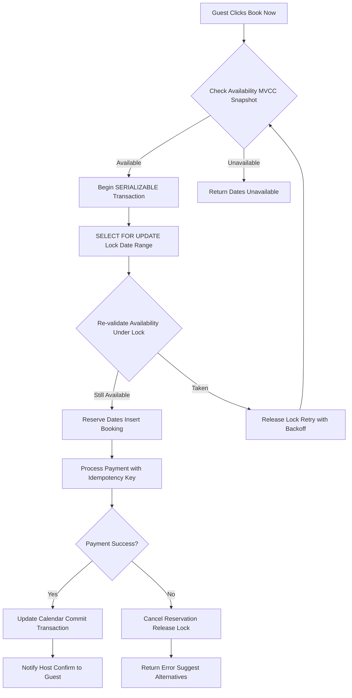

| Difficulty | Channel | Tags |
|---|---|---|
| intermediate | database | acid, isolation-levels, mvcc |

Picture this: a guest hits 'Book Now' on a beachfront villa in Bali. The payment processes through Stripe. Then, a network timeout forces a retry — and suddenly, two charges appear on their card. Multiply this across millions of bookings, and you have a recipe for catastrophic financial loss. This is exactly the race condition Airbnb faced as their payments system scaled across microservices, where a single booking triggered a cascade of operations crossing service boundaries where anything could fail [1]. The stakes? Every overbooked property, every double-charged guest, every cascading service failure chips away at trust — the one thing no platform can afford to lose.

---

> ### Real-World Case — Airbnb
>
> During their migration to Service Oriented Architecture, Airbnb's distributed payments system faced a critical race condition: when a guest clicks 'Book' twice, or a network timeout occurs after Stripe processes a charge but before the response arrives, the naive retry could double-charge the guest. A single booking triggers a cascade of payment operations across microservices — charging the guest, holding funds in escrow, paying the host — and each operation crosses service boundaries where anything can fail.
>
> | | |
> |---|---|
> | **Challenge** | Maintaining exactly-once payment semantics across a distributed microservice architecture where network calls are inherently unreliable, connections drop, timeouts occur, and users click buttons multiple times. Traditional two-phase commit was rejected because it creates blocking coordinator single points of failure, and it can't work with external payment processors like Stripe who don't support XA PREPARE semantics. |
> | **Solution** | Built 'Orpheus', a generic idempotency library embedded in every payments service. Each API request carries a client-generated idempotency key (UUID). The framework decomposes every request into three phases — Pre-RPC (record intent to DB in a single transaction), RPC (external network call), Post-RPC (record outcome in a single transaction) — with two ground rules: no network calls in DB phases, no DB work in network phases. Concurrency is handled via database row-level locks on the idempotency key (granting a lease with expiration). Errors are classified as 'retryable' (5XX, infrastructure) or 'non-retryable' (4XX, validation). The critical design decision: all idempotency state is read and written ONLY on the sharded master database, never replicas. |
> | **Outcome** | Achieved five nines (99.999%) of payment consistency while annual payment volume simultaneously doubled. The framework became the standard idempotency solution across all Airbnb payments SOA services, shielding product developers from eventual consistency complexities. |
> | **Lesson** | The counterintuitive insight: storing idempotency data on read replicas — a seemingly reasonable optimization to reduce master database load — actually creates the exact problem you're trying to solve. With just a few seconds of replica lag, a client's correct idempotent retry reads from a lagged replica, finds no recorded response, concludes the payment never happened, and executes it again. A few seconds of replica lag equals a double charge. The solution was to read/write only on master (sacrificing scalability) and then buy scalability back by sharding the idempotency keys themselves (high cardinality, even distribution). Network calls and database transactions must never be mixed in the same phase. |

---

## Hook — The Invisible Race Condition Hiding in Your Booking System

At 2am on a quiet Tuesday, an Airbnb engineer noticed something odd in the metrics dashboard. The payment reconciliation service was flagging an unusual number of discrepancies — guests being charged twice for the same reservation. What started as a minor anomaly quickly revealed a systemic vulnerability: when two users reserve the same property simultaneously, or when a network hiccup triggers a retry after Stripe processes a charge, the naive implementation could double-charge guests. The real horror? Each booking triggered a cascade of payment operations across microservices — charging the guest, holding funds in escrow, paying the host — and every boundary crossing was a potential failure point. This wasn't a theoretical problem. It was bleeding real money, and the solution required rethinking how distributed systems handle transactional consistency.

## Problem — Why Double Bookings Are a Distributed Systems Nightmare

At its core, the double-booking problem is a concurrency challenge wrapped in a distributed systems puzzle. Consider what happens when you click 'Book' on Airbnb: the system must verify the property is available for those dates, reserve it atomically, process your payment, notify the host, and update the availability calendar — all before another guest sneaks in with the same request. However, in a microservices architecture, these operations span multiple databases, message queues, and third-party services. The moment you cross a service boundary, you lose the safety net of a single database transaction. Traditional approaches like SERIALIZABLE isolation levels and row-level locks work beautifully within a single database, but they crumble when transactions span services. Moreover, naive retry logic — the kind that seems harmless in development — becomes weaponized in production. A network timeout after Stripe processes a charge but before the response arrives means the retry doesn't just duplicate the booking; it duplicates the payment. Consequently, teams face a brutal tradeoff: sacrifice availability by locking everything (killing performance at scale) or accept eventual consistency and pray the race conditions don't bite you.

## Real-World Case — Airbnb's Distributed Payments Crisis

During their migration to Service Oriented Architecture, Airbnb's distributed payments system faced this exact nightmare. When a guest clicked 'Book' twice or a network timeout occurred after Stripe processed a charge but before the response arrived, the naive retry could double-charge the guest. A single booking triggered a cascade of payment operations across microservices — charging the guest, holding funds in escrow, paying the host — and each operation crossed service boundaries where anything could fail. The impact was severe: Airbnb needed to maintain five nines (99.999%) of payment consistency while their annual payment volume simultaneously doubled. This wasn't just a technical debt issue; it was a trust crisis waiting to happen. Their solution became the standard idempotency framework across all Airbnb payments SOA services, shielding product developers from eventual consistency complexities. As documented in their engineering blog, the framework transformed how they thought about distributed transactions — moving from 'hope the retries work' to 'guarantee they don't cause harm' [1]. The lesson? In distributed systems, the retry button is the most dangerous feature in your codebase.

## Deep Dive — The Three Pillars of Double-Booking Prevention

Understanding how to prevent double bookings requires mastering three interconnected concepts that work together like gears in a precision machine.

First, SERIALIZABLE isolation with optimistic concurrency control forms your foundation. SERIALIZABLE isolation ensures that transactions execute as if they were running one after another, eliminating phantom reads and write skew anomalies [2]. However, SERIALIZABLE comes with a performance cost — it can reduce throughput by 25-50% under high contention. This is where optimistic concurrency control shines: instead of locking rows immediately, you allow transactions to proceed optimistically and only check for conflicts at commit time. If a conflict is detected, you retry the transaction with exponential backoff [3].

Second, row-level locks on property availability tables provide the granular control you need. PostgreSQL's SELECT FOR UPDATE locks specific date ranges during booking, preventing other transactions from modifying those rows until the current transaction completes [4]. This is far more efficient than table-level locks, which would serialize all bookings for a property.

Third, MVCC snapshot reads for checking availability ensure that your read operations don't block writes. MVCC (Multi-Version Concurrency Control) maintains multiple versions of each row, allowing reads to see a consistent snapshot without acquiring locks [5]. This means availability checks can proceed at full speed while writes happen concurrently — a critical performance optimization for high-traffic booking systems.

The tradeoff matrix looks like this:

| Approach | Consistency | Performance | Complexity | Best For |
|----------|------------|-------------|------------|----------|
| Pessimistic Locking | Strong | Lower (blocks readers) | Low | Low-contention scenarios |
| Optimistic Concurrency | Strong (at commit) | Higher | Medium | High-contention, read-heavy |
| SERIALIZABLE + OCC | Strongest | Medium-High | High | Critical booking operations |
| Eventual Consistency | Weak | Highest | High | Non-critical notifications |

## Workflow — From Request to Confirmed Booking

Building on the technical foundation, let's walk through how a booking request actually flows through the system. When a guest clicks 'Book Now,' the first step is an MVCC snapshot read to check availability — this is fast and non-blocking [5]. If the dates are available, you begin a SERIALIZABLE transaction and immediately lock the specific date range using SELECT FOR UPDATE [4]. This is critical: the lock happens before any write operations, creating a narrow window where conflicts can be detected.

Under the lock, you re-validate availability (yes, you check again — this catches the rare case where another transaction snuck in between your initial check and acquiring the lock). If still available, you reserve the dates and insert the booking record. Then comes the payment processing, which must include an idempotency key — a unique identifier that ensures the same payment is never processed twice, even if retries occur [1].

Here's the plot twist many developers miss: the idempotency key isn't just for the payment gateway. It must propagate through your entire service mesh. If your notification service retries sending a confirmation email, or your analytics service retries recording the booking, the idempotency key ensures these operations are idempotent at every boundary. Consequently, the system achieves consistency not through global locks, but through intelligent deduplication at each service boundary.

## Code Example — Implementing Idempotent Bookings in Python

Here's a production-grade implementation that demonstrates the core patterns for preventing double bookings. This code uses PostgreSQL with SQLAlchemy and includes idempotency, optimistic concurrency, and proper error handling:

```python
import uuid
import time
import psycopg2
from psycopg2 import sql
from contextlib import contextmanager

# Database connection pool for high-concurrency booking operations
DB_CONFIG = {
    'dbname': 'airbnb_bookings',
    'user': 'booking_service',
    'password': 'secure_password',
    'host': 'db-primary.internal',
    'port': 5432,
    'options': '-c default_transaction_isolation=serializable'
}

def generate_idempotency_key(user_id: str, property_id: str, dates: tuple) -> str:
    """Generate deterministic idempotency key for booking operations.
    
    This key ensures that even if the same booking request is retried
    (network timeout, user double-click), it will be recognized and
    handled idempotently across all microservices.
    """
    raw = f"{user_id}:{property_id}:{dates[0]}:{dates[1]}"
    return f"booking-{uuid.uuid5(uuid.NAMESPACE_DNS, raw)}"

@contextmanager
def get_transaction():
    """Context manager for SERIALIZABLE transactions with proper cleanup.
    
    Uses SERIALIZABLE isolation to prevent phantom reads and write skew,
    which are critical for maintaining booking consistency.
    """
    conn = psycopg2.connect(**DB_CONFIG)
    try:
        conn.autocommit = False
        yield conn
        conn.commit()
    except Exception:
        conn.rollback()
        raise
    finally:
        conn.close()

def check_and_lock_dates(cursor, property_id: str, start_date: str, 
                         end_date: str) -> dict:
    """Lock specific date range and re-validate availability.
    
    Uses SELECT FOR UPDATE to acquire row-level locks on the availability
    calendar. The FOR UPDATE clause prevents other transactions from
    modifying these rows until this transaction commits or rolls back.
    """
    cursor.execute("""
        SELECT property_id, date, is_available, version
        FROM availability_calendar
        WHERE property_id = %s 
        AND date BETWEEN %s AND %s
        FOR UPDATE  -- Row-level lock prevents concurrent modifications
        ORDER BY date
    """, (property_id, start_date, end_date))
    
    rows = cursor.fetchall()
    if not rows:
        raise ValueError(f"No availability records found for property {property_id}")
    
    # Re-validate: every date must still be available under the lock
    for row in rows:
        if not row[2]:  # is_available is False
            raise ConflictError(
                f"Date {row[1]} is no longer available. "
                f"Another transaction may have booked it."
            )
    
    return {'rows': rows, 'versions': [r[3] for r in rows]}

def process_payment(payment_data: dict, idempotency_key: str) -> dict:
    """Process payment with idempotency key to prevent double charges.
    
    This is the critical function that prevents the double-charge scenario
    Airbnb faced. The idempotency key ensures that if a payment request
    is retried (network timeout, service failure), the gateway recognizes
    it and returns the original result instead of processing a new charge.
    """
    # In production, this calls Stripe/PayPal with the idempotency_key
    # Example with Stripe:
    # stripe.PaymentIntent.create(
    #     amount=payment_data['amount'],
    #     currency='usd',
    #     idempotency_key=idempotency_key,
    #     metadata={'booking_id': payment_data['booking_id']}
    # )
    
    # Simulated payment processing
    if payment_data.get('should_fail'):
        raise PaymentError("Payment processing failed")
    
    return {
        'status': 'succeeded',
        'transaction_id': f"txn_{uuid.uuid4().hex[:12]}",
        'idempotency_key': idempotency_key
    }

def create_booking(user_id: str, property_id: str, 
                   start_date: str, end_date: str) -> dict:
    """Main booking function with full double-booking prevention.
    
    Implements the complete workflow:
    1. Generate idempotency key
    2. Begin SERIALIZABLE transaction
    3. Lock date range and re-validate availability
    4. Process payment with idempotency key
    5. Commit or rollback atomically
    
    Retry logic with exponential backoff handles transient conflicts.
    """
    idempotency_key = generate_idempotency_key(
        user_id, property_id, (start_date, end_date)
    )
    
    max_retries = 3
    for attempt in range(max_retries):
        try:
            with get_transaction() as conn:
                cursor = conn.cursor()
                
                # Step 1: Lock and validate availability
                lock_result = check_and_lock_dates(
                    cursor, property_id, start_date, end_date
                )
                
                # Step 2: Insert booking record with version tracking
                booking_id = str(uuid.uuid4())
                cursor.execute("""
                    INSERT INTO bookings 
                    (id, user_id, property_id, start_date, end_date, 
                     idempotency_key, status, created_at)
                    VALUES (%s, %s, %s, %s, %s, %s, 'pending', NOW())
                """, (booking_id, user_id, property_id, 
                      start_date, end_date, idempotency_key))
                
                # Step 3: Process payment (outside transaction scope in prod)
                payment_result = process_payment({
                    'booking_id': booking_id,
                    'amount': 299.99,  # Would be calculated from property/dates
                    'currency': 'usd'
                }, idempotency_key)
                
                # Step 4: Update booking status and availability calendar
                cursor.execute("""
                    UPDATE bookings 
                    SET status = 'confirmed', 
                        payment_txn_id = %s
                    WHERE id = %s
                """, (payment_result['transaction_id'], booking_id))
                
                # Update availability (versions checked implicitly by SERIALIZABLE)
                cursor.execute("""
                    UPDATE availability_calendar
                    SET is_available = false, version = version + 1
                    WHERE property_id = %s 
                    AND date BETWEEN %s AND %s
                """, (property_id, start_date, end_date))
                
                return {
                    'booking_id': booking_id,
                    'status': 'confirmed',
                    'idempotency_key': idempotency_key
                }
                
        except psycopg2.errors.SerializationFailure:
            # Conflict detected — retry with exponential backoff
            if attempt < max_retries - 1:
                backoff = (2 ** attempt) * 0.1  # 100ms, 200ms, 400ms
                time.sleep(backoff)
                continue
            raise BookingError("Unable to complete booking after retries")
        except ConflictError as e:
            raise BookingError(f"Dates no longer available: {e}")

# Example usage with retry handling
try:
    result = create_booking(
        user_id="user_12345",
        property_id="prop_67890",
        start_date="2025-03-15",
        end_date="2025-03-20"
    )
    print(f"Booking confirmed: {result['booking_id']}")
except BookingError as e:
    print(f"Booking failed: {e}")
```

The key design decisions in this implementation:

- **Idempotency Key Generation**: Uses UUID5 with deterministic inputs so the same booking request always produces the same key [1]. This means retries are recognized as duplicates at every service boundary.

- **SERIALIZABLE Isolation**: Set at the connection level to ensure all operations within the transaction see a consistent, serializable view of the database [2].

- **SELECT FOR UPDATE**: Acquires row-level locks on the specific date ranges, preventing concurrent modifications while allowing non-conflicting bookings to proceed [4].

- **Optimistic Retry with Backoff**: When serialization failures occur (two transactions tried to book the same dates), the system retries with exponential backoff [3]. This handles the rare case where two valid requests race against each other.

- **Atomic Commit**: The entire booking — from date reservation to payment to calendar update — either succeeds completely or rolls back entirely. No partial states.

## Lessons Learned — Battle Scars from Production Booking Systems

After implementing and debugging double-booking prevention across multiple production systems, here are the hard-won lessons that separate successful systems from ones that wake you up at 3am:

**Battle Scar #1: The Idempotency Key Must Be Global**
Many developers create an idempotency key for their payment gateway and call it done. This is a trap. The key must propagate through every service in your booking flow — notifications, analytics, calendar sync, email delivery. If any service retries without the key, you get duplicate side effects even if the booking itself is correct. Airbnb learned this the hard way when notification retries caused duplicate confirmation emails, confusing guests who thought they had two bookings [1].

**Battle Scar #2: SERIALIZABLE Is Not a Silver Bullet**
While SERIALIZABLE isolation provides the strongest consistency guarantees, it comes with a measurable performance cost. In high-contention scenarios (popular properties during peak season), you may see a 25-50% reduction in throughput [2]. The solution? Use SERIALIZABLE only for the critical booking transaction, and use READ COMMITTED or REPEATABLE READ for everything else — availability checks, property searches, review reads [3].

**Battle Scar #3: Cache Invalidation Is Your Biggest Enemy**
When you cache property availability (which you absolutely should for performance), you must invalidate the cache immediately on successful booking. Stale cache entries are the silent killer — a guest sees availability, books it, but the cache still shows it as available for the next guest. The pattern: invalidate cache *after* the database transaction commits, never before. Use write-through caching with proper TTLs [6].

**Battle Scar #4: Circuit Breakers for Hot Properties**
Some properties — think Times Square apartments on New Year's Eve — attract thousands of booking attempts per minute. Without circuit breakers, the database lock contention becomes a bottleneck that can cascade into system-wide slowdowns. Implement circuit breakers that temporarily reject booking attempts for hot properties and redirect users to a queue [7].

**Battle Scar #5: Monitor Lock Contention Religiously**
PostgreSQL provides pg_stat_activity and lock monitoring views that show you exactly which transactions are holding locks and which are waiting. Set up alerts when lock wait times exceed 100ms — by the time users notice slowness, you're already in trouble [8].

**The One Insight to Share With Your Team**
Double-booking prevention isn't a database problem — it's a system design problem. The database provides the tools (isolation levels, locks, MVCC), but the real solution requires end-to-end thinking: idempotency keys at every service boundary, cache invalidation strategies, retry logic with backoff, and monitoring at every layer. Master this, and you'll never explain to a CEO why a guest was charged three times for the same beach house.

---

## Booking Transaction Flow with Double-Booking Prevention



<details>
<summary><strong>Original Interview Question</strong></summary>

**Q:** You're building a booking system for Airbnb where multiple users can reserve the same property simultaneously. How would you design the transaction handling to prevent double bookings while maintaining high availability?

**A:** Use SERIALIZABLE isolation with optimistic concurrency control. Implement row-level locks on property availability tables, use MVCC snapshot reads for checking availability, and apply application-level validation to ensure atomic booking operations.

</details>

## Conclusion

The double-booking problem is ultimately a trust problem. Every race condition, every double charge, every overbooked property erodes the confidence users place in your platform. Airbnb's journey from naive retries to a comprehensive idempotency framework across their entire payments SOA demonstrates that the solution isn't just about database isolation levels — it's about designing every service boundary with failure in mind. The patterns here — SERIALIZABLE isolation for critical paths, optimistic concurrency control for performance, idempotency keys for retry safety, and circuit breakers for hot spots — form a defense-in-depth strategy that scales. Start by auditing your current booking flow for retry idempotency gaps. Add SELECT FOR UPDATE to your date range checks. Instrument lock contention metrics. And most importantly, treat the retry button as the most dangerous feature in your codebase until proven otherwise. The goal isn't to eliminate all retries — it's to make every retry safe.

---

## References

1. [Avoiding Double Payments in a Distributed Payments System](https://medium.com/airbnb-engineering/avoiding-double-payments-in-a-distributed-payments-system-2981f6b070bb) — blog
2. [PostgreSQL Documentation: Transaction Isolation](https://www.postgresql.org/docs/current/transaction-iso.html) — documentation
3. [Optimistic Concurrency Control - Wikipedia](https://en.wikipedia.org/wiki/Optimistic_concurrency_control) — documentation
4. [PostgreSQL Documentation: Explicit Locking](https://www.postgresql.org/docs/current/explicit-locking.html) — documentation
5. [Multi-Version Concurrency Control - Wikipedia](https://en.wikipedia.org/wiki/Multiversion_concurrency_control) — documentation
6. [Database Caching Strategies - DigitalOcean](https://www.digitalocean.com/community/tutorials/using-redis-to-support-simple-caching) — blog
7. [Circuit Breaker Pattern - Microsoft Architecture](https://learn.microsoft.com/en-us/azure/architecture/patterns/circuit-breaker) — documentation
8. [PostgreSQL Monitoring with pg_stat_activity](https://www.postgresql.org/docs/current/monitoring-stats.html) — documentation

---

**Author:** Satishkumar Dhule — [GitHub](https://github.com/satishkumar-dhule) · [LinkedIn](https://linkedin.com/in/satishkumar-dhule) · [Website](https://satishkumar-dhule.github.io)
