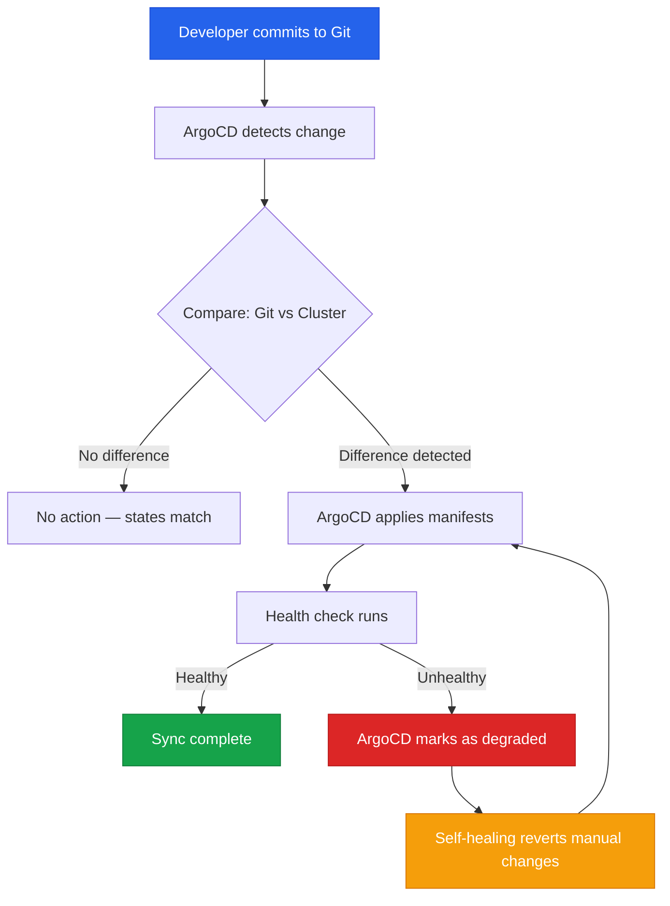

| Difficulty | Channel | Tags |
|---|---|---|
| beginner | devops | argocd, flux, declarative |

Picture this: you are responsible for 3,000 production services running across nearly 50,000 environments, and your deployment platform is buckling under the weight. That is exactly the cliff Adobe was staring down with their legacy CaaS platform, Moonbeam. Pipelines were slow, configuration drift was rampant, and nobody could confidently answer which services were even still alive. The answer? A full-throated migration to GitOps, Argo, and Kubernetes — a move that would retire roughly 80% of stale services, migrate or decommission 10,400 pipelines, and fundamentally change how hundreds of teams ship software [1]. This is not just Adobe's story. If you have ever pushed a kubectl apply into production and prayed, this one is for you.

---

> ### Real-World Case — Adobe
>
> Adobe needed to modernize its software delivery platform, migrating from a legacy internal platform called Moonbeam (CaaS) to Flex—a GitOps-based delivery platform built on Kubernetes and the Argo project ecosystem. The legacy model had become increasingly difficult to scale, secure, and operate reliably across hundreds of teams.
>
> | | |
> |---|---|
> | **Challenge** | 10,400 pipelines across 100+ engineering teams and 3,000+ developers needed to be migrated to a new deployment model without disrupting production. The legacy system lacked reconciliation, auditability, and self-healing—teams couldn't trust that what was declared matched what was running in the cluster. Stale and duplicate services had accumulated over years, inflating operational overhead. |
> | **Solution** | Adobe operationalized Argo CD, Argo Workflows, Argo Events, and Argo Rollouts together as a cohesive governed delivery platform—not as isolated tools. Argo CD provided continuous reconciliation and Git-based delivery (declarative approach). A React/Node.js migration interface backed by Argo Workflows orchestrated the migration of thousands of services. They established Git as the single source of truth, with automated reconciliation replacing manual kubectl interventions, and used self-healing sync policies to prevent configuration drift. |
> | **Outcome** | 10,400 pipelines migrated or decommissioned, ~80% of previously identified stale services retired contributing to substantial infrastructure cost savings, significant reduction in deployment queue times, improved security posture across all migrated services, and hundreds of teams transitioned to GitOps workflows supporting 3,000+ production services across nearly 50,000 environments. |
> | **Lesson** | Adopting the technology was only part of the challenge—building the workflow experience, governance model, and migration tooling around it was what made large-scale GitOps adoption practical. Mandates alone are not an effective adoption strategy; demonstrating concrete value in speed, reliability, and developer experience drives lasting change. Also: invest in end-to-end automation tooling from day one, not scripts. |

---

## The Deploy That Broke the Camel's Back

It starts innocuously enough. A developer runs kubectl set image deployment/api api=api:v2.3.1 and moves on with their day. The deploy worked. The rollback worked. But now three months later, nobody can explain why production is running v2.3.1 when the Git repo says v2.1.0. This is configuration drift — the silent killer of reliability. When teams use imperative commands to poke at a live cluster, the actual state and the declared state diverge silently. There is no audit trail, no rollback history, and no single source of truth. For a team of ten it is annoying. For a team of five hundred across dozens of microservices? It is an existential threat to your deployment confidence. You might think, 'We have CI/CD, so we are fine.' But CI/CD tells you how code gets built and pushed. It does not tell you whether what is running in production matches what you intended to deploy. That gap — the gap between delivery and reconciliation — is where outages live.

## Real-World Case — Adobe's Moonbeam to Flex Migration

Adobe's internal platform team faced this exact problem at massive scale. Their legacy platform, Moonbeam (CaaS), had served them well for years, but as hundreds of teams adopted microservices, the imperative deployment model became increasingly difficult to scale, secure, and operate reliably. The migration to Flex — a GitOps-based delivery platform built on Kubernetes and the Argo project ecosystem — was not a weekend project. It involved migrating or decommissioning 10,400 pipelines, retiring roughly 80% of previously identified stale services, and transitioning hundreds of teams to GitOps workflows supporting 3,000+ production services across nearly 50,000 environments [1]. The payoff was substantial: reduced deployment queue times, improved security posture, and meaningful infrastructure cost savings from killing off zombie services that nobody owned anymore. The key insight from Adobe's journey was not the technology itself — it was the shift in mental model. Moving from imperative (run this command) to declarative (this is what production should look like) gave every team a shared language and a shared audit trail. If you are dealing with drift, sprawl, or simply a lack of confidence in your deployments, you are not alone. You are in excellent company.

## Deep Dive — ArgoCD, Declarative Pipelines, and the Declarative-Imperative Divide

Here is the thing about ArgoCD: it is not just a deployment tool. It is a reconciliation engine. That distinction matters enormously. Think of ArgoCD as a persistent observer watching your Git repository and your Kubernetes cluster simultaneously. Every few minutes — typically every 1 to 3 minutes — it asks a simple question: 'Does the cluster match what Git says it should look like?' If yes, nothing happens. If no, ArgoCD takes action to make them match. This is the declarative approach in action [2]. You define the desired state in Git using YAML manifests, Helm charts, or Kustomize overlays. ArgoCD continuously reconciles the actual cluster state with that desired state. Every change flows through a Git commit, giving you full auditability, rollbacks for free, and collaboration through pull requests.

The imperative approach, by contrast, is the world of kubectl commands executed directly against the cluster. It is fast, it is flexible, and it is incredibly dangerous at scale. Changes bypass version control. Configuration drift creeps in. Rollbacks require tribal knowledge about what was changed and when. Sound familiar? Many developers discover the hard way that imperative workflows work beautifully until the third person modifies the same deployment in production without telling anyone [3].

The plot twist that catches many teams off guard: you do not have to choose one or the other. ArgoCD actually supports a 'manual sync' mode where you can make imperative changes for emergencies while still maintaining Git as the source of truth. After the fire is out, ArgoCD will revert those manual changes on the next sync — a feature called self-healing [4]. It is the best of both worlds, and it is one of ArgoCD's most underappreciated capabilities.

## Workflow — How ArgoCD Reconciles Your Cluster

The ArgoCD workflow follows a clear, repeatable pattern. First, you push your desired Kubernetes state to a Git repository. Next, ArgoCD detects the change and compares it against the live cluster state. If there is a delta, ArgoCD applies the necessary manifests to bring the cluster into alignment. Finally, a health check confirms that the resources are not just applied but actually healthy — pods running, services reachable, deployments available [4].

The following diagram illustrates this reconciliation loop:

## Code Example — Configuring ArgoCD for Auto-Sync with Self-Healing

Here is a practical example of an ArgoCD Application CRD configured for automatic synchronization with self-healing enabled. This is the kind of configuration you would define once and let run autonomously:

## Lessons Learned — What Adobe's Migration Teaches Every DevOps Team

If Adobe's migration teaches anything, it is that the real challenge of deployment at scale is not the technology — it is the governance and visibility gap. Here are the key takeaways:

**Start with inventory, not infrastructure.** Before migrating to GitOps, audit your existing services. Adobe discovered that roughly 80% of their identified services were stale — nobody owned them, nobody deployed them, but they were still consuming resources and appearing in dashboards. Retiring zombie services before migration saves massive cost and reduces cognitive load.

**Self-healing is non-negotiable.** If you enable auto-sync but forget self-healing, you have created a system where manual overrides silently drift away from Git. ArgoCD's self-healing ensures that Git remains the single source of truth — always [4]. Many teams skip this and live to regret it when a well-intentioned 'hotfix' via kubectl creates a mystery three weeks later.

**Health checks are not optional.** ArgoCD can verify that a deployment is 'synced' (manifests applied) or 'healthy' (pods actually running and ready). Always configure health checks. A deployment that is synced but unhealthy is worse than one that has not been deployed — it is broken in production [2].

**Use Kustomize overlays for environment separation.** Instead of duplicating Helm charts per environment, use Kustomize to layer environment-specific configurations on top of a base. This pattern keeps your desired state DRY and reduces the chance of drift between staging and production [5].

**The cost of doing nothing is real.** Adobe's stale services were not just technical debt — they were a security surface and a cost center. Configuration drift and zombie services accumulate silently. The longer you wait to adopt declarative practices, the harder the eventual migration becomes.

---

## ArgoCD Reconciliation Loop

<strong>Original Interview Question</strong>

**Q:** You're setting up GitOps for a microservices deployment. How would you configure ArgoCD to automatically sync changes from your Git repository to Kubernetes, and what's the difference between declarative and imperative approaches in this context?

**A:** I'd configure ArgoCD by setting up a Git repository containing Kubernetes manifests or Helm charts, creating an Application CRD that points to the Git repository, enabling auto-sync with a health check interval of 3 minutes, and implementing self-healing to automatically revert any manual changes. The declarative approach involves defining the desired state in Git through YAML manifests, Helm charts, or Kustomize configurations, where ArgoCD continuously reconciles the actual state with the desired state. In contrast, the imperative approach uses kubectl commands to make direct changes to the cluster, bypassing the Git repository as the single source of truth.

## Conclusion

Adobe's migration from Moonbeam to Flex proves that the shift from imperative to declarative deployment is not just a technical upgrade — it is an organizational transformation. When 10,400 pipelines, 3,000 services, and 50,000 environments converge on a single Git-backed source of truth, the entire team gains visibility, confidence, and speed. If your deploy pipeline still relies on kubectl commands executed by individuals, you are carrying technical debt that compounds with every manual change. Start small: pick one service, configure an ArgoCD Application CRD with auto-sync and self-healing enabled, and let Git be your single source of truth. The first time ArgoCD reverts an unauthorized manual change automatically, you will understand why declarative GitOps is not just best practice — it is the only practice that scales.

---

## References

1. [Adobe incident report](https://www.cncf.io/case-studies/adobe/) — article
2. [Argo CD Documentation — Application Spec](https://argo-cd.readthedocs.io/en/stable/operator-manual/declarative-setup/) — documentation
3. [Kubernetes Declarative Management](https://kubernetes.io/docs/concepts/configuration/overview/) — documentation
4. [Argo CD Auto-Sync and Self-Healing](https://argo-cd.readthedocs.io/en/stable/user-guide/auto-sync/) — documentation
5. [Kustomize Documentation](https://kustomize.io/) — documentation
6. [GitOps Principles — OpenGitOps](https://opengitops.dev/) — documentation
7. [Helm Package Manager for Kubernetes](https://helm.sh/docs/) — documentation
8. [CNCF GitOps Landscape](https://www.cncf.io/projects/) — article

---

**Author:** Satishkumar Dhule — [GitHub](https://github.com/satishkumar-dhule) · [LinkedIn](https://linkedin.com/in/satishkumar-dhule) · [Website](https://satishkumar-dhule.github.io)
