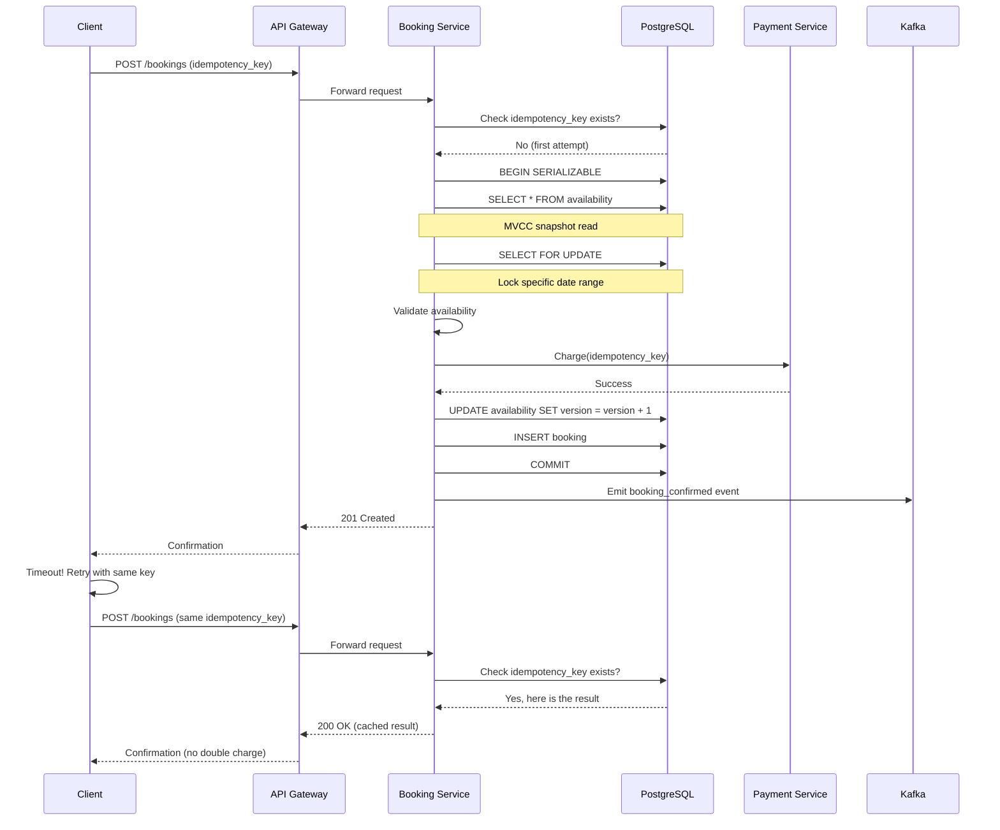

| Difficulty | Channel | Tags |
|---|---|---|
| intermediate | database | acid, isolation-levels, mvcc |

It was the kind of problem that makes payments engineers lose sleep. During Airbnb's migration from a monolithic Rails application to microservices, a single booking became a distributed transaction spanning multiple services. A user double-clicking 'Book' or a network timeout triggering a client retry meant the system could not tell if the original request had already gone through — resulting in double charges and phantom bookings [1]. Their payments team was staring at a ticking time bomb as booking volume grew exponentially. This is the story of how they defused it, and what every developer can learn about building bulletproof booking systems.

---

> ### Real-World Case — Airbnb
>
> During Airbnb's migration from a monolithic Rails app to microservices, a single booking became a distributed transaction spanning multiple services. If a user double-clicked 'Book' or a network timeout triggered a client retry, the system couldn't tell if the original request had already gone through — resulting in double charges and phantom bookings. Their payments team was staring at a ticking time bomb as booking volume grew.
>
> | | |
> |---|---|
> | **Challenge** | How to guarantee exactly-once processing for payments and booking operations across a distributed system where any API call can fail, timeout, or be replayed, without resorting to fragile distributed transaction protocols (2PC/XA) that introduce single points of failure and block indefinitely on coordinator crashes. |
> | **Solution** | They built 'Orpheus', a general-purpose idempotency library. Every API request acquires a database row-level lock on an idempotency key (with an expiring lease) before processing — the lock serializes concurrent duplicates. Network calls (RPCs) are explicitly separated from database work: Pre-RPC and Post-RPC phases are wrapped in enclosing database transactions so that entire units of work commit atomically. Responses reaching a deterministic end state are cached and replayed to retries. Exceptions are classified 'retryable' vs 'non-retryable', enabling safe auto-retry. Crucially, idempotency tables live only on the master database — a critical decision because reading from a lagged replica with just a few seconds of delay would cause a correct idempotent retry to look like a new request, creating a double charge. |
> | **Outcome** | Achieved 99.999% (five 9s) consistency for payments while annual payment volume doubled. The system could self-heal through automatic retries, drastically reducing manual intervention. Kafka-based async consumers used the idempotency framework to upgrade Kafka's at-least-once guarantee to exactly-once processing. |
> | **Lesson** | The most reliable way to prevent double-processing in distributed systems is not complex distributed transaction protocols but idempotency at the API level combined with database-level row locking. The counterintuitive insight: a correct idempotent retry can itself cause a double charge if the idempotency store reads from a replica — because replica lag means the retry won't find the cached response. Idempotency tables must read and write on master only, scaling via sharding on the idempotency key itself. |

---

## Hook — The Double-Click That Cost Thousands

Imagine this: a guest finds the perfect vacation rental, hesitates for a second, then double-clicks 'Book.' Two requests hit your API within milliseconds. Your payment service processes both. Congratulations — you just charged someone twice for the same stay.

This is not a hypothetical. When Airbnb decomposed their monolith into microservices, what was once a simple database transaction became a saga spanning booking, payment, notification, and calendar services [1]. A request could succeed on the booking service but timeout before the client received confirmation. The guest, seeing an error message, retried. The booking service, having no memory of the first attempt, processed the second request as if it were brand new.

Every booking platform faces this fundamental tension: how do you allow multiple users to compete for the same resource (a property, a seat, a time slot) while guaranteeing that only one succeeds — and that everyone gets charged exactly once? The answer lies at the intersection of database isolation, idempotency, and careful system design.

## Problem — The Race Condition That Breaks Booking Systems

At its core, a booking system is a resource allocation engine. Multiple users query availability, see the same open slot, and attempt to claim it. Without proper safeguards, the system behaves like a crowded bar where everyone hears 'last call' — and multiple people grab the same bottle.

The technical term is a race condition. Two concurrent transactions read the same state, both conclude 'this property is available,' and both proceed to book. The second writer overwrites the first, or worse, both succeed independently. The result: overbooking, angry customers, and a customer support nightmare.

Traditional solutions rely on database transactions with high isolation levels. SERIALIZABLE isolation guarantees that concurrent transactions execute as if they ran one at a time — but at a cost. Lock contention increases, throughput drops, and under heavy load, the system can degrade into a cascade of failures.

This is where the plot thickens. In a distributed system (think microservices), you cannot rely on a single database transaction to coordinate everything. Booking might live in one service, payments in another, and calendar management in a third. Suddenly, the problem shifts from 'how to avoid double writes' to 'how to coordinate multiple services such that each operation happens exactly once, even in the face of failures.'

## Real-World Case — Airbnb's Distributed Payments Nightmare

When Airbnb migrated from a monolithic Rails app to a service-oriented architecture, they hit a wall. A booking was no longer a single database row update — it was a distributed transaction involving the booking service, the payments service, the pricing engine, the calendar management service, and the notification system [1].

The scenario that haunted them: a guest clicked 'Book.' The booking service reserved the property and called the payment service. The payment service charged the guest's credit card, but the response timed out. Was the charge successful? The booking service could not tell. The guest saw an error, clicked 'Book' again, and the cycle repeated. Result: multiple charges, one booking — or worse, multiple bookings.

Airbnb's solution was an idempotency framework inspired by Stripe's API design. Every booking request carried a unique idempotency key generated by the client. Services stored the key alongside the result of the operation. If a duplicate request arrived (same key), the service returned the stored result instead of executing the operation again [1]. This transformed an 'at-least-once' delivery semantics into 'exactly-once' processing — even when Kafka consumers retried messages.

The impact was staggering. Airbnb achieved 99.999% (five 9s) consistency for payments while their annual payment volume doubled. The system could self-heal through automatic retries, drastically reducing manual intervention. Kafka-based async consumers used the same idempotency framework to upgrade Kafka's at-least-once guarantee to exactly-once processing [1].

## Deep Dive — Isolation Levels, MVCC, and the Consistency Trade-Off

Building on Airbnb's approach, let's examine the database-level tools that make booking systems work under pressure.

PostgreSQL offers four isolation levels, but for booking systems, the two that matter are REPEATABLE READ and SERIALIZABLE. REPEATABLE READ prevents dirty reads and non-repeatable reads, but allows phantom reads — meaning a second transaction could insert a new row that your transaction missed. For a booking system, this is dangerous: two transactions could both see 'room available' and both proceed to book.

SERIALIZABLE isolation, on the other hand, guarantees that transactions execute as if serialized — one after another. PostgreSQL implements this using Serializable Snapshot Isolation (SSI), which detects read-write conflicts and aborts one of the conflicting transactions [2]. The trade-off? Higher abort rates under contention. For a hot property in Manhattan during peak season, expect retries.

Many developers reach for pessimistic locking first — SELECT FOR UPDATE — which locks rows explicitly. This works, but it reduces concurrency. Optimistic concurrency control (OCC) is often a better fit [3]. Instead of locking rows, you let transactions proceed optimistically and check for conflicts at commit time using a version column.

Here is the counterintuitive insight: optimistic locking can outperform pessimistic locking under low to moderate contention because readers never block writers [4]. Only when two transactions actually conflict do you pay the price of a retry. For a booking system where most properties see moderate demand, OCC is often the right default. Save pessimistic locking for the 'Taylor Swift concert' scenario — those rare, extreme-contention resources.

MVCC (Multi-Version Concurrency Control) makes this all possible. PostgreSQL maintains multiple versions of each row, so readers see a consistent snapshot without blocking writers [5]. Your availability check reads a snapshot from before the booking transaction started, giving you a consistent view of open slots.

## Workflow — The Booking Transaction Lifecycle

Here is how a robust booking transaction plays out, from click to confirmation. The following sequence diagram illustrates the flow: a client generates an idempotency key, the booking service checks the key, acquires a row-level lock on the availability calendar, validates against a consistent MVCC snapshot, processes the payment idempotently, updates availability, and returns the confirmation.

The key steps are: (1) Generate a unique idempotency key on the client before any network call. (2) On the server, check if this key has been seen before — if yes, return the cached result. (3) Begin a SERIALIZABLE transaction, read availability using an MVCC snapshot, and acquire row-level locks only on the date range being booked. (4) Validate availability against the snapshot. (5) Process the payment with the same idempotency key. (6) Update the availability row with an incremented version column — if the version changed since your read, the UPDATE affects zero rows, and you must abort and retry. (7) Commit. (8) Emit an event to Kafka for downstream consumers (calendar sync, notifications).

The mermaid diagram below visualizes this exact flow, including the critical retry path where the idempotency key prevents the double charge.

## Code Example — Booking with Idempotency and Optimistic Locking

Here is a production-inspired Python implementation that ties together SERIALIZABLE isolation, optimistic concurrency control, and idempotency keys.

The function starts by checking the idempotency cache — if this request key has been seen before, it returns the cached result immediately (preventing double charges on retries). Then it enters a retry loop where each attempt runs inside a SERIALIZABLE transaction. The SELECT FOR UPDATE acquires row-level locks on the specific date range — only rows being booked, not the entire table. The version column acts as an optimistic lock: the UPDATE increments it only if the row is still unbooked. If another transaction booked the same dates first, the UPDATE affects zero rows and PostgreSQL raises a SerializationFailure. The exponential backoff (50ms, 100ms, 200ms) gives the competing transaction time to complete before retrying. After three failures, the function returns a clear error rather than silently failing.

The idempotency_cache table ensures that even if the client retries after a successful commit but before receiving the response, they get the same result without a new booking being created.

## Lessons Learned — Building Systems That Never Overbook

What should you take away from Airbnb's journey and the technical patterns behind it?

**Idempotency is non-negotiable.** If your system processes payments or creates resources, every operation needs an idempotency key. Clients generate them, servers cache results, and duplicates are silently handled [1]. This single pattern eliminates the most common class of booking bugs.

**Start with SERIALIZABLE, optimize later.** Many teams reach for lower isolation levels to improve performance. Start with SERIALIZABLE for critical booking operations. If contention becomes a problem, measure and optimize — do not prematurely optimize away correctness [5].

**Optimistic concurrency beats pessimistic locking in most cases.** Developers over-use SELECT FOR UPDATE [6]. Optimistic locking with version columns gives better throughput under moderate contention and degrades gracefully. Use SELECT FOR UPDATE only for high-contention resources where retry costs outweigh lock costs.

**Measure lock contention before adding circuit breakers.** Monitor pg_locks and track serialization failure rates. If you see more than 5-10% abort rates on SERIALIZABLE transactions, consider sharding hot properties or implementing a Circuit Breaker pattern [7].

**Use read replicas to scale availability checks.** The majority of requests are read-only availability queries. Route these to read replicas to keep your primary database focused on write transactions. Invalidate cached availability aggressively after every successful booking [8].

**Distributed systems need exactly-once semantics.** If you use Kafka or similar message brokers, combine idempotency keys with consumer-side deduplication. This upgrades at-least-once delivery to exactly-once processing [1].

The final lesson? Simplicity wins. Airbnb's solution was not an exotic new technology — it was a well-designed idempotency layer combined with solid database fundamentals. The best distributed systems are built from reliable local patterns composed correctly.

---

## Booking Transaction Lifecycle with Idempotency Retry

<strong>Original Interview Question</strong>

**Q:** You're building a booking system for Airbnb where multiple users can reserve the same property simultaneously. How would you design the transaction handling to prevent double bookings while maintaining high availability?

**A:** Use SERIALIZABLE isolation with optimistic concurrency control. Implement row-level locks on property availability tables, use MVCC snapshot reads for checking availability, and apply application-level validation to ensure atomic booking operations.

## Conclusion

The next time you build a booking system — whether for apartments, concert tickets, or time slots in a SaaS product — start with idempotency. It is the single highest-leverage pattern you can adopt. Combine it with SERIALIZABLE isolation, optimistic concurrency control, and exponential backoff retries, and you will have a system that handles race conditions gracefully instead of corrupting data. Airbnb proved that with these fundamentals, even a distributed payments system processing billions can achieve five 9s of consistency. The patterns are well understood. The tools are battle-tested. The only question is: does your system handle the double-click?

---

## References

1. [Avoiding Double Payments in a Distributed Payments System](https://medium.com/airbnb-engineering/avoiding-double-payments-in-a-distributed-payments-system-2981f6b070bb) — blog
2. [PostgreSQL Transaction Isolation Levels](https://www.postgresql.org/docs/current/transaction-iso.html) — documentation
3. [Multiversion Concurrency Control - Wikipedia](https://en.wikipedia.org/wiki/Multiversion_concurrency_control) — documentation
4. [ACID - Wikipedia](https://en.wikipedia.org/wiki/ACID) — documentation
5. [PostgreSQL SELECT FOR UPDATE Documentation](https://www.postgresql.org/docs/current/sql-select.html#SQL-FOR-UPDATE-SHARE) — documentation
6. [Optimistic Concurrency Control - Wikipedia](https://en.wikipedia.org/wiki/Optimistic_concurrency_control) — documentation
7. [Exponential Backoff - Wikipedia](https://en.wikipedia.org/wiki/Exponential_backoff) — documentation
8. [Isolation (Database Systems) - Wikipedia](https://en.wikipedia.org/wiki/Isolation_(database_systems)) — documentation

---

**Author:** Satishkumar Dhule — [GitHub](https://github.com/satishkumar-dhule) · [LinkedIn](https://linkedin.com/in/satishkumar-dhule) · [Website](https://satishkumar-dhule.github.io)
