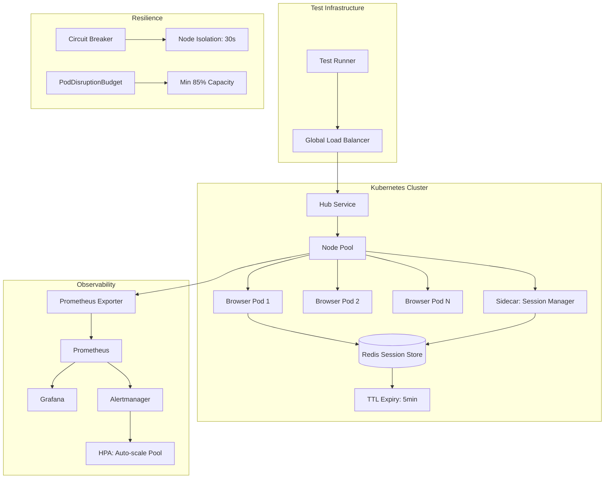

| Difficulty | Channel | Tags |
|---|---|---|
| advanced | system-design | selenium, webdriver, grid |

By 2014, Expedia Group's test automation had metastasized into a full-blown crisis [1]. Nearly 9,000 UI tests ran across 350+ Jenkins jobs, with browsers launching directly on CI executors—turning build machines into stale-process graveyards. Hours-long test suites became the norm, and the only scaling strategy was throwing more hardware at the problem. Sound familiar?

---

> ### Real-World Case — Expedia Group
>
> By 2014, Expedia's UI automation had grown to ~9,000 tests running across 350+ Jenkins jobs directly on executors—browsers opening on the same machines running CI. Tests took hours, stale browser processes made executors unusable, and scaling meant adding more jobs and executors linearly. The system was choking the company's ability to ship.
>
> | | |
> |---|---|
> | **Challenge** | Design a Selenium Grid architecture that could run all UI automation tests within the time of the single slowest test, scale across 100+ microservice teams with their own CI/CD pipelines, and eliminate the operational debt of 350+ manually-managed Jenkins jobs. |
> | **Solution** | First generation (2015): Built SeleniumGridScaler, an open-source tool using Selenium Grid + AWS EC2 API to auto-scale nodes on demand—spinning up instances per test batch and terminating them immediately after. Second generation (2019): Migrated to DA-Kube on Amazon EKS with Docker, Helm, and Traefik, enabling per-branch ephemeral Selenium Grids in Kubernetes with dynamic hub creation, warm worker node pools, and per-pod QoS guarantees. |
> | **Outcome** | 150,000+ tests run daily across 100+ hubs. 4,500+ EC2 nodes created and terminated daily on average. Test execution reduced from hours to the duration of the longest single test (~3-5 min). Cost comparison vs third-party vendors: internal solution costs ~$80K/year vs $2.41M/year for 1,000 parallel connections from cross-browser vendors—a 97% cost reduction. Node spin-up went from 2-4 minutes (EC2) to near-instant (Kubernetes). |
> | **Lesson** | The biggest surprise wasn't scale—it was the hidden cost of IP address exhaustion in Kubernetes (a c5.2xlarge could only run 19 Chrome pods due to AWS ENI IP reservations, wasting ~11 IPs per node) and the stunning cost comparison that showed internal infrastructure at $80K/year vs $2.41M for equivalent third-party capacity. The shift from EC2 to Kubernetes also revealed that container-based grids enabled a fundamentally new capability: each developer branch could get its own ephemeral Selenium Grid, enabling shift-left testing before code was even committed. |

---

## Hook — The Hidden Cost of Test Automation at Scale

Every engineering team hits this wall eventually. Your test suite starts at 50 tests, then 500, then 5,000. Your CI pipeline slows from minutes to hours. The build machines start throwing mysterious OOM errors that nobody can explain. The common reflex is to buy more hardware—more executors, more RAM, more parallelism. But that is treating the symptom, not the disease. The real problem is architectural: your test infrastructure was never designed for the scale it now needs to operate at.

## Problem — When Browsers Eat Your CI Alive

The fundamental challenge with browser automation at scale is session lifecycle management. Every Selenium WebDriver session spawns a browser process—typically consuming 200-500MB of RAM. When a test crashes or forgets to call `driver.quit()`, that browser process becomes a zombie, leaking memory until the host runs out. Multiply this across thousands of daily sessions and you are not running tests anymore—you are running a memory leak factory.

Traditional Selenium Grid deployments use a hub-and-node model where each node is a long-running VM or bare-metal machine. You manually add nodes when you need capacity and manually remove them when you do not. This is brittle, expensive, and fundamentally unscalable. The moment you hit a traffic spike (like a release candidate triggering a full regression suite), your static pool either runs out of capacity or sits half-idle burning money.

## Real-World Case — Expedia Group: The Kubernetes Pivot

Expedia Group's solution to this crisis became a case study in modern test infrastructure design [1]. They rebuilt their Selenium Grid on top of Kubernetes, Docker, Helm, and Traefik. The results were staggering: 150,000+ tests run daily across 100+ hubs. Their infrastructure spins up 4,500+ EC2 nodes and tears them down every single day—something impossible with traditional static provisioning. Node spin-up time dropped from 2-4 minutes to near-instant with Kubernetes. Test execution collapsed from hours to just 3-5 minutes—the duration of the longest single test.

Here is where it gets really interesting: the economics. A third-party cross-browser testing vendor would charge roughly $2.41 million per year for 1,000 parallel connections. Expedia's internal solution cost approximately $80,000 per year. That is a **97% cost reduction**—and that is before factoring in the velocity gains from faster feedback loops. This is not just a scaling story; it is a business transformation story.

## Deep Dive — Anatomy of a Production-Grade Selenium Grid

Building a grid that handles 10,000 concurrent sessions with 99.9% uptime requires thinking about four interconnected subsystems: session orchestration, resource management, observability, and resilience.

**Session Orchestration:** The hub-node pattern still works, but the nodes must be ephemeral. Each browser pod gets a container lifecycle—spin up on demand, run the test, tear down cleanly. Kubernetes StatefulSets manage node identity across availability zones while horizontal pod autoscaling adjusts pool size based on queue depth and session volume [2].

**Resource Management:** With 200 minimum nodes (50 sessions per node × 10,000 sessions) and 2GB RAM per node, you need at least 520GB of cluster memory (400GB baseline + 30% buffer). CPU limits prevent noisy-neighbor problems, and Pod Disruption Budgets guarantee minimum 85% capacity during rolling updates [7].

**Observability:** Prometheus collects memory trends, session duration, and queue depth metrics [4]. Grafana dashboards visualize these in real time [8]. Alert rules fire at 80% memory usage, giving operators time to react before nodes start thrashing.

**Resilience:** This is where most designs fall short. Circuit breakers isolate nodes after three consecutive health check failures, giving them a 30-second recovery window before rejoining the pool [6]. This pattern prevents cascading failures where one misbehaving node drags down the entire grid.

## Workflow — Session Lifecycle: From Request to Cleanup

The entire system is easier to understand when you trace a single test session from submission to teardown. The Mermaid diagram below maps this journey across the major subsystems.

The flow works in stages: First, a test request hits the global load balancer, which uses weighted round-robin routing based on node capacity and response time. The hub service assigns the session to a healthy node pod. The sidecar session manager registers the session in Redis with a 5-minute TTL, ensuring automatic cleanup if the test hangs or crashes [3]. Meanwhile, Prometheus scrapes node metrics every 15 seconds, feeding the autoscaler and alert manager. If a node fails three consecutive health checks, the circuit breaker trips and isolates it for 30 seconds.

## Code Example — Building the Session Lifecycle Manager

The heart of the system is the session lifecycle manager. This Python class runs as a sidecar container in each browser pod, managing Redis-backed sessions with circuit breaker protection for node failures.

## Lessons Learned — What Scaling 10,000 Concurrent Sessions Taught Us

**1. Treat nodes as cattle, not pets.** The single biggest insight from Expedia's journey is that browser nodes must be ephemeral. If a node misbehaves, kill it and spin up a new one. Do not SSH into it and try to fix it. Kubernetes makes this trivial; traditional VM-based grids make it painful. The result is a system that self-heals without human intervention.

**2. TTL-based cleanup is non-negotiable.** You cannot rely on tests to clean up after themselves. Redis key expiration with a 5-minute TTL provides a safety net for hung sessions. Combined with a background scanner that runs every 30 seconds to catch orphaned keys, this eliminates the memory leak problem that plagues naive Selenium deployments.

**3. Circuit breakers prevent cascading failures better than monitoring does.** Monitoring tells you something is on fire. Circuit breakers put the fire out before it spreads. The 3-failure threshold with 30-second recovery window is a good starting point, but tune it based on your specific latency profile [6].

**4. Autoscaling must be predictive, not reactive.** By the time your queue depth triggers a scale-up, tests are already waiting. Combine HPA based on queue depth with scheduled scale-ups for known peak periods (release days, end-of-sprint).

**5. The economics favor in-house at scale.** Expedia's 97% cost reduction over third-party vendors [1] is not an outlier. At 10,000 concurrent sessions, the math overwhelmingly favors building your own Kubernetes-based grid. The operational overhead is real, but the savings fund an entire dedicated infrastructure team with money left over.

---

## Selenium Grid Session Lifecycle Architecture

<strong>Original Interview Question</strong>

**Q:** Design a scalable Selenium Grid architecture to handle 10,000 concurrent test sessions with 99.9% uptime, ensuring zero memory leaks through automatic session lifecycle management, real-time monitoring, and graceful node failure recovery across multiple data centers?

**A:** Deploy Kubernetes cluster with auto-scaling node pools, Redis session store with TTL policies, Prometheus metrics for memory monitoring, circuit breakers for node isolation, and sidecar containers for session cleanup. Implement health checks, resource quotas, and rolling updates.

## Conclusion

Expedia Group's story proves that test infrastructure at scale is not a hardware problem—it is a distributed systems problem. Treating browser nodes as ephemeral, cattle-like resources, backed by Redis TTL cleanup and circuit breaker isolation, transforms a fragile, expensive test grid into something that self-heals and costs 97% less. The next time your CI pipeline starts choking on its own test suite, resist the urge to buy more executors. Ask a harder question: what would this look like if you designed it for 10,000 concurrent sessions from day one?

---

## References

1. [Da Kube — Selenium Grid using Kubernetes, Docker, Helm and Traefik](https://medium.com/expedia-group-tech/da-kube-selenium-grid-using-kubernetes-docker-helm-and-traefik-856b802d1d08) — blog
2. [Horizontal Pod Autoscaling — Kubernetes](https://kubernetes.io/docs/tasks/run-application/horizontal-pod-autoscale/) — documentation
3. [Redis EXPIRE Command](https://redis.io/commands/expire/) — documentation
4. [Prometheus Overview](https://prometheus.io/docs/introduction/overview/) — documentation
5. [Selenium Grid Documentation](https://www.selenium.dev/documentation/grid/) — documentation
6. [Circuit Breaker Pattern — Martin Fowler](https://martinfowler.com/bliki/CircuitBreaker.html) — article
7. [Pod Disruption Budgets — Kubernetes](https://kubernetes.io/docs/tasks/run-application/configure-pdb/) — documentation
8. [Grafana Documentation](https://grafana.com/docs/grafana/latest/) — documentation
9. [Docker Overview](https://docs.docker.com/get-started/overview/) — documentation

---

**Author:** Satishkumar Dhule — [GitHub](https://github.com/satishkumar-dhule) · [LinkedIn](https://linkedin.com/in/satishkumar-dhule) · [Website](https://satishkumar-dhule.github.io)
