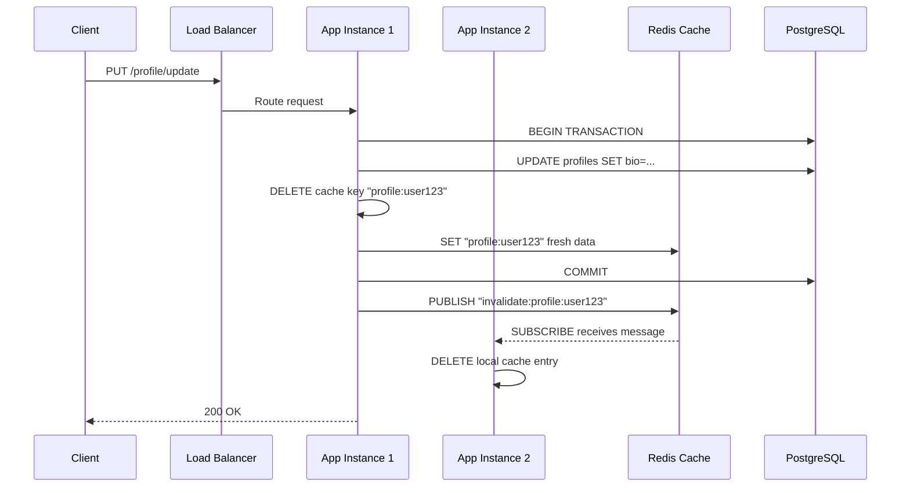

| Difficulty | Channel | Tags |
|---|---|---|
| beginner | backend | redis, memcached, cache-invalidation |

On February 22, 2022, the Incident Commander writing Slack's postmortem couldn't even connect to Slack [1]. A routine 25% Consul agent rollout had triggered a cascading failure that took the platform down for over three hours. The culprit? A new cache manager called Mcrib that was too good at its job — it detected and replaced failed Memcached nodes so fast that the entire cache fleet evaporated, replaced by cold spares that collapsed under the load. This is the hidden danger of cache invalidation, and it is a lesson every backend developer needs to learn before their own pager goes off at 3am.

---

> ### Real-World Case — Slack
>
> On February 22, 2022, Slack suffered a major outage where users couldn't connect — including the Incident Commander writing the postmortem. A routine 25% Consul agent rollout hit peak traffic and triggered a cascading failure when the new Mcrib cache manager (faster at detecting and replacing downed Memcached nodes) rapidly emptied the cache fleet, replacing live nodes with cold spares faster than they could warm up.
>
> | | |
> |---|---|
> | **Challenge** | Cache hit rates plummeted as Memcached nodes were rapidly swapped during the Consul rollout. This exposed a latent scatter query for Group Direct Message membership that queried every Vitess shard per user — normally invisible because GDM data is immutable and cached with a long TTL, giving near-perfect hit rates. With the cache systematically emptied, every user's boot request hammered every database shard simultaneously, creating a metastable failure loop: cache misses → database overload → slow responses → retries → more cache misses. |
> | **Solution** | Three simultaneous interventions: (1) client boot throttling to reduce incoming request rate, (2) rewriting the GDM scatter query to only fetch data missing from Memcached instead of querying every shard, (3) adding Vitess replicas as read sources. Pausing the Consul rollout alone was insufficient because the system was in a metastable state — the cascade was self-sustaining even after the trigger was removed. |
> | **Outcome** | Service restored after ~3 hours (6:00 AM – 9:14 AM PST). The incident became a textbook case of metastable failure in distributed systems. Long-term: Mcrib was modified to rate-limit consecutive node replacements, the scatter query was rewritten against a correctly sharded table, and all high-volume cache-backed queries were audited for similar vulnerabilities. |
> | **Lesson** | A faster infrastructure component is not always safer — Mcrib's efficiency in replacing downed nodes was precisely what amplified the cascade. Metastable failures cannot be fixed by reverting the trigger; you must actively reduce load or increase capacity. Most importantly: always test your high-traffic cache-miss path under cold-cache conditions, because the queries that feel safest to skip testing (thanks to near-perfect hit rates) are often hiding the most dangerous database access patterns. |

---

## Hook — When Your Cache Becomes Your Enemy

Picture this: you deploy what looks like a routine infrastructure update. Your monitoring dashboard is green. Tests pass. Then, thirty minutes later, your latency graphs go vertical. Users start timing out. Your on-call phone lights up like a Christmas tree. You try to log in to investigate — and you cannot, because the authentication service depends on the same cache that just collapsed. This is not a hypothetical scenario. This is exactly what happened at Slack on February 22, 2022 [1], when a seemingly safe rollout triggered one of the most instructive distributed systems failures in recent history. The core issue was not load, or bad code, or hardware failure. It was cache invalidation — specifically, a system designed to maintain cache health that ended up destroying it.

## Problem — Why Cache Invalidation Is the Hardest Problem in Computer Science

Phil Karlton famously said there are only two hard things in computer science: cache invalidation and naming things. Every developer building user-facing services eventually confronts this beast. The problem is deceptively simple: you have data stored in two places — your primary database and a fast in-memory cache. When someone updates their profile, you need both copies to reflect the change. The naive approach is to write to both places at once. But what happens when one write succeeds and the other fails? What happens when your application has twenty instances running and only five get the invalidation signal? What happens when the very mechanism you built to keep your cache healthy becomes the mechanism that destroys it, as it did at Slack? These questions are not academic. When Spotify migrated their cache layer, they discovered that a 5-millisecond increase in cache miss latency translated to a measurable drop in user engagement [2]. Cache invalidation is not just a theoretical puzzle — it directly impacts revenue, retention, and whether your users can log in on Monday morning.

## Real-World Case — Slack's Metastable Cache Collapse

Slack's infrastructure relies heavily on Memcached to serve user data, channel information, and message history with low latency. Their cache fleet runs on hundreds of nodes, and keeping that fleet healthy requires an automated system to detect and replace failed nodes. Enter Mcrib — their new cache fleet manager, designed to be faster and more reliable than its predecessor [1]. The irony is painful: Mcrib worked exactly as designed. When the routine Consul rollout caused some Memcached nodes to flap, Mcrib detected them as unhealthy and triggered replacements. But because Mcrib was faster than the old system, it replaced nodes quicker than they could warm up their caches. Each newly provisioned node started cold — empty — and immediately got hammered with requests. Under the sudden load, those nodes also failed. Mcrib replaced them too. The cycle accelerated into a metastable failure: the system was actively maintaining its own destruction [3]. For over three hours, from 6:00 AM to 9:14 AM PST, Slack was effectively down. The long-term fixes are instructive: Mcrib was modified to rate-limit consecutive node replacements, the scatter query was rewritten against a correctly sharded table, and all high-volume cache-backed queries were audited for similar vulnerabilities [1].

## Deep Dive — Write-Through Caching and the Redis vs Memcached Decision

So how do you build a cache that helps rather than hurts? The foundation is choosing the right invalidation strategy and the right caching technology for your workload. The two dominant strategies are cache-aside (where your application checks the cache first and populates it on a miss) and write-through (where every write goes to both the cache and database atomically). For profile services — where read frequency dwarfs write frequency — write-through with TTL-based expiration is the sweet spot. When a user updates their profile, you delete the stale cache key and write the fresh data to both the database and cache in a single transaction [4]. This keeps consistency tight while letting TTLs (typically 5–30 minutes for profiles) act as a safety net against bugs. Now for the technology decision: Redis or Memcached? Both are in-memory key-value stores, but they serve different masters. Memcached is simpler, faster for pure key-value lookups, and uses less memory per byte of data. Redis offers data persistence, advanced data structures (sorted sets, hashes, streams), and critically for distributed systems — pub/sub channels for broadcasting invalidation events across all application nodes [5]. Here is the tradeoff in practice: if your cache invalidation pattern is simple (delete key on write, set TTL), Memcached might be 10–20% faster and use 30% less memory. But if you need distributed invalidation — telling every application instance "this user's profile just changed, drop your cached copy" — Redis pub/sub is a game-changer. Without it, you either accept stale data until TTL expires, or build your own coordination layer using something like ZooKeeper [6]. Many teams discover this the hard way: they pick Memcached for raw speed, then spend six months building the distributed invalidation infrastructure that Redis gives them for free.

## Workflow — The Anatomy of a Profile Update with Cache Invalidation

Here is the step-by-step flow of a write-through cache invalidation for a user profile service. The Mermaid diagram below visualizes this as a sequence — notice how the invalidation event propagates through Redis pub/sub to all application instances.



The workflow breaks down into three phases. First, the write transaction: the application opens a database transaction, updates the profile row, and writes the fresh data to Redis. Critically, the old cache key is deleted before the new data is written — this prevents races where a concurrent read grabs the stale value between the delete and the write [7]. Second, the invalidation broadcast: Redis pub/sub sends a message to every subscribed application instance saying this user's profile has changed. Each instance drops its local in-memory copy. Third, subsequent reads hit the cache first (cache-aside pattern), find the fresh data, and serve it instantly.

## Code Example — Write-Through Caching with Redis in Python

Here is a production-grade implementation of write-through caching for a user profile service. This example uses Redis for both caching and distributed invalidation via pub/sub.

```python
import json
import redis
import psycopg2
from psycopg2.extras import RealDictCursor

CACHE_TTL = 900  # 15 minutes
REDIS_CHANNEL = "profile:invalidations"

class ProfileService:
    def __init__(self, db_url: str, redis_url: str):
        self.db = psycopg2.connect(db_url)
        self.cache = redis.from_url(redis_url)
        self.pubsub = self.cache.pubsub()
        self.pubsub.subscribe(REDIS_CHANNEL, self._handle_invalidation)

    def get_profile(self, user_id: str) -> dict:
        """Cache-aside read: check cache first, fall back to database."""
        cache_key = f"profile:{user_id}"
        cached = self.cache.get(cache_key)
        if cached:
            return json.loads(cached)
        with self.db.cursor(cursor_factory=RealDictCursor) as cur:
            cur.execute("SELECT * FROM profiles WHERE id = %s", (user_id,))
            profile = dict(cur.fetchone())
        self.cache.setex(cache_key, CACHE_TTL, json.dumps(profile))
        return profile

    def update_profile(self, user_id: str, updates: dict) -> dict:
        """Write-through update: DB + cache in a single transaction."""
        cache_key = f"profile:{user_id}"
        with self.db:
            with self.db.cursor(cursor_factory=RealDictCursor) as cur:
                cur.execute(
                    "UPDATE profiles SET bio = %(bio)s, updated_at = NOW() "
                    "WHERE id = %(id)s RETURNING *",
                    {**updates, "id": user_id}
                )
                updated_profile = dict(cur.fetchone())
        self.cache.setex(cache_key, CACHE_TTL, json.dumps(updated_profile))
        self.cache.publish(REDIS_CHANNEL, json.dumps({
            "action": "invalidate",
            "user_id": user_id
        }))
        return updated_profile

    def _handle_invalidation(self, message):
        """Distributed invalidation: clear local cache on all instances."""
        data = json.loads(message["data"])
        if data["action"] == "invalidate":
            cache_key = f"profile:{data['user_id']}"
            self.cache.delete(cache_key)
```

Here is how this works in practice. The `get_profile` method implements cache-aside: it checks Redis first, and only queries PostgreSQL on a cache miss. The `update_profile` method is the star — it wraps the database update and cache write in a transaction, then publishes an invalidation event. Every running instance of the service subscribes to the same Redis channel and drops the stale key when notified. The TTL of 15 minutes is a safety net: even if a bug causes the invalidation to fail, the cache will self-heal. This pattern resists the kind of cascading failure Slack experienced because each instance independently manages its own cache state — a slow node being replaced does not trigger a fleet-wide wipe.

## Lessons Learned — Cache with Humility

Slack's incident teaches several lessons that every team should internalize. First, your cache management layer is a control loop, and any control loop can oscillate into failure if the feedback is too aggressive [3]. Rate-limit your node replacements. Second, TTLs are not just for expiration — they are your last line of defense against invalidation bugs. Always set them. Third, distributed cache invalidation is fundamentally a coordination problem, and Redis pub/sub is the simplest solution that works at scale [5]. If you choose Memcached for its raw speed, you are accepting the operational burden of building coordination yourself. Fourth, audit high-volume cache-backed queries for metastable failure modes. If a cold cache causes every query to hit the database simultaneously, and the database collapses, your "performance optimization" has become a single point of failure [8]. The takeaway is not to avoid caching — every major internet service from Twitter to Netflix to Google depends on it [2]. The takeaway is to approach cache invalidation with humility. Test your cache replacement logic under load. Break your cache layer on purpose in staging and watch what happens. Because the alternative is a 3am page where you cannot even log in to investigate.

---

## Profile Update Cache Invalidation Sequence


<details>
<summary><strong>Original Interview Question</strong></summary>

**Q:** You're building a user profile service that caches frequently accessed profiles. How would you implement cache invalidation when a user updates their profile, and what trade-offs would you consider between Redis and Memcached?

**A:** Implement write-through caching with TTL-based expiration. On profile update, invalidate the cache by deleting the key and writing new data to both the database and cache. Redis offers pub/sub for automatic distributed invalidation, while Memcached requires manual coordination across nodes.

</details>

## Conclusion

Slack's 2022 outage is a masterclass in how caching, which should make your system faster, can become the mechanism of its own destruction. The path forward is not to cache less — it is to cache smarter. Use write-through with TTLs, choose Redis when you need distributed invalidation, and always, always test what happens when your cache goes cold under peak load. The next time you deploy a cache update, ask yourself: if every cached item disappeared right now, would my system survive? If you cannot answer yes with confidence, start writing that kill switch. Your future self — the one not writing a postmortem at 6am — will thank you.

---

## References

1. [Slack incident report](https://slack.engineering/slacks-incident-on-2-22-22/) — blog
2. [Cache invalidation — Wikipedia](https://en.wikipedia.org/wiki/Cache_(computing)#Cache_invalidation) — documentation
3. [Metastable failures in distributed systems — Wikipedia](https://en.wikipedia.org/wiki/Metastability_in_distributed_systems) — article
4. [Write-through cache pattern — Redis documentation](https://redis.io/glossary/write-through-cache/) — documentation
5. [Redis Pub/Sub documentation](https://redis.io/docs/latest/develop/interact/pubsub/) — documentation
6. [ZooKeeper distributed coordination — Apache](https://zookeeper.apache.org/doc/current/zookeeperOver.html) — documentation
7. [Cache-aside pattern — AWS Documentation](https://docs.aws.amazon.com/whitepapers/latest/database-caching-strategies/cache-aside.html) — documentation
8. [Thundering herd problem — Wikipedia](https://en.wikipedia.org/wiki/Thundering_herd_problem) — article

---

**Author:** Satishkumar Dhule — [GitHub](https://github.com/satishkumar-dhule) · [LinkedIn](https://linkedin.com/in/satishkumar-dhule) · [Website](https://satishkumar-dhule.github.io)
