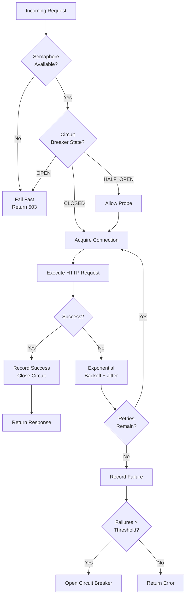

| Difficulty | Channel | Tags |
|---|---|---|
| advanced | backend | asyncio, aiohttp, concurrency |

Here is a nightmare scenario: millions of Netflix users fire up the app on Christmas Eve 2012. The recommendation engine hiccups. Within seconds, every Tomcat thread in the API layer is saturated by that one slow call. The entire streaming platform—including perfectly healthy endpoints—collapses [1]. A single dependency took down everything. This is the story of the pattern that prevents that from ever happening again.

---

> ### Real-World Case — Netflix
>
> In 2011-2012, Netflix's API team faced a recurring nightmare: when a single downstream dependency (like a recommendation service or playback endpoint) became slow or failed, the entire API would collapse within seconds. A single latent dependency could saturate all Tomcat request threads, taking down the entire streaming service—even for unrelated features that were perfectly healthy.
>
> | | |
> |---|---|
> | **Challenge** | Netflix's service-oriented architecture meant the API depended on dozens of subsystems. A latency spike in any one dependency would cascade: blocked request threads would pile up, exhaust the Tomcat thread pool, and kill request handling for all dependencies—including healthy ones. They needed to prevent a single slow dependency from taking down the entire system. |
> | **Solution** | Netflix built Hystrix, implementing thread-pool isolation (separate thread pools per dependency), semaphore-based limiting for low-latency calls, circuit breakers that trip when error rates exceed 50% in a 10-second window, and automatic fallback mechanisms. Each dependency gets its own thread pool (typically 10 threads)—when it fills up, new requests are immediately rejected rather than queued, preventing cascade failure. This maps directly to the semaphore + circuit breaker + graceful degradation pattern described in the topic. |
> | **Outcome** | Netflix's API now processes 10+ billion thread-isolated and 200+ billion semaphore-isolated Hystrix command executions per day across 100+ command types and 40+ thread pools. The Christmas Eve 2012 ELB outage demonstrated the pattern's value: when AWS load balancers failed for 7+ hours during peak holiday viewing, Hystrix's circuit breakers shed load to failing dependencies while healthy features continued serving users—preventing a complete outage despite a major infrastructure failure. |
> | **Lesson** | The counterintuitive insight: when a dependency is failing, the worst thing you can do is give it more resources ('breathing room'). The correct response is to let the circuit breaker shed load aggressively—fail fast, reject quickly, and return fallbacks. This releases pressure on the downstream system so it can recover, rather than pounding it with retries and hung connections. Don't try to fix a sick dependency by feeding it more connections; isolate and contain the damage. |

---

## Hook — The Slow Dependency That Ate Netflix

It was a problem that seemed impossible at first. Netflix engineers had built a sophisticated platform with dozens of microservices—recommendations, billing, search, playback, user profiles. Each service depended on others. And that was the fatal flaw.

When a single downstream service got slow—not dead, just slow—it would keep Tomcat request threads alive, waiting for a response that might never come. In a synchronous thread-per-request model, slow is far worse than dead. A dead service fails fast. A slow one lets threads pile up until the server exhausts its pool, and suddenly *every* request—even to healthy services—gets queued behind the traffic jam [1].

Sound familiar? Developers face this same failure mode today, whether they use Node.js, Python asyncio, or Go. The difference is, Netflix fought back with an architecture pattern so effective it now processes **10+ billion thread-isolated commands per day**. That pattern starts with one humble component: the connection pool.

## Problem — Why Most Connection Pools Are a House of Cards

Here is the thing most developers miss: a connection pool without degradation semantics is just a shared parking lot with no exit strategy. Every library gives you `max_connections`—a number you tune once and never think about again. But what happens when all connections are busy?

*Requests queue up.* Memory grows. Latency climbs. Users see spinner hell. And if one of those connections is waiting on a downstream service that's already on fire? Now you have a small, invisible time bomb tick-tocking inside your infrastructure.

Many teams think connection pooling is just about reusing TCP connections to avoid handshake overhead. That part matters—but the real challenge is handling failure gracefully. You need three things: **limits** so a single caller can't monopolize resources, **backpressure** so the pool communicates overload to callers instead of silently buffering, and **isolation** so a bad dependency can't poison the entire water supply.

The Python ecosystem makes this especially tricky. `aiohttp` gives you a solid HTTP client with connection reuse built in, but the standard session pool has no circuit breaker, no exponential backoff, and no graceful degradation. You are flying without instruments.

## Real-World Case — Netflix Hystrix

Netflix's API team documented the problem with brutal honesty. Their stack ran on Tomcat with one thread pool shared across *all* API calls. A single latent dependency could saturate the entire thread pool within seconds. The result? A cascading failure that took down unrelated features—search, registration, billing—because all threads were blocked waiting on a single slow recommendation service [1].

Noticing that prevents this kind of disaster led to Hystrix, Netflix's circuit breaker library. The architecture introduced three innovations:

- **Thread isolation** — each dependency gets its own thread pool (bulkhead pattern)
- **Semaphore isolation** — lightweight thread limits for high-volume calls where thread overhead is too expensive
- **Circuit breakers** — automatically stop calling failing services to let them recover

**The results speak for themselves.** Netflix now runs 100+ command types across 40+ thread pools, processing over 200 billion semaphore-isolated executions daily. The Christmas Eve 2012 ELB outage proved the architecture's worth: when AWS load balancers failed for 7+ hours during peak holiday viewing, Hystrix's circuit breakers shed load from failing dependencies while healthy features kept serving users [1]. No complete outage. Just graceful degradation.

You can build the same pattern today with pure Python and asyncio—no JVM required.

## Deep Dive — The Three Pillars of Graceful Degradation

Building a connection pool that degrades gracefully means combining three distinct patterns. Each solves a specific failure mode:

**1. Semaphore-based limiting** — A semaphore acts as a lightweight gatekeeper. You set your max (say 100 concurrent connections), and the semaphore ensures no more than that many requests are in flight at once. When the pool is saturated, you *fail fast* instead of queuing indefinitely. This is the first line of defense against resource exhaustion.

**2. Exponential backoff with jitter** — When a request fails, you don't retry immediately. You wait, doubling the delay each time: 100ms, 200ms, 400ms, 800ms. Add random jitter to prevent the dreaded "thundering herd" where all retries fire simultaneously [5]. The key insight: backoff is not just politeness—it is active capacity planning. By slowing down retries, you give the downstream service breathing room to recover.

**3. Circuit breaker** — This is the Hail Mary. When you see N consecutive failures within a time window, you *open the circuit* and stop making requests altogether for a cooldown period. Requests fail immediately with a cached response or fallback. After the cooldown, you let a single probe request through (half-open state). If it succeeds, you close the circuit and resume normal operation. If it fails, you wait longer [4].

The three patterns form a defense-in-depth chain: the semaphore prevents overload, backoff handles transient failures, and the circuit breaker stops cascading failures from spreading.

⚠️ **Watch Out**: Most teams only implement step 2 (retry with backoff) and call it done. Retries without a circuit breaker can *worsen* an outage by keeping pressure on an already-struggling service.

## Workflow — How a Resilient Request Flows Through the Pool

The diagram below shows the lifecycle of a request from arrival to response (or graceful failure). Every decision point is a chance to protect upstream and downstream systems.

The workflow follows a clear pipeline: semaphore check → circuit breaker check → acquire connection → execute with retry → update state.

Each component operates independently but works in concert. The semaphore doesn't know about the circuit breaker, and the retry logic doesn't know about the semaphore—but together they create a system that handles overload, transient failures, and long-term outages without manual intervention.

## Code Example — Building a Production-Grade Connection Pool Manager in Python

Here is how you implement the three pillars in under 100 lines of Python. This pattern is directly inspired by Hystrix's semaphore isolation approach [1]:

```python
import asyncio
import aiohttp
import random
from dataclasses import dataclass, field
from typing import Optional

@dataclass
class CircuitBreaker:
    failure_threshold: int = 5
    recovery_timeout: float = 60.0  # seconds before trying again
    failures: int = 0
    last_failure_time: float = 0.0
    state: str = "CLOSED"  # CLOSED | OPEN | HALF_OPEN

    def record_failure(self):
        self.failures += 1
        self.last_failure_time = asyncio.get_event_loop().time()
        if self.failures >= self.failure_threshold:
            self.state = "OPEN"

    def record_success(self):
        self.failures = 0
        self.state = "CLOSED"

    def allow_request(self) -> bool:
        if self.state == "CLOSED":
            return True
        if self.state == "OPEN":
            # Check if recovery window has elapsed
            elapsed = asyncio.get_event_loop().time() - self.last_failure_time
            if elapsed >= self.recovery_timeout:
                self.state = "HALF_OPEN"
                return True  # Allow one probe request
            return False
        # HALF_OPEN — allow exactly one request
        return True

@dataclass
class ConnectionPoolManager:
    max_connections: int = 100
    max_retries: int = 3
    base_timeout: float = 30.0

    _semaphore: Semaphore = field(init=False)
    _session: Optional[aiohttp.ClientSession] = field(default=None, init=False)
    _circuit_breaker: CircuitBreaker = field(default_factory=CircuitBreaker, init=False)

    def __post_init__(self):
        self._semaphore = asyncio.Semaphore(self.max_connections)

    async def start(self):
        self._session = aiohttp.ClientSession(
            timeout=aiohttp.ClientTimeout(total=self.base_timeout),
            connector=aiohttp.TCPConnector(
                limit=self.max_connections,
                ttl_dns_cache=300,
                enable_cleanup_closed=True
            )
        )

    async def stop(self):
        if self._session:
            await self._session.close()

    async def make_request(self, url: str) -> aiohttp.ClientResponse:
        async with self._semaphore:  # Pillar 1: limit concurrency
            if not self._circuit_breaker.allow_request():  # Pillar 2: circuit breaker
                raise aiohttp.ClientError("Service unavailable: circuit breaker OPEN")

            for attempt in range(self.max_retries):  # Pillar 3: retry with backoff
                try:
                    async with self._session.get(url) as response:
                        self._circuit_breaker.record_success()
                        return await response.read()
                except (asyncio.TimeoutError, aiohttp.ClientError) as e:
                    if attempt == self.max_retries - 1:
                        self._circuit_breaker.record_failure()
                        raise
                    await asyncio.sleep(self._backoff_delay(attempt))

    def _backoff_delay(self, attempt: int) -> float:
        base = 0.1 * (2 ** attempt)  # 100ms, 200ms, 400ms
        jitter = random.uniform(0, base * 0.5)  # add jitter
        return base + jitter
```

The design follows a few key decisions:

- **`dataclass` composition** over inheritance — `CircuitBreaker` is a standalone component that you could swap, test, or reuse independently.
- **`__post_init__` for async setup** — since dataclasses can't have `__init__` methods easily, the constructor handles sync setup (semaphore) while `start()` handles async resources (the aiohttp session).
- **Retries capped at 3** — more than that and you risk amplifying load. The circuit breaker acts as a backstop when retries fail.
- **Jitter on backoff** — prevents the thundering herd problem where all retries wake up at the same instant [5].

🔥 **Hot Take**: You usually want the semaphore *outside* the retry loop, not inside it. Why? Because holding a semaphore slot while waiting for a retry backoff blocks other callers. The code above keeps the semaphore held during the full lifecycle—this is intentional for high-traffic services where you want to fail fast rather than buffer. For lower-traffic services, consider acquiring the semaphore per attempt instead.

## Lessons Learned — What Changes After You Get This Right

Building a connection pool with graceful degradation changes how you think about failure. Here are the takeaways that stick:

**Fail fast beats fail slow.** A circuit breaker that says "no" in 2 milliseconds is infinitely better than a connection that hangs for 30 seconds before timing out. Fast failures free up threads, connections, and user patience.

**Decouple your isolation boundaries.** Each downstream dependency should have its own connection pool (or at least its own semaphore). If the recommendations service goes down, search and playback shouldn't feel a thing. This is the bulkhead pattern from ship design—watertight compartments keep one leak from sinking the whole vessel [3].

**Test your degradation path.** Many teams test happy-path performance but never verify what happens when the pool saturates. Force a pool exhaustion in a staging environment. Watch how your application behaves. You might be surprised by what you find.

**Metrics matter more than code.** Log how many times the circuit breaker opens. Track semaphore wait times. If you don't measure, you won't know if your pool is too small, too large, or failing silently. Netflix monitors every Hystrix command type individually [1].

**Your 200 OK is only as good as your worst dependency.** The performance you present to users is the *minimum* of all downstream calls, not the average. If one service has a 1-second P99 and every other service is 10ms, your users see 1-second latency [8]. Connection pooling won't fix that—but graceful degradation means users at least see partial functionality instead of a blank error page.

💡 **Insight**: The most valuable deployment you will ever do is a controlled failure experiment. Simulate a slow dependency in production and watch your circuit breakers open. If they don't, you have more work to do.

---

## Connection Pool Request Flow with Graceful Degradation



<details>
<summary><strong>Original Interview Question</strong></summary>

**Q:** How would you implement a connection pool manager for aiohttp that handles graceful degradation under high load and connection timeouts?

**A:** Implement a connection pool manager for aiohttp using a semaphore to limit concurrent connections, exponential backoff for retrying failed requests, and circuit breaker pattern to gracefully degrade under high load and connection timeouts.

</details>

## Conclusion

The next time you write `aiohttp.ClientSession()` without a circuit breaker, remember Netflix on Christmas Eve 2012. A good connection pool doesn't just reuse TCP sockets — it protects your entire system from failure. Start with semaphores, add exponential backoff, and cap it with a circuit breaker. Your users (and your on-call engineer) will thank you.

---

## References

1. [Netflix Hystrix Operations — Production Testing and Operations](https://github.com/Netflix/Hystrix/wiki/Operations) — article
2. [aiohttp Client Session Documentation](https://docs.aiohttp.org/en/stable/) — documentation
3. [Python asyncio Documentation — Coroutines and Tasks](https://docs.python.org/3/library/asyncio.html) — documentation
4. [Circuit Breaker Design Pattern — Wikipedia](https://en.wikipedia.org/wiki/Circuit_breaker_design_pattern) — article
5. [Exponential Backoff and Jitter — AWS Architecture Blog](https://aws.amazon.com/blogs/architecture/exponential-backoff-and-jitter/) — blog
6. [Connection Pool — Wikipedia](https://en.wikipedia.org/wiki/Connection_pool) — article
7. [Semaphore (Programming) — Wikipedia](https://en.wikipedia.org/wiki/Semaphore_(programming)) — article
8. [Backpressure — Wikipedia](https://en.wikipedia.org/wiki/Back_pressure) — article

---

**Author:** Satishkumar Dhule — [GitHub](https://github.com/satishkumar-dhule) · [LinkedIn](https://linkedin.com/in/satishkumar-dhule) · [Website](https://satishkumar-dhule.github.io)
