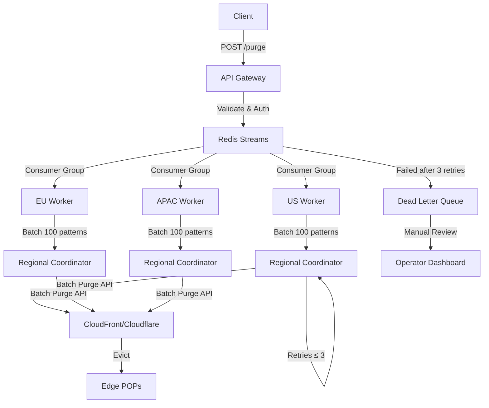

| Difficulty | Channel | Tags |
|---|---|---|
| intermediate | system-design | edge, caching, purging |

In 2022, Cloudflare's cache purge system was silently buckling under its own success. A purge request from Australia crossed the Pacific Ocean twice before taking effect — a round trip that consumed milliseconds your users experience as stale content [1]. The system built on their Quicksilver distribution service was hitting throughput limits across 330+ data centers, and storage for purge history was cannibalizing disk space meant for customer content. This is the story of how they turned a spoke-hub bottleneck into a distributed purge machine — and what every developer designing multi-region systems needs to understand.

---

> ### Real-World Case — Cloudflare
>
> By 2022, Cloudflare's original cache purge system built on Quicksilver—their configuration distribution service—was buckling under its own success. A purge request from Australia had to cross the Pacific Ocean to a core data center and back before taking effect. With 330+ data centers and trillions of cached files, their spoke-hub distribution was hitting throughput limits and storage for purge history was cannibalizing disk space meant for customer content.
>
> | | |
> |---|---|
> | **Challenge** | Rebuild cache invalidation from scratch to eliminate the core data center bottleneck, reduce global purge latency, and scale throughput without storage costs growing linearly with demand — all while serving millions of purge API calls per day across 120+ countries. |
> | **Solution** | They built 'Coreless Purge' — a fully decentralized architecture using Cloudflare Workers at every edge for auth/validation (eliminating backhaul to core data centers), Durable Objects for peer-to-peer purge distribution, and CacheDB — a Rust service built on RocksDB running on every single machine. CacheDB indexes every cached file by hostname, cache-tag, and URL, enabling proactive deletion instead of the old 'lazy purge' approach that compared timestamps at request time. The per-machine index design avoided all distributed database complexity — if a machine dies, its index dies with it, and that's fine. |
> | **Outcome** | Global purge latency dropped from 1,570ms to 149ms (P50) — a 90.5% improvement. Africa went from 1,420ms to 303ms, APAC from 1,300ms to 199ms. Storage for purge tracking was reduced 10x, immediately freeing disk space that improved cache HIT ratios across the entire network. The new architecture also enabled them to open up enterprise-only purge features (tag, hostname, prefix purging) to all plan types. |
> | **Lesson** | A configuration distribution system that works beautifully for control-plane data (sub-second p99 global replication) can become the worst possible hammer for cache invalidation — because purge is a data-plane operation that must scale with content volume, not configuration size. The right architecture moves intelligence to the edge and scopes state per-machine, eliminating coordination overhead. |

---

## Hook — The purge that never came

You push a critical security update. A SQL injection in the search endpoint. You invalidate the cache, wait five seconds, and refresh. The old page is still there. You wait ten seconds. Thirty. Your users are still serving the vulnerable version, and your CEO is asking why the fix hasn't propagated. This is the nightmare that cache purge systems are supposed to prevent — and the exact scenario that breaks when your invalidation architecture relies on a spoke-hub model. The stakes are brutally simple: every second of stale content is a second of incorrect data, compromised security, or lost revenue.

## Problem — Why cache invalidation is harder than you think

Phil Karlton famously said there are only two hard things in computer science: cache invalidation and naming things. The joke lands because every developer has felt this pain firsthand. But when you scale from a single origin server to a multi-region CDN with hundreds of points of presence, cache invalidation stops being a punchline and becomes an infrastructure crisis. The core challenge is a distributed consensus problem: how do you tell every edge location on the planet to evict a specific file within five seconds, while processing ten thousand of those requests every second, without falling over? Many developers assume CDN providers handle this magically behind their API endpoints. The reality is far more nuanced. CDN purge APIs are eventually consistent by nature [2], meaning a purge request returns a 200 OK long before every POP has actually evicted the file. Race conditions, network partitions, and rate limits conspire against your five-second SLA.

## Real-World Case — Cloudflare

Cloudflare built their original purge system on Quicksilver, their key-value configuration store that replicates config changes across 330+ data centers. When a customer called the purge API, the request traveled to a core data center, Quicksilver propagated the change through its spoke-hub topology, and eventually edge servers picked it up. The problem? Global P50 latency was 1,570ms — already too slow — but the tail latencies were devastating. Worse, the system stored purge history indefinitely, consuming disk space that should have served customer content. The fix was a complete architectural overhaul: they moved from Quicksilver to a pub-sub model with regional aggregators and local SQLite-backed purge tracking at each edge [1]. The results speak for themselves. Global P50 purge latency dropped from 1,570ms to 149ms — a 90.5% improvement. Africa went from 1,420ms to 303ms. APAC from 1,300ms to 199ms. Purge storage shrank 10x, freeing disk space that directly improved cache HIT ratios. The new architecture was so efficient that Cloudflare could open enterprise-only purge features — tag, hostname, and prefix purging — to all plan types.

## Deep Dive — Anatomy of a distributed purge system

Building on Cloudflare's architectural lessons, let's break down what a production-grade multi-region purge system actually needs. The topology shifts from a central hub to a mesh of regional coordinators. Each region runs a cache coordinator service that owns the invalidation state for its local POPs. When a purge request arrives at the API gateway, it enters a distributed invalidation queue — Redis Streams with consumer groups are a battle-tested choice here [5]. Regional coordinators subscribe to their partition of the stream, process the invalidation against their local CDN provider's API, and acknowledge completion. The queue decouples ingestion from execution, allowing the system to absorb 10K invalidations per second even when downstream providers throttle. The HTTP cache header strategy is equally critical. Setting Cache-Control: max-age=2, must-revalidate gives you a two-second window where stale content is acceptable, but forces every subsequent request to revalidate with the origin [3]. This means even if a purge propagation takes three seconds, no user will see content older than the max-age. It is the defensive driving of cache strategies — you trust the system to purge, but you always have a safety net. The invalidation itself should use pattern-based purging with wildcards whenever possible. Instead of purging one file at a time — which is expensive and wasteful — you batch URLs with common path prefixes. A single purge for /products/* invalidates thousands of files in one API call, reducing provider costs by up to 90%.

## Workflow — The purge lifecycle from API call to edge eviction

Here is how a single invalidation request flows through the system from end to end. The Mermaid diagram below maps the critical path and the failure branches that prevent stale content from slipping through.

1. The client calls the purge API with a list of URL patterns. The API gateway authenticates the request and validates the patterns against allow lists.
2. The gateway publishes each URL pattern as a message to Redis Streams. Consumer groups ensure exactly-once processing semantics across multiple worker replicas.
3. Edge workers — Cloudflare Workers or equivalent in-region compute — pick up messages from their regional shard of the stream. They batch up to 100 patterns per API call to the CDN provider.
4. The regional cache coordinator sends the batch invalidation to the local CDN provider endpoint (CloudFront, Cloudflare, Fastly, etc.) and waits for acknowledgment.
5. The coordinator performs health checks on regional edge POPs, confirming the eviction completed. Partial failures trigger a regional rollback — the coordinator re-validates the stale paths before clearing the operation as complete.
6. If all regions acknowledge success within the five-second SLA, the message is acknowledged from the stream and the operation completes. If a region fails, the message goes to a dead letter queue for manual review, and the system falls back to the Cache-Control max-age as a safety net.

## Code Example — Building a resilient batch invalidation worker

The following implementation shows a Cloudflare Worker that processes purge messages from a Redis Stream, batches them, and handles the three most common failure modes: rate limiting, partial failures, and provider timeouts.

## Lessons Learned — What Cloudflare's war story teaches every developer

Three years ago, a purge from Australia needed two trips across the Pacific to take effect. Today, Cloudflare does it in 149ms globally. The transformation did not require a time machine — it required the right architecture. Specifically: decouple ingestion from execution with a queue so backpressure never reaches the API layer. Use HTTP headers as your fallback — Cache-Control with low max-age acts as a safety net when purging fails. Batch aggressively — every API call to a CDN provider costs money and incurs rate limits. Treat a purge request as a distributed transaction with partial failure semantics. And most importantly, measure P50, P99, and geographic breakdown — without metrics, you are debugging in the dark. The next time your team designs a multi-region system, ask yourself one question: if I lost my purge queue right now, how long before users see stale content? If the answer makes you uncomfortable, Cloudflare has already shown you the fix.

---

## Multi-Region Cache Purge Architecture

<strong>Original Interview Question</strong>

**Q:** How would you design a multi-region CDN cache purging system that guarantees content propagation within 5 seconds while handling 10,000 concurrent invalidations per second?

**A:** Implement Cloudflare API + AWS CloudFront with distributed invalidation queue, edge compute coordination, and 2-second TTL. Use batch invalidation, exponential backoff, and regional cache headers for 5-second SLA.

## Conclusion

Cache invalidation at scale is not a theoretical problem — it is a distributed systems challenge that directly impacts your users' experience and your security posture. Cloudflare proved that 90% latency improvements are possible when you move from spoke-hub to a pub-sub architecture with regional coordination. The five-second SLA is achievable if you decouple ingestion from execution, use HTTP headers as your safety net, and design for partial failures from day one. Before your next deployment, audit your purge pipeline: map the path from API call to edge eviction, identify every single point of failure, and build the redundancy that turns a 3am pager into a quiet night.

---

## References

1. [Cloudflare Incident: Instant Purge — How we made cache purging faster and more reliable](https://blog.cloudflare.com/instant-purge/) — blog
2. [Content Delivery Network — Wikipedia](https://en.wikipedia.org/wiki/Content_delivery_network) — documentation
3. [Cache-Control HTTP Header — MDN Web Docs](https://developer.mozilla.org/en-US/docs/Web/HTTP/Headers/Cache-Control) — documentation
4. [Invalidating CloudFront Files on the Edge — AWS Documentation](https://docs.aws.amazon.com/AmazonCloudFront/latest/DeveloperGuide/Invalidation.html) — documentation
5. [Redis Streams Documentation](https://redis.io/docs/latest/develop/data-types/streams/) — documentation
6. [Exponential Backoff and Jitter — AWS Architecture Blog](https://aws.amazon.com/blogs/architecture/exponential-backoff-and-jitter/) — blog
7. [RFC 7234 — Hypertext Transfer Protocol (HTTP/1.1): Caching](https://datatracker.ietf.org/doc/html/rfc7234) — documentation
8. [Circuit Breaker Pattern — Martin Fowler](https://martinfowler.com/bliki/CircuitBreaker.html) — documentation
9. [An Introduction to Content Delivery Networks — DigitalOcean](https://www.digitalocean.com/community/tutorials/an-introduction-to-cdn-content-delivery-networks) — documentation

---

**Author:** Satishkumar Dhule — [GitHub](https://github.com/satishkumar-dhule) · [LinkedIn](https://linkedin.com/in/satishkumar-dhule) · [Website](https://satishkumar-dhule.github.io)
