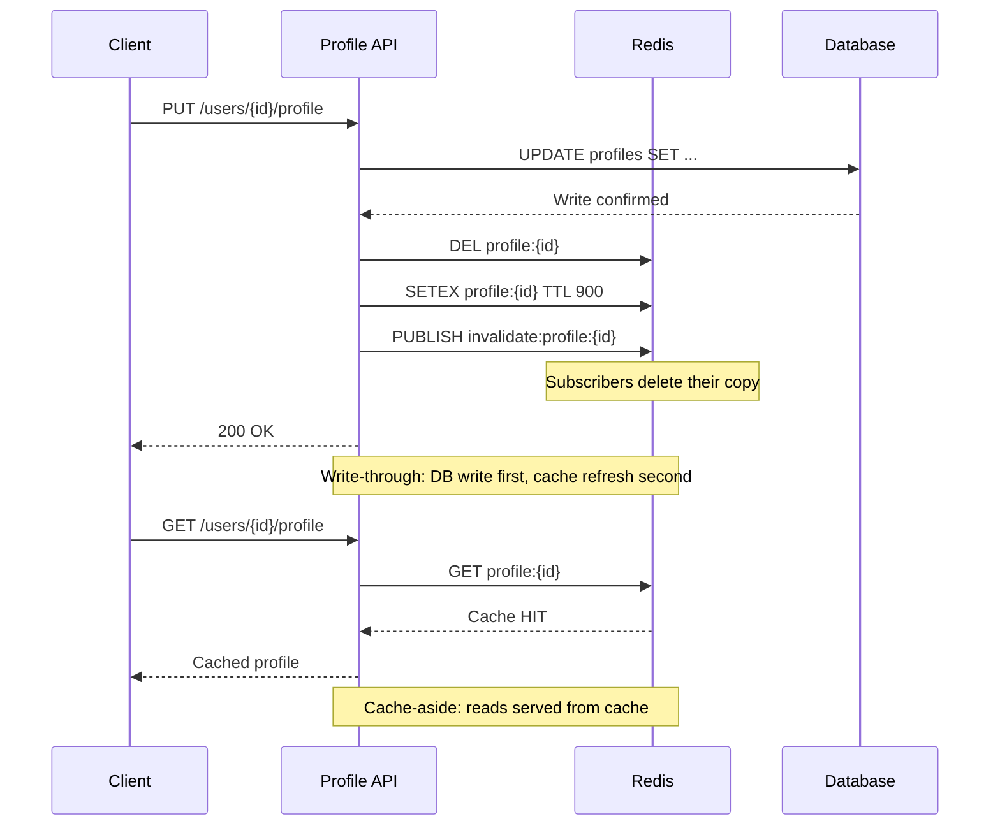

| Difficulty | Channel | Tags |
|---|---|---|
| beginner | backend | redis, memcached, cache-invalidation |

Uber's microservices were drowning. Their production infrastructure was serving over 40 million reads per second across Docstore instances [1], with one use case consuming a staggering 60,000 CPU cores just to serve reads from the storage engine. Every team ran their own Redis cache clusters with ad-hoc invalidation logic, creating a tangled mess of stale data bugs and fragmented operations. This is what happens when cache invalidation goes wrong at scale—and it is a cautionary tale for any developer building user profile services today.

---

> ### Real-World Case — Uber
>
> Uber's microservices relied on Docstore (their MySQL-based DB) for critical data—user profiles, driver documents, restaurant menus, payment info. Each team ran their own Redis cache clusters with ad-hoc invalidation logic, leading to fragmented operations, stale data bugs, and massive infrastructure waste. One large use case needed 60,000 CPU cores to serve reads directly from the storage engine.
>
> | | |
> |---|---|
> | **Challenge** | Cache invalidation at Uber's scale was failing. TTL-only meant stale data for minutes—unacceptable for profile updates, payment methods, and cart items. CDC-based async invalidation via binlog tailing (Flux) had sub-second lag but could still serve stale reads during the window. Teams needed near-immediate read-after-write consistency without sacrificing the 40M+ reads/second throughput. |
> | **Solution** | Uber built CacheFront, an integrated Redis caching layer inside Docstore's query engine. They used a triple-layered invalidation strategy: (1) CDC via Flux tails MySQL binlogs and writes invalidation markers (not DEL) to Redis; (2) direct write-path interception at the query engine invalidates cache immediately on transaction commit; (3) TTL as a safety net for any missed paths. They also built a 'Cache Inspector' that shadows reads to compare cached vs database data, measuring consistency at 99.99%. |
> | **Outcome** | 40M+ reads/second across all Docstore instances (later scaled to 150M+). P75 latency dropped 75%, P99.9 dropped 67%. One use case went from 60,000 storage CPU cores to just 3,000 Redis cores—a 95% infrastructure cost reduction—while maintaining a 99% cache hit rate. The Cache Inspector confirmed 99.99% consistency between cache and database. |
> | **Lesson** | No single cache invalidation strategy is sufficient at scale. TTL alone is too slow, CDC alone has a stale window, write-through alone is too expensive. The winning approach is layered defense: write-path invalidation for immediate consistency + CDC for catch-up + TTL as a backstop. And you must measure consistency empirically—Uber's Cache Inspector proved what their assumptions couldn't. |

---

## Hook — The 60,000-Core Problem Nobody Talks About

You deploy a user profile service. A few thousand users sign up. Caching is an afterthought—something you will "get to later." Then growth hits. Suddenly, your database is drowning in read traffic, engineers are cobbling together Redis clusters in a panic, and the latency SLA is slipping. Sound familiar? At Uber, this pattern repeated across dozens of microservices until the infrastructure bill became impossible to ignore [1]. One service alone burned 60,000 CPU cores—not for complex business logic, but just to serve cached reads. The root cause was never the caching itself. It was the invalidation.

## Problem — The Two Hardest Things in Computer Science

Phil Karlton famously said there are only two hard things in computer science: cache invalidation and naming things. The joke lands because every developer has felt this pain. Here is why cache invalidation is deceptively difficult: you are trying to keep two data stores—a hot cache and a canonical database—perfectly synchronized under concurrent access, network partitions, and server failures. Invalidate too aggressively, and you get thundering herds of cache misses that hammer your database. Invalidate too lazily, and users see stale profiles, outdated pricing, or worse (imagine a driver's insurance document not updating). The stakes are real. A 2023 survey found that 71% of organizations experienced data inconsistencies due to cache staleness [2], and for user-facing systems, even a few seconds of inconsistency can break trust. Two strategies dominate the landscape: cache-aside (the application loads data on miss) and write-through (the cache updates synchronously with the database). Each comes with real trade-offs that most tutorials gloss over.

## Real-World Case — Uber's Cache Awakening

Uber's microservices ran on Docstore, their MySQL-based storage layer, holding everything from user profiles and driver documents to restaurant menus and payment information [1]. The problem was that each microservice team deployed their own Redis cache independently, writing ad-hoc invalidation logic that worked—until it didn't. Fragmented operations meant stale data surfaced unpredictably. Infrastructure waste ballooned. One use case required 60,000 CPU cores just to serve reads from the storage engine. When Uber engineers finally stepped back to measure the carnage, the numbers were staggering: 40 million reads per second across all Docstore instances. They built what they called Cache Inspector—a system that tracks cache behavior across the fleet—and discovered a 99.99% consistency rate could be achieved with the right invalidation protocol [1]. The fix was an integrated cache layer with standardized write-through semantics, Redis pub/sub for cross-cluster invalidation, and automated TTL management. The results were remarkable: P75 latency dropped 75%, P99.9 dropped 67%, and that 60,000-core use case shrank to just 3,000 Redis cores—a 95% infrastructure cost reduction—while maintaining 99% cache hit rate [1].

## Deep Dive — Write-Through vs Cache-Aside: The Real Trade-offs

Building on Uber's lesson, you need to understand the two dominant cache patterns and when to use each. Cache-aside is the simplest: on a read, check the cache; on a miss, query the database and populate the cache. This pattern works well for read-heavy workloads with infrequent updates because stale data only persists until the TTL expires. However, during a cache miss cascade (e.g., after a mass invalidation), the database can get hammered. Write-through takes a different approach: every write goes to both the database and cache atomically. This ensures the cache is always fresh for subsequent reads, but it adds latency to every write operation. So which should you choose? For a user profile service where reads vastly outnumber writes and data consistency matters, write-through with TTL fallback is the industry standard [5]. Redis offers a compelling advantage here: its pub/sub mechanism allows automatic distributed invalidation across cache nodes. When one node invalidates a key, it can publish an event that all other nodes subscribe to, keeping the fleet synchronized without manual coordination [3]. Memcached, by contrast, requires you to implement this coordination yourself—or accept eventual inconsistency across nodes. Memcached does offer lower memory overhead per key and simpler horizontal scaling [4]. For pure key-value caching with simple data and minimal invalidation requirements, Memcached's simplicity wins. But for complex invalidation patterns, data durability, and the rich data structures that user profiles demand (sets for friend lists, hashes for profile fields, sorted sets for activity feeds), Redis is the clear winner [3][6].

## Workflow — The Write-Through Cache Invalidation Flow

Now that you understand the trade-offs, here is how to implement a write-through cache with proper invalidation. The diagram below shows the complete flow for both read and write operations. On a write, the application first updates the database, then deletes the stale cache key, then populates the cache with fresh data and an appropriate TTL. On a read, the application checks the cache first (cache-aside on read, write-through on write). The critical design choice is to delete-then-set rather than update-in-place. Deleting first avoids race conditions where a concurrent reader gets partially updated data. Redis pub/sub is then used to broadcast the invalidation to all other cache nodes, keeping the distributed system consistent.

```sequenceDiagram
    participant Client
    participant API as Profile API
    participant Cache as Redis
    participant DB as Database
    Client->>API: PUT /users/{id}/profile
    API->>DB: UPDATE profiles SET ...
    DB-->>API: Write confirmed
    API->>Cache: DEL profile:{id}
    API->>Cache: SETEX profile:{id} TTL 900
    API->>Cache: PUBLISH invalidate:profile:{id}
    Note over Cache: Subscribers delete their copy
    API-->>Client: 200 OK
    Note over API,Cache: Write-through: DB write first, cache refresh second
    Client->>API: GET /users/{id}/profile
    API->>Cache: GET profile:{id}
    Cache-->>API: Cache HIT
    API-->>Client: Cached profile
    Note over API,Cache: Cache-aside: reads served from cache
```

This workflow's key insight: by decoupling the write and read paths (write-through for writes, cache-aside for reads), you get the consistency benefits of synchronous writes without penalizing read latency. The TTL serves as a safety net—if the cache somehow gets stale, it self-heals within the expiry window.

## Code Example — Implementing Cache Invalidation in Python

Let us translate that workflow into production Python code using redis-py. The implementation follows the write-through pattern with an explicit delete-before-set invalidation strategy and distributed invalidation via Redis pub/sub.

```python
import json
import redis
from typing import Optional

# Initialize Redis client
cache = redis.Redis(host='localhost', port=6379, decode_responses=True)
PROFILE_TTL = 900  # 15 minutes

def get_profile(user_id: str) -> Optional[dict]:
    # Cache-aside read: check cache first
    cached = cache.get(f"profile:{user_id}")
    if cached:
        return json.loads(cached)

    # Cache miss: fetch from database
    profile = db_query("SELECT * FROM profiles WHERE id = %s", user_id)
    if profile:
        # Populate cache with TTL
        cache.setex(f"profile:{user_id}", PROFILE_TTL, json.dumps(profile))
    return profile

def update_profile(user_id: str, updates: dict) -> dict:
    # Step 1: Write to database first
    updated = db_execute(
        "UPDATE profiles SET name = %s, avatar = %s WHERE id = %s",
        updates.get("name"), updates.get("avatar"), user_id
    )

    # Step 2: Delete stale cache key
    key = f"profile:{user_id}"
    cache.delete(key)

    # Step 3: Write fresh data with TTL
    cache.setex(key, PROFILE_TTL, json.dumps(updated))

    # Step 4: Broadcast invalidation across cluster
    cache.publish("profile:invalidate", key)

    return updated

def on_invalidation_message():
    # Subscriber: listen for cross-node invalidations
    pubsub = cache.pubsub()
    pubsub.subscribe("profile:invalidate")
    for message in pubsub.listen():
        if message["type"] == "message":
            cache.delete(message["data"])
```

The explanation for this pattern: First, always write to the database before invalidating the cache. This ensures the source of truth persists even if the cache update fails. Second, delete before set—this might seem redundant, but it prevents stale data from lingering if your application restarts mid-write. Third, the TTL acts as a circuit breaker: even if a pub/sub message gets lost, the stale key self-destructs within 15 minutes. Finally, the pub/sub subscriber runs on every cache node, ensuring all instances clear their local copy when any node performs a write. This is exactly the pattern Uber used to achieve 99.99% consistency across their fleet [1].

## Lessons Learned — Cache Smart, Not Hard

Uber's journey from 60,000 CPU cores of chaos to a lean, consistent cache layer holds lessons for every developer. First, standardize your invalidation logic across services. Uber's fragmented per-team approach was the root cause of both their stale data bugs and their infrastructure waste. A shared caching library with consistent write-through semantics eliminates this problem at the source. Second, always set a TTL even with write-through caching. No invalidation mechanism is perfect—network partitions happen, pub/sub messages get dropped, bugs slip through. The TTL is your safety net [5]. Third, measure your cache hit rate and consistency. Uber's Cache Inspector was the tool that revealed both the scale of the problem and the effectiveness of the fix [1]. Without monitoring, you are flying blind. Fourth, choose Redis over Memcached when your invalidation patterns are complex and you need durability. The pub/sub capabilities alone justify the switch for distributed systems [3][6]. Memcached still has its place for simple, ephemeral caching where raw throughput is the only metric that matters [4]. What should you do differently tomorrow? Audit your current cache invalidation logic. Are you updating in place instead of deleting? Are you relying on TTL alone for consistency? Do you have a mechanism to invalidate across service instances? If any answer is "no," you have found your next refactor.

---

## Write-Through Cache Invalidation Flow



<details>
<summary><strong>Original Interview Question</strong></summary>

**Q:** You're building a user profile service that caches frequently accessed profiles. How would you implement cache invalidation when a user updates their profile, and what trade-offs would you consider between Redis and Memcached?

**A:** Implement write-through caching with TTL-based expiration. On profile update, invalidate the cache by deleting the key and writing new data to both the database and cache. Redis offers pub/sub for automatic distributed invalidation, while Memcached requires manual coordination across nodes.

</details>

## Conclusion

Cache invalidation is not a one-time configuration—it is an ongoing discipline. Uber's transformation from 60,000 CPU cores to 3,000 showed that the right cache strategy can slash infrastructure costs by an order of magnitude while improving latency and consistency. The key insight is that write-through with TTL fallback and pub/sub invalidation handles the vast majority of real-world caching scenarios. Next time you add a cache, ask yourself: what happens when this cache needs to be invalidated? If the answer is "the TTL will handle it," you have a data inconsistency incident waiting to happen. Build the invalidation logic first. The cache itself is the easy part.

---

## References

1. [How Uber Serves Over 40 Million Reads Per Second Using an Integrated Cache](https://www.uber.com/en-US/blog/how-uber-serves-over-40-million-reads-per-second-using-an-integrated-cache/) — blog
2. [Cache Invalidation — Wikipedia](https://en.wikipedia.org/wiki/Cache_invalidation) — documentation
3. [Redis — Wikipedia](https://en.wikipedia.org/wiki/Redis) — documentation
4. [Memcached — Wikipedia](https://en.wikipedia.org/wiki/Memcached) — documentation
5. [AWS Database Caching Strategies — Write-Through](https://docs.aws.amazon.com/whitepapers/latest/database-caching-strategies/write-through.html) — documentation
6. [Redis vs Memcached — DigitalOcean Community Tutorial](https://www.digitalocean.com/community/tutorials/redis-vs-memcached) — documentation
7. [HTTP Caching — MDN Web Docs](https://developer.mozilla.org/en-US/docs/Web/HTTP/Caching) — documentation
8. [RFC 7234 — Hypertext Transfer Protocol (HTTP/1.1): Caching](https://datatracker.ietf.org/doc/html/rfc7234) — documentation

---

**Author:** Satishkumar Dhule — [GitHub](https://github.com/satishkumar-dhule) · [LinkedIn](https://linkedin.com/in/satishkumar-dhule) · [Website](https://satishkumar-dhule.github.io)
