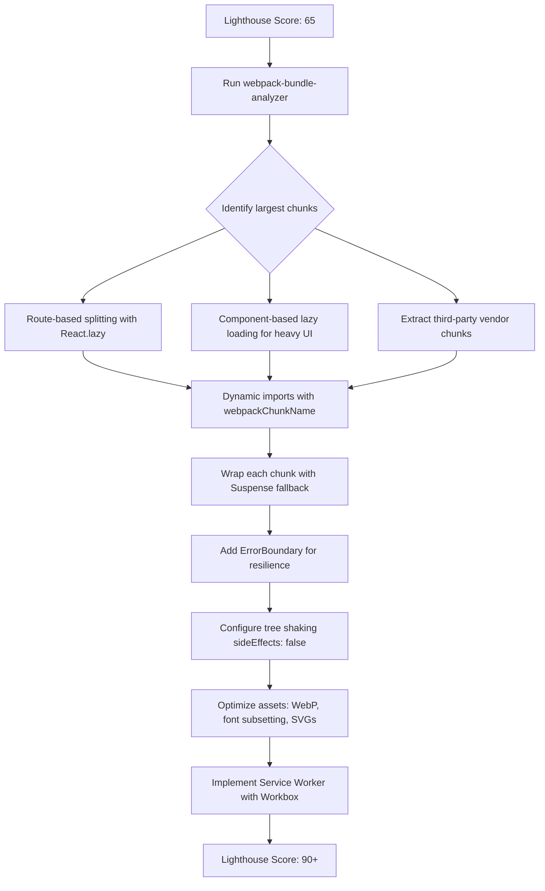

| Difficulty | Channel | Tags |
|---|---|---|
| intermediate | frontend | lighthouse, bundle, lazy-loading |

Your React app just scored 65 on Lighthouse. Bundle size: 2.1MB. Time to Interactive: 4.2 seconds. Your competitors are loading in under 2 seconds — and users are voting with their thumbs. Now imagine you have 328 million monthly active users, 80% of them on mobile, many browsing on 2G networks. That was Twitter in 2017 [1]. Their native Android app weighed 23.5MB. Their mobile web experience was hemorrhaging users. So they rebuilt with a PWA strategy that cut 99th percentile time-to-interactive by 50%, boosted pages per session by 65%, and increased Tweets sent by 75%. The playbook they used is the same one that takes a React app from a Lighthouse 65 to 90+.

---

> ### Real-World Case — Twitter (X)
>
> Twitter had 328M monthly active users, 80%+ on mobile, with many on 2G/3G networks in emerging markets. Their native Android app required 23.5MB of downloads, and the mobile web experience was slow, with high data costs and poor engagement.
>
> | | |
> |---|---|
> | **Challenge** | Twitter needed to dramatically improve the mobile web experience — reducing bundle size, time-to-interactive, and data consumption — while delivering native-like performance and engagement for users on slow networks and low-end devices. |
> | **Solution** | Built Twitter Lite as a React Progressive Web App using the PRPL pattern (Push, Render, Pre-cache, Lazy-load). They implemented granular code splitting so the initial load only shipped resources needed for the visible screen, used service workers for instant repeat visits, lazy-loaded non-critical components, optimized images to reduce data consumption by 70%, and served only 600KB over the wire total. |
> | **Outcome** | 65% increase in pages per session, 75% increase in Tweets sent, 20% decrease in bounce rate, 50% reduction in 99th percentile time-to-interactive latency, 30% faster average load for logged-in users. The PWA boots in under 3 seconds on return visits vs. 23.5MB for the native app. Over 10M push notifications delivered daily, and 250K unique daily users launch from the homescreen ~4x/day. |
> | **Lesson** | Aggressive code splitting combined with the PRPL pattern can make a React web app rival native performance. By shipping only the JavaScript needed for the visible viewport and caching everything else via service workers, you can achieve sub-3-second repeat loads even on 2G networks — and reduce data usage by 70%. |

---

## Hook — The Lighthouse Score That Wakes You Up at 3am

You have just run Lighthouse on your React app. Score: 65. Bundle: 2.1MB. Time to Interactive: 4.2 seconds. Your first instinct might be to reach for the low-hanging fruit — compress images, minify CSS, enable gzip. Those help, but they will not get you from 65 to 90. The real culprit is hiding in plain sight: your JavaScript bundle has become a dependency hoarder. Every import, every convenience abstraction, every "it is just one more package" adds bytes. And bytes become bundles. And bundles become bottlenecks. The tension is real — ship more features or ship a faster experience. The good news? You do not have to choose. But the path requires more than guesswork. It demands a systematic approach, the kind that transformed one of the most trafficked web applications on the planet.

## Problem — The Paradox of Modern React Development

The modern React app suffers from a cruel paradox. Developer productivity has never been higher. TypeScript catches bugs before they ship. Component libraries accelerate UI development. Thousands of npm packages solve every conceivable problem. Yet every single one of those conveniences adds weight to your bundle. A 2.1MB JavaScript bundle does more than ruin a Lighthouse score — it costs real money for users on metered data plans, it costs engagement when pages take over 4 seconds to become interactive, and it costs revenue when users bounce before the first meaningful paint. Many developers think the answer is "just use code splitting." But naive code splitting without understanding your bundle composition is like guessing which organs to remove without an X-ray. You need to measure before you cut. You need to understand the difference between route-based and component-based splitting. You need to know why tree shaking sometimes does nothing at all. And you need a workflow that makes performance optimization a habit, not a fire drill.

## Real-World Case — Twitter: When Performance Becomes a Business Multiplier

Here is where Twitter's story becomes the playbook. In 2017, Twitter faced a brutal reality: their native Android app required 23.5MB of downloads, and their mobile web experience was too slow for the 80% of users accessing the platform from phones — many on 2G or 3G networks in emerging markets [1]. Instead of accepting this as a mobile-web limitation, they rebuilt their experience as a Progressive Web App with aggressive performance optimizations. The results were staggering. A 50% reduction in 99th percentile time-to-interactive latency. A 30% faster average load for logged-in users. The PWA boots in under 3 seconds on return visits — compared to a 23.5MB native app download that users had to install. Engagement metrics soared: 65% more pages per session, 75% more Tweets sent, and a 20% reduction in bounce rate. Over 10 million push notifications delivered daily, and 250,000 unique daily users launch from the homescreen roughly four times per day. Twitter proved that performance optimization is not a technical luxury — it is a business multiplier. And the tools they used are available to every React developer today.

## Deep Dive — Bundle Analysis, Code Splitting, and the Art of the Scalpel

To bridge the gap from a 65 to a 90+ Lighthouse score, you need to think like a surgeon, not a lumberjack. The first tool on the table is webpack-bundle-analyzer [3]. This plugin generates a visual treemap of your production bundle, showing exactly which dependencies consume the most space. The results are often humbling. That moment you realize moment.js alone eats 300KB, or that lodash was imported in a way that completely bypassed tree shaking. Once you have clarity on what is in your bundle, the real work begins: code splitting. There are two main strategies, each with distinct trade-offs. Route-based splitting loads JavaScript per-page, ensuring users only download what they need for the current view [6]. This is ideal for applications with distinct sections — dashboard, settings, billing, analytics. Component-based splitting targets heavy UI elements that are expensive regardless of which route they appear on — charts, code editors, rich text fields, drag-and-drop interfaces. Both strategies rely on dynamic import() statements, a native JavaScript feature that returns a Promise and loads modules on demand [5]. When combined with React.lazy() and Suspense, you get a declarative API that makes splitting feel like a first-class part of the framework [2]. But here is the plot twist that surprises many developers: code splitting alone is not enough. If your shared vendor bundle still contains every library from day one, you are just rearranging deck chairs on the Titanic. You must also configure proper tree shaking in your webpack config — setting sideEffects: false in package.json and using ES module imports instead of CommonJS [7]. And for truly aggressive optimization, extract critical third-party libraries into separate chunks that can be loaded in parallel and cached independently by the browser.

## Workflow — A Repeatable Process for Performance Transformation

All of this theory comes together in a repeatable workflow that moves systematically from diagnosis to delivery. Start by running Lighthouse and webpack-bundle-analyzer to establish your baseline — you cannot fix what you do not measure. Then identify the largest chunks in your bundle and categorize them: third-party vendors, heavy components, and entire route trees. Implement route-based splitting first, since it delivers the highest impact with the lowest refactoring cost. Add component-based splitting for any UI elements that are expensive and not immediately visible. Configure tree shaking properly and verify it is working by inspecting the analyzer output before and after. Optimize static assets — images, fonts, icons — using modern formats like WebP and responsive image sets [4]. Finally, add a service worker caching strategy using Workbox to ensure repeat visits are near-instant [8]. The diagram below visualizes this entire pipeline.

## Code Example — Lazy Loading in Practice with React.lazy and Suspense

Here is how the patterns described above translate into production code. The following example implements route-based splitting with React.lazy, adds component-based splitting for a heavy chart component, wraps everything in Suspense with a loading skeleton, and protects against failures with an error boundary.

## Lessons Learned — What Works, What Breaks, and What to Do Tomorrow

Performance optimization is never a one-time project. It is a discipline that must be woven into your development workflow. Several key insights emerge from this journey. First, measurement must come before optimization — every change should be validated against a baseline. Second, route-based splitting is almost always the right starting point because it maps naturally to how users navigate your application [6]. Third, component-based splitting should be reserved for truly expensive UI elements — applying it everywhere creates unnecessary complexity and can actually hurt performance due to the overhead of multiple network requests. Fourth, tree shaking requires vigilance: use ES module syntax throughout, check your webpack configuration, and verify with bundle analysis [7]. Finally, do not forget the non-JavaScript factors. Image optimization, font subsetting, and HTTP caching headers often provide the fastest wins with the smallest effort. One common mistake teams make is reaching for premature optimization — adding lazy loading before understanding what is actually slow. Another is neglecting error boundaries around dynamically loaded components, which can cause entire screens to white-screen if a chunk fails to load. The right approach combines technical rigor with a clear priority order: measure, split the biggest pieces, optimize assets, cache strategically, and repeat.

---

## Performance Optimization Workflow

<strong>Original Interview Question</strong>

**Q:** You're tasked with improving a React app's Lighthouse performance score from 65 to 90+. The bundle size is 2.1MB and Time to Interactive is 4.2s. What specific steps would you take to optimize the bundle and implement lazy loading?

**A:** Implement code splitting with React.lazy() and Suspense, analyze bundle composition with webpack-bundle-analyzer to identify largest chunks, remove unused dependencies and optimize imports, add dynamic imports for heavy components and third-party libraries, implement route-based splitting for better initial load times, and utilize tree shaking with proper ES module configuration.

## Conclusion

The gap between a 65 and a 90+ Lighthouse score is not a chasm — it is a series of deliberate, measurable steps. Twitter proved that performance optimization is not just about technical metrics; it is about user engagement, business growth, and reaching audiences in every corner of the world. Start with bundle analysis. Split ruthlessly by route. Protect every lazy chunk with an error boundary. Cache aggressively with service workers. Measure again. The 90+ score is waiting. More importantly, so are the users who will notice the difference in every millisecond you save.

---

## References

1. [Twitter (X) incident report](https://developers.google.com/web/showcase/2017/twitter) — article
2. [React.lazy documentation](https://react.dev/reference/react/lazy) — documentation
3. [webpack-bundle-analyzer](https://github.com/webpack-contrib/webpack-bundle-analyzer) — documentation
4. [Lighthouse performance scoring guide](https://developer.chrome.com/docs/lighthouse/performance/) — documentation
5. [Dynamic import() - MDN](https://developer.mozilla.org/en-US/docs/Web/JavaScript/Reference/Operators/import) — documentation
6. [Webpack code splitting guide](https://webpack.js.org/guides/code-splitting/) — documentation
7. [Webpack tree shaking guide](https://webpack.js.org/guides/tree-shaking/) — documentation
8. [Workbox — Service worker caching](https://developer.chrome.com/docs/workbox/) — documentation
9. [React Suspense documentation](https://react.dev/reference/react/Suspense) — documentation

---

**Author:** Satishkumar Dhule — [GitHub](https://github.com/satishkumar-dhule) · [LinkedIn](https://linkedin.com/in/satishkumar-dhule) · [Website](https://satishkumar-dhule.github.io)
