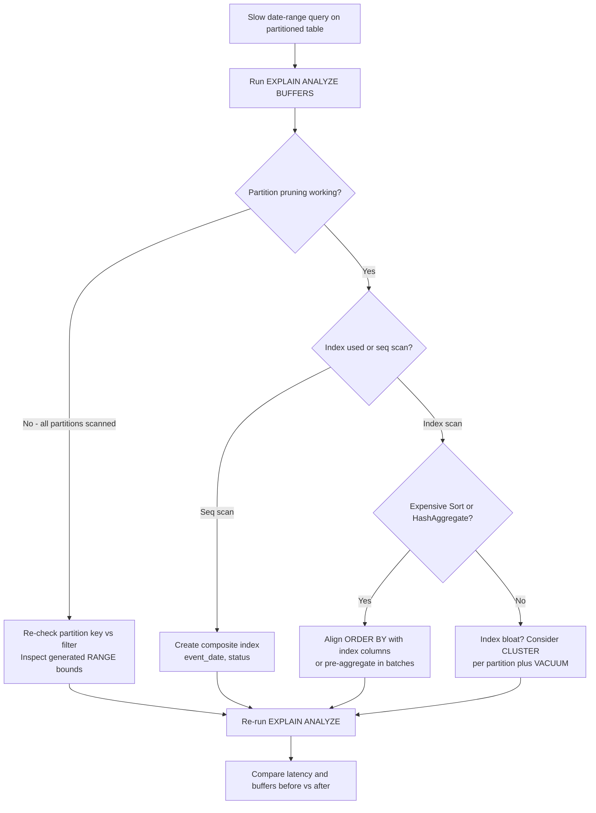

| Difficulty | Channel | Tags |
|---|---|---|
| intermediate | database | explain, query-plan, partitioning |

By early 2020, GitLab.com's PostgreSQL database had swelled past 5 TB, and the ci_builds table alone accounted for a staggering 3.5 TB of it. Append-only event and audit tables were slowing down because indexes alone could not keep up, which pushed GitLab to make table partitioning a formal database-engineering initiative [1]. Sound like someone else's problem? Your 100-million-row table is one poorly chosen index away from the same 3 a.m. pager call. This article walks through exactly what to check in the EXPLAIN plan when a date-range query refuses to be fast — and how to fix it.

---

> ### Real-World Case — GitLab
>
> GitLab.com's PostgreSQL database grew past 5 TB by early 2020, driven by individual tables exceeding 100 GB (some in the terabytes, like ci_builds at 3.5 TB). Queries on append-only event/audit tables were slowing down because indexes alone couldn't keep up, so GitLab made table partitioning a formal database-engineering initiative.
>
> | | |
> |---|---|
> | **Challenge** | An audit_events table tracking security events was growing out of control: the UI queries it by date range, but naive queries filtering only on author_id hit the entire table. GitLab needed to partition by date so date-filtered queries could be pruned to a single month's worth of data, while ensuring other query patterns didn't silently scan every partition. |
> | **Solution** | GitLab made audit_events the first table partitioned in the application database (GitLab 13.5), using native PostgreSQL range partitioning on created_at with monthly partitions, migrated zero-downtime via a 4-step process (create partitioned copy + sync trigger, batched background backfill of 50,000 rows per job, cleanup, then swap). Their docs explicitly demonstrate the core diagnostic: a query like WHERE created_at >= '2020-01-01' AND created_at < '2020-01-08' prunes to one month's partition, but WHERE author_id = 123 ORDER BY created_at DESC cannot prune anything and queries every partition individually. This became their enforced rule - the partition key must appear in the WHERE clause of every performance-sensitive query - and they rolled the pattern out to the events table and the 3.5 TB ci_builds / CI pipeline tables. |
> | **Outcome** | Date-range queries on partitioned tables reduced to scanning a single monthly partition instead of the whole multi-hundred-GB table. GitLab produced official partitioning tooling (PartitioningMigrationHelpers), documented the migration path for self-managed users, and scaled the pattern to a 3.5 TB ci_builds table plus dozens of CI/CD tables, citing earlier S1/S2 production incidents (excessive buffer reads, running transactions) as the motivation. |
> | **Lesson** | Partitioning is not a performance silver bullet - partition pruning is the whole game. A partitioned table only helps if queries filter on the partition key in a form the planner can prove; otherwise the database visits every partition. Always verify with EXPLAIN that pruning is actually happening and design composite indexes/queries to align with the partition key. |

---

## Hook — A Date-Range Query That Refuses to Be Fast

It starts innocently enough. A colleague opens a dashboard, clicks a date filter, and the page hangs for twenty seconds. The query itself looks harmless: a WHERE clause on event_date BETWEEN two dates, one status filter, one SELECT. What could possibly go wrong? Plenty. Many developers discover the hard way that partitioning is not a magic wand — it fails silently, and the failure shows up not in error logs but in latency charts. GitLab lived this exact nightmare on a database that outgrew 5 TB [1]. Here is the uncomfortable truth: on a 100M-row partitioned table, a slow date-range query is almost never a hardware problem. It is a planning problem. And the plan is written down, in plain English, every single time you run EXPLAIN. The trick is learning to read it like a detective reads a crime scene.

## Problem — When 100 Million Rows Decide to Fight Back

Here is what makes 100 million rows special: every mistake gets amplified by ten orders of magnitude. A sequential scan that costs a few milliseconds on 10,000 rows becomes a forty-second grind on 100M. The pain compounds on partitioned tables because partitioning changes the math in subtle ways. You might think, "I partitioned by date, so the planner will obviously scan one month." Actually, partition pruning only works when the planner can prove which partitions the query touches — and that proof collapses the moment your filter does not match the partition key exactly [2][7]. Add a second condition like status = 'completed' and the planner must decide between chasing a B-tree index on status and filtering date afterward, or scanning the pruned partitions entirely [9]. When it guesses wrong, you get an index scan that touches 30 million rows and a sort node that eats gigabytes of work_mem. The stakes are real: GitLab's own documentation cites excessive buffer reads and long-running transactions as drivers of S1/S2 production incidents [1].

## Real-World Case — GitLab's 5 TB Wake-Up Call

Now, meet the case that should make every database-minded developer sit up straight. GitLab.com's PostgreSQL database grew past 5 TB by early 2020, and the growth was not evenly spread — individual tables crossed 100 GB, and the ci_builds table hit 3.5 TB on its own [1]. The killer detail: these were append-only event and audit tables. Append-only sounds cheap, but it is where indexes go to die — every write adds a new row, indexes balloon in size, and queries that should read a narrow slice end up wading through index pages that outgrow the data they point at. GitLab responded by making table partitioning a formal database-engineering initiative, building PartitioningMigrationHelpers to automate the migration and documenting the path for self-managed users [1][6]. The payoff was dramatic: date-range queries on partitioned tables shrank from scanning a multi-hundred-GB table to scanning a single monthly partition. The team then scaled the same pattern to the 3.5 TB ci_builds table plus dozens of CI/CD tables. This is not a hypothetical — this is a documented journey with tooling you can inspect today [1].

## Deep Dive — Reading EXPLAIN Like a Detective

So what does the fix actually look like inside the EXPLAIN plan? Start by running EXPLAIN (ANALYZE, BUFFERS) on the exact slow query [3]. Then interrogate the output like a witness. Three questions matter. First, is partition pruning happening? The plan's Append node should list only the partitions your date range touches. If you see every partition listed, pruning silently failed — often because the filter expression does not match the partition key's structure [2]. Second, is the planner scanning or seeking? A "Seq Scan on events" with an estimate in the millions means the index is missing, unhelpful, or bloated. Third, is there an expensive Sort or HashAggregate? Sorting 40 million rows in memory is usually the actual bottleneck, and it hides behind an otherwise pretty plan.

Here is the plot twist: the most common fix is not a bigger index or more memory — it is a composite index shaped like the WHERE clause, for example (event_date, status) [5]. A composite index lets the planner satisfy the filter from a narrow, ordered slice of the index instead of chasing random pages across the heap [9].

| What EXPLAIN shows | What it means | The move |
|---|---|---|
| Seq Scan over parent, all partitions under Append | Pruning failed | Align filter with partition key; inspect RANGE bounds |
| Index Scan but millions of rows still touched | Index too selective or bloated | Composite index matching WHERE; refresh statistics |
| Sort (cost=high) on a huge row set | Ordering is the bottleneck | Put ORDER BY columns first in the composite index |
| HashAggregate churning millions of rows | Aggregation on too much data | Pre-aggregate nightly or add a summary table |

But wait — there is a second, quieter layer. Even with the perfect index, reading millions of heap pages is I/O-bound work. That is where CLUSTER enters: it rewrites a table physically in index order, converting scattered random reads into sequential ones [4]. The real trade-offs look like this:

| Approach | When it shines | Hidden cost |
|---|---|---|
| Single-column index on date | Simple, small footprint | Useless for second-column filters |
| Composite index (date, status) | Matches the WHERE clause | Larger index, write amplification |
| CLUSTER | Reads grouped physically | Lock-heavy; needs a maintenance window |
| Re-partition with a new key | Query pattern changed permanently | Full migration, downtime risk |

⚠️ Watch Out: a composite index is only as good as its column order. If your queries filter by status more often than by date, (date, status) silently becomes the wrong shape — read your real workload before deciding.

## Workflow — The 5-Step Diagnostic You Can Run Tonight

Building on the deep dive, here is the diagnostic workflow you can run tonight without touching production data — except for the one command that deserves a maintenance window. The diagram below maps the entire decision tree: run the plan, check pruning, check the scan strategy, hunt for sorts, then apply the cheapest fix and re-measure.

**Step 1 — Baseline.** Capture EXPLAIN (ANALYZE, BUFFERS) on the exact slow query. Never optimize blind; the plan is your before-and-after evidence [3].

**Step 2 — Verify pruning.** The Append node must list only the partitions your date range covers. All partitions listed means pruning failed silently.

**Step 3 — Verify the scan strategy.** Index scan or sequential scan? Compare the planner's `rows` estimate against `actual rows` — a 10x gap means stale statistics, so run ANALYZE first.

**Step 4 — Hunt the expensive nodes.** Sort, HashAggregate, and Nested Loop nodes with huge inner scans are the classic hidden culprits.

**Step 5 — Apply the cheapest fix first, in order:** ANALYZE → composite index → CLUSTER → reconsider the partition key. Then re-measure and compare the numbers before and after.

The flow diagram captures the moment where most teams go wrong: they jump straight to the index, skipping the pruning and scan checks that would have pointed at a completely different fix.

## Code Example — From Diagnosis to a Fix in Five Commands

The moment of truth: translating the diagnosis into commands. The snippet below captures the whole loop — baseline plan, pruning check, index creation, optional clustering, and a final comparison. Run it against a staging copy of your table first; nothing humbles a query plan like a production-sized dataset.

## Lessons Learned — What to Do Differently Tomorrow

If this feels like a lot, you are not alone — teams have been paying this tuition for a decade, and database partitioning has been a documented practice for that long [7]. Here is the condensed playbook from GitLab's journey and the interview question it inspired:

- **Read the plan before you touch the schema.** It costs nothing and tells you whether the problem is pruning, scanning, or sorting [3].
- **Indexes are not free.** On append-only tables they bloat relentlessly; budget for periodic rebuilds or clustering [4].
- **Composite indexes beat scattergun single-column indexes.** Shape them like your WHERE clause [5].
- **Partitioning is a commitment, not a ceremony.** GitLab built repeatable migration tooling [6], and community extensions like pg_partman automate partition lifecycle management so you do not hand-create monthly partitions forever [8].

🔥 Hot Take: if your EXPLAIN plan shows a Sort node costing more than the scan itself, the missing index is the least of your problems — your ORDER BY and your index are arguing with each other.

**Battle scars worth collecting:**
- CLUSTER on a partitioned parent table fails — it runs per-partition.
- CREATE INDEX CONCURRENTLY cannot run inside a transaction and can take hours on 100M rows. Plan for it.
- Stale statistics make EXPLAIN lie. When `rows` and `actual rows` disagree by an order of magnitude, ANALYZE before you build anything.

🎯 Key Point: the same questions that land the interview answer — is pruning working, is an index being used, is a sort eating the budget — are the questions that prevent your next S1 incident.

---

## Slow Query Diagnostic Flow

<strong>Original Interview Question</strong>

**Q:** You have a PostgreSQL table with 100M rows partitioned by date. A query filtering on a specific date range is still slow. What would you check in the EXPLAIN plan and how would you optimize it?

**A:** Check partition pruning effectiveness, index utilization patterns, and expensive sort operations. Create composite indexes on (date, filtered_columns) and evaluate clustering strategies for optimal data access.

## Conclusion

GitLab started with a 5 TB database and a formal partitioning initiative; the journey ended with single-month partition scans and a reusable migration toolkit [1]. The takeaway for your team tomorrow morning: before adding hardware or rewriting the query, run EXPLAIN (ANALYZE, BUFFERS) and ask three questions — is pruning working, is an index being used, and is a sort eating the budget? That one habit separates teams that fight symptoms from teams that fix root causes. Here is the insight worth sharing at your next standup: your database already wrote the explanation for every slow query. The only thing standing between you and the answer is knowing how to read it.

---

## References

1. [GitLab incident report](https://docs.gitlab.com/development/database/partitioning/date_range/) — article
2. [PostgreSQL documentation — Table Partitioning](https://www.postgresql.org/docs/current/ddl-partitioning.html) — documentation
3. [PostgreSQL documentation — Using EXPLAIN](https://www.postgresql.org/docs/current/using-explain.html) — documentation
4. [PostgreSQL documentation — CLUSTER](https://www.postgresql.org/docs/current/sql-cluster.html) — documentation
5. [PostgreSQL documentation — CREATE INDEX](https://www.postgresql.org/docs/current/sql-createindex.html) — documentation
6. [GitLab documentation — Database partitioning](https://docs.gitlab.com/development/database/partitioning/) — documentation
7. [Wikipedia — Database partitioning](https://en.wikipedia.org/wiki/Database_partitioning) — article
8. [pg_partman — PostgreSQL Partition Manager](https://github.com/pgpartman/pg_partman) — documentation
9. [Wikipedia — B-tree](https://en.wikipedia.org/wiki/B-tree) — article

---

**Author:** Satishkumar Dhule — [GitHub](https://github.com/satishkumar-dhule) · [LinkedIn](https://linkedin.com/in/satishkumar-dhule) · [Website](https://satishkumar-dhule.github.io)
