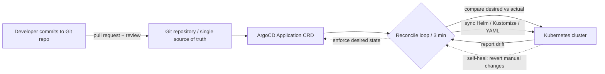

| Difficulty | Channel | Tags |
|---|---|---|
| beginner | devops | argocd, flux, declarative |

The year was 2020, and Okta's Auth0 team was staring down a wall they couldn't climb: a dozen manually operated Kubernetes clusters, each a hand-tuned 'snowflake' with its own quirks, operator-driven upgrades, and workloads still running on plain VMs. As enterprise demand for private-cloud identity exploded, that imperative, hands-on model simply could not scale [1]. So they made a bet that felt reckless at the time — they staked their entire private-cloud future on open-source GitOps with Argo CD [1]. The payoff was staggering: roughly 1,000+ clusters, 1M+ resources, and hundreds of daily deploys — an ~83x scale-up driven by one simple idea: let Git be the single source of truth.

---

> ### Real-World Case — Okta
>
> Okta's Auth0 private cloud platform was barely runnable: a dozen manually operated Kubernetes clusters with 'snowflake' configurations, operator-driven upgrades, insecure access management, and plain VM workloads. As enterprise demand for private-cloud identity grew, this imperative, hands-on model could not scale, so the team bet big on open-source GitOps with Argo CD in 2020.
>
> | | |
> |---|---|
> | **Challenge** | Scaling Argo CD from 12 to 1,000+ Kubernetes clusters managing 1M+ resources and hundreds of daily deployments. Native auto-sync broke on their release model: each release candidate bundles service image versions, Terraform code, manifests, plugins and custom logic, and Terraform must run before an Argo sync because generated infrastructure changes configs and secrets. Auto-sync also couldn't honor customer-specific deployment windows. At scale the application controller crashed under load, the UI slowed dramatically, refresh operations took minutes, and upstream race-condition bugs appeared. |
> | **Solution** | A fully declarative platform where Argo CD provisions services, Argo Workflows orchestrates deployments, and Terraform (via a custom provider) manages IaC, coordinated by control-plane services. One Argo Application represents an entire customer cluster. Since stock auto-sync couldn't handle Terraform dependencies or deployment windows, they built their own 'auto-sync' with Argo Workflows and the control plane, plus a CLI wrapper that classifies transient failures, enforces timeouts, and controls retries — while scaling controllers, tuning ignore-resource settings, and fixing upstream bugs like the application controller race condition. |
> | **Outcome** | Scaled from roughly 12 clusters in 2020 to 1,000+ clusters, 1M+ resources, and hundreds of daily deploys — an ~83x increase — with Git as the single source of truth and GitOps reconciling the cluster back to desired state even if runtime configs are tampered with (a key security benefit they cited). |
> | **Lesson** | Argo CD's auto-sync and self-healing are powerful, but at enterprise scale the defaults often don't fit: Okta couldn't use native auto-sync because of Terraform-before-sync dependencies and per-customer deployment windows, and had to build a custom auto-sync. The declarative Git-as-truth model still worked — the tooling around it just had to be adapted to the release process, showing that GitOps principles scale even when the stock controller features don't. |

---

## Hook — When a dozen clusters is one cluster too many

Ever wondered why the word 'snowflake' makes platform engineers visibly flinch? It is not about the weather. A snowflake server is that one machine no one can reproduce — the one configured by hand, years ago, by someone who has since left, and which breaks only when it matters most. Now multiply that by twelve, wrap it in Kubernetes, and give it enterprise identity workloads. That is exactly where Okta found themselves in 2020: twelve manually operated clusters, each upgraded by hand, each with its own security posture, each a ticking operational bomb [1]. The stakes were brutal. Their private-cloud identity product was barely runnable, and enterprise customers were lining up for exactly the thing the platform could not reliably deliver. Sound familiar? If your team manages more than a handful of clusters with kubectl and prayer, you are one missed manual step away from the same story.

## Problem — The quiet chaos of imperative operations

Here is the uncomfortable truth many developers discover only after their third 'works on my cluster' incident: Kubernetes does not care how the cluster got into a state. It only cares about the current state. The imperative approach — running kubectl apply, kubectl scale, or kubectl delete directly against a live cluster — feels fast and satisfying in the moment [4]. You changed something. It worked. Ship it. But here is the thing though: every one of those commands bypasses version control, leaves zero audit trail, and creates configuration drift that quietly accumulates until the day two clusters behave like completely different products [3]. The problem is not that imperative commands are wrong. The problem is that they scale linearly with human attention, and human attention is the scarcest resource in any platform team. When you have 12 clusters, kubectl works. When you have 1,000, it is a recipe for a very long, very public incident. The core tension: developers want speed, platforms need stability, and nothing reconciles those two forces better than an automated system that treats Git as the contract between them.

## Real-World Case — Okta's 83x gamble on Argo CD

This is where the story turns from cautionary tale into transformation. In 2020, Okta made a deliberate, company-wide bet: move their Auth0 private cloud platform to open-source GitOps with Argo CD [1]. The goal was not incremental improvement — it was structural reinvention. Instead of operators babysitting clusters, they built a system where Git is the single source of truth and Argo CD continuously reconciles the live cluster back to the desired state, even if someone tampers with runtime configs directly [1]. The results are the kind of numbers engineers frame and hang on their walls. Roughly 12 clusters became 1,000+ clusters — an ~83x increase. They manage over 1 million resources with hundreds of daily deployments [1]. But here is the counterintuitive twist that surprises most people: the security win. Because Argo CD self-heals any runtime tampering back to the Git-defined state, unauthorized changes become nearly impossible to sneak into production — Git is the only door that stays unlocked [1]. Okta did not just make their platform more scalable. They made it more secure, more auditable, and more boring in all the right ways. Boring, in platform engineering, is the highest compliment.

## Deep Dive — Declarative vs imperative: the real tradeoff

At this point you might be thinking, 'Okay, but I already use Git and YAML. Am I not already doing GitOps?' Not quite. The distinction between declarative and imperative is subtle, and it is where most GitOps migrations quietly fail. The imperative approach is a series of instructions: do this, then that, then something else [4]. kubectl apply is imperative in spirit — it describes a change you want to execute right now. The declarative approach is a statement of fact: here is the desired end state, full stop [3]. Argo CD's whole job is to look at the declared state in Git and make the cluster match it — continuously, automatically, and without asking permission [2]. That continuous reconciliation loop is the plot twist. Many developers assume that putting YAML in a Git repo is the hard part. It is not. The hard part is building the loop that never lets the cluster drift. Consequently, the real tradeoff between the two approaches comes down to three things: auditability (Git gives you a complete history of every change and who made it), rollback speed (revert a bad deploy by reverting a commit, not by writing five manual kubectl commands), and drift detection (Argo CD actively hunts for unauthorized changes and reverses them) [2]. The imperative approach offers immediate gratification; the declarative approach offers a good night's sleep. Here is a concrete comparison that captures the reality for teams choosing today:

## Workflow — From Git commit to running cluster, end to end

Building on that comparison, here is what the actual GitOps workflow looks like in practice — the pipeline that took Okta from a dozen fragile clusters to over a thousand self-healing ones [1]. It is a loop, not a ladder, and every step reinforces the one before it. First, you centralize truth: developers commit Kubernetes manifests, Helm charts, or Kustomize overlays to a Git repository, and that repository becomes the only place changes are allowed to originate [5]. Second, you register intent: you create an ArgoCD Application CRD that points at that repository, the target path within it, and the destination cluster [2]. Third, the reconciliation loop takes over: ArgoCD polls the repository (typically every 1–5 minutes; Okta-class setups tune this to their needs), compares the desired state against live cluster state, and syncs anything that has drifted [2]. Fourth, self-healing kicks in: if anyone directly edits a resource in the cluster, ArgoCD notices the mismatch and reverts it — no humans required [6]. Fifth, you ship through Git: every release becomes a pull request, a review, and a merge. No kubectl in the production path, ever. The diagram below captures this loop visually — notice that the cluster always reports back, keeping the loop honest:

## Code Example — Your first self-healing Application CRD

Theory is nice, but the moment of truth is when you actually point ArgoCD at your own repository. Here is a production-grade starting point — an Application manifest that wires a Git repo to a Kubernetes cluster with automated sync and self-healing enabled. This is the exact pattern Okta-class platforms run at scale, minus the 1,000 clusters [2].

## Lessons Learned — What 1,000 clusters taught the industry

So what does the whole journey — from snowflake clusters to a self-healing fleet — actually teach us? Plenty of teams adopt ArgoCD, but far fewer escape the pitfalls that turn a good tool into a mediocre one. Here are the battle scars worth respecting. First, 'Git as source of truth' is a promise, not a default. The moment someone in your team runs kubectl apply --force on a production cluster 'just this once', the loop is broken and drift begins [3]. Fight this with read-only permissions on clusters where it matters and make self-healing non-negotiable [2]. Second, pruning is power — and danger. auto-sync with prune: true deletes resources that disappear from Git, which is exactly what you want for clean rollbacks and exactly how you accidentally delete a database namespace. Test prune behavior in staging religiously before trusting it in production [2]. Third, start small and standardize hard. Okta did not move 12 clusters in a weekend; they built patterns, validated them, and then scaled [1]. Pick one service, wire the loop, and let the pattern spread. Finally, remember the plot twist from earlier: the security payoff. When runtime tampering automatically reverts to the Git-defined state, your cluster becomes effectively tamper-proof — a genuine defense-in-depth win that CISOs tend to like [1][6]. The memorable takeaway to share with your team tomorrow: you are not choosing between Git and clusters. You are choosing whether your clusters remember their own history. In the GitOps world, Git is not just where your manifests live — it is the memory of what your platform promises to be [5]. Make the commit. Let the loop do the rest.

---

## GitOps Reconciliation Loop

<strong>Original Interview Question</strong>

**Q:** You're setting up GitOps for a microservices deployment. How would you configure ArgoCD to automatically sync changes from your Git repository to Kubernetes, and what's the difference between declarative and imperative approaches in this context?

**A:** I'd configure ArgoCD by setting up a Git repository containing Kubernetes manifests or Helm charts, creating an Application CRD that points to the Git repository, enabling auto-sync with a health check interval of 3 minutes, and implementing self-healing to automatically revert any manual changes. The declarative approach involves defining the desired state in Git through YAML manifests, Helm charts, or Kustomize configurations, where ArgoCD continuously reconciles the actual state with the desired state. In contrast, the imperative approach uses kubectl commands to make direct changes to the cluster, bypassing the Git repository as the single source of truth.

## Conclusion

Okta's journey from a dozen snowflake clusters to a fleet of 1,000+ self-healing ones is not a story about a tool — it is a story about what happens when you stop trusting humans to remember the desired state and start trusting Git to enforce it [1]. The same journey is open to you, starting much smaller: pick one service, point an Application CRD at its manifest folder, turn on self-healing, and let the loop earn your trust before you scale it across your platform. Your cluster will remember what it is supposed to look like. Your rollbacks will be one-line reverts. And your on-call pages about 'unexplained config drift' will quietly stop. The takeaway to share with your team: in GitOps, you are not choosing between Git and clusters — you are choosing whether your clusters remember their own history. Make the commit. Let the loop do the rest. If this feels overwhelming, you are not alone — but the first Application CRD is just one YAML file away, and the 83x multiplier comes free with the pattern.

---

## References

1. [How Okta Scaled From 12 to 1000 Kubernetes Clusters With Argo CD](https://thenewstack.io/how-okta-scaled-from-12-to-1000-kubernetes-clusters-with-argo-cd) — article
2. [Argo CD Documentation](https://argo-cd.readthedocs.io/en/stable/) — documentation
3. [Kubernetes Declarative Configuration Management](https://kubernetes.io/docs/tasks/manage-kubernetes-objects/declarative-config/) — documentation
4. [Kubernetes Imperative Command Line Management](https://kubernetes.io/docs/tasks/manage-kubernetes-objects/imperative-command/) — documentation
5. [GitOps Principles](https://www.gitops.tech/) — documentation
6. [Argo CD GitHub Repository](https://github.com/argoproj/argo-cd) — documentation
7. [Helm Documentation](https://helm.sh/docs/) — documentation
8. [Kustomize](https://kustomize.io/) — documentation
9. [OpenGitOps — CNCF GitOps Working Group](https://opengitops.dev/) — documentation
10. [Flux CD Documentation](https://fluxcd.io/flux/) — documentation

---

**Author:** Satishkumar Dhule — [GitHub](https://github.com/satishkumar-dhule) · [LinkedIn](https://linkedin.com/in/satishkumar-dhule) · [Website](https://satishkumar-dhule.github.io)
