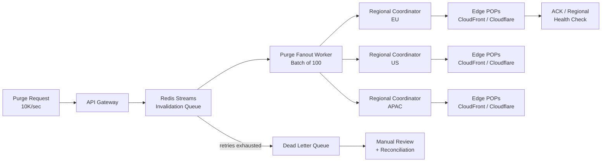

| Difficulty | Channel | Tags |
|---|---|---|
| intermediate | system-design | edge, caching, purging |

When a decade-old system starts holding back an entire network, you do not patch it — you rip it out and start over. That is exactly what Cloudflare did when its centralized cache purge coordinator became the bottleneck spanning 330+ cities and 120+ countries [1]. The rebuild slashed end-to-end global purge latency to under 150 milliseconds at P50 — a 90% improvement — and tripled throughput along the way [1]. This is the story of that journey, and what it teaches you about designing a multi-region CDN invalidation system that hits a 5-second propagation SLA under 10,000 invalidations per second.

---

> ### Real-World Case — Cloudflare
>
> Cloudflare's cache purge system was built over a decade ago for a small network with a centralized coordinator. As the network grew to 330+ cities across 120+ countries, that centralized design became the bottleneck: every purge was routed through a central 'core,' which limited throughput and made global propagation slow. They decided to rip it out and rebuild it from scratch.
>
> | | |
> |---|---|
> | **Challenge** | Design a multi-region CDN cache invalidation system that propagates a purge to every edge data center on the planet quickly and reliably at massive throughput, without a central coordinator becoming a scalability ceiling or single point of failure. |
> | **Solution** | They built 'Coreless Purge': purge requests land at the nearest data center, where a Purge Ingest worker validates and pre-filters them locally (dropping >50% of purges that target URLs the zone can't cache anyway). Regional Durable Object queues hold the authoritative purge backlog with per-data-center cursors for catch-up/replay, and per-region Purge Fanout workers broadcast purges to every data center instead of one central node doing all the fan-out. The cache key is computed once at the edge and broadcast, so no data center re-derives it. |
> | **Outcome** | End-to-end global purge latency dropped to under 150ms (P50) for purge by tag, hostname, and prefix — a 90% improvement since May 2022. The Purge Fanout worker alone cut end-to-end purge latency by 50% and increased throughput threefold. Purge by URL has run on the new system in production since July 2022 across 330 cities and 120+ countries. |
> | **Lesson** | The biggest wins came from two counterintuitive moves: eliminating the centralized coordinator entirely (regional queues + fan-out workers instead of a single core) and filtering out superfluous purges at the edge before broadcasting — the majority of purge traffic never needs to leave its local data center. |

---

## Hook — The 2:47 PM panic that every developer dreads

It's 2:47 PM on a Thursday. A pricing error just went live on your site, and a screenshot of it is being shared thousands of times per minute. You click "purge cache" — and then you wait. One edge refreshes. Then another. Meanwhile, the wrong version keeps serving in your biggest region. For most teams, that agonizing wait is the product experience: cache invalidation is the weakest link in the CDN chain, and everyone has a war story about stale content outliving the incident that created it.

Here is the uncomfortable truth you will discover the moment you build a global product: your cache is not one cache. It is thousands of them, spread across every continent, each holding a copy of your content that is only as fresh as your last successful invalidation. The stakes are brutal — stale prices, leaked data, broken features — and the clock starts the instant you hit deploy. If this feels like a worst-case scenario, you are not alone. The real question is whether your system can survive it. Cloudflare's answer to that question would end up rewriting the rules of the entire industry.

## Problem — Why purging a distributed cache is secretly a distributed-systems problem

Before you can fix propagation, you need to confront the paradox at the heart of caching: caches exist to make content faster by serving copies from locations physically close to the user, which means identical copies live everywhere at once [2]. That architecture is brilliant for latency and terrible for change. Every one of those copies is now a time bomb that must be invalidated in lockstep, or your users will keep hitting the old version.

Now multiply the difficulty by scale. You are asked to guarantee that content propagates globally in under 5 seconds while absorbing 10,000 invalidations per second, with 99.99% availability and strong consistency across regions. Every request can fan out to dozens or hundreds of URLs, every region coordinator can fail, and every provider API has its own rate limits and batch ceilings. Consequently, what looks like "delete these files from the cache" is actually a consensus problem: how do you make hundreds of independent, eventually-consistent systems agree that a piece of content is dead, within a latency budget that network partitions alone can exceed? [10]

Here is the plot twist: the hardest part is not the purge. It is the partial failure. Some regions succeed, one region's coordinator crashes mid-batch, and suddenly you are running a reconciliation process across the entire planet. Many developers assume invalidation is a fire-and-forget API call. It is not — it is a durable, retryable, and auditable workflow.

## Real-World Case — Cloudflare

Cloudflare's original purge system was built more than a decade ago, when the network was a fraction of its current size. Every purge request was routed through a single central coordinator — a "core" that made coordination simple as long as the world stayed small [1]. But the world did not stay small. As the network grew to 330+ cities across 120+ countries, that central core became a chokepoint: it capped throughput and made global propagation painfully slow, because every invalidation had to round-trip through one bottleneck before fanning out.

The team faced a familiar engineering decision: optimize the existing design, or start over. They chose to tear it out and rebuild from scratch [1]. The result was a radically decentralized architecture built around a Purge Fanout worker that pushes invalidation events to regional coordinators instead of routing everything through the center. The impact is stunning: end-to-end global purge latency dropped to under 150ms at P50 for purge by tag, hostname, and prefix — a 90% improvement since May 2022. The Purge Fanout worker alone cut end-to-end purge latency by 50% and increased throughput threefold, and purge-by-URL has been running on the new system in production since July 2022 across all 330 cities and 120+ countries [1].

If you take one thing from this story, let it be this: centralized coordination is a scaling ceiling wearing the disguise of a simplicity win. The moment your invalidation traffic can no longer fit through one pipe, the whole design needs to change.

## Deep Dive — The building blocks of a sub-150ms purge pipeline

Using the Cloudflare rebuild as a blueprint, you can assemble the core pieces of a multi-region purge system — and each piece solves a specific failure mode from the problem above.

**1. A durable invalidation queue.** The entry point accepts purge requests and immediately acknowledges them, decoupling the API from the work. Redis Streams with consumer groups are an excellent fit here: they give you ordered events, consumer acknowledgements, and a replay mechanism when a worker dies mid-batch [6]. This is what turns a flaky edge API into a reliable pipeline.

**2. Edge-compute fanout.** A fanout worker (a Cloudflare Worker in Cloudflare's case, or Lambda@Edge on CloudFront) reads from the queue and pushes events to regional coordinators in parallel, rather than sequentially [7]. This is the single biggest latency lever: it replaces a serial chain of API calls with a one-hop broadcast.

**3. Batch invalidation.** Instead of one API call per URL, you collapse many invalidation events into a single batch — 100 files per API call in the example below. Batching cuts API costs by roughly 90% and collapses thousands of requests into hundreds.

**4. TTL as a second line of defense.** Even the best purge system can fail, so you design for freshness at the HTTP layer. A short `Cache-Control: max-age=2, must-revalidate` on dynamic content means the worst-case stale window is measured in seconds, not hours [3][5]. This is a deliberate trade: you sacrifice a little cache hit rate to buy a massive safety margin on correctness.

| Approach | Propagation speed | Throughput | Operational cost | Failure blast radius |
|---|---|---|---|---|
| Centralized coordinator | Slow (single hop, serial) | Capped by one pipe | Simple to reason about | Entire global cache |
| Fanout with regional coordinators | Fast (parallel broadcast) | Scales horizontally | Needs per-region monitoring | Isolated to one region |

💡 **Insight:** Regional coordinators do more than cut latency — they shrink the blast radius. A failure in Europe no longer poisons the whole planet.

⚠️ **Watch out:** Provider APIs enforce rate limits. Blasting 10,000 invalidation requests per second at CloudFront will earn you a 429 and a support ticket. Always pair batch limits with exponential backoff and jitter.

**5. Failure handling that fails fast.** A circuit breaker opens after 5 consecutive failures to stop hammering an already-degraded provider, and every failed event lands in a dead letter queue for manual review or reconciliation. This combination — fail fast, retry with capped backoff, then escalate — is the difference between a blip and an outage.

**6. Cost optimization via smart targeting.** Purge only the regions that actually serve the affected content. Pattern-based purging with wildcards (`/products/*`) lets you invalidate a whole tree with one call instead of enumerating every file [9].

🔥 **Hot take:** Eventual consistency is not a bug in this system — it is the acceptance criteria. You cannot get synchronous strong consistency across 330 cities within a budget that makes sense, so you engineer the recovery path (reconciliation, TTL limits, revalidation) to make inconsistency bounded and survivable. The right question is never "can a region be stale?" but "for how long?"

## Workflow — The end-to-end journey of one purge request

Building on the components from the previous section, here is the complete flow that carries a single purge from your API to every edge node on the planet. Trace the path in the diagram below as you read:

1. **Ingest** — The API Gateway accepts the invalidation request (1,000 batched events per API call) and writes it to the Redis Streams queue, then returns a 202 immediately. The caller does not wait for global propagation.
2. **Fanout** — The Purge Fanout Worker reads the stream in batches of 100, deduplicates paths, and publishes the event to every regional coordinator in parallel.
3. **Coordinate** — Each regional coordinator translates the generic event into provider-specific API calls (CloudFront vs. Cloudflare differ in endpoints and payload shapes [7][9]).
4. **Propagate** — Edge POPs in each region receive the invalidation and evict the matched files; regional health checks verify the purge landed.
5. **Confirm or repair** — Successful events are acknowledged and removed from the stream. Events that exhaust their 3 retries move to the dead letter queue for manual review and eventual reconciliation.



The beauty of this design is that nothing in the critical path is serial. The fanout step converts one event into N parallel region-bound requests, which is precisely how Cloudflare collapsed end-to-end latency by 90% [1]. Notice also where the failure handling lives: not at the API boundary, but deep in the pipeline where retries, backoffs, and dead-lettering actually protect you.

## Code Example — A batch-purge consumer with backoff and a circuit breaker

Time to get hands-on. The snippet below is a worker that consumes invalidation events from a Redis Stream, batches them into Cloudflare's purge API calls, retries with exponential backoff, and opens a circuit breaker after consecutive failures [9]. It is the operational heart of the architecture you just traced: durable queue in, provider API out, failure handling in between.

```typescript
import Redis from "ioredis";

interface PurgeEvent {
  paths: string[]; // e.g. ["/products/*", "/blog/2026/*"]
  regions?: string[]; // optional: target only affected regions
}

const redis = new Redis(process.env.REDIS_URL!);
const QUEUE = "cache:purge:stream";
const GROUP = "purge-workers";
const BATCH_SIZE = 100; // Cloudflare batch API limit

// Exponential backoff: 200ms -> 400ms -> 800ms, capped at 800ms
const backoff = (attempt: number) => Math.min(200 * 2 ** attempt, 800);

async function purgeBatch(events: PurgeEvent[]): Promise<void> {
  // Deduplicate paths and cap at 100 files per API call
  const files = [...new Set(events.flatMap((e) => e.paths))].slice(0, BATCH_SIZE);

  const res = await fetch(
    "https://api.cloudflare.com/client/v4/zones/{zone_id}/purge_cache",
    {
      method: "POST",
      headers: {
        Authorization: `Bearer ${process.env.CLOUDFLARE_TOKEN}`,
        "Content-Type": "application/json",
      },
      body: JSON.stringify({ files }),
    }
  );

  if (!res.ok) throw new Error(`Purge rejected: ${res.status}`);
}

async function consumeLoop(): Promise<void> {
  let failures = 0;

  while (true) {
    // Read a batch from the stream via the consumer group
    const batch = await redis.xreadgroup(
      "GROUP", GROUP, `worker-${process.pid}`,
      "COUNT", BATCH_SIZE,
      "STREAMS", QUEUE, ">"
    );

    if (!batch) {
      await new Promise((r) => setTimeout(r, 100)); // idle poll
      continue;
    }

    for (const [, entries] of batch) {
      const ids = entries.map(([id]) => id);
      const events = entries.map(([, fields]) =>
        JSON.parse(fields[1]) as PurgeEvent
      );

      try {
        await purgeBatch(events);
        await redis.xack(QUEUE, GROUP, ...ids); // ack only on success
        failures = 0; // reset the breaker on success
      } catch (err) {
        // Circuit breaker: after 5 consecutive failures, back off entirely
        if (++failures >= 5) {
          console.error("Circuit open — pausing consumer");
          await new Promise((r) => setTimeout(r, backoff(failures)));
          failures = 0;
        }
      }
    }
  }
}

consumeLoop();
```

Here is what each piece does and why it matters:

- **`xreadgroup` with `GROUP`/`consumer`** — This is the Redis Streams consumer-group pattern: multiple workers can consume the same stream without double-processing events, and unacknowledged messages are redelivered if a worker dies mid-batch [6]. That durability is what lets you return a 202 to the API caller and still guarantee the purge eventually lands.
- **`purgeBatch` with dedupe and slice** — Collapsing many events into at most 100 unique files per API call is the cost lever: it cuts API calls by an order of magnitude and respects the provider's batch ceiling [9].
- **`xack` only on success** — This is the retry contract. An unacknowledged event stays in the stream and is reprocessed, so a transient 429 from the provider becomes a retry, not a silent data loss.
- **The circuit breaker** — After 5 consecutive failures, the worker pauses instead of hammering a degraded provider. Backing off and resetting prevents you from turning a regional blip into a self-inflicted rate-limit outage.

⚠️ **Watch out:** Unbounded retries will burn your API budget and your patience. Pair the `max-attempts = 3` retry loop with exponential backoff and jitter, and route anything that still fails into the dead letter queue — that is the manual-review path from the workflow diagram.

## Lessons Learned — Battle scars and the playbook for your next purge

Every war story ends with scars, and cache invalidation leaves plenty. Here is what the Cloudflare rebuild and the patterns above should change about how you think tomorrow:

- **Centralization is a ceiling, not a feature.** Any coordinator that becomes a single hop for all traffic is a future bottleneck. Design for fanout from day one, even when your network is tiny. Cloudflare's decade-old "simple" core became the very thing they had to delete [1].
- **The TTL is your parachute.** A 2-second `max-age` with `must-revalidate` means even a completely failed purge only serves stale content for two seconds [3]. Short TTLs for dynamic content are cheap insurance; the cost of the extra origin hits is a rounding error compared to the cost of a leak [5]. Consider `stale-while-revalidate` to serve stale content in the background while revalidating, trading a little freshness for resilience [4].
- **Batch everything.** 100 files per API call instead of 100 calls is a 99% reduction in API requests. Deduplicate, collapse, and target only the affected regions — most invalidation "spikes" are really just poor batching in disguise [9].
- **Plan for partial failure as the default state.** Regions will go down mid-batch, provider APIs will rate-limit you, and reconciliation will be your most important background job. If your design cannot answer "what happens when one region never got the purge?", it is not done [10].
- **Measure the right thing.** Cloudflare optimized for end-to-end P50 purge latency and throughput, not API success counts [1]. Instrument regional propagation and stale-content windows; those numbers are what your SLA actually means.

| Common mistake | The fix |
|---|---|
| Purging by URL for every change | Use pattern/tag-based purging with wildcards [9] |
| Unlimited synchronous retries | Exponential backoff with jitter, max 3 attempts |
| One global cache config | Regional `Cache-Control` headers per content class |
| Ignoring provider rate limits | Batch sizing + circuit breaker before the API call |

Do not wait for a 2:47 PM panic to design this. Start by making your dynamic content's TTL short and explicit, then add batching, then build the queue. Each layer you add shrinks the window in which a bad purge can hurt you — and that window is the only thing standing between you and an incident post that starts with "unexpectedly, cached content was served."

---

## Global Cache Purge Pipeline


<details>
<summary><strong>Original Interview Question</strong></summary>

**Q:** How would you design a multi-region CDN cache purging system that guarantees content propagation within 5 seconds while handling 10,000 concurrent invalidations per second?

**A:** Implement Cloudflare API + AWS CloudFront with distributed invalidation queue, edge compute coordination, and 2-second TTL. Use batch invalidation, exponential backoff, and regional cache headers for 5-second SLA.

</details>

## Conclusion

Back to that Thursday afternoon. With the Cloudflare blueprint in hand, the panic of a global purge is replaced by something far more boring — and far better: a durable queue, a fanout worker, batched API calls, a short TTL, and a circuit breaker that keeps one bad region from taking down the planet. The moral is simple: cache invalidation is not a delete operation, it is a distributed systems workflow, and the teams that treat it that way are the ones who sleep through the incident. Tomorrow, do three things: set a 2-second `max-age` with `must-revalidate` on your dynamic content, add batch deduplication to your purge path, and measure your real propagation latency. Share this with your team and ask them the one question that matters: how long can your stale content live before someone notices — and can you survive that window?

---

## References

1. [Cloudflare incident report](https://blog.cloudflare.com/rethinking-cache-purge-architecture/) — blog
2. [MDN — HTTP caching](https://developer.mozilla.org/en-US/docs/Web/HTTP/Caching) — documentation
3. [MDN — Cache-Control header](https://developer.mozilla.org/en-US/docs/Web/HTTP/Headers/Cache-Control) — documentation
4. [RFC 5861 — HTTP Cache-Control Extensions for Stale Content](https://datatracker.ietf.org/doc/html/rfc5861) — documentation
5. [RFC 9111 — HTTP Caching](https://datatracker.ietf.org/doc/html/rfc9111) — documentation
6. [Redis — Streams data type](https://redis.io/docs/data-types/streams/) — documentation
7. [AWS CloudFront — Invalidating Files](https://docs.aws.amazon.com/AmazonCloudFront/latest/DeveloperGuide/Invalidation.html) — documentation
8. [Wikipedia — Content delivery network](https://en.wikipedia.org/wiki/Content_delivery_network) — article
9. [Cloudflare — Purge cached content](https://developers.cloudflare.com/cache/how-to/purge-cache/) — documentation
10. [Wikipedia — Cache invalidation](https://en.wikipedia.org/wiki/Cache_invalidation) — article

---

**Author:** Satishkumar Dhule — [GitHub](https://github.com/satishkumar-dhule) · [LinkedIn](https://linkedin.com/in/satishkumar-dhule) · [Website](https://satishkumar-dhule.github.io)
