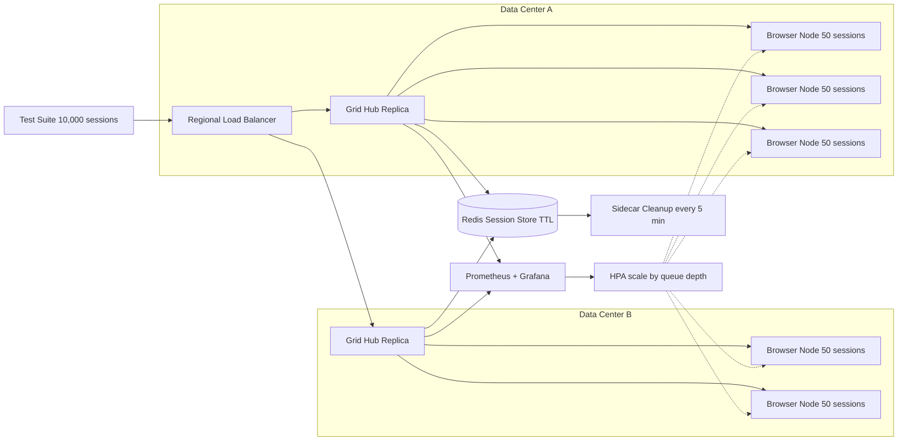

| Difficulty | Channel | Tags |
|---|---|---|
| advanced | system-design | selenium, webdriver, grid |

Pond5's Selenium Grid began life as a single server running a small test suite — no orchestration, no autoscaling, no drama [1]. It worked, until test coverage grew and the team kept stacking on Windows EC2 servers that sat idle, resisted configuration, and kept crashing into resource ceilings that slowed the entire suite. The fix was not more machines; it was a smarter architecture — and the result was a 53% drop in test run time and a roughly 60% cheaper infrastructure bill [1]. This is the journey from fragile test infrastructure to a grid engineered for 10,000 concurrent sessions, 99.9% uptime, and zero memory leaks.

---

> ### Real-World Case — Pond5
>
> Pond5's Selenium Grid began as a single server running a small suite, but as test coverage grew they kept adding Windows EC2 servers to the grid. These servers were often idle, configuration and maintenance were a headache, and the team kept hitting resource ceilings that slowed their growing test suite.
>
> | | |
> |---|---|
> | **Challenge** | Manual scale-out with pre-provisioned Windows EC2 nodes meant paying for idle capacity, a ~60% higher monthly bill, long test runtimes, and repeated resource ceilings — no clean path to add capacity or manage nodes as the suite scaled. |
> | **Solution** | Re-architected the grid onto AWS Fargate (ECS): the Selenium Hub sits behind an AWS ELB so it can be replaced without reconfiguring the test endpoint, registers itself in AWS Cloud Map for browser services to reach it directly on port 4444, and per-browser ECS services auto-scale using step-scaling CloudWatch alarms. Deployed via Terraform + Jenkins with a PR-based config-change flow. |
> | **Outcome** | Test suite run time dropped 53% (mostly from removing resource constraints), the Fargate monthly bill is ~60% cheaper than the Windows EC2 predecessor, and failure rate decreased — more tests, faster, for less than half the cost. |
> | **Lesson** | Pre-provisioned grid nodes waste money and create bottlenecks. Container-based on-demand scaling (Fargate + step-scaling alarms + service discovery) removes resource ceilings and cuts cost and runtime simultaneously while simplifying ops with infrastructure-as-code. |

---

## Hook — It is 3 a.m., and the grid just went dark

Picture this: it is 3 a.m., and the pager lights up because 'session not created' errors are piling up in the queue. The CI pipeline is red, the release train is parked, and the only thing standing between your team and shipping is a grid that ran out of memory again. This is the exact trajectory Pond5 was on before they rebuilt their grid — the single server that quietly grew into an unmanageable fleet [1].

The stakes could not be higher: every minute the grid stalls, every test that times out, is a deploy that slips and a feature that ships late. Most teams respond to that fear by buying more hardware. The journey ahead shows why that instinct is exactly wrong — and what to do instead.

## Problem — Why grids break the moment they need to scale

Building on that moment, consider why grids break in the first place. A single-server grid handles a handful of suites fine — until it does not. Each browser session spawns real processes: a WebDriver agent, a browser binary, a renderer tree, all holding onto memory. When sessions are not terminated properly, the memory is never released, and a leak that adds a few megabytes per session slowly turns a healthy server into an OOM victim. This is a hazard as old as browser automation itself, which has plagued Selenium-based infrastructure since the framework first shipped [7].

Many developers respond to that pain by adding more servers to the fleet. It feels like the obvious answer: more machines, more capacity. But a static fleet has three hidden costs:

- Idle nodes still burn budget — a fleet sized for peak load sits mostly unused, exactly the problem Pond5 hit with their Windows EC2 boxes [1].
- Configuration drift multiplies — each node hand-patched and differently configured becomes 'works on this node, not on that one.'
- Failure domains grow — one misbehaving node can drag the whole session scheduler down with it.

⚠️ Watch Out: the leak does not announce itself. It compounds silently over weeks, and it always surfaces during peak hours. So the real problem is not 'not enough machines.' The real problem is lifecycle: sessions that never end, nodes that never restart, and memory that is never reclaimed.

## Real-World Case — Pond5, or why more machines was the wrong answer

Which leads to one of the most instructive stories in test infrastructure: Pond5's grid migration [1]. Pond5, a stock footage marketplace, started the way most teams do — a single server running a small suite. It worked, and then it stopped working. As test coverage grew, the team kept adding Windows EC2 servers to the grid, hoping capacity would solve what was actually a lifecycle problem. Instead, they found servers that were often idle, configuration and maintenance headaches that consumed their days, and resource ceilings that slowed the entire growing test suite [1].

The turning point came when they stopped scaling horizontally and started scaling intelligently: they moved the grid onto AWS Fargate, a serverless compute platform where containers run without managing the underlying instances [9]. The results were dramatic:

- Test suite run time dropped 53%, mostly from removing resource constraints.
- The Fargate monthly bill came in roughly 60% cheaper than the Windows EC2 setup.
- Failure rate decreased — more tests, faster, for less than half the cost [1].

🔥 Hot Take: the counterintuitive lesson is that the win did not come from adding capacity; it came from removing constraints. Pond5's grid got faster and cheaper because resources were no longer stuck in static, idle, hard-to-configure boxes. This leads to the obvious question: what does the same architecture look like when the target is not a handful of parallel suites but 10,000 concurrent sessions? For that, you need the deep dive.

## Deep Dive — The anatomy of a grid that survives 10,000 concurrent sessions

Scaling from Pond5's fleet to 10,000 concurrent sessions is not a matter of multiplying servers; it is a matter of redesigning how sessions are born, tracked, and killed. The pattern to build on is Selenium Grid's classic hub-and-node model, where a central hub distributes test work to registered browser nodes [2][8]. To hold 10,000 sessions, that pattern needs four upgrades: managed state, bounded resources, observable health, and automated failure recovery.

First, session state moves out of memory and into Redis. Every session key carries a TTL, so a hung browser session cannot live forever — the store itself enforces the lifecycle. Second, resources become explicit: each node pod gets a 2 GB RAM / 1 CPU limit, and the cluster autoscales based on queue depth rather than peak guesses [4]. The math is worth doing up front. At 50 sessions per node, 10,000 sessions means at least 200 nodes; at 2 GB each that is 400 GB baseline, plus a 30% headroom buffer, for a 520 GB cluster. Budgeting that before building avoids the resource-ceiling trap Pond5 hit [1].

💡 Insight: memory is the real design constraint. A browser node does not leak because it is broken; it leaks because sessions are never cleaned up. So the design attacks the leak from three sides at once:

- Prevention: weekly rolling restarts, memory alerts at 80%, and garbage-collection tuning for the JVM running each node.
- Cleanup: Kubernetes init containers remove stale Docker volumes, and a background scan expires Redis keys every 5 minutes.
- Monitoring: Prometheus and Grafana track memory trends and session-duration metrics so a leak is visible in charts before it becomes an outage.

Then comes the nervous system: load balancing and health. Nodes report a /status endpoint every 10 seconds, and a node is removed after three consecutive failures [6]. A circuit breaker isolates a failing node for a 30-second recovery window so one bad container cannot cascade. The trade-offs across scaling strategies are worth seeing side by side:

| Strategy | Cost profile | Maintenance | Memory isolation | Failure domain |
| --- | --- | --- | --- | --- |
| Single server | Cheapest, flat | One box to babysit | None | Total — one leak kills everything |
| Static fleet (EC2/VM) | Peaks paid all day | Drift city, per-node patching | Partial | A few big machines |
| Auto-scaling K8s | Pay for what runs | Managed by automation | Per-pod, enforced by limits | One small node at a time |

⚠️ Watch Out: even a perfect design must handle the edge cases where grids die. Network partitions are handled with leader election to prevent split-brain, where two hubs think they own the same sessions. Pod Disruption Budgets guarantee a minimum of 85% capacity survives rolling maintenance [5]. And new node versions ship through canary deployments with traffic splitting, so a zero-day regression only affects a few sessions, not the whole fleet. That is the complete system — and here is how you build it, step by step.

## Workflow — Seven steps to a self-healing grid

Armed with the architecture, the build order matters. Treat these seven steps like a recipe — skip one and the whole dish falls apart. Figure 1 shows the full flow, and each step maps onto it.

Step 1 — Containerize the grid. Package the hub and browser nodes as images with declared CPU and memory limits. There is no autoscaling without containers [2].

Step 2 — Deploy nodes as StatefulSets across multiple availability zones. StatefulSets give stable identities, which monitoring and health checks depend on [3].

Step 3 — Attach the Redis session store. Every session gets a key with a TTL; the store becomes the single source of truth for lifecycle.

Step 4 — Add Prometheus and Grafana. Track memory per node, queue depth, and session duration from day one — retrofitting observability later is painful.

Step 5 — Wire health checks and circuit breakers. The /status probe every 10 seconds, with node removal after three failures, turns a crash into a non-event [6].

Step 6 — Enable autoscaling on queue depth. Let the cluster add nodes when the queue grows and retire idle ones when it shrinks [4].

Step 7 — Plan for failure. Add Pod Disruption Budgets, leader election, and canary deploys before you need them, not after [5].

The diagram below tells the whole story: requests flow from the pipeline through regional load balancers to hubs, each hub fans out to a pool of browser nodes, and Redis, Prometheus, and the cleanup sidecar keep the loop tight.

🎯 Key Point: the workflow's power is that every component is replaceable. A node dies; the scheduler sees the health check fail and routes around it. A hub dies; leader election promotes a replica. Nothing in this design is a single point of failure — which is exactly what 99.9% uptime requires.

## Code Example — A session lifecycle manager that refuses to leak

All the architecture in the world comes down to one thing: making sure sessions die on time. Here is a minimal, production-shaped lifecycle manager in Python that shows the three mechanisms that matter — TTL enforcement, circuit breaking, and periodic cleanup. It uses Redis for the session store and the standard library's concurrent.futures for concurrent health checks [10].

## Lessons Learned — What 53% faster and 60% cheaper actually teaches you

Every pattern in this journey traces back to Pond5's experience, so the takeaways should be framed the same way: as principles, not recipes [1].

- Treat lifecycle as the product, not the hardware. The grid's job is to create sessions and, crucially, to end them. TTLs, sweeps, and restarts are not chores; they are the feature.
- Idle capacity is the most expensive capacity. Pond5's Windows servers sat idle and still billed [1]. Autoscaling on queue depth means paying for the grid only when the grid is working.
- Automate everything that can drift. Hand-configured nodes are the origin of most 'works on this node' grid bugs. Containers plus infrastructure-as-code make configuration an artifact, not a memory.
- Design for failure, then rehearse it. Health checks every 10 seconds, removal after three failures, circuit breakers, and Pod Disruption Budgets turn 'the grid crashed' into 'a node rotated out' [5][6].
- Do the arithmetic before you build. 10,000 sessions, 50 per node, 2 GB each, 30% headroom: 200 nodes, 520 GB. Numbers like that make architecture decisions obvious before a single line of orchestration is written.

Battle scars from teams who have lived this:

- Skipping the 80% memory alert means finding the leak in the outage, not in the chart.
- Forgetting the TTL means a hung session holds a slot and its RAM indefinitely — Redis cannot clean what was never given an expiry.
- Rolling out a new node image to the whole fleet at once means one zero-day regression takes down the grid — the same failure Pond5 was trying to escape [1].

🎯 Key Point: start tomorrow by adding three things to your current grid — a TTL on every session, a /status health check the scheduler actually trusts, and an alert at 80% memory. Those three cheap changes prevent most of the outages this article describes.

---

## Grid Request Flow

<strong>Original Interview Question</strong>

**Q:** Design a scalable Selenium Grid architecture to handle 10,000 concurrent test sessions with 99.9% uptime, ensuring zero memory leaks through automatic session lifecycle management, real-time monitoring, and graceful node failure recovery across multiple data centers?

**A:** Deploy Kubernetes cluster with auto-scaling node pools, Redis session store with TTL policies, Prometheus metrics for memory monitoring, circuit breakers for node isolation, and sidecar containers for session cleanup. Implement health checks, resource quotas, and rolling updates.

## Conclusion

The story began with Pond5's single server growing into an unmanageable fleet — and ended with a grid that runs 53% faster at 60% lower cost [1]. Along the way, the lesson was consistent: scaling a test grid to 10,000 concurrent sessions with 99.9% uptime is not about buying more machines. It is about giving every session a lifecycle, every node a health check, and every failure a graceful exit. The memorable insight to carry to your team: a grid is not a box you buy; it is a system you operate — and systems that are designed for failure rarely need to fail. So tonight, when the grid hums quietly through another thousand sessions, that is not luck. That is architecture [1].

---

## References

1. [Pond5 incident report](https://medium.com/@pond5-technology/reducing-costs-and-resource-bottlenecks-with-selenium-grid-on-aws-fargate-d8e5b853389f) — article
2. [SeleniumHQ Selenium repository](https://github.com/SeleniumHQ/selenium) — documentation
3. [Kubernetes StatefulSets](https://kubernetes.io/docs/concepts/workloads/controllers/statefulset/) — documentation
4. [Kubernetes Horizontal Pod Autoscaling](https://kubernetes.io/docs/tasks/run-application/horizontal-pod-autoscale/) — documentation
5. [Kubernetes Pod Disruption Budgets](https://kubernetes.io/docs/concepts/workloads/pods/disruptions/) — documentation
6. [Kubernetes Liveness, Readiness and Startup Probes](https://kubernetes.io/docs/tasks/configure-pod-container/configure-liveness-readiness-startup-probes/) — documentation
7. [Selenium (software) on Wikipedia](https://en.wikipedia.org/wiki/Selenium_(software)) — documentation
8. [RFC 6455 - The WebSocket Protocol](https://datatracker.ietf.org/doc/html/rfc6455) — paper
9. [AWS Fargate documentation](https://docs.aws.amazon.com/AmazonECS/latest/developerguide/what-is-fargate.html) — documentation
10. [Python concurrent.futures documentation](https://docs.python.org/3/library/concurrent.futures.html) — documentation

---

**Author:** Satishkumar Dhule — [GitHub](https://github.com/satishkumar-dhule) · [LinkedIn](https://linkedin.com/in/satishkumar-dhule) · [Website](https://satishkumar-dhule.github.io)
