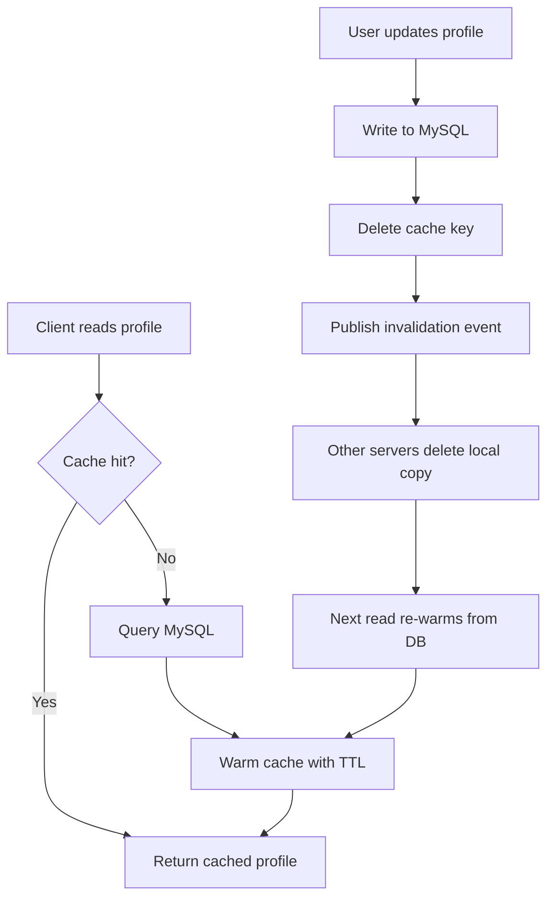

| Difficulty | Channel | Tags |
|---|---|---|
| beginner | backend | redis, memcached, cache-invalidation |

By 2013, Facebook was quietly running one of the largest distributed caches the world has ever seen — memcached clusters holding trillions of items and serving over a billion reads per second to deliver profiles, feeds, and messages for more than a billion users [1]. The cache was so fast that it effectively became the primary data store, which turned a simple question into Facebook's hardest operational problem: when a user updates their profile, how do you stop the cache from serving stale data? That same question is now your interview question, your ticket, and eventually your 2 a.m. pager alert. The good news is that Facebook already paid for these lessons — and the journey from that paper to your profile service is shorter than you think.

---

> ### Real-World Case — Facebook
>
> By 2013 Facebook ran one of the largest distributed caches in the world — memcached clusters holding trillions of items and serving billions of reads per second to deliver user profiles, feeds, and messages for over a billion users. As the cache became effectively the primary data store, keeping it consistent with the underlying MySQL databases across thousands of machines became the hardest operational problem.
>
> | | |
> |---|---|
> | **Challenge** | How to invalidate cached data reliably at massive scale. Application-level invalidation required coordinating across many web/application servers, and naive deletes created 'miss storms' (thundering herds) when a hot key like a popular user profile was invalidated, plus 'stale sets' when out-of-order cache writes resurrected old values. |
> | **Solution** | Instead of coordinating invalidations from the application layer or relying on TTLs alone, Facebook built 'mcsqueal' — a system that taps MySQL's commit-log (binlog) replication stream and issues cache deletes the moment a row write commits, making invalidation consistent with database state. They also added a lease mechanism: a client must present a token obtained before a cache miss when writing the value back, which eliminates stale sets and lets the cache withhold leases during miss storms to shed load. |
> | **Outcome** | The system sustained billions of requests per second (over 1 billion reads/sec) with trillions of cached items, and the lease mechanism drove stale sets to negligible levels while preventing thundering-herd outages when popular data changed. The paper is one of the most widely cited systems papers and is still a blueprint for sharded SQL + cache architectures. |
> | **Lesson** | Cache invalidation doesn't need pub/sub (Redis) — at Facebook's scale the winning pattern was to observe the database's own change/replication stream and push invalidations from there. They chose simple memcached over feature-rich alternatives and compensated with a well-engineered invalidation pipeline, proving that simplicity plus a reliable change stream beats coordinated application-level invalidation. |

---

## Hook — One Billion Reads Per Second, One Wrong Cached Value

You have felt this moment. The deploy goes out, a user edits their bio, and for the next ten minutes every friend who visits sees the old one. A stale profile is embarrassing; a stale price is a lawsuit. Now multiply that single blip by a billion reads per second and trillions of cached items, and you begin to understand the scale of what Facebook faced in 2013 [1].

This is not really a story about memcached versus Redis. It is a story about trust — about building a system fast enough that no one notices it is also lying. By the end of this post, you will know exactly how to keep that promise in your own service. Buckle up, because the first plot twist is that deleting data is often safer than updating it.

## Problem — Your Cache Will Go Stale (and Users Will Notice)

Every caching decision starts with a lie you tell yourself: this data does not change very often. That is why you cache it. Then a user edits their profile photo and, suddenly, your carefully tuned system is serving yesterday's face alongside today's timeline. Here is the tension that makes cache invalidation hard: the database is the source of truth, but the cache is what users actually see [4].

Developers discover this on day one and keep rediscovering it at scale, because the failure modes are deceptively quiet. No exception is thrown, no error is logged — the system simply answers with data that is only 'recently true.' Then comes the second plot twist: the thundering herd. When a popular key expires and a thousand requests miss at once, they all queue up to hit the database in the same instant, and the cache you built to protect the database becomes the thing that destroys it. Consequently, the problem is not just keeping data fresh; it is keeping data fresh without turning every cache miss into a stampede.

## Real-World Case — When the Cache Became the Database (Facebook)

In 2013, Facebook published the paper 'Scaling Memcache at Facebook,' and it remains one of the most widely cited systems papers of the decade [1]. By then, the cache was doing more than accelerating reads: it had effectively become the primary data store, with MySQL playing catch-up underneath thousands of machines. Three lessons from that paper still function as a blueprint for any sharded SQL plus cache architecture.

First, the team introduced a lease mechanism: before a request is allowed to fill a cache miss, it must obtain a lease, so only one request writes the hot value. Stale sets dropped to negligible levels, and thundering-herd outages disappeared when popular data changed [1]. Second, they accepted that perfect consistency was not the goal — instead, they built an invalidation system that propagated delete commands across clusters, keeping transient staleness down to milliseconds instead of minutes. Third, they separated caches by workload: profile caches, user-identity caches, and count caches each got dedicated pools. The result sustained over a billion reads per second with trillions of cached items, numbers that still dwarf most production systems today [1].

When a company with more machines than most data centers chose deletion and leases over clever overwrites, that is a signal worth taking seriously.

## Deep Dive — Write-Through, Cache-Aside, and the Redis Versus Memcached Decision

Now that you have seen the scale, shrink it down to your service. There are two classic caching patterns, and the choice between them shapes everything else. With cache-aside, reads check the cache first, miss, then load from the database and warm the cache — the default for most teams because reads stay fast and writes stay simple [5]. With write-through, every update writes to both the database and the cache, keeping them consistent by construction.

But here is the plot twist from the hook: overwriting the cache on every write is not the same as invalidating it. Facebook's insight — and the reason you should delete keys instead of overwriting them — is that a delete is unambiguous. The next read re-warms from the source of truth, while an overwrite can race with an in-flight read and clobber newer data [1]. Whatever pattern you pick, always set a TTL. A TTL is your escape hatch: it guarantees that even if every invalidation fails, the lie expires. For user profiles, 5 to 30 minutes is a sane range — long enough to be useful, short enough to limit damage.

| Aspect | Redis | Memcached |
|---|---|---|
| Invalidation | Pub/sub broadcasts deletes across servers automatically [6] | Manual coordination — every app server must know which keys to delete |
| Persistence | Optional RDB/AOF snapshots; data survives restarts [3] | In-memory only; a restart is a full cache flush [2] |
| Data types | Strings, hashes, sets, sorted sets, streams | Simple key-value strings |
| Memory overhead | Higher per key due to richer structures | Lower — the leanest pure key-value cache [2] |
| Scaling | Cluster mode shards keys with built-in replication [3] | Distributed pools with famously simple consistent hashing [2] |
| When to choose | Complex invalidation, durability, pub/sub | Pure cache workloads, max throughput per byte of RAM |

Here is the nuance most interview answers miss: both systems are excellent at caching, so the decision is rarely about raw speed. It is about what you need when everything goes wrong. If your service must survive a cache restart without a cold thundering herd, Redis's persistence [3] earns its memory overhead. If your workload is a pure key-value cache and you want the lowest overhead per item, Memcached's simplicity is a feature, not a limitation [2].

The clever part is that Memcached can still get distributed invalidation — you just have to build the coordination layer yourself, which is precisely the work Facebook did across thousands of nodes [1]. Redis hands you pub/sub for that job, but pub/sub is a broadcast, not a guarantee: messages are fire-and-forget, so you still need a TTL backstop [6].

💡 **Insight:** The fastest read is the one that never hits the database — but the safest read is the one that expires.

⚠️ **Watch Out:** Pub/sub messages are not durable. If a subscriber is offline when you publish, that invalidation is gone forever — the TTL is your only guaranteed cleanup [6].

🔥 **Hot Take:** Stop overwriting cache values on write. Delete them, and let the next read decide. Facebook's lease-plus-delete design proved this at planetary scale [1].

🎯 **Key Point:** A TTL is not an alternative to invalidation — it is the safety net underneath it.

## Workflow — The Five-Step Invalidation Playbook

Building on the deep dive, here is the step-by-step flow you can copy for a profile service — the same shape Facebook used, minus the twenty thousand servers. The diagram below tells the story visually: reads take the cache-aside path, writes take the write-through path, and the two meet at a single delete command.

1. **Read path (cache-aside):** check the cache for the profile key. On a hit, return it immediately — no database involved.
2. **On a miss,** query the database and warm the cache with a TTL. Never write a key without an expiry.
3. **Write path (write-through):** update the database first, because it remains the source of truth [4].
4. **Delete the cache key. Do not overwrite it.** A delete removes ambiguity and lets the next read re-warm with fresh data [1].
5. **Broadcast the invalidation.** With Redis, publish the user_id to a channel that every app server subscribes to [6]. With Memcached, you own this coordination — design a message bus or registry early, before the fleet grows.

Reference the diagram — **Cache Invalidation Flow** — which captures this entire playbook in one picture. The visual thread to follow: the read path hugs the left side, the write path on the right, and both collapse into the delete that keeps the system honest.

## Code Example — A Profile Service That Never Serves Lies

Enough theory — this is where the playbook becomes code. The Python service below implements the exact flow from the workflow section: cache-aside reads, write-through updates, a delete instead of an overwrite, and Redis pub/sub for distributed invalidation. You can run this pattern with any language; the shape of the logic matters more than the syntax.

```python
import json
import redis

r = redis.Redis(host='cache', port=6379, decode_responses=True)

PROFILE_TTL = 600  # 10 minutes: profiles change rarely
KEY_PREFIX = 'profile:'
UPDATE_CHANNEL = 'profile-updates'

def get_profile(user_id: str) -> dict:
    # Cache-aside read: serve from cache, warm on miss
    key = KEY_PREFIX + user_id
    cached = r.get(key)  # fast path - no DB round-trip
    if cached:
        return json.loads(cached)

    profile = load_from_db(user_id)  # slow path - MySQL is the source of truth
    r.set(key, json.dumps(profile), ex=PROFILE_TTL)  # TTL = safety net
    return profile

def update_profile(user_id: str, changes: dict) -> dict:
    # Write-through update: DB first, then invalidate, never overwrite
    profile = apply_changes_to_db(user_id, changes)  # 1. commit to the DB

    r.delete(KEY_PREFIX + user_id)  # 2. delete the key instead of updating it

    # 3. broadcast so every app server drops its local copy too
    r.publish(UPDATE_CHANNEL, json.dumps({'user_id': user_id}))

    # 4. re-warm the cache so the very next read stays fast
    r.set(KEY_PREFIX + user_id, json.dumps(profile), ex=PROFILE_TTL)
    return profile

def subscriber_loop() -> None:
    # Runs on every app server: applies remote invalidations locally
    pubsub = r.pubsub()
    pubsub.subscribe(UPDATE_CHANNEL)
    for message in pubsub.listen():
        if message['type'] != 'message':
            continue
        user_id = json.loads(message['data'])['user_id']
        r.delete(KEY_PREFIX + user_id)  # drop the stale copy immediately
```

The snippet shows the full loop in about forty lines. `get_profile` is the cache-aside read: one fast cache call on the happy path, and only a cache miss touches the database — that single branching decision is what lets the hot 90% of reads complete in under a millisecond. `update_profile` is where the discipline lives: the database commit comes first, so the cache can never be newer than the truth [4]. Then the key is deleted rather than overwritten, because an overwrite racing with a concurrent read can resurrect stale data — the exact failure Facebook's lease mechanism existed to prevent [1].

The `publish` call is Redis's answer to distributed invalidation: every app server running `subscriber_loop` hears about the change and deletes its local copy, closing the window of stale reads across the fleet [6]. The final re-warm call is a small optimization — write-through repopulates the cache so the next reader does not pay a miss penalty. And every `set` carries a TTL, the last line of defense if any link in this chain quietly fails.

## Lessons Learned — What the Journey Actually Teaches

The story began with trillions of cached items and a billion reads per second, and it ends with a handful of principles that fit in a single code review. Here is what the journey actually teaches.

- **Delete, don't overwrite.** An invalidation that removes a key can never clobber newer data — Facebook proved this at planetary scale [1].
- **TTLs are your parachute.** Every cache entry must expire, because invalidation is best-effort even with pub/sub [6].
- **The database stays the source of truth.** Write to it first, always [4][5].
- **Monitor before you tune.** Track cache hit rates, miss latency, and eviction counts — a 90% hit rate with a stale-profile bug is a consistency problem, not a performance problem.
- **Rehearse the cold start.** When the cache empties overnight, your database must survive the herd — that is the moment leases and rate limiting earn their keep [1].

⚠️ **Watch Out — three failure modes that bite teams:**
- **The silent overwrite:** updating the cache on write and racing an in-flight read, ending up with data that never existed on disk.
- **The bare pub/sub:** publishing invalidations to Redis but scaling out app servers that do not subscribe — the new nodes serve stale data with a smile.
- **The no-TTL golden key:** a 'hot' profile cached forever; the first edit never propagates, and every user sees a ghost profile.

So what should you do tomorrow? Pick one service that caches user data. If any key lacks a TTL, add one. Then change the update path to delete-then-re-warm, and watch the hit-rate dashboard for a week. That single change removes the worst failure modes this post describes — and it is small enough for one developer to ship before lunch.

---

## Cache Invalidation Flow



<details>
<summary><strong>Original Interview Question</strong></summary>

**Q:** You're building a user profile service that caches frequently accessed profiles. How would you implement cache invalidation when a user updates their profile, and what trade-offs would you consider between Redis and Memcached?

**A:** Implement write-through caching with TTL-based expiration. On profile update, invalidate the cache by deleting the key and writing new data to both the database and cache. Redis offers pub/sub for automatic distributed invalidation, while Memcached requires manual coordination across nodes.

</details>

## Conclusion

It started with a billion reads per second and trillions of cached items — Facebook's quiet lesson that a cache can grow until it becomes the database, and that keeping the two in agreement is the real engineering [1]. The journey from that paper to your profile service is shorter than it looks: write to the source of truth first, delete the key instead of trusting it, let a TTL be your safety net, and broadcast the change to every node that could be holding a stale copy [5][6]. Here is the memorable insight to share with your team: a cache is a bet that data changes slowly, and invalidation is how you hedge that bet. Ship the delete, set the TTL, and actually sleep through the night.

---

## References

1. [Facebook incident report](https://www.usenix.org/conference/nsdi13/technical-sessions/presentation/nishtala) — article
2. [Memcached - Wikipedia](https://en.wikipedia.org/wiki/Memcached) — documentation
3. [Redis - Wikipedia](https://en.wikipedia.org/wiki/Redis) — documentation
4. [Cache (computing) - Wikipedia](https://en.wikipedia.org/wiki/Cache_(computing)) — documentation
5. [Caching strategies and best practices - AWS ElastiCache documentation](https://docs.aws.amazon.com/AmazonElastiCache/latest/dg/CacheStrategies.html) — documentation
6. [Redis Pub/Sub - Redis documentation](https://redis.io/docs/latest/interact/pubsub/) — documentation
7. [Redis source code - GitHub](https://github.com/redis/redis) — documentation
8. [Memcached source code - GitHub](https://github.com/memcached/memcached) — documentation

---

**Author:** Satishkumar Dhule — [GitHub](https://github.com/satishkumar-dhule) · [LinkedIn](https://linkedin.com/in/satishkumar-dhule) · [Website](https://satishkumar-dhule.github.io)
