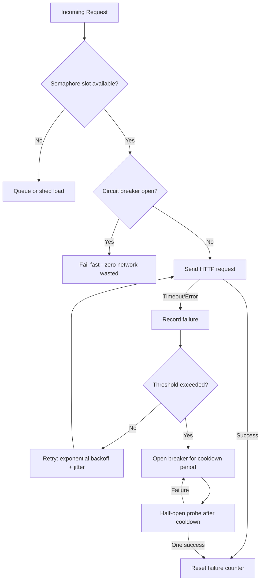

| Difficulty | Channel | Tags |
|---|---|---|
| advanced | backend | asyncio, aiohttp, concurrency |

One slow dependency. Thirty of them at 99.99% uptime. A 1:6 request fanout that turns every incoming call into six outgoing ones. That is the math that mathematically guaranteed Netflix's API over two hours of downtime every single month — until engineers built fault tolerance into the call stack itself [1]. Your aiohttp service may not serve a billion requests a day, but the same failure dynamics are lurking in your code right now. Here is how to make your connection pool degrade gracefully instead of falling over spectacularly.

---

> ### Real-World Case — Netflix
>
> Netflix's API receives over 1 billion incoming calls per day that fan out to several billion outgoing calls (a 1:6 ratio) to dozens of internal service dependencies. A single dependency that became slow or failed would saturate every available request thread within seconds, taking down the entire API — and with 30 dependencies each at 99.99% uptime, combined uptime was only ~99.7%, meaning 2+ hours of downtime per month was mathematically guaranteed.
>
> | | |
> |---|---|
> | **Challenge** | Prevent one slow or failing downstream service from exhausting the connection/thread budget and cascading into a full-API outage, while still serving users when dependencies were unhealthy. |
> | **Solution** | Netflix built the DependencyCommand (which became the open-source Hystrix library) to wrap every network-bound dependency call with: aggressive network timeouts and retries, per-dependency thread pools, non-blocking semaphores (tryAcquire, not blocking acquire) to cap concurrent executions, and a circuit breaker that trips at ~50% error rate over a 10-second window — rejecting requests instantly and shedding load until health checks pass. Any failure fell back to graceful degradation (stale cache, SQS queuing for eventual consistency, stubbed data, or empty responses) instead of blocking. This maps exactly onto the semaphore + circuit breaker + timeout + graceful-degradation design the aiohttp pool manager answer proposes. |
> | **Outcome** | Netflix's API went from being seconds away from total collapse when any dependency degraded to tolerating system, infrastructure, and application failures 'without impacting (or limiting impact to) user experience,' at a sustained scale of 1B+ inbound and several billion outbound calls per day with peaks over 100k dependency requests per second. |
> | **Lesson** | Failing fast beats waiting: when a dependency is unhealthy, rejecting requests immediately (via circuit breaker/semaphore rejection) keeps request capacity free for healthy dependencies and lets the system recover — the counterintuitive insight is that deliberately throwing errors improves overall availability, and this resilience must be designed in because infrastructure alone can't save you at this scale. |

---

## Hook — It is 3am and the pager is screaming

The deploy looked fine. Load was normal. Then one internal dependency — a search service, a cache, it does not matter which — started answering 200ms too slowly. Within seconds, every request thread in your API is occupied waiting on that one endpoint. New requests queue. Latency balloons. Memory climbs. And then, like a row of dominoes, the entire API collapses. Sound familiar? If you build with aiohttp, this is the nightmare that keeps reliability engineers up at night. The enemy is not a flashy bug — it is a slow neighbor, and a request pool with no guardrails is the perfect transmission belt for its sickness.

## Problem — Your connection pool is a fire hose with no valve

Here is the uncomfortable truth: a plain `aiohttp.ClientSession` is not a connection pool manager — it is a connection shop. It will happily open connections until your file descriptors scream. Many developers discover this the hard way when their async service melts under the very load it was built to handle. The real problem has three faces. First, concurrency is unbounded: nothing caps how many simultaneous requests hit a struggling downstream. Second, retries are naive: hammering a dying service with instant retries is like pressing the elevator button harder. Third, failures cascade: when one dependency slows, its timeout budget is borrowed from every caller downstream, and throughput collapses in a chain reaction. Consequently, a pool without limiting, backoff, and circuit breaking is not a reliability feature — it is a liability.

## Real-World Case — Netflix

This is not a hypothetical. Netflix's API receives over a billion incoming calls per day that fan out to several billion outgoing calls — a 1:6 ratio — across dozens of internal service dependencies. A single dependency that became slow or failed would saturate every available request thread within seconds, taking down the entire API. The math was brutal: with 30 dependencies each at 99.99% uptime, combined uptime landed at roughly 99.7% — meaning over two hours of downtime per month was not a risk, it was a certainty [1]. Here is the plot twist, though: the fix was not throwing more servers at it. Netflix built resilience into the request path itself — fail fast when a dependency is sick, shed load instead of absorbing it, and never let one neighbor's bad day become your outage. The result? An API that went from being seconds away from collapse to tolerating system, infrastructure, and application failures without impacting user experience — at sustained peaks of over 100,000 dependency requests per second [1].

## Deep Dive — Semaphores, backoff, and circuit breakers, oh my

Netflix's lessons translate directly into three mechanisms you can build with asyncio today. The first is a semaphore — the concurrency valve. A `Semaphore` caps how many requests enter your pool at once, converting unbounded chaos into a controlled queue [4][5]. When the pool is saturated, requests wait instead of multiplying. The second is exponential backoff with jitter: after a failure, retry with doubling delays plus a random offset, so retries do not pile up in synchronized waves — the very waves that turn a blip into an outage [3][7]. The third is the circuit breaker: track consecutive failures, and when the threshold trips, fail fast for a cooldown window instead of spending precious request budget on a dependency that is clearly down [2]. Now the counterintuitive insight — the plot twist: perfect retries are wrong. Some failures should never be retried, and some requests should be rejected the moment the circuit is open. As RFC 7231 reminds you, retry semantics depend on whether the request is idempotent — retrying a POST that partially succeeded can double-charge a customer [8]. The hardest engineering is not adding resilience; it is knowing when to give up.

## Workflow — The request lifecycle under graceful degradation

Building on those three mechanisms, the full request flow reads like a story with a happy ending. Every request enters the semaphore gate; if the pool is saturated, it waits or is shed. Next, the circuit breaker is checked — if it is open, the request fails fast without touching the network. Otherwise the request is sent. On success, the breaker resets. On timeout or connection error, the failure counter increments, the request retries with exponential backoff plus jitter, and if the threshold trips, the breaker opens for a cooldown period. When the cooldown expires, a single probe (half-open state) tests the waters — one success closes the circuit, one failure reopens it. The diagram below captures the full flow:

## Code Example — A production-grade pool, not a toy

Now the payoff. The code below implements the entire story: a shared session with keep-alive for reduced TCP overhead, a semaphore for concurrency limiting, a circuit breaker that fails fast, and retries with exponential backoff plus jitter. Note the details that separate production code from interview code: a separate connect timeout, cleanup of closed connections, a graceful shutdown method, and a half-open probe so the breaker recovers automatically. Each line is commented so you can trace it back to the flow above.

## Lessons Learned — What to change on Monday

If this feels overwhelming, you are not alone — but the path is short. Start by capping your session's concurrency with a semaphore; that single line prevents most cascade failures. Add timeouts for connect, read, and total, because a request without a timeout is a leak. Layer in a circuit breaker before you add retries — retrying a dead service without a breaker just makes the collapse faster. And always, always close your session on shutdown, because the most embarrassing bug in production is the one that only appears during deploys. The memorable insight to share with your team: resilience is not about handling more load — it is about failing gracefully under the load you already have. Netflix proved it at a billion calls a day. Your API can survive its next 3am dependency hiccup too.

---

## Request Flow with Graceful Degradation

<strong>Original Interview Question</strong>

**Q:** How would you implement a connection pool manager for aiohttp that handles graceful degradation under high load and connection timeouts?

**A:** Implement a connection pool manager for aiohttp using a semaphore to limit concurrent connections, exponential backoff for retrying failed requests, and circuit breaker pattern to gracefully degrade under high load and connection timeouts.

## Conclusion

Netflix's near-collapse taught the industry a truth that applies to your aiohttp service at any scale: you cannot engineer around slow dependencies with more hardware, but you can engineer around them with the right failure semantics. Tomorrow, add a semaphore cap and honest timeouts to your session — that is 80% of the battle. Then layer in the circuit breaker and backoff, and watch your API shrug off the dependency failures that used to cascade. The one insight worth sharing with your team: resilience is not about surviving more load, it is about failing gracefully under the load you already have. Your future 3am self — and the pager that stays silent — will thank you.

---

## References

1. [Netflix incident report](http://web.archive.org/web/20170126152131/http://techblog.netflix.com/2012/02/fault-tolerance-in-high-volume.html) — article
2. [Circuit breaker design pattern](https://en.wikipedia.org/wiki/Circuit_breaker_design_pattern) — documentation
3. [Exponential backoff](https://en.wikipedia.org/wiki/Exponential_backoff) — documentation
4. [Semaphore (programming)](https://en.wikipedia.org/wiki/Semaphore_(programming)) — documentation
5. [Python asyncio synchronization primitives](https://docs.python.org/3/library/asyncio-sync.html) — documentation
6. [aiohttp client advanced usage](https://docs.aiohttp.org/en/stable/client_advanced.html) — documentation
7. [AWS — Exponential backoff and jitter](https://docs.aws.amazon.com/whitepapers/latest/architecture-best-practices/exponential-backoff-and-jitter.html) — documentation
8. [RFC 7231 — HTTP Semantics](https://datatracker.ietf.org/doc/html/rfc7231) — documentation

---

**Author:** Satishkumar Dhule — [GitHub](https://github.com/satishkumar-dhule) · [LinkedIn](https://linkedin.com/in/satishkumar-dhule) · [Website](https://satishkumar-dhule.github.io)
