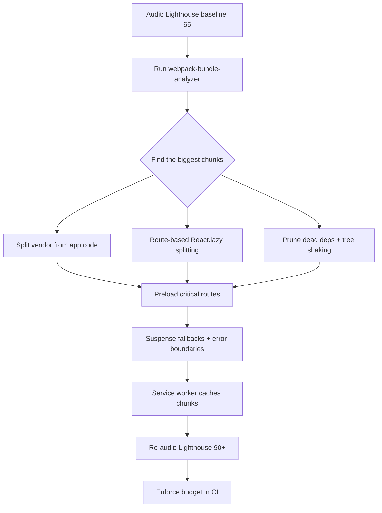

| Difficulty | Channel | Tags |
|---|---|---|
| intermediate | frontend | lighthouse, bundle, lazy-loading |

In 2017, Tinder shipped a React PWA in just three months to break into markets where native app installs were impractical—and discovered their monolithic JavaScript bundles took several seconds to become interactive on the mid-range Android phones of their target audience [1]. It is the exact scenario you face when your Lighthouse score reads 65, your bundle weighs 2.1MB, and Time to Interactive drags past four seconds [1]. Sound familiar? The same oversized-bundle story plays out in codebases everywhere, and the fixes that saved Tinder's web experience are the ones you can apply to yours today.

---

> ### Real-World Case — Tinder
>
> Tinder built "Tinder Online," a React + Redux Progressive Web App in just 3 months to break into markets where native app installs were impractical due to data costs and low-end phones. Their initial web experience shipped as large, monolithic JavaScript bundles (a ~166KB main chunk plus a heavy vendor chunk), so the page took several seconds to parse and become interactive on the mid-range Android devices that dominated their target audience.
>
> | | |
> |---|---|
> | **Challenge** | Reduce Time to Interactive and initial load time of a React SPA whose monolithic, monolithic bundles contained code not needed to boot the core experience, while also preventing performance regressions and cache-invalidation churn from changing third-party vendor libraries. |
> | **Solution** | They implemented route-based code splitting with React Router + React Loadable, analyzed bundles with webpack-bundle-analyzer and source-map-explorer, enabled webpack 3 scope hoisting, upgraded to React 16 (smaller Rollup-bundled output), split the vendor chunk and webpack manifest for long-term caching, added  for late-discovered critical chunks, adopted performance budgets (~155KB main+vendor, ~55KB lazy chunks, 20KB CSS), and used Workbox for app-shell/asset caching. |
> | **Outcome** | Route-based code splitting cut the main bundle from 166KB to 101KB and improved DOMContentLoaded from 5.46s to 4.69s; preloading critical bundles reduced load time by ~1s and first paint from ~1000ms to ~500ms; scope hoisting improved vendor-bundle parse time by 8%; React 16 shrank the gzipped vendor chunk ~7% (react+react-dom ~50KB to ~35KB). The PWA delivered the core experience in ~10% of the data of the native app, and users swiped and messaged more on the web than on the native app. |
> | **Lesson** | Only ship the code users need upfront and lazy-load the rest — and make performance a hard, CI-enforced budget rather than a one-time effort, because measurable gains compound (code splitting, preloading, and a smaller React alone bought seconds off interactivity). |

---

## Hook — A Lighthouse score of 65, a 2.1MB bundle, and a ticking clock

Picture this: you open your freshly built React app in Lighthouse, hit Generate Report, and stare at a score that looks like it belongs on a grade curve, not a production dashboard. 65. Meanwhile your bundle sits at a bloated 2.1MB and Time to Interactive hangs around 4.2 seconds. On your fast office connection, everything feels fine. But your users are not on your office connection. They are on mid-range Android devices with flaky 3G, waiting four-plus seconds for a screen that should render instantly. Every extra second of interactivity delay quietly costs you engagement, conversions, and revenue. The stakes could not be higher, and the pressure to fix it is real—but here is the good news: this is not a mystery. It is a mechanical problem with a proven, step-by-step solution.

## Problem — Why your bundle ballooned and why parse time is the real villain

So how did a clean project end up with a 2.1MB bundle? It never happened overnight. Somewhere along the way, a heavy charting library got imported wholesale, a date utility was pulled in twice, and a dozen components were bundled even though only a handful ever rendered. It is death by a thousand imports. The real villain, though, is not download size alone—it is parse time. JavaScript has to be downloaded, parsed, and executed before the page becomes interactive, and low-end devices parse megabytes of JS painfully slowly. You might think the answer is simply 'make the bundle smaller,' but shrinking one number without understanding what dominates it is guesswork. The correct starting point is always the same: measure, analyze, then split. Consequently, teams that skip the analysis step tend to shave kilobytes while a single 800KB dependency keeps ruining their score [2].

## Real-World Case — Tinder builds Tinder Online and buys back a second of load time

This is precisely where Tinder found themselves in 2017. To expand into emerging markets where data costs and low-end hardware made native installs impractical, the team built Tinder Online—a React + Redux Progressive Web App—in three months. The first web experience shipped as a large, monolithic bundle: a roughly 166KB main chunk plus a heavy vendor chunk. On the mid-range Android devices that dominated their audience, that meant several seconds of parsing before the page was usable [1]. So they went to work with the exact toolkit you are about to learn. Route-based code splitting cut the main bundle from 166KB to 101KB and improved DOMContentLoaded from 5.46s to 4.69s. Preloading critical bundles reduced load time by roughly one second and slashed first paint from about 1000ms to 500ms. Scope hoisting improved vendor-bundle parse time by 8%, and upgrading to React 16 shrank the gzipped vendor chunk about 7%, with react plus react-dom dropping from ~50KB to ~35KB [1]. The payoff was dramatic: the PWA delivered the core experience in roughly 10% of the data of the native app, and users swiped and messaged more on the web than on the native app [1]. If you think you need a massive team or months of time to get those kinds of wins, Tinder proves otherwise.

## Deep Dive — Code splitting, tree shaking, and the trade-offs nobody warns you about

Building on Tinder's numbers, let's look under the hood at the three mechanisms that made those wins possible. First, code splitting is the practice of breaking your bundle into chunks that load on demand, so the initial route only ships what it actually needs [6]. React.lazy() and Suspense make this nearly trivial at the component level: a lazy import tells bundlers like webpack to emit a separate chunk, and Suspense renders a fallback while it loads [2][3]. Second, tree shaking relies on ES module static imports—bundlers can then eliminate exports that are never used, but only if your libraries are written with proper side-effect-free module structure [7]. Third, scope hoisting collapses modules into a single scope to reduce the overhead of function calls between modules, which is exactly the 8% parse-time win Tinder saw [1]. Now for the plot twist: splitting too aggressively can backfire. Every chunk boundary introduces a network round trip, so splitting a 5KB component into its own chunk is worse than leaving it inline. Moreover, lazy loading the critical path—like your hero content—adds a waterfall of requests and hurts the very metric you are trying to save. The art is deciding what is critical, what is route-scoped, and what can wait for idle time [5].

## Workflow — Six steps from Lighthouse 65 to 90+

Given everything covered so far, here is the battle-tested sequence that turns analysis into measurable wins, visualized in the 'Bundle Optimization Flow' diagram below. Step one: audit with Lighthouse to establish your baseline score and pinpoint the worst metric [9]. Step two: run webpack-bundle-analyzer to visualize your bundle and identify the largest chunks—this is where the shock of discovering a 500KB icon library usually happens [4]. Step three: separate vendor code from application code so third-party upgrades do not force users to re-download your app code. Step four: apply route-based React.lazy() splitting so each route fetches only its own chunk [2]. Step five: prune unused dependencies and confirm your build's production mode enables tree shaking [7]. Step six: add preloading for critical routes, then re-audit and wire Lighthouse scores into CI as a budget that fails the build when performance regresses [9]. Each step compounds on the previous one, which is why skipping analysis and jumping straight to 'delete some dependencies' rarely moves the needle.

## Code Example — Route-based splitting, error boundaries, and preloading in action

Now for the hands-on part. The example below implements the workflow's core steps: route-based splitting with React.lazy(), component-level splitting for a heavy chart, an error boundary to survive failed chunk loads, and idle-time preloading so navigation feels instant. The pattern is the same one Tinder's team leaned on: the main entry point stays lean, and everything else arrives just in time [1][3].

## Lessons Learned — Battle scars, best practices, and what to do tomorrow

So what should you take away? First, the discipline: measure before you optimize, because bundles have a way of surprising you [4]. Second, split by route first and by component second—route boundaries are natural user journeys, so they give the best perceived-performance return. Third, never lazy-load above the fold; the critical render path deserves a synchronous, cached chunk [10]. Fourth, wrap every lazy import in an error boundary, because a flaky network that fails to fetch a chunk becomes an unrecoverable white screen without one—a lesson many teams learn the hard way [3]. Fifth, treat performance as a budget, not a one-time cleanup: enforce it in CI so a sneaky dependency bump cannot silently re-bloat the bundle [9]. And if all of this feels overwhelming, you are not alone—but remember Tinder's story. A three-month deadline, a monolithic bundle, and mid-range hardware, yet route splitting alone cut their main chunk by 39%, preloading bought back a full second, and web users ended up swiping more than native users did [1]. Start small: run the analyzer, split one heavy route, and watch the score climb. Every point of Lighthouse you recover is a user who stops waiting and starts clicking.

---

## Bundle Optimization Flow

<strong>Original Interview Question</strong>

**Q:** You're tasked with improving a React app's Lighthouse performance score from 65 to 90+. The bundle size is 2.1MB and Time to Interactive is 4.2s. What specific steps would you take to optimize the bundle and implement lazy loading?

**A:** Implement code splitting with React.lazy() and Suspense, analyze bundle composition with webpack-bundle-analyzer to identify largest chunks, remove unused dependencies and optimize imports, add dynamic imports for heavy components and third-party libraries, implement route-based splitting for better initial load times, and utilize tree shaking with proper ES module configuration.

## Conclusion

Tinder started with a three-month deadline and a monolithic bundle, and walked away with a PWA that cut data usage to a tenth of the native app and won more swipes on the web than on native [1]. The moral of the story is that performance is not a mystery—it is a measured, iterative engineering discipline. Tomorrow, run Lighthouse to establish your baseline, open webpack-bundle-analyzer to find the culprit chunks, split one heavy route with React.lazy(), and re-audit. Do that weekly, enforce a budget in CI, and a 65 becomes a 90 before you know it. The one insight worth sharing with your team: every second of interactivity you save is not a number on a dashboard—it is a user who stayed long enough to tap, swipe, or buy.

---

## References

1. [Tinder incident report](https://calendar.perfplanet.com/2017/a-tinder-progressive-web-app-performance-case-study/) — article
2. [React.lazy reference](https://react.dev/reference/react/lazy) — documentation
3. [React Suspense reference](https://react.dev/reference/react/Suspense) — documentation
4. [webpack-bundle-analyzer](https://github.com/webpack-contrib/webpack-bundle-analyzer) — documentation
5. [Webpack Code Splitting guide](https://webpack.js.org/guides/code-splitting/) — documentation
6. [MDN: Code splitting](https://developer.mozilla.org/en-US/docs/Glossary/Code_splitting) — documentation
7. [MDN: Tree shaking](https://developer.mozilla.org/en-US/docs/Glossary/Tree_shaking) — documentation
8. [MDN: Service Worker API](https://developer.mozilla.org/en-US/docs/Web/API/Service_Worker_API) — documentation
9. [Chrome DevTools: Lighthouse overview](https://developer.chrome.com/docs/lighthouse/overview/) — documentation
10. [MDN: Lazy loading](https://developer.mozilla.org/en-US/docs/Web/Performance/Lazy_loading) — documentation

---

**Author:** Satishkumar Dhule — [GitHub](https://github.com/satishkumar-dhule) · [LinkedIn](https://linkedin.com/in/satishkumar-dhule) · [Website](https://satishkumar-dhule.github.io)
