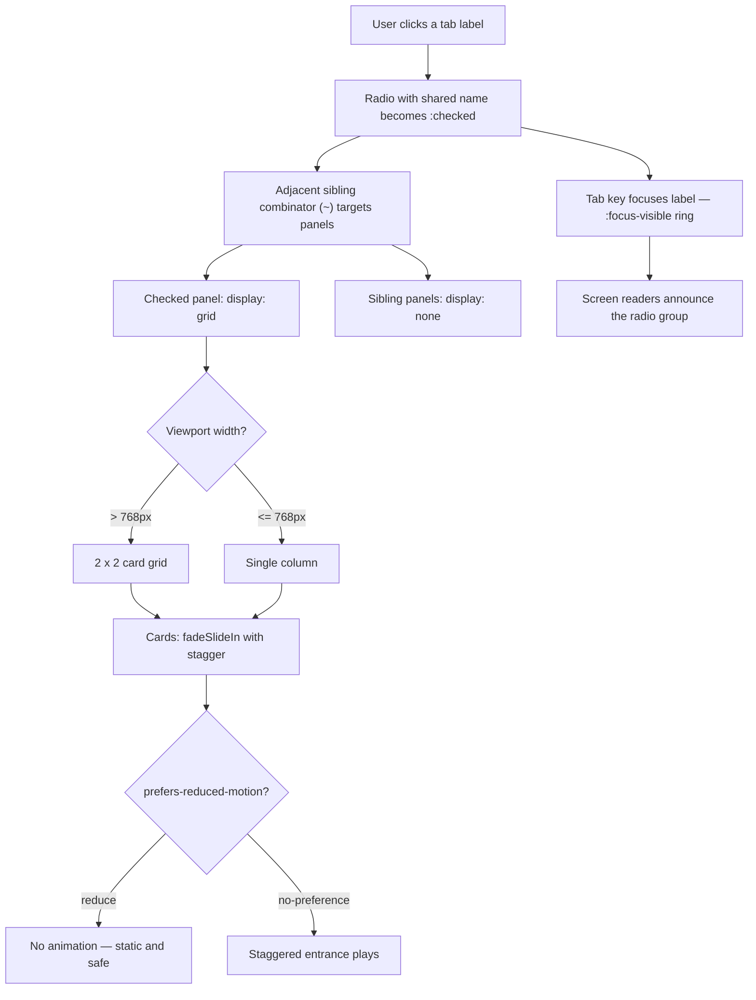

| Difficulty | Channel | Tags |
|---|---|---|
| beginner | frontend | css, flexbox, grid, animations |

On December 16, 1997, a 4-second explosion sequence in a Pokémon episode flickered red and blue at 12 Hz — and within hours, 685 children were hospitalized with photosensitive seizures [1]. The episode has never aired again anywhere in the world. Now imagine your design system shipping a tab panel with an unguarded flashing entrance animation to millions of users. This is the story of how to build accessible, motion-safe, CSS-only tabs — no JavaScript required, and no one gets hurt.

---

> ### Real-World Case — Nintendo / TV Tokyo (Pokémon anime)
>
> On December 16, 1997, the Pokémon anime episode "Dennō Senshi Porygon" aired in Japan to roughly 4.6 million households. Near the end, a 4-second explosion sequence alternated red and blue strobes at 12 Hz, triggering photosensitive epileptic seizures in children across the country — 685 were taken to hospitals by ambulance.
>
> | | |
> |---|---|
> | **Challenge** | One animation choice in a single episode harmed hundreds of viewers and threatened an entire franchise. The industry had no safety standards for flashing/motion, which is exactly the problem `prefers-reduced-motion` solves today for web animations like the staggered card entrance in this tab panel. |
> | **Solution** | The episode was pulled from rotation permanently, the anime went on a nearly 4-month hiatus, and TV Tokyo worked with medical officials to write new broadcast guidelines (no red flicker faster than 3x/second, no non-red flicker faster than 5x/second, max 2s of flashing, plus the automated Harding luminance test). This regulatory lineage directly led to WCAG 2.1's motion requirements and browsers shipping the `prefers-reduced-motion` media query, letting developers detect a user's motion preference and disable animations. |
> | **Outcome** | 685 children hospitalized (208 admitted, 3 unconscious); Nintendo's share price dropped 400 yen (~3.2%) the following morning; the episode has never aired again in any country — yet it remains the Guinness record for "Most Photosensitive Epileptic Seizures Caused by a Television Show." |
> | **Lesson** | Motion that users cannot disable is not a cosmetic concern — roughly 1 in 5,000 people are photosensitive, and "Pokémon Shock" showed the real stakes. That's why the entrance animation and stagger in the CSS answer must be wrapped in `@media (prefers-reduced-motion: no-preference)`: it's not a nice-to-have, it's a safety feature born from a production incident. |

---

## Hook — A 4-second flash that stopped a nation

It is 6:30 PM in Japan, and roughly 4.6 million households have the same thing glowing on their TV sets: Pokémon. Episode 38 is almost over when a rocket launcher fires, and a single explosion erupts across the screen — four seconds of red and blue strobes alternating at 12 Hz. Within minutes, children across the country are collapsing in front of their screens. Ambulances race through Tokyo streets. 685 kids are rushed to hospitals, 208 of them admitted, three unconscious [1]. The episode — 'Dennō Senshi Porygon' — is pulled, banned from re-broadcast in every country, and still holds the Guinness record for most photosensitive seizures caused by a single television show [1]. Sound dramatic? Here is the uncomfortable part: the danger was never the Pokémon. It was the motion. And every developer who ships an unguarded CSS animation is running the same risk at a much smaller scale — often without ever realizing it.

## Problem — Tabs are everywhere, and they are quietly hostile

Here is the thing about tabs: they are everywhere and they are deceptively complex. A design-system docs page is the perfect example — dozens of component variations, code snippets, and usage guidelines all fighting for space in a single viewport. Tabs are the hero that keeps that chaos organized. The obvious approach is JavaScript: a click handler, a toggle class, a content swap. But that approach drags in dependencies, depends on hydration timing, and breaks the moment a script fails to load. The CSS-only answer — radio inputs with a shared name — feels like pure magic, and that is exactly why it is dangerous. Many developers discover the pattern, copy-paste it, and assume 'no JavaScript' means 'no risk.' It does not. Skip the focus outline and keyboard users are navigating blind. Forget the mobile breakpoint and your pristine 2×2 grid collapses into an unreadable mess. Add a 'subtle entrance animation' without a guard and you have shipped flashing motion to every single user — including the roughly 1 in 4,000 people who experience photosensitive seizures [10]. The stakes here are not a passing grade in an interview. They are the difference between a component that welcomes people and one that harms them.

## Real-World Case — Nintendo / TV Tokyo

In the late 1990s, anime studios leaned on a technique nicknamed 'paka paka' — rapid alternating frames used to convey explosive intensity. On December 16, 1997, that technique became a public health event. Roughly 4.6 million households were watching Pokémon episode 38 when its climactic blast sequence flashed red and blue at 12 Hz for four seconds. The result: 685 children taken to hospitals by ambulance, 208 admitted, three unconscious [1]. The fallout was swift and brutal. TV Tokyo suspended Pokémon's broadcast indefinitely. The following morning, Nintendo's share price dropped 400 yen — roughly 3.2% — as investors priced in the damage [1]. The episode has never aired again, in any country. The incident forced Japan's broadcast industry to rewrite its animation production guidelines, introduced on-screen viewing warnings, and gave Porygon a strange immortality: a Pokémon so infamous it has been permanently written out of the anime [1]. Here is the plot twist that makes this relevant to your stylesheet: it was never the art that failed. It was the motion — rapid flashing, high-contrast strobes, and sudden large movement, precisely the triggers that photosensitive epilepsy feeds on. Your 'subtle entrance animation' — a 0.3-second fade with a 10-pixel slide — sits on the same spectrum, just far from the extreme. That is why the modern web built a safety valve: the prefers-reduced-motion media query [3]. One line of CSS tells the browser 'this human is motion-sensitive; honor them.' Respecting it is not a nice-to-have. It is the line between animation as delight and animation as danger.

## Deep Dive — The anatomy of a CSS-only state machine

At the heart of the CSS-only tab pattern is a beautiful accident of HTML: radio inputs with the same name are mutually exclusive [8]. Check one, and the browser automatically unchecks the others — no JavaScript required. Pair each radio with a , and clicking the label toggles its input exactly as if you had clicked the radio itself [8]. One behavior, and you have a free state machine. The second mechanism is the adjacent sibling combinator (~), which matches elements that come after a given element in the DOM [6]. It lets each checked radio reach forward and reveal exactly its own panel while the others stay hidden. But here is where the question grows teeth. Pure CSS does not equal accessible. The hidden radios must remain focusable, and the visible labels need real focus rings via :focus-visible [2]. When someone tabs onto your tab — yes, really — the browser paints the outline; your job is simply to make sure it is actually visible and not cut off by an overflow rule. On the layout side, the responsive grid is almost boringly simple: repeat(2, 1fr) gives you the 2×2 desktop grid, and a single 768px breakpoint collapses it to one column [5]. The fixed 16:9 image area is the sleight of hand that keeps cards stable — aspect-ratio: 16/9 reserves the space before images ever load, so titles and meta lines never jump around [4]. Then comes the motion, the part where most answers go off the rails. The naive instinct is animation: fadeSlideIn 0.3s and done. That animation plays for every user on every render — including users with reduced-motion enabled, and including the very first paint where the cards should already be in place. The fix has two halves: gate the animation behind prefers-reduced-motion: no-preference [3], and use animation-fill-mode: backwards with stagger delays so cards start hidden, settle into their spots, and never flash mid-layout [9]. Building on that, here is the real tradeoff you are making:

## Workflow — From markup to motion-safe in six steps

Every developer who has built this pattern has a slightly different sequence, but a battle-tested order emerges after doing it a few times. First, lay out the DOM: for each tab, an input[type=radio] with a shared name, a  pointing at it, and the panel as a following sibling — this ordering is what makes the sibling combinator legal in the first place. Second, wire the toggle with explicit :checked rules that target each panel by ID, not a blanket selector. Third, give the visible panels display: grid with repeat(2, 1fr) and a gap. Fourth, add the mobile breakpoint that swaps to 1fr. Fifth, set the fixed image ratio with aspect-ratio: 16/9 so cards stay rectangular. Sixth — and this is the step most people skip — wrap the entrance animation inside prefers-reduced-motion: no-preference and add :focus-visible outlines. The full journey, from click to safe animation, looks like this:

## Code Example — The panel, minus the JavaScript

The complete pattern is pure CSS; the small module below only generates the markup for a docs-page panel. Its job is to write three radio inputs, three labels, and three panels in the exact sibling order the selectors require — no click handlers, no state, no bundle. The CSS string is the real logic, and it ships as a static stylesheet in the docs build. The key decision is the explicit #tab-id:checked ~ #panel-id rules. That deliberate verbosity is the whole point: a generic input:not(:checked) ~ .panel rule hides every panel after every unchecked radio, which means the moment you add a second tab, your own CSS breaks. Naming the relationships removes the ambiguity.

## Lessons Learned — What the Porygon episode taught a generation of frontend developers

The most important lesson is the one a 1997 news cycle learned the hard way: motion is a safety feature, not a decoration. Guard every non-essential animation behind prefers-reduced-motion, or you are publishing flashing content to people who cannot absorb it [3]. The second lesson is that 'CSS-only' is a promise about dependencies, not about effort — the pattern still demands keyboard support, focus visibility, and responsive discipline. Third, embrace explicit selectors over clever ones; the concise input:not(:checked) approach looks elegant until a second tab silently breaks it. Fourth, aspect-ratio is your friend: it reserves image space, kills layout shift, and turns a row of cards into a stable grid in one line [4]. Finally, remember that this entire exercise — from radio exclusivity to staggered entrances — exists so one component can serve every human, on every device, under every condition. That is the real interview question. And the answer starts with the person who might not be able to watch your animation.

---

## CSS-only Tab Panel Flow

<strong>Original Interview Question</strong>

**Q:** Build a CSS-only tab panel for a design-system docs page. Use radio inputs to switch tabs (no JavaScript). Desktop: a 2x2 grid of cards under each tab; mobile: single column. Each card has a fixed 16:9 image area, a title, and a short meta line. Add a subtle entrance animation with a stagger and keep focus-visible outlines; ensure prefers-reduced-motion is respected?

**A:** Use a set of radio inputs with a shared `name` attribute and corresponding `` elements for each tab section. The `:checked` state of each radio controls visibility of its associated panel via adjacent sibling selectors. Each panel renders a 2×2 card grid on desktop and collapses to a single column on mobile. Cards use `aspect-ratio: 16/9` for fixed image containers, with a title and meta line below.

## Conclusion

A four-second animation once put 685 children in hospitals and ended an era of broadcast television in Japan [1]. Decades later, the tooling finally caught up — prefers-reduced-motion, :focus-visible, aspect-ratio, and a radio-input pattern that runs on pure CSS. The pattern you just walked through is small, but it carries a big responsibility: it proves that a component can be both lightweight and humane, both clever and safe. Tomorrow, open your design system and do three things: wrap every non-essential animation in prefers-reduced-motion, make sure :focus-visible is visible, and replace any blanket tab selector with explicit ones. The memorable insight to take back to your team: the best CSS is the code that respects the person who can't handle it.

---

## References

1. [Nintendo / TV Tokyo (Pokémon anime) incident report](https://en.wikipedia.org/wiki/Denn%C5%8D_Senshi_Porygon) — article
2. [:focus-visible — MDN Web Docs](https://developer.mozilla.org/en-US/docs/Web/CSS/:focus-visible) — documentation
3. [prefers-reduced-motion — MDN Web Docs](https://developer.mozilla.org/en-US/docs/Web/CSS/@media/prefers-reduced-motion) — documentation
4. [aspect-ratio — MDN Web Docs](https://developer.mozilla.org/en-US/docs/Web/CSS/aspect-ratio) — documentation
5. [grid-template-columns — MDN Web Docs](https://developer.mozilla.org/en-US/docs/Web/CSS/grid-template-columns) — documentation
6. [Adjacent sibling combinator — MDN Web Docs](https://developer.mozilla.org/en-US/docs/Web/CSS/Adjacent_sibling_combinator) — documentation
7. [:checked — MDN Web Docs](https://developer.mozilla.org/en-US/docs/Web/CSS/:checked) — documentation
8. [The <input type="radio"> element — MDN Web Docs](https://developer.mozilla.org/en-US/docs/Web/HTML/Element/input/radio) — documentation
9. [@keyframes — MDN Web Docs](https://developer.mozilla.org/en-US/docs/Web/CSS/@keyframes) — documentation
10. [Photosensitive epilepsy — Wikipedia](https://en.wikipedia.org/wiki/Photosensitive_epilepsy) — article

---

**Author:** Satishkumar Dhule — [GitHub](https://github.com/satishkumar-dhule) · [LinkedIn](https://linkedin.com/in/satishkumar-dhule) · [Website](https://satishkumar-dhule.github.io)
