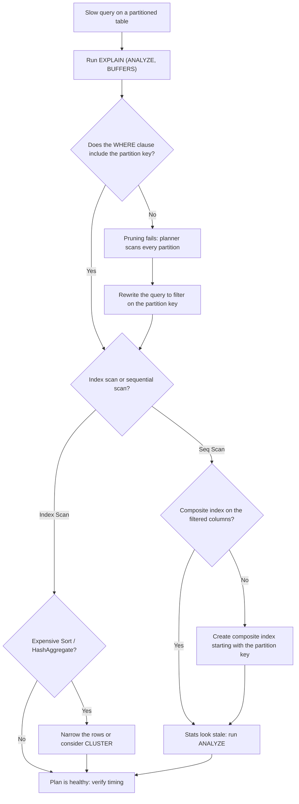

| Difficulty | Channel | Tags |
|---|---|---|
| intermediate | database | explain, query-plan, partitioning |

By 2020, GitLab.com's PostgreSQL database had quietly grown past 5 TB, and its audit_events table — the fourth largest at roughly 112 GB across 240 million rows — was dragging analytical audit queries to a crawl [1]. Queries that filtered by project, group, or author routinely blew past the 15-second statement_timeout, and users got timeouts instead of answers. Then the database team swapped in a fix: the most expensive date-filtered query collapsed from 13,158.6 ms to 5.7 ms — roughly a 2,000x speedup [1]. This is the story of that fix, the plot twist nobody saw coming, and the exact playbook any team can use when their own partitioned tables start to misbehave.

---

> ### Real-World Case — GitLab
>
> By 2020 GitLab.com's PostgreSQL database had grown past 5TB and its audit_events table (the 4th largest, ~112GB / 240M rows) was causing production pain: analytical audit-log queries that filtered by project, group, or author could take tens of seconds, blowing past the 15-second statement_timeout and timing out for users. The database team set a hard goal of keeping tables under 100GB.
>
> | | |
> |---|---|
> | **Challenge** | Queries against a single giant events/audit table had no way to cheaply narrow the search space — count/aggregate queries and sorts scanned far too much data, and even with indexes on entity columns the planner still touched millions of rows, so expensive sorts and hash aggregates were stalling on the primary. |
> | **Solution** | GitLab partitioned audit_events by month using PostgreSQL RANGE partitioning on created_at, with a composite primary key (id, created_at), rebuilt secondary indexes per partition, backfilled via background migrations behind a table-sync trigger, then swapped the partitioned table into production. The critical part was the discovery from their own pgbench benchmark: partition pruning only helps when the WHERE clause actually references the partition key, so they audited every query and enforced a rule that all audit queries must carry a bounded (max 30-day) created_at filter — and created composite indexes on each partition so the planner could index-scan instead of seq-scan. |
> | **Outcome** | Benchmarks against 240M rows across 48 partitions showed the most expensive date-filtered query (count all events for a large project in a range) dropped from 13,158.6 ms to 5.7 ms — a ~2,000x speedup — and every previously timing-out query fell below ~3 seconds, well under the 15s limit. Production pg_stat_statements after the swap showed sub-millisecond mean execution times. The plot twist: queries without a date filter got slower (a count query went from 670 ms to ~10.4 s) because the planner scanned every partition, proving pruning was the real win. Later, applying the same pattern to the 1.0 TiB events table, they found ~55% of 167 queries had to be rewritten to include the partition key, and they dropped an unused 60 GiB index (6% of storage). |
> | **Lesson** | Partitioning the table is only half the fix — the planner can only prune partitions when the query references the partition key. When a date-partitioned query is still slow, read the EXPLAIN plan for unpruned partitions and per-partition Seq Scans, pair partitioning with composite indexes on each partition, and rewrite queries to always filter on the partition key; also remember new partitions are not auto-analyzed, so statistics must be refreshed. |

---

## Hook — When a 100M-row table decides to fight back

Picture this: it's a quiet Tuesday, and a support ticket lands on your desk. 'Dashboard is slow. Users are complaining.' You open the query, and there it is — a 100-million-row PostgreSQL table, partitioned by date, filtering on a date range, and somehow still crawling. Sound familiar?

The stakes are higher than they look. A query that takes 20 seconds doesn't just annoy one user — it burns database connections, backs up connection pools, and quietly degrades performance for every other request sharing that instance [2]. In a busy production environment, one slow analytical query can cascade into a site-wide outage.

Here is the uncomfortable truth many developers discover the hard way: partitioning is not a performance guarantee. It is a promise your query planner still has to keep. And when it doesn't, the fastest database on earth looks slow.

## Problem — Partitioning is only half the battle

The premise of partitioning is seductive: split a giant table into smaller pieces, and queries only touch the pieces they need. Date-based partitioning is the classic move — historical data lands in old partitions, recent rows land in fresh ones, and range queries should fly.

But 'should' is doing a lot of work in that sentence. A partitioned table only pays off when partition pruning actually happens — when the planner looks at the WHERE clause, realizes it only needs January, and never even opens February [3]. When pruning fails, the planner cheerfully reads every single partition, which is strictly worse than having one big table, because now there is partition overhead on top of everything else.

You might think the solution is simple — 'just add an index.' And sometimes that is exactly right. But an index built on the wrong column order is a paperweight. A query that filters on status while the index starts with event_date forces the planner into a full scan anyway. This leads to the real diagnostic question: what is the query actually doing inside the planner's head? The only honest way to find out is to ask EXPLAIN.

## Real-World Case — GitLab's 240M-row audit log

GitLab's audit_events table is a textbook example of this exact struggle. By 2020 the audit log held around 240 million rows across 48 partitions and weighed in at roughly 112 GB — the fourth-largest table on a database that had already crossed 5 TB [1]. Analytical queries on the audit log — counting all events for a large project in a date range, for instance — took tens of seconds, blowing past the team's 15-second statement_timeout. Users got errors; the database team got a hard goal: keep every table under 100 GB [1].

The fix combined every technique covered in the rest of this article: rewriting queries so the partition key always made it into the WHERE clause, adding composite indexes that matched the query filters, and validating each change with EXPLAIN (ANALYZE, BUFFERS). Benchmarks against the full 240M-row dataset showed the most expensive date-filtered query dropping from 13,158.6 ms to 5.7 ms — roughly a 2,000x improvement — and every previously timing-out query fell below about 3 seconds, comfortably inside the 15-second budget [1]. Production pg_stat_statements after the swap showed sub-millisecond mean execution times [1][6].

But here is the plot twist: queries without a date filter got dramatically slower. A count query that used to take 670 ms ballooned to about 10.4 seconds, because the planner now scanned all 48 partitions to be safe [1]. Pruning, it turned out, was the real win — and skipping the partition key was the price of admission. The team later applied the same pattern to the 1.0 TiB events table, where roughly 55% of 167 queries had to be rewritten to include the partition key, and where they discovered a 60 GiB index nobody was using — about 6% of total storage, gone [1].

## Deep Dive — Reading EXPLAIN like a detective

Building on the GitLab story, the next question is practical: when a query on your partitioned table is slow, where do you look? The answer is always the same place — the EXPLAIN plan [2].

Here is what to check, in priority order:
- **Is partition pruning happening?** Look for Append nodes. A healthy plan shows a single child for one partition (or a handful for a range). An unhealthy one lists every partition as a child — the smoking gun of a pruning failure [3].
- **Index scan or sequential scan?** If the planner chose a Seq Scan on a filtered partition, the rows per partition might be small enough that scanning is genuinely cheaper — but on a 100M-row table, that is usually a red flag.
- **Expensive sorts and hash aggregates?** ORDER BY and GROUP BY can silently dominate runtime. A sort of millions of rows can easily cost more than the scan that produced them [2].
- **Are the estimates right?** If the planner thinks a partition has a thousand rows and it really has ten million, every downstream decision is wrong. Fresh statistics via ANALYZE fix that.

If pruning checks out and the scan is still heavy, the classic lever is a composite index whose leading column is the partition key. Because the partition key is already in the WHERE clause, a B-tree index starting with event_date lets the planner walk straight to the relevant range and then filter within it [7]. Appending the filtered columns — status, project_id, author_id — turns a bare index scan into a bitmap or index-only scan and often removes the need to touch the heap at all [8].

The second lever is physical layout. A B-tree index tells the planner where rows are, but the heap can still scatter matching rows across many pages. CLUSTER rewrites the table in index order, so a range scan reads far fewer pages [4]. The trade-off: CLUSTER locks the table and rewrites it, so it is a scheduled operation, not a Friday-afternoon experiment.

| Strategy | When it wins | The catch |
|---|---|---|
| Pruning via query rewrite | Always — free, no schema change | Requires the WHERE clause to include the partition key |
| Composite index (partition key first) | Narrow row access per partition | Column order is non-negotiable |
| CLUSTER | Range scans read contiguous pages | Table lock plus rewrite, so schedule it |

## Workflow — The seven-step diagnostic ritual

Now for the practical sequence. The workflow below is the distilled version of what GitLab's team practiced at production scale, and it applies whether your table has 1 million rows or 240 million [1].

1. **Reproduce and capture a baseline.** Run the slow query with EXPLAIN (ANALYZE, BUFFERS) and save the output. 'Seems faster now' is not a benchmark — numbers are.
2. **Verify partition pruning.** Scan the plan for Append nodes and count the children. One child means pruning worked; forty-eight means it did not [3].
3. **Check the scan strategy.** Note whether each partition uses an index scan or a sequential scan, and whether a Sort or HashAggregate node is dominating the cost [2].
4. **Fix the query first, indexes second.** If the WHERE clause can legally include the partition key, add it. GitLab rewrote 55% of queries this way — the cheapest win available [1].
5. **Add or reshape the composite index.** Create an index starting with the partition key followed by the filtered columns, run ANALYZE, and re-measure [5].
6. **Consider CLUSTER for range-heavy access.** Rewrite the table in index order so range scans stop chasing scattered pages [4].
7. **Re-run the benchmark and compare.** Keep the before/after numbers. They are the evidence you will need when someone proposes 'optimizing' the schema next quarter.

The 'Query Optimization Flow' diagram below captures this decision tree visually — starting from a slow query and ending at a plan you can defend with measurements.

## Code Example — The five-command fix

This leads us to the practical payoff: a command sequence that mirrors GitLab's production fix [1]. Step one proves the problem with buffers included so the numbers are real, not estimates. Step two builds a composite index that matches the query's filter order. Step three refreshes statistics, and step four — only when range scans still chase scattered rows — clusters the table into index order. Every command maps one-to-one to the steps in the workflow above.

## Lessons Learned — What a 2,000x speedup teaches

Every part of this journey points back to one insight: partitioning is only as good as the pruning that powers it. GitLab's speedup was not magic — it was measurement, query rewriting, and indexes that matched reality [1]. Here are the takeaways worth carrying into your next incident:

- **Verify before you optimize.** Run EXPLAIN (ANALYZE, BUFFERS) and save the baseline. Every subsequent change is judged against it [2].
- **The partition key is sacred.** Queries that filter on the partition key are the only ones that prune. Design every hot path around that constraint [3].
- **Composite index order matters.** Leading with the partition key, then the filtered columns, is what turns a scan into a short walk [5][8].
- **Watch for regressions.** GitLab's slower non-date queries were not a failure — they were a trade-off, and understanding it is what separates optimization from guessing [1].
- **Cluster sparingly.** It reorganizes the heap for range scans, but it locks the table, so schedule it deliberately [4].
- **Trust pg_stat_statements.** Sub-millisecond mean execution times in production are the only benchmark that truly counts [6].

💡 **Insight:** A slow query is rarely a database problem — it is almost always a communication problem between your WHERE clause and your indexes.

⚠️ **Watch Out:** Never run CLUSTER on a live table during peak hours; the lock will bite you.

🔥 **Hot Take:** Your first instinct — 'add an index' — is usually correct but often in the wrong order.

🎯 **Key Point:** Pruning, not partitioning, is the real win.

---

## Query Optimization Flow

<strong>Original Interview Question</strong>

**Q:** You have a PostgreSQL table with 100M rows partitioned by date. A query filtering on a specific date range is still slow. What would you check in the EXPLAIN plan and how would you optimize it?

**A:** Check partition pruning effectiveness, index utilization patterns, and expensive sort operations. Create composite indexes on (date, filtered_columns) and evaluate clustering strategies for optimal data access.

## Conclusion

So back to GitLab: a query that once took 13 seconds now runs in 5 milliseconds, and the team's real discovery was that partition pruning — not partitioning itself — was the prize [1]. The moral of the story is refreshingly boring: measure first, rewrite the query second, index third, and cluster last. Tomorrow, when a slow partitioned table lands in your lap, you know exactly what to do — open EXPLAIN, look for the Append node, and ask whether your WHERE clause is speaking the planner's language. The 2,000x speedup is waiting for you too.

---

## References

1. [GitLab incident report](https://gitlab.com/gitlab-org/gitlab/-/issues/216658) — article
2. [PostgreSQL EXPLAIN documentation](https://www.postgresql.org/docs/current/using-explain.html) — documentation
3. [PostgreSQL table partitioning documentation](https://www.postgresql.org/docs/current/ddl-partitioning.html) — documentation
4. [PostgreSQL CLUSTER documentation](https://www.postgresql.org/docs/current/sql-cluster.html) — documentation
5. [PostgreSQL CREATE INDEX documentation](https://www.postgresql.org/docs/current/sql-createindex.html) — documentation
6. [PostgreSQL pg_stat_statements documentation](https://www.postgresql.org/docs/current/pgstatstatements.html) — documentation
7. [Wikipedia — B-tree](https://en.wikipedia.org/wiki/B-tree) — article
8. [DigitalOcean — How to Use Indexes in PostgreSQL](https://www.digitalocean.com/community/tutorials/how-to-use-indexes-in-postgresql) — blog

---

**Author:** Satishkumar Dhule — [GitHub](https://github.com/satishkumar-dhule) · [LinkedIn](https://linkedin.com/in/satishkumar-dhule) · [Website](https://satishkumar-dhule.github.io)
