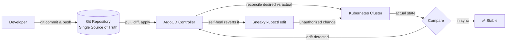

| Difficulty | Channel | Tags |
|---|---|---|
| beginner | devops | argocd, flux, declarative |

When Intuit rolled GitOps out to its entire Kubernetes platform, the company was already juggling hundreds of applications across dozens of clusters. By the time the dust settled, its GitOps platform was running 140+ ArgoCD instances managing 40,000 applications across 3,000+ Git repositories for 5,000 engineers [1]. Deployment cycles shrank from days to minutes, and mean time to recovery dropped from 45 minutes to under 5 [1]. This is the story of how declarative GitOps — and the ArgoCD machinery that makes it tick — transformed one of the largest production platforms on Earth, and why your deployment pipeline should be paying attention.

---

> ### Real-World Case — Intuit
>
> Intuit, maker of QuickBooks and TurboTax, acquired the startup behind the open-source Argo project (Applatix) and set out to run its entire Kubernetes platform on GitOps. As Kubernetes adoption exploded, their ArgoCD deployment went from a handful of applications on a few clusters to hundreds of apps across dozens of clusters — and later tens of thousands.
>
> | | |
> |---|---|
> | **Challenge** | At scale, the ArgoCD Application Controller couldn't keep up: a single large application (e.g., the Istio Helm chart at 1MB+) could take almost a minute to reconcile, and 150-app production instances took ~40 seconds from a Git commit to a refreshed app. They needed sub-second reconciliation to make Git truly the source of truth and provide a responsive developer experience. |
> | **Solution** | Intuit redesigned the ArgoCD Application Controller to use Kubernetes watch APIs and an in-memory cache of lightweight resource references instead of storing full cluster state, switched to informers to eliminate the k8s client's 5 QPS throttling (triggered by excessive configmap queries), and added a shared Redis cache plus concurrency throttling for the Repo Service so manifest generation could scale horizontally with HA. |
> | **Outcome** | Istio reconciliation dropped from ~1 minute to ~0.5 seconds; 150 applications reconciled in under 5 seconds (down from ~40s). The GitOps platform now runs 140+ ArgoCD instances managing 40,000 applications across 3,000+ Git repositories for 5,000 engineers (~1,000 deployments/day). CNCF-documented results: deployment cycle went from days to minutes and MTTR dropped from 45 minutes to under 5. |
> | **Lesson** | Declarative GitOps at scale requires the controller to be a fast, lightweight reconciler — full-state storage and naive polling don't scale. When Git becomes the single source of truth (instead of manual imperative kubectl/scripts), rollbacks become minutes-long and auditability is built in. |

---

## Hook — The 3am kubectl fix that almost took down staging

It is 3:00 AM and the pager just went off. Someone "quickly fixed" a config with a kubectl command an hour ago, and now staging is serving traffic it was never supposed to see. The engineer who did it is asleep, the change was never committed, and there is no audit trail, no diff, no rollback button. Sound familiar? This is the exact failure mode GitOps was built to eliminate. The core idea is disarmingly simple: your Git repository is the single source of truth for the cluster's desired state, and a controller named ArgoCD continuously reconciles the live cluster against that declaration [4]. But simple ideas get brutally complicated at scale — and nobody discovered that faster than Intuit.

## Problem — When kubectl becomes a time bomb

Here is the tension every team hits around the moment your microservices start multiplying and your cluster count goes from one to five to twenty. Imperative commands — kubectl apply, kubectl scale, kubectl edit — are fantastic for learning and for emergency triage. However, every imperative change that never lands in Git is a ticking time bomb. Configuration drift appears quietly: one environment gets a tweak, another does not, and suddenly "works on my namespace" is a real sentence. Consequently, debugging becomes archaeology — digging through shell history instead of reading a commit log. Moreover, rollbacks become manual theater: someone has to remember what the state *used* to be. The stakes are real. Every change made outside version control is invisible to your team, untestable in CI, and unrecoverable after the fact. Many developers discover this the hard way, usually at 3 AM. GitOps exists to make that the exception, not the norm.

## Real-World Case — Intuit

Intuit, the company behind QuickBooks and TurboTax, acquired Applatix — the startup behind the Argo project — and set out to run its entire Kubernetes platform on GitOps [1]. As Kubernetes adoption exploded, their ArgoCD deployment went from a handful of applications on a few clusters to hundreds across dozens of clusters, and eventually to tens of thousands [1]. Here is where it gets interesting: the numbers they documented are staggering. Istio reconciliation dropped from roughly one minute to 0.5 seconds. A batch of 150 applications that took about 40 seconds to reconcile now completes in under 5 seconds [1]. Today, the platform runs 140+ ArgoCD instances managing 40,000 applications across 3,000+ Git repositories for 5,000 engineers — roughly 1,000 deployments a day [1]. The business impact, documented by the CNCF: deployment cycles went from days to minutes, and MTTR dropped from 45 minutes to under 5 [1]. Here is the plot twist though: the bottleneck was never Git or Kubernetes. It was naive polling and blunt-force reconciliation. Intuit's journey proves that declarative GitOps is not just for small teams — it is the operating model that makes massive scale survivable.

## Deep Dive — Declarative vs. Imperative, and the reconciliation engine

Building on Intuit's experience, it is time to dissect the philosophical divide at the heart of this interview question. The declarative approach means defining the complete desired state in version control — YAML manifests, Helm charts, or Kustomize overlays — and letting a controller make reality match [6]. ArgoCD continuously monitors the cluster, diffs actual state against desired state, and reconciles any drift, all on a health check interval you configure, typically every 1-5 minutes [2]. The imperative approach, in contrast, executes kubectl commands to mutate the cluster directly, bypassing version control entirely. Let us make the trade-off brutally honest with a table:

| Aspect | Declarative (GitOps) | Imperative (kubectl) |
|---|---|---|
| Source of truth | Git repo, versioned and reviewable | The live cluster, whatever is running now |
| Change process | Pull request → review → merge → auto-sync | Run a command, hope for the best |
| Auditability | Every change is a commit [5] | Shell history (if you are lucky) |
| Rollback | Revert the commit, ArgoCD heals it [4] | Manual reconstruction from memory |
| Collaboration | Built-in: review, approval, blame | Tribal knowledge and screenshots |
| Drift | Detected and reverted automatically | Becomes permanent, undiscovered [5] |

🎯 **Key Point:** Declarative means you tell the system *what* you want; imperative means you tell it *how* to get there, step by step.

💡 **Insight:** "Auto-sync without self-heal is like a seatbelt that only works when you remember to click it." Auto-sync applies your Git state on a schedule; self-heal is the muscle that reverts unauthorized manual changes back to the declared state [2]. Both, together, give you the self-correcting loop Intuit depends on. ⚠️ **Watch Out:** auto-sync with `prune` enabled deletes resources that disappeared from Git. It is powerful — and terrifying on the first run. Review your diffs before flipping that switch.

## Workflow — Standing up a self-healing GitOps loop

This leads directly to the practical path. Setting up ArgoCD for a microservices deployment follows a repeatable six-step flow that any team can copy:

1. **Put your truth in Git** — commit your YAML manifests, Helm charts, or Kustomize overlays to a repository [7][8].
2. **Deploy ArgoCD** into your cluster (a namespace, a CRD, and a controller).
3. **Define an Application CRD** that points at your Git repository, path, and target revision [2].
4. **Enable auto-sync** with a health check interval — start at 3 minutes, tune from there [2].
5. **Turn on self-heal** so manual changes get reverted automatically.
6. **Ship via pull request** — merging to the repo is the new deployment trigger.

Here is what the whole loop looks like visually:

flowchart LR
  Dev["Developer"] -->|"git commit & push"| Git[("Git Repository
Single Source of Truth")]
  Git -->|"pull, diff, apply"| Argo["ArgoCD Controller"]
  Argo -->|"reconcile desired vs actual"| K8s["Kubernetes Cluster"]
  K8s -->|"actual state"| Diff{Compare}
  Diff -->|"in sync"| Stable["✅ Stable"]
  Diff -->|"drift detected"| Argo
  User["Sneaky kubectl edit"] -.->|"unauthorized change"| K8s
  Argo -.->|"self-heal reverts it"| User

🔥 **Hot Take:** The Application CRD should itself live in Git. GitOps for your GitOps. If someone can `kubectl delete application` your sync target, you have a single point of imperative failure. Declare your ArgoCD apps the same way you declare your workloads [3].

## Code Example — Bootstrapping a self-healing ArgoCD Application

Time to make this concrete. Here is the exact workflow a developer would run to point ArgoCD at a Git repo with auto-sync and self-heal enabled from day one — the same pattern that scales from one app to tens of thousands:

```bash
# 1. Create the namespace that will host ArgoCD
kubectl create namespace argocd

# 2. Imperative quick-start: create an app with auto-sync + self-heal
#    The CLI generates the Application CRD for you
argocd app create guestbook \
  --repo https://github.com/your-org/manifests.git \
  --path guestbook \
  --dest-server https://kubernetes.default.svc \
  --dest-namespace default \
  --sync-policy automated \
  --auto-prune \
  --self-heal

# 3. Declarative version: same app, defined as an Application CRD
#    Now the app definition itself lives in Git — GitOps for GitOps
kubectl apply -f - <<'EOF'
apiVersion: argoproj.io/v1alpha1
kind: Application
metadata:
  name: guestbook
  namespace: argocd
spec:
  project: default
  source:
    repoURL: https://github.com/your-org/manifests.git
    path: guestbook
    targetRevision: main
  destination:
    server: https://kubernetes.default.svc
    namespace: default
  syncPolicy:
    automated:
      prune: true        # delete resources removed from Git
      selfHeal: true     # revert any manual cluster changes
      allowEmpty: false  # fail if a path has no manifests
    syncOptions:
      - CreateNamespace=true
EOF

# 4. Watch reconciliation in action
argocd app get guestbook
```

Step by step: the namespace command sets up a clean home for ArgoCD. The `argocd app create` block is the imperative fast path — it generates an Application CRD for you with automation wired in, so you can be live in minutes. Step 3 is the production-grade move: it declares the exact same Application as a YAML object you commit to Git, turning ArgoCD's own config into versioned, reviewable infrastructure [3]. The critical fields are `selfHeal: true` — which makes ArgoCD revert sneaky kubectl edits, the drift killer from the earlier comparison — and `prune: true`, which keeps the cluster spotless by deleting resources that Git no longer declares [2]. Finally, `argocd app get` gives you the live reconciliation status, the same heartbeat Intuit scaled to thousands of apps.

## Lessons Learned — The battle scars of GitOps at scale

Every scaling story leaves scars, and Intuit's is no different. From their post-mortem and the collective experience of the ArgoCD community, a few lessons stand out:

- **Enable self-heal from day one.** Teams that defer it collect drift debt that becomes unpayable once apps multiply [1].
- **Respect the interval.** A 3-minute health check is a sensible default; shorter intervals hammer the Kubernetes API and ArgoCD itself. Intuit had to re-engineer reconciliation (down to 0.5s for Istio) rather than just poll faster [1].
- **Do not fear prune — fear blind prune.** Start with `allowEmpty: false` and review diffs in the UI before enabling auto-prune on production projects [2].
- **Declare your Applications too.** Imperatively creating apps defeats the auditability you adopted GitOps for [3].
- **Choose your source format deliberately.** Helm charts for versioned, parameterized releases [7]; Kustomize for environment overlays [8]; plain YAML for the simplest path. Mixing is fine — ArgoCD supports all three [2].

⚠️ **Watch Out:** the most common failure is treating auto-sync as a replacement for CI. ArgoCD applies what is in Git; it does not validate your manifests against your environment, run tests, or prevent a bad merge. CI gates still matter.

So what should you do differently tomorrow? Pick one small service, commit its manifests to a repo, and flip on the exact Application from the code example. If this feels like a lot, you are not alone — but the payoff is the quietest production environment you have ever run: no 3 AM drift disasters, no archaeology, no 45-minute rollbacks [1].

---

## GitOps Reconciliation Loop



<details>
<summary><strong>Original Interview Question</strong></summary>

**Q:** You're setting up GitOps for a microservices deployment. How would you configure ArgoCD to automatically sync changes from your Git repository to Kubernetes, and what's the difference between declarative and imperative approaches in this context?

**A:** I'd configure ArgoCD by setting up a Git repository containing Kubernetes manifests or Helm charts, creating an Application CRD that points to the Git repository, enabling auto-sync with a health check interval of 3 minutes, and implementing self-healing to automatically revert any manual changes. The declarative approach involves defining the desired state in Git through YAML manifests, Helm charts, or Kustomize configurations, where ArgoCD continuously reconciles the actual state with the desired state. In contrast, the imperative approach uses kubectl commands to make direct changes to the cluster, bypassing the Git repository as the single source of truth.

</details>

## Conclusion

Intuit's journey proves that declarative GitOps is not a luxury for tiny startups — it is the only sane operating model when you are juggling 40,000 applications and 1,000 daily deployments [1]. The moral is simple: put the desired state in Git, let ArgoCD reconcile reality, and turn self-heal on before you need it. Tomorrow, take one small service, commit its manifests, and apply the Application CRD from this post. The 3 AM pager will thank you — and so will the next engineer who has to debug your drift.

---

## References

1. [Intuit incident report](https://blog.argoproj.io/doing-gitops-at-scale-6313f5889775) — article
2. [Argo CD Documentation](https://argo-cd.readthedocs.io/en/stable/) — documentation
3. [Argo CD GitHub Repository](https://github.com/argoproj/argo-cd) — documentation
4. [GitOps — Wikipedia](https://en.wikipedia.org/wiki/GitOps) — documentation
5. [Kubernetes Object Management](https://kubernetes.io/docs/concepts/overview/working-with-objects/object-management/) — documentation
6. [Kubernetes Declarative Configuration Management](https://kubernetes.io/docs/tasks/manage-kubernetes-objects/declarative-config/) — documentation
7. [Helm Documentation](https://helm.sh/docs/) — documentation
8. [Kustomize Introduction](https://kubectl.docs.kubernetes.io/guides/introduction/kustomize/) — documentation

---

**Author:** Satishkumar Dhule — [GitHub](https://github.com/satishkumar-dhule) · [LinkedIn](https://linkedin.com/in/satishkumar-dhule) · [Website](https://satishkumar-dhule.github.io)
