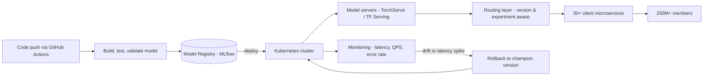

| Difficulty | Channel | Tags |
|---|---|---|
| beginner | devops | mlops, deployment |

Picture this: a routing layer designed to make your ML platform elegant quietly becomes the thing most likely to break it. That was the tension inside Netflix's model serving platform, which by 2025 was handling one million ML inference requests per second for more than 250 million members [1]. Engineers built a clean abstraction so 30+ client microservices could call models without knowing versions or cluster shards — then discovered the price of that elegance: a 10-20ms tax on every prediction and a single point of failure threatening every ML-powered experience at once [1]. This is the story of that tension, and what it reveals about the line between model deployment and model serving.

---

> ### Real-World Case — Netflix
>
> Netflix's centralized ML model serving platform powers personalized experiences (title recommendations, commerce, payment fraud detection) for 250M+ members. By 2025 the platform was serving 1 million ML inference requests per second across hundreds of model types and versions, and needed a routing layer so 30+ client microservices could access models without knowing which model version, cluster shard, or VIP to call.
>
> | | |
> |---|---|
> | **Challenge** | Model serving at this scale required context-aware routing (per-user A/B allocation, device, surface type), dynamic traffic splitting for canaries, instant rollback, and shadow-mode testing. Standard off-the-shelf solutions (AWS API Gateway, standalone service mesh proxies) couldn't expose gRPC, integrate with Netflix's experimentation platform, or handle rich domain-specific routing, so Netflix built a custom central routing service called Switchboard that became a mandatory hop for all traffic. |
> | **Solution** | Switchboard gave clients a single 'Objective' API abstraction and researcher-defined JavaScript routing rules for A/B experiments and traffic shifts. But at scale it became a single point of failure and added 10-20ms of latency per request from serialization/deserialization of payloads. Netflix then refactored to the 'Lightbulb' architecture: routing metadata resolution was decoupled from the data plane, actual request routing moved into the existing Envoy proxy (via a routingKey header), and Lightbulb only resolved context to minimal routing metadata, keeping large payloads out of the deserialize/re-serialize hot path. |
> | **Outcome** | The evolution preserved all the benefits of the Switchboard design — single integration point for 30+ clients, model version/experiment abstraction, context-aware routing — while eliminating the extra network hop, the 10-20ms added latency and tail-latency amplification, and the single-point-of-failure risk that threatened all ML-powered experiences at once. Netflix describes it as positioning the platform for reliable, efficient, scalable serving of personalized experiences. |
> | **Lesson** | In ML serving systems, routing/experimentation config must be decoupled from the data path: a central proxy that deserializes and re-serializes request payloads to make routing decisions becomes both a latency tax and a fleet-wide failure domain at high QPS. The counterintuitive fix was removing the router from the hot path and pushing routing into the existing Envoy mesh using lightweight header metadata. It also illustrates the real-world distinction between model serving (end-to-end workflow execution: feature computation, pre/post-processing, inference) and bare model inference. |

---

## Hook — One Million Requests a Second, and a Router in the Hot Seat

Ever wondered what happens to your "Recommended for You" row the moment Netflix ships a new recommendation model? Somewhere in a cluster, an inference request for your account is hitting a model server — one of roughly one million such requests every second, across hundreds of model types and versions [1]. That is more than 86 billion predictions a day, every one of them judged in milliseconds by a member with low patience and high standards.

Here is the twist: the thing that nearly broke this pipeline was not the models, and it was not the GPU fleet. It was the traffic cop — the routing layer deciding which version of which model gets which request. When that layer got it right, 30+ client microservices could call any model without knowing its version, cluster shard, or VIP [1]. When it got it wrong, everything slowed down at once.

The fix Netflix landed on upends a lot of assumptions about how ML systems should be architected. And understanding it starts with a distinction most teams blur every single day: deployment is not serving.

## Problem — Two Words That Should Not Be Synonyms

Deploy a model to a production cluster. Serve it to users. Same thing, right? Many developers discover this is the most expensive false assumption in ML engineering — the two words describe fundamentally different jobs that fail in different ways [9].

Deployment is the "how did this artifact get here?" problem. It covers CI/CD pipelines that build and validate model containers, infrastructure provisioning with tools like Kubernetes, Terraform, and SageMaker [8], artifact registries such as MLflow [5], plus monitoring, alerting, and rollback strategies. Deployment answers: did the new model actually land safely?

Serving is the "what happens every time a request shows up?" problem. It covers runtime inference APIs, model loading and version management, request routing, batching, and autoscaling of the serving layer itself [3][4]. Serving answers: did the request come back fast enough?

The stakes make the distinction urgent. A deployment failure is a deploy-time event — you catch it in a smoke test. A serving failure is a runtime event — you discover it when your latency budget blows up at 8pm during peak traffic, and users are already feeling it. Moreover, the tooling that makes deployment easy (YAML, pipelines, registries) gives you almost no help at request time, and the tooling that makes serving fast (gRPC, batchers, versioned endpoints) does nothing to get your artifact into production [7]. Teams that confuse the two end up with models that are "deployed" but effectively unusable — or inference APIs that are fast but impossible to ship safely.

## Real-World Case — Netflix, the Router in the Hot Seat

To see the collision between deployment and serving in the most brutal light, look at Netflix. By 2025 its model serving platform was the nervous system of the product: title recommendations, commerce, payment fraud detection — all of it flowing through a shared inference infrastructure [1].

The architecture that got them there was called Switchboard, a centralized routing layer. Its promise was exactly the version-abstraction dream: 30+ client microservices could hit one integration point and receive whatever model version, cluster shard, or VIP was appropriate, without the clients knowing any of the details [1]. Engineers could spin up experiments and route a slice of traffic to a challenger model with a config change.

But the design carried a hidden toll. Every prediction paid an extra network hop through the router — adding 10-20ms of latency to requests that were supposed to return in tens of milliseconds. Under load, that hop amplified tail latency, turning occasional stragglers into user-visible slowdowns. And because the router sat in the critical path for every ML-powered experience, it was a single point of failure: one incident there could take down recommendations, commerce, and fraud detection all at once [1].

The resolution is the plot twist. Netflix did not rip out the routing abstraction and force every client to call models directly. It kept the benefits — single integration point, model versioning, context-aware routing — but moved the routing closer to the models, eliminating the extra hop and the single-point-of-failure risk [1]. That is the difference between an architecture that is elegant on a whiteboard and one that survives a million requests per second.

## Deep Dive — Deployment vs Serving, the Real Trade-Offs

Building on the Netflix story, the distinction snaps into focus once you map the two halves of the lifecycle to the technologies that own them.

| | Deployment | Serving |
|---|---|---|
| Core job | Ship model artifacts safely | Answer inference requests fast |
| Representative tools | Kubernetes [2], Docker, Terraform, MLflow [5], SageMaker [8], GitHub Actions | TensorFlow Serving [3], TorchServe [4], BentoML [6], FastAPI, gRPC [7] |
| Key activities | CI/CD, provisioning, monitoring, rollback | Model loading, request routing, batching, autoscaling |
| Primary metric | Deploy success rate, rollback time | Latency p99, throughput (QPS), cold start |
| Failure mode | Bad artifact shipped to prod | Slow or failed requests at runtime |

The trade-offs are where experience shows. First, latency versus throughput: real-time prediction demands sub-100ms response times and typically means keeping hot models loaded in memory with small batch sizes, while batch inference optimizes for maximum throughput and can tolerate seconds of latency. Second, batch versus real-time: not every prediction needs to happen at request time — scoring last night's transactions can be a nightly batch job, but personalizing the homepage cannot. Choosing the wrong mode wastes either GPUs or milliseconds. Third, cold start: model servers load artifacts into memory lazily, so a fresh replica answers its first requests at 10-20x the steady-state latency. TensorFlow Serving and BentoML both support warm-start and prefetch strategies precisely because this surprise latency spike is a classic production battle scar [3][6].

⚠️ Watch Out: horizontal scaling (adding replicas) fixes throughput but does not fix latency — that requires model optimization, quantization, and fewer hops. Netflix learned the "fewer hops" half the hard way [1].

🔥 Hot Take: a model that takes 3 seconds to serve is not production-ready, no matter how accurate it is. Accuracy is deployed; speed is served.

## Workflow — From Commit to Prediction in Seven Steps

Now that the two worlds are clear, here is the workflow that connects them — the path a model takes from a code commit to a member's screen. Figure 1 (Deployment to Serving Lifecycle) shows the full loop.

1. Commit and build: training code lands in CI (GitHub Actions, Jenkins), which rebuilds the model and runs evaluation gates.
2. Register: the validated artifact is stored in a model registry like MLflow, tagged with version, metrics, and lineage [5].
3. Deploy: Kubernetes rolls the new model container out onto the serving cluster [2]; an immutable version means rollback is just pointing at the old artifact.
4. Serve: model servers (TorchServe [4], TensorFlow Serving [3]) load the artifact, expose an API, and keep replicas warm.
5. Route: a routing layer — the Netflix lesson — sends traffic to versions without clients knowing the details [1].
6. Observe: monitor latency percentiles, QPS, error rate, and prediction drift; that data feeds the next step.
7. Rollback: if p99 latency spikes or drift is detected, the routing layer shifts traffic back to the champion version — a config change, not a redeploy [10].

Notice where the speed lives: steps 1-3 can run for minutes or hours, but steps 4-7 happen in milliseconds and are where users feel every mistake. That asymmetry is why the serving layer deserves as much design attention as the model training itself.

## Code Example — Versioned Routing That Survives Peak Traffic

Here is the pattern that puts the whole story into practice: an inference gateway that keeps the version abstraction (clients never specify a version) while staying cheap enough to survive real traffic. The code mirrors Netflix's core idea in miniature — routing decisions pushed close to the models, with versioning and traffic splits handled in one place.

## Lessons Learned — The Takeaways Worth Stealing

After the Netflix case and the trade-off tour, the takeaways are compact but consequential.

- Deployment and serving are two jobs. One ships the artifact; the other answers the request. Teams that only build the first half end up with models that exist but feel broken [9].
- Keep version abstraction at the routing layer, not the client. Netflix's 30+ services never needed to know model versions — and neither do yours [1].
- Design rollback into routing, not redeploys. Traffic splits and weighted routing make "undo" a config change, not a fire drill [10].
- Watch the p99, not the average. Cold starts, GC pauses, and stragglers hide in the tail; the extra network hop at Netflix cost 10-20ms of exactly that tail [1].
- Measure serving latency from the client, not the server. The number that matters is what the member experienced, not what the replica reported.

A common mistake teams make: pouring effort into training pipelines while running serving as an afterthought, then being surprised when a latency budget explodes at launch. The counter-move is to define your serving SLO — p99 under 100ms, for example — before the model ever ships, and let that number drive architecture decisions like batch size, replica count, and whether to add a routing hop.

---

## Deployment to Serving Lifecycle

<strong>Original Interview Question</strong>

**Q:** Explain the key differences between model serving and model deployment in ML systems, including specific technologies, scaling considerations, and real-world implementation patterns?

**A:** Deployment encompasses CI/CD pipelines, infrastructure setup, and monitoring using tools like Kubernetes, MLflow, and SageMaker. Serving focuses on runtime inference APIs with frameworks like TensorFlow Serving, TorchServe, or BentoML, handling request routing, model versioning, and autoscaling. Key trade-offs include latency vs throughput, batch vs real-time inference, and cold start optimization.

## Conclusion

Netflix's router nearly became the thing that took down every ML-powered experience at once — until engineers realized the abstraction itself was not the problem, its placement was [1]. That is the moral of the story: deployment gets your model into the cluster, but serving is where your users meet your work, and the line between them is the difference between an architecture that is elegant and one that is alive. Tomorrow, pick one model you own, write down its serving SLO (p99 latency, target QPS), and ask honestly: do you know which version is answering today, and how fast could you roll back if it went wrong? The answer will tell you whether you have been deploying — or truly serving. Share it with your team; the 30+ microservices you save could be your own.

---

## References

1. [Netflix incident report](https://netflixtechblog.com/state-of-routing-in-model-serving-16e22fe18741) — article
2. [Kubernetes Deployments](https://kubernetes.io/docs/concepts/workloads/controllers/deployment/) — documentation
3. [TensorFlow Serving](https://github.com/tensorflow/serving) — documentation
4. [TorchServe](https://github.com/pytorch/serve) — documentation
5. [MLflow Documentation](https://mlflow.org/docs/latest/) — documentation
6. [BentoML](https://github.com/bentoml/BentoML) — documentation
7. [gRPC Documentation](https://grpc.io/docs/) — documentation
8. [AWS SageMaker Documentation](https://docs.aws.amazon.com/sagemaker/) — documentation
9. [MLOps (Machine Learning Operations)](https://en.wikipedia.org/wiki/MLOps) — article
10. [Envoy Proxy Documentation](https://www.envoyproxy.io/docs) — documentation

---

**Author:** Satishkumar Dhule — [GitHub](https://github.com/satishkumar-dhule) · [LinkedIn](https://linkedin.com/in/satishkumar-dhule) · [Website](https://satishkumar-dhule.github.io)
