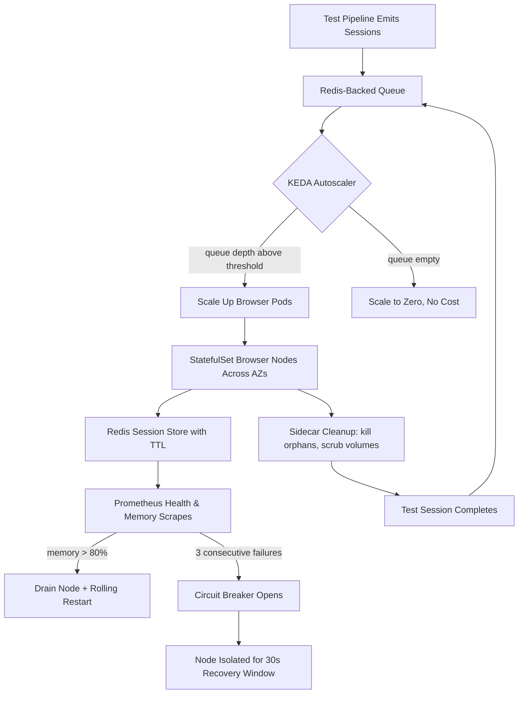

| Difficulty | Channel | Tags |
|---|---|---|
| advanced | system-design | selenium, webdriver, grid |

Blibli.com, one of Indonesia's largest e-commerce platforms and an Apple authorized reseller listed on the IDX, runs thousands of automated UI test scenarios every hour as a mission-critical part of its development pipeline. Those tests once ran on a Selenium grid of always-on VMs that choked during peak events and demanded painful manual provisioning — until a Kubernetes rewrite changed everything [1]. This is the story of that transformation, and the blueprint you can use to build a grid that handles 10,000 concurrent sessions, survives multi-datacenter chaos, and never leaks memory again.

---

> ### Real-World Case — Blibli.com
>
> Blibli.com — one of Indonesia's largest e-commerce platforms (an Apple authorized reseller, publicly listed on the IDX) — runs thousands of automated UI test scenarios every hour as a mission-critical part of its development pipeline. Their old Selenium setup ran on always-on VMs via Selenoid, which couldn't burst for peak events and required painful manual VM provisioning and per-server browser upgrades.
>
> | | |
> |---|---|
> | **Challenge** | They needed to run large-scale parallel browser tests (hundreds of concurrent sessions for events like the iPhone 16 launch in Indonesia, simulating offline sales across all branches) but were blocked by hard server limits. At the same time, keeping idle VMs running 24/7 was expensive and browser version upgrades had to be applied manually on every server. |
> | **Solution** | They migrated to Selenium Grid 4 on Google Kubernetes Engine (GKE) and used KEDA (Kubernetes Event-Driven Autoscaling) with the official Selenium Grid scaler, which polls the Grid's GraphQL API and scales browser node pods based on the number of pending requests in the session queue — not CPU. Browser pods scale from zero to hundreds on demand, nodes are drained before termination for graceful shutdown, and the cluster drains unused nodes entirely when idle. |
> | **Outcome** | The grid now spins up hundreds of concurrent browsers during busy periods and scales to zero when idle. Cost comparison: a single always-on N2-standard VM (8 vCPU/32 GiB) costs ~$371/month on Compute Engine, while the equivalent GKE node delivered 40-50% savings on one VM — and in practice far more because nodes scale to zero instead of running 24/7. No more manual VM prep or per-server browser upgrades, and handling peak event load tests became a one-line max-pod-config change. |
> | **Lesson** | CPU/memory-based autoscaling (Kubernetes HPA) fundamentally fails for Selenium Grids — browser pods use variable CPU and queued-but-not-yet-running tests trigger no scale-up — so scale based on the Grid's actual session queue depth via event-driven autoscaling, and scale to zero when idle to turn test infrastructure from a fixed cost into a pay-per-use one. |

---

## Hook — When the flash sale hits, your grid dies first

Ever wondered why your test grid starts gasping for air exactly when you need it most? It is 10:30 PM before a flash-sale launch, a hundred commits have landed, and your CI pipeline is queueing test runs like a nightclub bouncer on double shift. The first sign of trouble is subtle: a session hangs, then another, then the node hosting them quietly eats 12 GB of RAM until the OS pulls the plug. You restart the node, the queue heals, and three hours later the same thing happens again. Sound familiar? This is the reality of running Selenium at scale, and it gets worse with every browser you add. Here is the uncomfortable truth: the old 'just throw more VMs at it' playbook stops working long before you reach the scale your business actually needs. The fix is not a bigger budget — it is a fundamentally different architecture, and the teams who figured it out first are quietly saving hundreds of thousands of dollars a year while shipping faster.

## Problem — Always-on VMs, always-on bills, always-on headaches

Many developers start their Selenium journey the way every tutorial tells them to: spin up a few VMs, install Selenoid or Selenium Server, and point tests at them. It works great — until it does not. Consequently, three specific pains show up in almost every team that outgrows the tutorial phase. First, capacity is a binary choice: the grid is either always on, burning money 24/7, or always too small, crashing during peak events. Second, every browser upgrade becomes a manual ops ritual — SSH into each server, install the new Chrome, pray nothing else breaks. Third, memory leaks are a slow-burn disaster. Selenium's browser drivers are notorious for holding onto RAM, and on an always-on VM those leaks accumulate for days until a node silently degrades to 50% throughput [1]. These pains compound. The always-on capacity you pay for is idle 90% of the time, and the manual provisioning means scaling up for a big release takes a human, not a system. The real problem is architectural, not operational: you are treating a bursty, elastic workload like a long-running server farm. To fix it, you have to change what a 'node' even is.

## Real-World Case — Blibli.com: from Selenoid VMs to scale-to-zero GKE

Blibli.com lived every one of those pains. As one of Indonesia's largest e-commerce platforms, it runs thousands of automated UI tests every hour, and its Selenium grid ran on always-on VMs via Selenoid [1]. The grid simply could not burst for peak events — think flash sales and big campaign drops — and every browser upgrade meant manual per-server work across the fleet. Rather than accept the tax, the team rebuilt the grid on Kubernetes with KEDA-based autoscaling [1]. The results were dramatic. During busy periods the grid now spins up hundreds of concurrent browsers, and when idle it scales to zero — the node pool literally stops existing. On cost alone the math is brutal: a single always-on N2-standard VM (8 vCPU/32 GiB) costs roughly $371/month on Compute Engine, while the equivalent GKE node delivered 40–50% savings on one VM — and far more in practice, because nodes scale to zero instead of running 24/7 [1]. No more manual VM prep, no more per-server browser upgrades, and handling peak-event load tests became a one-line change to a max-pod config value. Here is the plot twist you should sit down for: scaling to zero sounds like a performance risk, but for a bursty test workload it is the single best cost optimization you can make — and it forces your architecture to be clean enough to survive it.

## Deep Dive — The anatomy of a 10,000-session grid

Building on Blibli's lesson, the question becomes: how do you design a grid that can burst to 10,000 concurrent sessions with 99.9% uptime, across multiple data centers, without leaking a single megabyte? The answer starts with the classic hub-node pattern, but with a Kubernetes twist. Selenium Grid's distributed model uses a hub (or router) that assigns sessions to nodes, and modern Selenium Grid separates the router, distributor, and event bus into independently scalable components [2]. In a Kubernetes deployment, browser nodes run as pods managed by StatefulSets so each node keeps a stable identity and storage [4], spread across multiple availability zones for fault tolerance. Then you need the math. At roughly 50 sessions per node, 10,000 concurrent sessions means at least 200 nodes; at 2 GB RAM per node that is a 400 GB baseline, and with a 30% headroom buffer you land at 520 GB of cluster memory. The grid targets a P99 session-initiation latency under 2 seconds, achieved with regional load balancing that routes new sessions to the nearest healthy capacity. However — and this is where most designs fall apart — raw capacity is worthless if sessions leak. Memory management is therefore a three-layer defense. Redis stores session metadata with TTL-based expiration so stale sessions clean themselves up automatically [5]. Kubernetes init containers remove stale Docker volumes on node startup. And a Prometheus-powered monitoring layer tracks memory trends and session duration, alerting at 80% utilization and triggering weekly rolling restarts to flush accumulated garbage [6]. On the failure side, you need circuit breakers — a pattern borrowed from distributed service design that isolates failing nodes for a 30-second recovery window instead of letting them drag the whole grid down [7]. Finally, high availability across data centers requires more than replicas: leader election prevents split-brain when a network partition splits your hub cluster, and Pod Disruption Budgets guarantee at least 85% capacity survives even during deliberate node drains [9]. When would you actually use this? Any time your test suite is on the critical path to production and a broken grid means a blocked deploy. Here is the tradeoff table: Always-on VMs vs Kubernetes — You pay $371+/month per VM, scaling is manual, browser upgrades are manual, failures take down sessions; versus Kubernetes where cost scales with usage, scaling is automatic via HPA and KEDA [3], upgrades are image rebuilds, and failures self-heal. The only real cost is architectural discipline — and that is a tax you were paying anyway, in incident calls.

## Workflow — From test trigger to session teardown in six steps

This leads to the operational flow that makes the whole system tick — and it all revolves around one principle: let the platform manage the lifecycle, not the humans. The diagram below shows the full journey of a test run from trigger to teardown, and each step matters. Step one: your test pipeline emits a session request, which lands in a Redis-backed queue. Step two: the autoscaler watches queue depth — when it crosses a threshold, KEDA scales the Kubernetes deployment up [8]; when the queue empties, it scales back down to zero [3]. Step three: new browser pods join the StatefulSet, register their health endpoint, and pick up sessions via weighted round-robin that accounts for node capacity and response time. Step four: each session writes its metadata to Redis with a TTL — if a session is abandoned, it simply expires and its slot frees up [5]. Step five: Prometheus scrapes every node every 10 seconds; three consecutive failed health checks remove a node immediately, and the circuit breaker isolates it for a 30-second cooldown so it cannot poison new sessions [6][7]. Step six: a sidecar container on every pod owns cleanup — terminating orphaned browser processes, scrubbing volumes, and reporting memory pressure before it becomes a crash [10]. Notice what is missing from that flow: humans. There is no SSH session, no manual restart, no 'hey, can someone check the test box?' The architecture does the babysitting, and your team does the engineering.

## Code Example — The sidecar cleanup worker that keeps leaks away

The most overlooked piece of the whole design is the memory-leak defense, so let's build the small worker that makes it real. This is the kind of sidecar that runs inside every browser pod, keeping an eye on session hygiene and node memory — the exact pattern that prevents the slow degradation that killed always-on grids [10].

## Lessons Learned — What to steal, what to skip, and what will burn you

After this journey, three takeaways stand above the rest. First, scale-to-zero is not a compromise — for bursty test workloads it is the endgame, saving real money while forcing you to design something that can actually autoscale [1][3]. Second, memory leaks are a lifecycle problem, not a monitoring problem: TTLs, init containers, sidecar cleaners, and rolling restarts beat any 'just alert me when it's high' strategy, because by the time you are alerted, the grid is already degrading [5][10]. Third, availability is a design property, not a config flag: multi-AZ spread, leader election, circuit breakers, and Pod Disruption Budgets are what turn a '99.9% aspirational' SLO into an actual number [7][9]. And here are the battle scars to avoid: don't make TTLs too short — a 30-minute session that dies at minute 29 will teach you about flaky test suites the hard way; don't put sessions on the same Redis keyspace as your cache, or a cleanup sweep will nuke live state; and never treat your browser image as immutable — a Chrome update in the image is a rollout, which is exactly why canary deployments with traffic splitting exist for new node versions. If this feels overwhelming, you are not alone — every team that builds this has a scar from the version before. Start small: pick one leak source, add one TTL, measure for a week.

---

## Grid Scaling and Recovery Flow

<strong>Original Interview Question</strong>

**Q:** Design a scalable Selenium Grid architecture to handle 10,000 concurrent test sessions with 99.9% uptime, ensuring zero memory leaks through automatic session lifecycle management, real-time monitoring, and graceful node failure recovery across multiple data centers?

**A:** Deploy Kubernetes cluster with auto-scaling node pools, Redis session store with TTL policies, Prometheus metrics for memory monitoring, circuit breakers for node isolation, and sidecar containers for session cleanup. Implement health checks, resource quotas, and rolling updates.

## Conclusion

So what is the moral of this story? Your Selenium grid is not a pile of VMs — it is a bursty, elastic production service that deserves the same architecture discipline as the checkout API in front of it. Blibli.com proved that a Kubernetes-native, scale-to-zero grid is not just more resilient than the old always-on fleet, it is cheaper, self-healing, and dramatically less stressful to operate [1]. Start tomorrow: put session metadata in Redis with TTLs, add a Prometheus memory alert at 80%, and schedule one rolling restart a week. Then measure — because the journey from 'grid that survives' to 'grid that thrives' is one metric at a time. And the one insight worth repeating to your team? Scale-to-zero is not a feature you bolt on; it is the reward for building a grid clean enough to deserve it.

---

## References

1. [Blibli.com incident report](https://medium.com/bliblidotcom-techblog/scaling-selenium-grid-on-gcp-using-keda-which-saves-us-on-the-cost-too-b479c00c5526) — article
2. [Selenium Grid architecture documentation](https://www.selenium.dev/documentation/grid/architecture/) — documentation
3. [Kubernetes horizontal pod autoscaling](https://kubernetes.io/docs/tasks/run-application/horizontal-pod-autoscale/) — documentation
4. [Kubernetes StatefulSets](https://kubernetes.io/docs/concepts/workloads/controllers/statefulset/) — documentation
5. [Redis key expiration and TTL](https://redis.io/docs/latest/develop/using-keys/expiration/) — documentation
6. [Prometheus monitoring overview](https://prometheus.io/docs/introduction/overview/) — documentation
7. [Circuit breaker pattern (Azure Architecture Center)](https://learn.microsoft.com/en-us/azure/architecture/patterns/circuit-breaker) — documentation
8. [KEDA — Kubernetes Event-Driven Autoscaling](https://keda.sh/docs/) — documentation
9. [PodDisruptionBudget in Kubernetes](https://kubernetes.io/docs/tasks/run-application/configure-pdb/) — documentation
10. [Kubernetes sidecar containers](https://kubernetes.io/docs/concepts/workloads/pods/sidecar-containers/) — documentation

---

**Author:** Satishkumar Dhule — [GitHub](https://github.com/satishkumar-dhule) · [LinkedIn](https://linkedin.com/in/satishkumar-dhule) · [Website](https://satishkumar-dhule.github.io)
