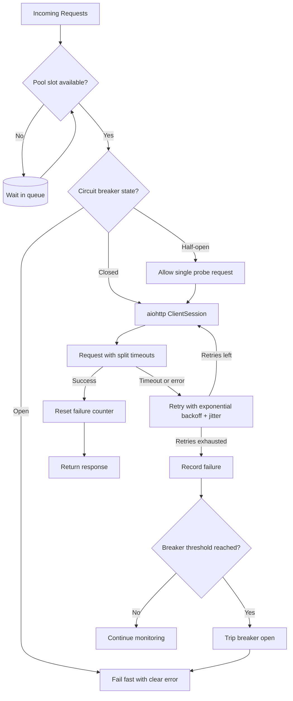

| Difficulty | Channel | Tags |
|---|---|---|
| advanced | backend | asyncio, aiohttp, concurrency |

Netflix's API brokers catalog and subscriber metadata to hundreds of device types, handling more than one billion requests a day with peaks around 20,000 req/s [1]. Because every API call fans out roughly 6x into dozens of upstream SOA services, a single slow or failing dependency could saturate every Tomcat request thread in seconds and take down streaming for all members [1]. This is the exact failure you are trying to prevent the day your own aiohttp service meets a slow dependency. Here is how to build a connection pool that degrades gracefully instead of collapsing.

---

> ### Real-World Case — Netflix
>
> Netflix's API brokers catalog and subscriber metadata to hundreds of device types and handles over 1 billion requests per day (peaking at 20,000 req/s). Because each API call fans out ~6x into dozens of upstream SOA services, a single slow or failing dependency could rapidly saturate every Tomcat request thread and take down the entire API in seconds — breaking streaming for all members.
>
> | | |
> |---|---|
> | **Challenge** | Prevent cascade failures and connection-pool saturation: when one downstream service became latent or failed, blocked threads piled up until the whole API cluster was unusable, so Netflix needed a way to limit concurrency to each dependency, fail fast instead of queueing, and degrade gracefully. |
> | **Solution** | The API team built a fault-tolerance layer (which became Hystrix) combining network timeouts + retries, per-dependency thread pools/semaphores to cap concurrent calls, and the circuit breaker pattern: when a dependency's error rate crossed a threshold (e.g., 50% in a 10-second rolling window), the circuit tripped and all requests were short-circuited to fallbacks (custom fallback, fail-silent, or fail-fast) instead of hitting the failing service. A single half-open probe was allowed after the sleep window to test recovery and re-close the circuit. |
> | **Outcome** | Tens of billions of thread-isolated and hundreds of billions of semaphore-isolated calls are executed through Hystrix every day, with a dramatic improvement in uptime. In one documented incident, the team themselves caused a database-throttling spike while bypassing a buggy cache — the circuit tripped automatically (80% error rate, 157 of 200 instances serving fallbacks from local query cache), and video views per second stayed nearly flat versus the prior week. |
> | **Lesson** | Build fault tolerance in at the client/pool layer — don't expect infrastructure to save you. The plot twist: their own bug caused the outage, and the circuit breaker they'd built for external failures saved member experience from their internal mistake. Also counterintuitive: when a circuit trips, do NOT increase thread pools/timeouts to 'give it breathing room' — you'll DDOS yourself; let it shed load and recover. |

---

## Hook — It Was 3am When the Pager Went Off

Picture the scene: it's 3am, and the pager starts screaming. Your async service, the one that sits between your frontend and a dozen upstream APIs, has gone from 150ms p95 latency to 30 seconds. Every request that hits your event loop queues behind requests silently waiting on a dependency that stopped answering. Your connection count climbs, file descriptors run out, and the whole service tips over. The frustrating part? It wasn't your code that broke. It was a downstream service you don't control. Sound familiar? If you've built anything that talks to the outside world, you already know that feeling. This article is about making sure that 3am call never happens again — by learning from a company that solved this exact problem at massive scale.

## Problem — One Slow Dependency Shouldn't Take Your Service Down

Here is the uncomfortable truth about distributed systems: your service is only as reliable as its weakest upstream dependency. In synchronous code, a slow downstream call occupies a thread. In asyncio, it doesn't block the event loop, but it does occupy a connection — and connections are the real scarce resource [7]. When a dependency slows down, every in-flight request holds a connection hostage. New requests pile up, and each one wants its own connection. That's where the real trouble begins. Many developers discover that a naive aiohttp setup has no upper bound on concurrent connections [5]. The result? Socket exhaustion, port exhaustion, and an event loop buried under a mountain of half-finished tasks. To make matters worse, the standard reactive fix — retry — usually amplifies the problem. If 100 clients retry a failing endpoint at the same moment, the retries become a thundering herd that takes the already-struggling dependency down for good [4]. You need three things: a hard cap on concurrency, a smart retry strategy, and a way to stop sending requests to services that are clearly broken.

## Real-World Case — Netflix's 1 Billion Requests a Day

Netflix built its API layer to broker catalog and subscriber metadata to hundreds of device types, handling over a billion requests per day and peaking at 20,000 req/s [1]. Here is the catch: each of those API calls fans out roughly 6x into dozens of upstream SOA services [1]. Do the math on that amplification, and the risk becomes obvious. A single slow or failing dependency could rapidly saturate every Tomcat request thread in the API tier — breaking streaming for all members within seconds [1]. So Netflix built Hystrix, a resilience library built around the circuit breaker pattern [8][2]. It used bulkhead-style isolation — both thread pools and, for high-volume calls, semaphore isolation — to contain failures to the affected dependency [3][8]. The numbers are staggering: tens of billions of thread-isolated and hundreds of billions of semaphore-isolated calls execute through Hystrix every day, with a dramatic improvement in uptime [1]. But the most telling story is the incident Netflix's own team caused. While bypassing a buggy cache, they triggered a database-throttling spike. The circuit tripped automatically at an 80% error rate, and 157 of 200 instances started serving fallbacks from a local query cache. The result? Video views per second stayed nearly flat versus the prior week [1]. That's the whole point: when degradation is designed in, failure becomes invisible to your users.

## Deep Dive — Three Legs of the Resilience Stool

The Netflix story reduces to three patterns, and they map cleanly onto aiohttp. First, semaphore limiting. A semaphore is the cheapest bulkhead you can build in asyncio: it doesn't block the event loop, it just gates how many concurrent requests reach the network [6][3]. Unlike a thread pool, an asyncio.Semaphore costs almost nothing per permit, which is exactly why Netflix used semaphore isolation for its highest-volume calls [8]. Second, exponential backoff. When a request fails, retrying immediately is pointless — the dependency is still broken [4]. Doubling the delay with each attempt — 0.5s, 1s, 2s — spreads retries out over time, and adding random jitter prevents synchronized retry storms [4]. Third, the circuit breaker. Here is the plot twist: retries and circuit breakers pull in opposite directions. Retries amplify load to a struggling service; the breaker cuts it off entirely [2]. The breaker trips open after N consecutive failures, rejects requests immediately (fail fast), and after a cooldown window enters a half-open state to probe whether the service recovered [2]. The most underrated lever is timeouts. Every production aiohttp service needs distinct connect, socket-read, and total timeouts [5]. A request that never times out is a connection that is lost forever.

## Workflow — From Request to Response, Gracefully

Building on the patterns above, here is the request lifecycle your pool manager should enforce. The diagram below tells the visual story: requests funnel through a semaphore (the bulkhead), get checked by the circuit breaker (the gate), and only then touch the network. When the pool is saturated, requests wait in a queue instead of spawning unbounded connections. When the breaker is open, requests fail fast with a clear error — no retries, no wasted sockets. When a request succeeds, the failure counter resets. When it fails, the failure is recorded, and if retries remain, the request waits out an exponential backoff delay with jitter before trying again [4]. If retries are exhausted, the breaker is one step closer to tripping. Finally — and many developers forget this — the whole thing needs a graceful shutdown path that closes idle connections so the process can actually exit cleanly [7].

## Code Example — A Production-Grade Connection Pool

Here is what the full pattern looks like in aiohttp: a CircuitBreaker class that tracks consecutive failures and trips open, plus a ConnectionPoolManager that combines semaphore limiting, exponential backoff with jitter, and distinct timeouts. The code below is designed to be dropped into a service and adapted. A few details matter. The semaphore is acquired first, so concurrency is capped even when the breaker is open — that keeps the fail-fast path from turning into a connection flood. Timeouts are split into connect and socket-read so a hung connection fails before the total budget is wasted [5]. The retry loop increments a delay as 2^attempt, then adds jitter so 100 concurrent failures don't retry in lockstep [4]. On shutdown, close() waits for the session to release its keep-alive connections — without this, tests hang and deploys hang [7].

## Lessons Learned — What Netflix Taught Us About Failing Gracefully

So what should you do differently tomorrow? First, cap your concurrency. If you're not using a semaphore or connector limit, your pool is a liability waiting to happen [6]. Second, make timeouts non-negotiable. Every connection needs a connect timeout, a read timeout, and an overall budget [5]. Third, treat the circuit breaker as a feature, not a failure — Netflix's own team tripped their breaker during an incident and viewers never noticed [1]. Common battle scars to avoid: connection leaks when responses aren't closed (use async with), ignoring SSL context validation, forgetting to close sessions on shutdown, and burying retries inside the semaphore so failures pile up instead of failing fast [2]. Also keep in mind that retries and the circuit breaker must be configured as a pair: retries protect against transient blips, while the breaker protects against sustained outages [2]. The one insight to share with your team: a graceful failure beats a silent hang every time. Your users forgive a fast, clear error far more readily than a spinner that never resolves.

---

## Graceful Degradation Flow

<strong>Original Interview Question</strong>

**Q:** How would you implement a connection pool manager for aiohttp that handles graceful degradation under high load and connection timeouts?

**A:** Implement a connection pool manager for aiohttp using a semaphore to limit concurrent connections, exponential backoff for retrying failed requests, and circuit breaker pattern to gracefully degrade under high load and connection timeouts.

## Conclusion

Netflix's API survives billions of requests a day because it treats failure as inevitable and designs for it — circuit breakers, bulkheads, and fallbacks that keep streaming alive even when upstream services misbehave [1]. You can build the same resilience into your aiohttp service starting today: add a semaphore to cap concurrency, backoff with jitter to survive transient blips, and a circuit breaker to fail fast when things go south. Start with the code example above, add metrics around breaker trips and retry rates, and you'll never be caught off guard at 3am again. Remember: the goal isn't to never fail — it's to fail gracefully.

---

## References

1. [Making the Netflix API More Resilient](https://netflixtechblog.com/making-the-netflix-api-more-resilient-a8ec62159c2d) — blog
2. [Circuit breaker design pattern](https://en.wikipedia.org/wiki/Circuit_breaker_design_pattern) — documentation
3. [Bulkhead pattern](https://en.wikipedia.org/wiki/Bulkhead_pattern) — documentation
4. [Exponential backoff](https://en.wikipedia.org/wiki/Exponential_backoff) — documentation
5. [aiohttp ClientSession reference](https://docs.aiohttp.org/en/stable/client_reference.html) — documentation
6. [asyncio Synchronization Primitives](https://docs.python.org/3/library/asyncio-sync.html) — documentation
7. [asyncio — Asynchronous I/O](https://docs.python.org/3/library/asyncio.html) — documentation
8. [Netflix/Hystrix](https://github.com/Netflix/Hystrix) — documentation
9. [Coroutines and Tasks](https://docs.python.org/3/library/asyncio-task.html) — documentation

---

**Author:** Satishkumar Dhule — [GitHub](https://github.com/satishkumar-dhule) · [LinkedIn](https://linkedin.com/in/satishkumar-dhule) · [Website](https://satishkumar-dhule.github.io)
