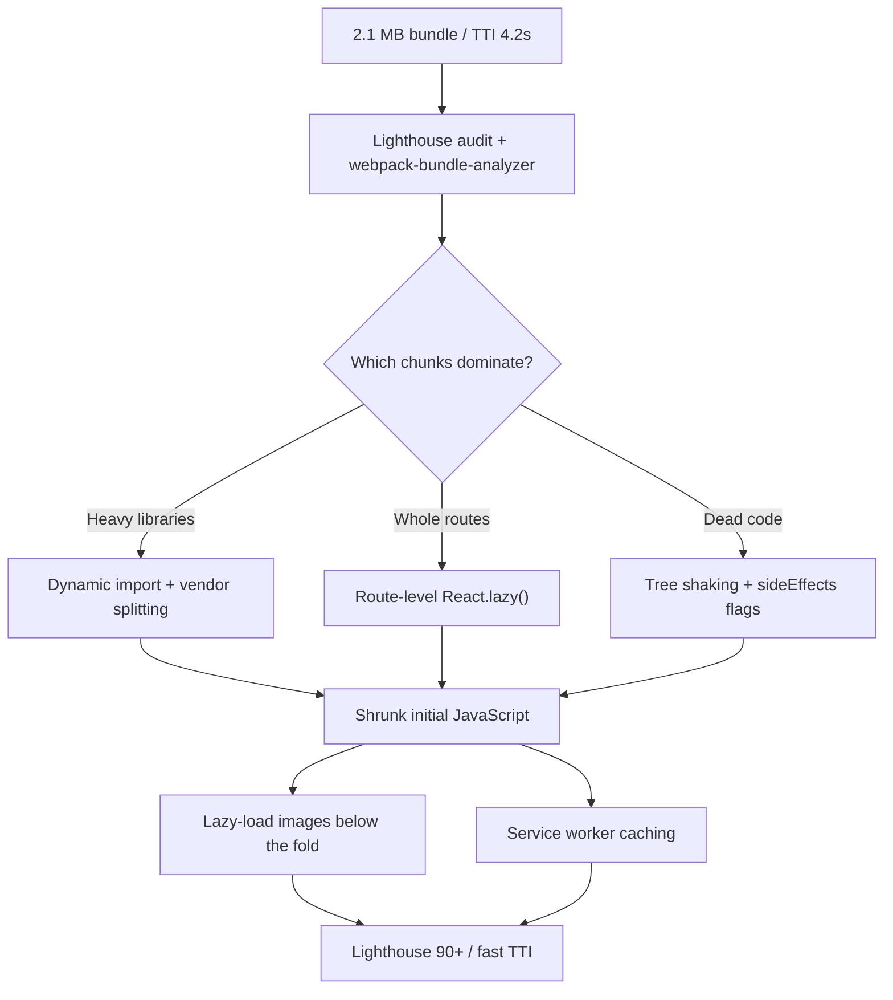

| Difficulty | Channel | Tags |
|---|---|---|
| intermediate | frontend | lighthouse, bundle, lazy-loading |

Somewhere in 2018, an Airbnb engineer changed a single line of code and then waited. Thirty seconds. A minute. Two minutes - just to see the browser update [1]. By then, the company's web codebase had quadrupled in size, and its slowest production build took 30.5 minutes. It is the same disease hiding inside your React app today: a 2.1 MB bundle, a 4.2-second Time to Interactive, and a Lighthouse score stuck at 65. This is the story of how teams escape that trap - and how you can push your score past 90.

---

> ### Real-World Case — Airbnb
>
> By 2018 Airbnb's web codebase had quadrupled in size, and their Webpack-based build had become a bottleneck. A one-line code change took 30 seconds to 2 minutes to reflect in the browser, and the slowest production build took 30.5 minutes, dragging down developer productivity and the experience of shipping performance fixes.
>
> | | |
> |---|---|
> | **Challenge** | Webpack required knowing every entry point upfront and pre-compiled the whole project, so as the codebase grew past ~49,000 modules, rebuilds and bundle updates got catastrophically slow. The out-of-the-box Metro setup produced giant ~5MiB bundles per entry point that could not be HTTP-cached — every code change forced a full re-download. |
> | **Solution** | Airbnb migrated their web platform from Webpack to Metro (Meta's bundler built for React Native). In development, Metro's on-demand bundling made changes reflect ~80% faster. In production, they implemented code splitting by dynamic import boundaries (borrowing Webpack's split algorithm) so a change to one file only invalidated that chunk while the rest reused the browser cache. Notably, they optimized development and production differently: dev prioritized fast page loads, production prioritized shipping fewer and smaller JavaScript bundles. |
> | **Outcome** | Dev time-to-interactive for UI changes improved 80%. The slowest production build dropped 55%, from 30.5 minutes to 13.8 minutes. Production bundle size on airbnb.com decreased ~20% (1549 KB to 1226 KB) versus dynamic-import-boundary splitting, and Airbnb Page Performance Scores improved ~1% on Metro-built pages — all validated with an in-production A/B test of Metro vs Webpack. |
> | **Lesson** | Code splitting by dynamic import boundaries is the key to making JavaScript bundles cacheable, and the 'right' split strategy differs by context: in development optimize for fast reload and cacheability, in production optimize for the smallest initial payload. Sometimes the biggest win for web performance comes from adopting an unexpected tool — a React Native bundler — rather than further tuning your current one. |

---

## Hook — The Two-Minute Curse

You have been there. One tiny edit - a className change, a typo fix - and then the reload. Spinner. Seconds stretch. At Airbnb in 2018, a single line of code took 30 seconds to 2 minutes to show up in the browser [1]. That is not a slow dev machine. That is a signal that the build - and the bundle behind it - has quietly metastasized.

The stakes are concrete: a 2.1 MB JavaScript bundle and a 4.2-second Time to Interactive are the same disease, just wearing different clothes. Every second of load time is a second your user spends staring at a blank screen, and a second your competitors are spending elsewhere. But here is the plot twist: the fix is rarely minifying harder or buying a faster laptop. It is restructuring how JavaScript reaches the browser in the first place.

💡 Insight: A slow build and a heavy bundle are the same disease. Fix the structure, and both heal together.

## Problem — A Lighthouse 65 You Cannot Argue With

Picture the prompt every frontend engineer dreads: "Improve the React app's Lighthouse score from 65 to 90+. Bundle size: 2.1 MB. Time to Interactive: 4.2 seconds." Sound familiar? It is the same request hiding behind countless JIRA tickets, and it trips up developers who attack it tactically instead of strategically.

Lighthouse is not a vibe check. It is an audit that scores performance, accessibility, best practices, and SEO, and the performance score is brutally sensitive to how much JavaScript ships down the wire [10]. A 2.1 MB bundle forces the browser to download, parse, and execute megabytes of code before the first meaningful paint. Every kilobyte compounds the TTI problem, which compounds the bounce rate.

Here is the trap: most developers reach for the first thing that looks fast - a CDN here, a cache header there. You might think the answer is compression or a beefier server. Actually, the systemic fix lives upstream: what you ship, when you ship it, and how the bundler splits it. Nobody wakes up intending to ship 2.1 MB. It accumulates one seemingly harmless import at a time.

## Real-World Case — Airbnb

Building on that dread, look at what happens when the problem scales to a company the size of Airbnb. By 2018, the Airbnb web codebase had quadrupled in size, and the Webpack-based build had become the single biggest bottleneck in shipping UI changes [1]. The numbers deserve a moment: a one-line code change took 30 seconds to 2 minutes to reflect in the browser, and the slowest production build clocked in at 30.5 minutes. No team at that scale can afford to lose 30 minutes on every release - not to mention the patience drained from every engineer sitting at a reload spinner.

Airbnb's response was to evaluate a different bundler, Metro, and to validate it with an in-production A/B test of Metro versus Webpack. The results proved that tooling is a performance lever in its own right: developer time-to-interactive for UI changes improved 80%, the slowest production build dropped 55% (from 30.5 to 13.8 minutes), and the production bundle on airbnb.com shrank roughly 20%, from 1549 KB to 1226 KB, versus dynamic-import-boundary splitting. Page Performance Scores improved about 1% on Metro-built pages [1].

Here is the insight that transfers directly to your React app: Airbnb did not ship fewer features. They changed how code was bundled and loaded, and everything downstream got faster. The bundle is not just a deployment concern - it is a developer experience concern, a user experience concern, and ultimately a business metric.

## Deep Dive — The Anatomy of a Fat Bundle

However, understanding the disease is only half the battle. You need a vocabulary for the cure. Every optimization below targets one of four costs: download time, parse time, execution time, or wasted bytes.

First, measure before you touch anything. webpack-bundle-analyzer turns your opaque bundle into an interactive treemap, making the real offenders - often a single charting library or a legacy date utility - impossible to ignore [4]. Developers are routinely stunned to discover that one dependency is responsible for 40% of the bundle.

Second, split along your routes, not your components. Route-based code splitting with React.lazy() downloads only the JavaScript a user needs for the screen they are on [8]. Component-based splitting is reserved for the genuinely heavy pieces that appear only during specific interactions.

| Option | Route-based splitting | Component-based splitting |
| --- | --- | --- |
| What it splits | Whole screens and pages | Individual heavy components |
| Best for | Apps with many views | Widgets, charts, modals |
| Initial-load impact | High - biggest win | Moderate |
| Risk | Minimal | Over-splitting causes request waterfalls |
| Watch out for | Duplicated shared chunks | Suspense fallback flicker |

Third - and this is where many developers get burned - tree shaking is not automatic. It only works with proper ES module configuration. The bundler can statically analyze and drop dead code only when you use ESM imports and declare sideEffects: false where it is safe [2][5]. A single CommonJS import can silently keep hundreds of kilobytes alive.

⚠️ Watch Out: Tree shaking happens at build time and depends on imports being statically analyzable. One dynamic require() can undo the entire optimization.

Fourth, images. The browser downloads images in parallel with script parsing, so lazy-loading below-the-fold media with Intersection Observer is a quick, massive win [6]. Finally, do not let caching be an afterthought. A service worker with a sensible strategy turns repeat visits into near-instant loads [7], built on the HTTP caching semantics defined in RFC 9111 [9].

This all leads to a repeatable workflow.

## Workflow — The 65-to-90 Pipeline

This is where the pieces snap together. The diagram below shows the full pipeline - think of it as the treasure map from "Lighthouse 65" to "Lighthouse 90+".

1. Baseline - Run Lighthouse (mobile and desktop) and capture TTI plus bundle size. Record the numbers before any change; this is the "before" you will need later [10].
2. Analyze - Open webpack-bundle-analyzer and rank the top ten chunks by size [4].
3. Split - Wrap every route in React.lazy(). Wrap genuinely heavy on-demand components as well [8].
4. Tree shake - Audit imports, switch to named ESM imports, and set sideEffects: false where safe [2].
5. Lazy media - Apply Intersection Observer to below-the-fold images [6].
6. Cache - Add a service worker with a stale-while-revalidate strategy [7].
7. Re-measure - Rerun Lighthouse. Make one optimization at a time so you know exactly what moved the needle [10].

🎯 Key Point: keep a score log that tracks bundle size and TTI after every single change. The discipline of measuring one variable at a time is what separates a 65 that stays at 65 from a 65 that climbs to 90+.

## Code Example — Lazy Loading Without the Landmines

With the workflow mapped, here is the implementation that ties it together - route-based splitting with React.lazy() and Suspense, wrapped in an error boundary so a failed chunk download never white-screens your app.

## Lessons Learned — What the Scoreboard Does Not Tell You

So what did the Airbnb story and the 65-to-90 sprint have in common? Both were solved by changing structure, not by adding effort. Here is the condensed, battle-scarred playbook:

- Analyze first. The biggest win is usually one library, not twenty micro-optimizations [4].
- Split by route, lazily. Route-level React.lazy() is the single highest-leverage change you can make [8].
- Tree shaking is a contract with your bundler. ESM imports plus sideEffects flags, or it silently fails [2].
- Images are JavaScript's silent sibling. Intersection Observer lazy-loading is free performance [6].
- Cache like the browser expects you to. Service workers and proper cache headers turn repeat visits into near-instants [7][9].
- Change one thing at a time. Otherwise you will never know which optimization actually moved TTI [10].

⚠️ Battle scar: Teams that split eagerly end up with dozens of tiny chunks and a network waterfall - a slower app than when they started.

🔥 Hot take: a Lighthouse 90 on desktop with a 4-second TTI on a mid-range phone is not an achievement. Measure mobile first, or you are grading your own homework.

---

## Bundle Optimization Pipeline

<strong>Original Interview Question</strong>

**Q:** You're tasked with improving a React app's Lighthouse performance score from 65 to 90+. The bundle size is 2.1MB and Time to Interactive is 4.2s. What specific steps would you take to optimize the bundle and implement lazy loading?

**A:** Implement code splitting with React.lazy() and Suspense, analyze bundle composition with webpack-bundle-analyzer to identify largest chunks, remove unused dependencies and optimize imports, add dynamic imports for heavy components and third-party libraries, implement route-based splitting for better initial load times, and utilize tree shaking with proper ES module configuration.

## Conclusion

Remember the engineer staring at that reload spinner at Airbnb? The fix was not patience, and it was not a faster laptop. It was restructuring how code gets bundled and loaded - and that restructuring moved developer velocity by 80% and bundle size by 20% [1]. Your app's 65 is the same story at a different scale: analyze the bundle, split the routes, shake the tree, lazy-load the media, cache the rest. Do that this week, measure after every single step, and the Lighthouse score will follow. And the next time someone asks how you would take a React app from 65 to 90+, you will not recite a checklist - you will tell a story.

---

## References

1. [Airbnb incident report](https://medium.com/airbnb-engineering/faster-javascript-builds-with-metro-cfc46d617a1f) — article
2. [MDN - JavaScript modules (ES modules and tree shaking)](https://developer.mozilla.org/en-US/docs/Web/JavaScript/Guide/Modules) — documentation
3. [MDN - Dynamic import() operator](https://developer.mozilla.org/en-US/docs/Web/JavaScript/Reference/Operators/import) — documentation
4. [webpack-bundle-analyzer - bundle analysis tool](https://github.com/webpack-contrib/webpack-bundle-analyzer) — documentation
5. [webpack - module bundler](https://github.com/webpack/webpack) — documentation
6. [MDN - Intersection Observer API](https://developer.mozilla.org/en-US/docs/Web/API/Intersection_Observer_API) — documentation
7. [MDN - Service Worker API](https://developer.mozilla.org/en-US/docs/Web/API/Service_Worker_API) — documentation
8. [Wikipedia - React (JavaScript library)](https://en.wikipedia.org/wiki/React_(JavaScript_library)) — documentation
9. [RFC 9111 - HTTP Caching](https://datatracker.ietf.org/doc/html/rfc9111) — documentation
10. [MDN - Performance API](https://developer.mozilla.org/en-US/docs/Web/API/Performance_API) — documentation

---

**Author:** Satishkumar Dhule — [GitHub](https://github.com/satishkumar-dhule) · [LinkedIn](https://linkedin.com/in/satishkumar-dhule) · [Website](https://satishkumar-dhule.github.io)
