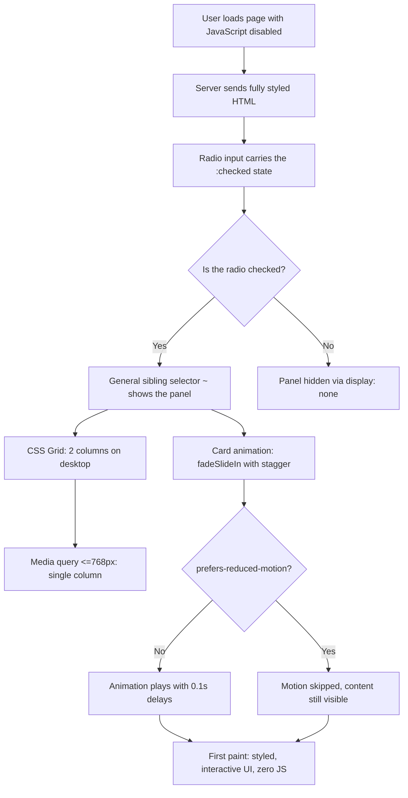

| Difficulty | Channel | Tags |
|---|---|---|
| beginner | frontend | css, flexbox, grid, animations |

In the quiet hours of a performance review, the numbers tell a story no developer wants to read: Wikipedia's mobile site was blocking the main thread for over 600ms on low-end phones — three times Google's recommended 200ms Total Blocking Time budget [1]. The culprit? JavaScript that sat between users and the interface they came to read. Wikimedia's answer was radical: they taught their design system, Codex, to work with zero JavaScript, shipping CSS-only components that render styled, functional UIs at first paint [1]. This is the story of what they learned — and how you can apply the same trick to something as simple as a tab panel.

---

> ### Real-World Case — Wikipedia (Wikimedia Foundation)
>
> Wikipedia's mobile site (the Minerva skin) ran a piece of JavaScript that could block the main thread for over 600ms on low-end phones during load — roughly 3x Google's recommended 200ms Total Blocking Time (TBT) budget — and Wikimedia's design system (Codex) was built entirely in client-side Vue.js, so any Codex-based UI silently required users to download and execute JavaScript before it would even render. Wikimedia's Design System Team launched a project to make interfaces work without JavaScript, including shipping CSS-only (no-JS) variants of Codex components so server-rendered HTML could carry full design-system styling with zero JS.
>
> | | |
> |---|---|
> | **Challenge** | Reduce Total Blocking Time on Wikipedia's mobile site and make design-system components usable for the 1-in-93 users who browse without JavaScript, on old browsers, or on slow connections — without rewriting the entire Vue-based design system. |
> | **Solution** | Two complementary moves: (1) The Design System Team built CSS-only versions of Codex components (styles-only, no JS required), so server-rendered elements get consistent design-system styling and basic interactivity via HTML/CSS while users await the enhanced JS version. (2) A performance pass removed redundant JavaScript: a jQuery click listener that was attached to nearly every link (over 4,000 on long articles like 'United States', costing ~200ms) was deleted because it duplicated logic already handled by the hashchange listener; the media-viewer click handler was replaced with a single delegated event listener on one container instead of one per thumbnail. |
> | **Outcome** | The two deployments cut Wikipedia mobile's TBT by ~300ms on a real Moto G (5) — the first removal saved ~200ms, the delegated-listener refactor ~80ms — bringing the worst offenders from 600ms+ down toward the <200ms recommendation. Combined with the CSS-only Codex components, no-JS users now get styled, functional UIs that render at first paint instead of blank waits (documented alongside the companion engineering analysis at https://www.nray.dev/blog/300ms-faster-reducing-wikipedias-total-blocking-time/). |
> | **Lesson** | One of the fastest ways to speed up a site is to remove JavaScript — CSS-only interactive patterns (radio/`:checked` tabs, etc.) are available the moment the HTML paints, and the single highest-impact fix here was deleting a click handler that duplicated existing behavior. Small, targeted 'no-JS' wins beat micro-optimizing the script. |

---

## Hook — The blank tab, the slow phone, and a design system that held its breath

Picture this: you've just rebuilt your design-system documentation page with a slick tabbed interface. Smooth transitions, staggered cards, everything a design system should feel like. Then a teammate opens it on a mid-range Android phone, and the page does nothing for half a second. Then another half-second. Every tab click feels like asking the browser to think really, really hard.

That blank moment is your JavaScript paying rent you never budgeted for. Here is the uncomfortable truth many developers discover late: every tab system built on a click handler is a wall between your users and your content. It's not about whether your JavaScript is "well written" — it's about whether it needs to exist at all. Wikipedia hit that wall at planetary scale, and what happened next rewired how an entire design-system team thinks about rendering [1].

## Problem — The hidden tax of a little JavaScript

Let's talk about what that blank moment actually costs. Google's performance model gives a page roughly 200ms of Total Blocking Time (TBT) before users perceive the main thread as broken [9]. On flagship phones, 200ms is nothing. On the Moto G (5) class of devices that dominate much of the developing world, it's a generous lunch break.

Every script the page parses and executes — analytics beacons, animation libraries, the one-liner that flips an `html.js` class — competes for that same budget. When a design system is built on a client-side framework, the stakes double: not only must the JavaScript run, the *entire interface* is produced by that JavaScript. No JavaScript, no tabs, no cards, no page. A reader on a slow connection isn't waiting 200ms; they're waiting for a framework to boot, hydrate, and paint.

This is the trap that grows silently. A tab component that starts as "just a few lines of vanilla JS" becomes a dependency tree. By the time you notice, the interface is a hostage of the runtime. Consequently, the question stops being "can we optimize this JavaScript?" and becomes something far more interesting: "what if the interface didn't need JavaScript at all?"

## Real-World Case — Wikimedia Foundation

Here's where the story turns from hypothetical to measured. Wikimedia's design system, Codex, was built entirely in client-side Vue.js. That meant every Codex-based UI silently required users to download, parse, and execute JavaScript before anything would render — a requirement that landed like a brick on low-end hardware [1]. Measurements on a real Moto G (5) showed Wikipedia's Minerva skin blocking the main thread for over 600ms, roughly three times the 200ms TBT budget Google recommends [1][2].

So the Design System Team launched a project to make interfaces work without JavaScript [1]. The first deployment — removing a blocking script — cut roughly 200ms of blocking time. A delegated-listener refactor trimmed another ~80ms. Combined, those two changes brought the worst offenders from 600ms+ down toward the 200ms recommendation: a ~300ms win on real hardware, all before a single design decision changed [2].

But here's the plot twist: performance wasn't the only beneficiary. The team also shipped CSS-only variants of Codex components, so server-rendered HTML carries full design-system styling with zero JavaScript [1]. The knock-on effect was enormous. Users with JavaScript disabled — a larger group than many developers assume, spanning privacy-minded readers to corporate proxy environments — suddenly got styled, functional interfaces at first paint instead of blank waits [1].

The lesson isn't "Vue is bad." The lesson is that a component's value should never be gated behind the runtime that builds it. And the technique that made this work at Wikipedia's scale is the same one you'll use in a single tab panel today.

## Deep Dive — Radios, sibling selectors, and the state machine that's been in your browser since 1997

Now for the fun part: how does a tab panel work with literally zero JavaScript? The secret is a trio of HTML and CSS features that have been in browsers for decades, quietly waiting for their moment.

**The actors.** A group of radio inputs sharing one `name` attribute forms a single-choice state machine — select one, and all others are automatically deselected, no code required [3]. Each radio is paired with a `` that doubles as the visible tab button. Clicking the label checks the radio; checking the radio flips a switch that CSS can read.

**The switch.** The `:checked` pseudo-class exposes that state to the stylesheet [4]. Combined with the general sibling combinator (`~`), a rule like `.tabs input:not(:checked) ~ .panel { display: none; }` shows exactly one panel at a time [5]. It's declarative state management from 1997 — no framework required.

**The layout.** Inside each panel, CSS Grid handles the responsive card arrangement: `repeat(2, 1fr)` on desktop collapses to a single column under a 768px breakpoint — a two-by-two grid becomes one column with three lines of CSS [10]. Each card's image area uses `aspect-ratio: 16 / 9`, so the container keeps its shape before images arrive, while they load, or even when they never load at all [6].

**The polish.** Two details separate a demo from a design system. First, `:focus-visible` adds a keyboard-only outline, so mouse users don't see focus rings while keyboard users always know exactly where they are [8]. Second, a stagger animation — each card delayed 0.1s more than the last, with the `backwards` fill mode so cards start hidden even before their delay elapses — creates that polished cascade feel.

**The respect.** Every animation rule lives inside `@media (prefers-reduced-motion: no-preference)`, so motion-sensitive users get the content instantly, without the entrance choreography [7]. This is what separates thoughtful engineering from a free CodePen.

Here is the trade-off table worth internalizing:

| Concern | CSS-only radio tabs | JS-driven tabs |
|---|---|---|
| JavaScript cost | Zero [1] | Framework + bundle + boot time |
| First paint | Full UI, styled [1] | Often blank until hydration |
| Works without JS | Yes [1] | No |
| Tab semantics | Native radio group, arrow-key navigation [3] | Hand-rolled ARIA + keyboard handlers |
| Roving tabindex | Not needed | Required |
| Dynamic content | Re-render at the server | Trivial client-side |
| Maintenance | A few sibling-selector rules | A component dependency |

The counterintuitive insight: for a static tab panel, the "primitive" radio pattern is often *more* accessible out of the box than a hand-rolled JavaScript tab system, because the browser already handles arrow-key selection and focus semantics for you [3]. The complexity you avoided isn't complexity you can skip — it's complexity the platform already solved.

⚠️ **Watch Out:** A classic battle scar — the general sibling combinator only matches elements that come *after* the input in the DOM [5]. Nest the labels inside the panels, and your selectors silently stop working. Structure first, style second.

💡 **Insight:** Don't over-think the a11y. Keyboard users navigate radios with arrow keys natively; the label is the focus target, and `:focus-visible` makes it visible. You get this for free [3][8].

## Workflow — Six steps from 'works on my machine' to 'works without JavaScript'

The path from a working demo to a genuinely no-JS component follows six steps, and each one builds on the last.

1. **Structure the markup** so every radio, label, and panel is a sibling inside one container — the sibling combinator demands this order, and this ordering is the entire trick [5].
2. **Style the labels as tabs**, using the `:checked` state to tint the active tab so the UI visibly echoes the state machine.
3. **Wire visibility**: hide every panel that doesn't follow a checked radio, and show the one that does.
4. **Add the responsive grid**: two columns on desktop, one column on mobile, via a single media query [10].
5. **Drop in the entrance animation**, wrapped in a reduced-motion guard so the stagger only runs for users who welcome it [7].
6. **Test with JavaScript disabled** — one toggle in DevTools — and the experience should feel identical.

Here is that journey as a picture, from server-rendered HTML to a styled, animated first paint:

The diagram above is the entire architecture: server-rendered HTML carries the state (a checked radio), CSS reads it with a sibling selector, the grid and animation layers do the rest, and a media query decides whether motion is welcome. No client runtime anywhere in the pipeline [1].

🎯 **Key Point:** The Mermaid flow mirrors the actual request pipeline at Wikimedia — HTML arrives complete and styled, and the CSS state machine takes over from there [1].

🔥 **Hot Take:** If your tab panel needs a "loading" skeleton, that's not a UI problem — that's evidence your interface is gated behind a runtime it didn't need.

Two pro tips from hard-won experience. First, always include a default `checked` radio — without it, every panel is hidden and the component looks broken for a frame or two. Second, if cards must change after render, the server owns that truth: re-serve the panel markup. There's no client to patch it.

## Code Example — The whole pattern, packaged as a build-time snippet

Here is the full pattern, packaged as a build-time snippet. It emits the accessible markup *and* the styles — but ships zero runtime JavaScript to the browser. The browser receives finished HTML and a plain CSS file, exactly the architecture that saved Wikipedia ~300ms of blocking time [1][2].

The code below walks through the three moving pieces: the radio state machine that gives you exclusive tab selection for free [3], the sibling-ordered markup that makes `:checked` + `~` work [4][5], and the stylesheet with the responsive grid, the stagger animation, and the reduced-motion guard [6][7][10].

## Lessons Learned — The 300ms rule and the question to ask at your next standup

Every story needs a moral, and this one has four.

- **Delete before you optimize.** Wikipedia didn't make mobile faster by writing better JavaScript; it shipped interfaces that don't require any [1][2]. Before profiling your tab component, ask if it should exist.
- **The platform is a state machine.** Radios give you exclusive selection, labels give you click targets, and sibling selectors give you visibility — no dependencies [3][4][5].
- **Layout is three lines.** `repeat(2, 1fr)`, one breakpoint, `aspect-ratio: 16 / 9` — that's your entire responsive card grid [6][10].
- **Accessibility is a feature list, not a checklist.** `:focus-visible` for keyboard users, `prefers-reduced-motion` for everyone else, and a default checked tab so nothing ever renders empty [7][8].

⚠️ **Watch Out — the battle scars:** forgetting the default `checked` radio leaves an empty panel; nesting labels inside panels breaks the `~` selector silently; and skipping the `backwards` fill mode makes the stagger look like a janky pop-in instead of a cascade. All three are one-line fixes you'll wish you'd made sooner.

So what should you do differently tomorrow? Open your design-system docs. Pick one component that currently hydrates before it renders — a tab panel, an accordion, a card grid — and ask the uncomfortable question: does this need JavaScript, or does the platform already have my back? Then test it with scripts disabled and watch the first paint. That's the moment the habit sticks.

---

## No-JS Tab Panel Flow

<strong>Original Interview Question</strong>

**Q:** Build a CSS-only tab panel for a design-system docs page. Use radio inputs to switch tabs (no JavaScript). Desktop: a 2x2 grid of cards under each tab; mobile: single column. Each card has a fixed 16:9 image area, a title, and a short meta line. Add a subtle entrance animation with a stagger and keep focus-visible outlines; ensure prefers-reduced-motion is respected?

**A:** Use a set of radio inputs with a shared `name` attribute and corresponding `` elements for each tab section. The `:checked` state of each radio controls visibility of its associated panel via adjacent sibling selectors. Each panel renders a 2×2 card grid on desktop and collapses to a single column on mobile. Cards use `aspect-ratio: 16/9` for fixed image containers, with a title and meta line below.

## Conclusion

Here is the plot twist worth carrying to your next standup: the most expensive line of code you write is the one that doesn't need to exist. Wikipedia didn't make its mobile site fast by writing better JavaScript — it made it fast by shipping interfaces that don't require any [1][2]. The tab panel you build this week is the same lesson at a smaller scale: radio inputs for state, sibling selectors for visibility, CSS Grid for layout, and one media query for empathy [7]. Start with your design-system docs. Pick one component and ask the uncomfortable question — does this need JavaScript, or does the platform already have my back? Then test it with scripts disabled and watch your first paint. That's the moment the habit sticks.

---

## References

1. [Wikipedia (Wikimedia Foundation) incident report](https://www.mediawiki.org/wiki/Design_System_Team/Projects/CSS-only_components) — article
2. [300ms Faster — Reducing Wikipedia's Total Blocking Time](https://www.nray.dev/blog/300ms-faster-reducing-wikipedias-total-blocking-time/) — blog
3. [MDN: input type radio](https://developer.mozilla.org/en-US/docs/Web/HTML/Element/input/radio) — documentation
4. [MDN: :checked pseudo-class](https://developer.mozilla.org/en-US/docs/Web/CSS/:checked) — documentation
5. [MDN: General sibling combinator](https://developer.mozilla.org/en-US/docs/Web/CSS/General_sibling_combinator) — documentation
6. [MDN: aspect-ratio](https://developer.mozilla.org/en-US/docs/Web/CSS/aspect-ratio) — documentation
7. [MDN: prefers-reduced-motion](https://developer.mozilla.org/en-US/docs/Web/CSS/@media/prefers-reduced-motion) — documentation
8. [MDN: :focus-visible](https://developer.mozilla.org/en-US/docs/Web/CSS/:focus-visible) — documentation
9. [MDN: Total blocking time](https://developer.mozilla.org/en-US/docs/Glossary/Total_blocking_time) — documentation
10. [MDN: CSS grid layout](https://developer.mozilla.org/en-US/docs/Web/CSS/CSS_grid_layout) — documentation

---

**Author:** Satishkumar Dhule — [GitHub](https://github.com/satishkumar-dhule) · [LinkedIn](https://linkedin.com/in/satishkumar-dhule) · [Website](https://satishkumar-dhule.github.io)
