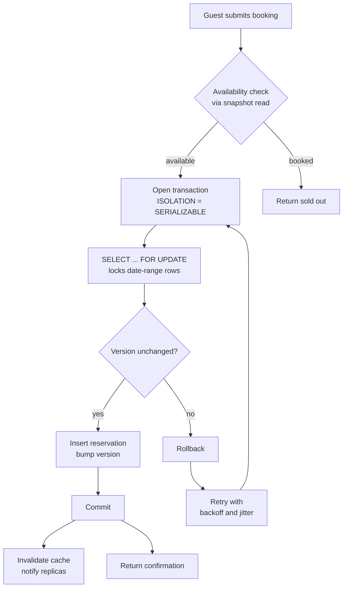

| Difficulty | Channel | Tags |
|---|---|---|
| intermediate | database | acid, isolation-levels, mvcc |

In late 2011, China Railway launched 12306.cn, the online home of the world's largest rail network — and almost immediately watched it collapse under the Spring Festival rush. By 2012 the site was fielding up to 1.4 billion page views a day from 20 million visitors, with 15-second queries, failed bookings, and money charged for tickets that never materialized [1]. The system eventually cut availability-query latency from 15 seconds to under 0.2 seconds and scaled past 20,000 QPS — a transformation built on one stubborn database problem: stopping two people from grabbing the same scarce resource at the same instant [1]. That is the same problem at the heart of every Airbnb-style booking system, and this post walks through exactly how to solve it.

---

> ### Real-World Case — China Railway (12306)
>
> China Railway launched its online ticket booking site 12306.cn in late 2011, and during the 2012 Spring Festival travel rush it nearly collapsed: up to 20 million people visited daily (peaking at ~1.4 billion page views/day), causing outages, 15-second queries, failed bookings, and even money deducted without tickets. The crash made worldwide headlines via Reuters and ignited a national engineering debate about the system's architecture.
>
> | | |
> |---|---|
> | **Challenge** | Millions of users simultaneously try to book the same finite pool of train seats — exactly the double-booking race in a booking system, where one seat must never be sold to two people while the site must stay up through unpredictable concurrency spikes (40,000+ visits/sec, peak ticket releases). |
> | **Solution** | The team (China Academy of Railway Sciences + Pivotal) replaced the bottlenecked relational database with an in-memory distributed data grid (Pivotal GemFire) on commodity x86 servers, partitioning remaining-ticket inventory across a replicated cluster for high availability and distributed locking. They added a booking queue that absorbs order requests (100k+/sec) and processes them asynchronously against per-seat inventory, split order generation from order queries, and later moved to a dual-data-center + hybrid cloud design that offloaded 75% of availability queries to public cloud. |
> | **Outcome** | Single availability query time dropped from ~15s to <0.2s (75x faster); query throughput rose from <1,000 QPS to 20,000-26,000 QPS; order-query TPS went from ~200-400 to 5,000+; peak daily ticket sales grew from 1.1M (2012) to 5.64M (2015); by the 2015 peak it handled over 18 billion availability queries per day at 300k+ average TPS with zero downtime. |
> | **Lesson** | In a booking system, the availability/inventory read-write path is the concurrency bottleneck: move hot inventory into a replicated in-memory store with distributed locking and async order queues so it scales horizontally, but keep the authoritative commit path (per-seat deduction) behind strict consistency — a cache/replica read path must never be the source of truth for confirming a booking. |

---

## Hook — The world's largest refresh-button mosh pit

It is 6 a.m. on the first day of the world's largest annual human migration. Twenty million travelers across China are hammering refresh on the same page, racing for a finite number of train seats. Every single tap is a database query targeting the same rows, and every double-allowance is a passenger left standing on a platform holding a ticket that also belongs to someone else. Now zoom out: that exact scene, at a smaller scale, plays out on every marketplace with scarce inventory — the Airbnb host whose calendar somehow shows three bookings for the same weekend, the venue with a dozen confirmed weddings. The stakes are outages, angry customers, and refunds with apologies attached. Here is the uncomfortable truth many developers learn the hard way: the naive solution — check availability, then insert the booking — is a race condition wearing a business suit.

## Problem — The millisecond-wide door that lets two guests through

Building on that uncomfortable truth, think about what actually goes wrong. A typical first attempt looks bulletproof: read the availability calendar, confirm the nights are free, write the reservation, done. The window between that read and that write is measured in milliseconds, but it is wide enough for two users to slip through simultaneously — a pattern called time-of-check to time-of-use, or TOCTOU. Both users read "available," both insert their reservation, and suddenly one property has two tenants. Moreover, the damage is not just a database anomaly; it cascades into chargebacks, support tickets, and a host whose entire calendar is now untrustworthy. The core tension is that correctness demands you prevent two writers from committing conflicting changes, while availability demands you never make one user wait on another. Concurrency control is the art of resolving that tension — and it is not a switch you flip, it is a strategy you choose based on your workload.

## Real-World Case — China Railway (12306)

This tension is not theoretical — it nearly broke the system that sells tickets for the largest train network on Earth. When China Railway's 12306.cn launched in late 2011, the 2012 Spring Festival travel rush overwhelmed it: up to 20 million daily visitors, a peak of roughly 1.4 billion page views per day, outages, 15-second queries, failed bookings, and the worst outcome imaginable — money deducted without a ticket ever being issued [1]. The crash made worldwide headlines and ignited a national engineering debate about the site's architecture [1]. The rebuild was ruthless about separating reads from writes: availability queries (huge volume, low consistency stakes) were pushed into in-memory caches and replicas, while order placement (small volume, very high stakes) traveled through strict transactional paths. The numbers tell the story: single availability queries dropped from roughly 15s to under 0.2s (75x faster), query throughput climbed from under 1,000 QPS to 20,000–26,000 QPS, and order-query TPS went from about 200–400 to 5,000+ [1]. By the 2015 peak, 12306 handled over 18 billion availability queries per day at 300k+ average TPS with zero downtime [1]. This is what disciplined concurrency design looks like at planetary scale — and its principles scale all the way down to a single PostgreSQL instance.

## Deep Dive — Isolation levels, MVCC, and the optimistic twist

Which brings you to the real question: what are your weapons? Start with isolation levels. The SQL standard defines four — READ UNCOMMITTED, READ COMMITTED, REPEATABLE READ, and SERIALIZABLE — each a different trade-off between consistency and concurrency [3]. READ COMMITTED is the default in most databases, and it will happily let two transactions both read "available" and both commit. SERIALIZABLE is the strictest level, promising that the outcome matches some serial execution of the transactions [3]. For booking, that guarantee is the difference between one guest and two. Underneath the hood, PostgreSQL and MySQL's InnoDB implement these levels using Multi-Version Concurrency Control (MVCC): every transaction reads a consistent snapshot as of its start time, so readers never block writers [4]. That is exactly what you want for 12306-style availability checks — a million parallel snapshot reads while a booking commits somewhere else.

Optimistic concurrency control (OCC) is the next piece of the puzzle. Instead of holding locks for the whole transaction, OCC lets transactions run freely and validates at commit time — typically via a version column — aborting any transaction whose data changed underneath it [5]. Its pessimistic sibling, two-phase locking, grabs locks first and avoids aborts, but at the cost of contention and deadlock risk [6]. Here is the plot twist: most developers assume SERIALIZABLE means "slow, don't touch." In practice, on a well-indexed table with short transactions, SERIALIZABLE on Postgres is surprisingly cheap — and its cost is nothing compared to the reputational damage of one overbooked property.

When you scale out, remember the fundamental constraint: you cannot have perfect consistency, availability, and partition tolerance all at once [7]. Research auditing production systems found that supposedly "highly available" databases quietly return stale or conflicting data under load — which is why 12306 kept writes strict and let only reads spread wide [8].

- **When would you actually use SERIALIZABLE?** Short transactions that mutate scarce inventory — bookings, seat holds, coupon redemption.
- **When is READ COMMITTED fine?** Catalog pages, search, availability browsing — anything where slightly stale is acceptable.
- **Pro tip:** keep transactions tiny. A lock held for 5ms is invisible; a lock held for 5 seconds is an outage.

| | Optimistic (version check) | Pessimistic (row locks) |
|---|---|---|
| When it shines | Read-heavy, low write contention | Hot rows with predictable contention |
| On conflict | Transaction aborts, client retries | Transaction waits on the lock |
| Throughput under contention | Degrades with retry storms | Degrades with queueing |
| Deadlock risk | Low — aborts instead | Higher — lock order matters |
| Best for | 12306-style availability reads | The actual booking insert |

## Workflow — The five-phase booking pipeline

Now that the pieces are clear, here is the orchestration. A production booking flow has five phases, and the Mermaid diagram below shows them end to end. First, serve availability from cache or a replica — this is where you win on throughput, because slightly stale availability is fine as long as the real booking is authoritative. Second, on a booking attempt, open a transaction at SERIALIZABLE. Third, lock the exact date-range rows with SELECT FOR UPDATE so competing bookings queue instead of interleaving. Fourth, re-validate availability and the version column inside the lock, then insert the reservation and bump the version. Fifth, commit — and only after the commit, invalidate the cache and notify replicas.

Every phase exists for a reason. The snapshot read handles your volume; the row lock handles correctness; the version bump handles cache coherence; and the retry-with-backoff loop handles the occasional conflict without hammering the database into a thundering herd. For the hottest properties — the equivalent of the 3 p.m. Beijing-to-Shanghai express — add a circuit breaker that fails fast to a queue rather than piling thousands of blocked transactions onto one row.

## Code Example — Locking, versioning, and retry in Python

Enough theory — here is what the booking transaction actually looks like with psycopg2 against PostgreSQL. The trick is layering the pessimistic lock (SELECT FOR UPDATE) and the optimistic guard (version bump) inside one short transaction, then wrapping the whole thing in a retry loop with exponential backoff and jitter.

## Lessons Learned — Battle scars from the booking trenches

So what does all of this mean for your codebase tomorrow? Start with the pattern that 12306 proved at national scale: separate your reads from your writes, and treat only the writes as sacred [1]. Availability browsing can live on cache and replicas; the booking itself must be a short, serializable, row-locked transaction [4][9].

Here are the battle scars to avoid:

- **Checking availability outside the transaction.** That is the TOCTOU trap — the check must live under the same lock as the insert.
- **Long transactions.** Every millisecond a lock is held is a millisecond another paying guest waits. Keep booking transactions to a handful of queries.
- **Retrying without backoff.** Blind retry storms make contention worse. Exponential backoff with jitter is non-negotiable [5].
- **Caching without invalidation.** A stale "available" result served after a booking is a silent lie. Invalidate only after commit, never before.
- **Treating SERIALIZABLE as scary.** On well-indexed, short transactions it is often cheaper than you fear — and always cheaper than one overbooking scandal.

🎯 Key Point: consistency is a budget. Spend it on the writes that matter and let everything else run wild and fast. ⚠️ Watch Out: if your retry logic can't distinguish "conflict" from "network blip," you will double-book anyway. 💡 Insight: 12306's real innovation was not fancy new tech — it was aggressively deciding which operations demanded correctness and which could tolerate freshness [1].

---

## Booking Flow with Optimistic Concurrency Control

<strong>Original Interview Question</strong>

**Q:** You're building a booking system for Airbnb where multiple users can reserve the same property simultaneously. How would you design the transaction handling to prevent double bookings while maintaining high availability?

**A:** Use SERIALIZABLE isolation with optimistic concurrency control. Implement row-level locks on property availability tables, use MVCC snapshot reads for checking availability, and apply application-level validation to ensure atomic booking operations.

## Conclusion

The journey from a naive check-then-insert to a hardened booking transaction mirrors exactly what 12306 went through at national scale: the check, the lock, and the write must live in one short serializable transaction, reads can roam free across cache and replicas, and every conflict needs a polite retry [1]. Here is the memorable insight to carry back to your team: consistency is a budget, not a default — spend it on the writes that matter, and let everything else be fast. Tomorrow, before you ship that next booking feature, ask one question: what happens when two users hit the same row in the same millisecond? If your answer is a shrug, your weekend is already overbooked.

---

## References

1. [China Railway (12306) incident report](https://topic.alibabacloud.com/article/distributed-memory-data-technology-gemfire-12306_2_6_1866447.html) — article
2. [ACID - Wikipedia](https://en.wikipedia.org/wiki/ACID) — documentation
3. [Isolation (database systems) - Wikipedia](https://en.wikipedia.org/wiki/Isolation_(database_systems)) — documentation
4. [Multiversion concurrency control - Wikipedia](https://en.wikipedia.org/wiki/Multiversion_concurrency_control) — documentation
5. [Optimistic concurrency control - Wikipedia](https://en.wikipedia.org/wiki/Optimistic_concurrency_control) — documentation
6. [Two-phase locking - Wikipedia](https://en.wikipedia.org/wiki/Two-phase_locking) — documentation
7. [CAP theorem - Wikipedia](https://en.wikipedia.org/wiki/CAP_theorem) — documentation
8. [Highly Available Transactions: Virtues and Limitations](https://arxiv.org/abs/1202.0403) — paper
9. [Understanding PostgreSQL - DigitalOcean](https://www.digitalocean.com/community/tutorials/understanding-postgresql) — documentation

---

**Author:** Satishkumar Dhule — [GitHub](https://github.com/satishkumar-dhule) · [LinkedIn](https://linkedin.com/in/satishkumar-dhule) · [Website](https://satishkumar-dhule.github.io)
