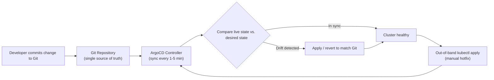

| Difficulty | Channel | Tags |
|---|---|---|
| beginner | devops | argocd, flux, declarative |

The company that invented ArgoCD and helped pioneer GitOps once ran roughly 30,000-40,000 applications across 350+ clusters serving QuickBooks, TurboTax, and Mint [1]. Then something ironic happened: its own teams quietly disabled auto-sync on the vast majority of those apps and drifted back to imperative Jenkins-driven pipeline calls, abandoning Git as the single source of truth [1]. This is the story of how Intuit almost became a cautionary tale about its own invention - and the exact setup you need to avoid repeating it.

---

> ### Real-World Case — Intuit
>
> Intuit created ArgoCD and pioneered GitOps, scaling it to roughly 30,000-40,000 applications across 350+ clusters serving QuickBooks, TurboTax, and Mint. But at that scale the tool's own creator hit the exact anti-pattern this question warns about: teams silently disabled auto-sync on the vast majority of applications and fell back to imperative Jenkins-driven 'argocd app sync' pipeline calls, abandoning Git as the single source of truth and drowning in ~346KB of logs per environment promotion.
>
> | | |
> |---|---|
> | **Challenge** | Keeping the declarative GitOps promise (Git as the only source of truth with ArgoCD reconciling desired vs. actual state) viable at massive scale, where environment promotion via imperative pipeline scripts reintroduced config drift, broke auditability, and made rollback and promotion a manual 'babysitting' chore for 5,000 engineers. |
> | **Solution** | ArgoCD Application CRDs point at Git repos containing Helm/Kustomize manifests; auto-sync + self-healing reverts any manual kubectl changes to drift. To fix the promotion problem declaratively, Intuit open-sourced GitOps Promoter and Source Hydrator (Argoproj Labs) so every environment promotion is a pull request merged into Git - autosync stays ON, promotion history lives in Git, and the entire state can be reconstructed from Git alone even if the tooling is deleted. |
> | **Outcome** | At peak: ~40,000 applications across 3,000+ repos, 140+ Argo CD instances, ~1,000 deployments/day for 5,000 engineers, with average reconciliation under 0.5 seconds. Measured before/after (2018 KubeCon): CI build ~14 min to ~4 min, deployment ~90 min to ~20 min, release and rollback time each ~18 min to ~3 min; QuickBooks deployment cycle went from days to under 5 minutes and MTTR from 45 minutes to under 5. |
> | **Lesson** | Auto-sync and self-healing only deliver GitOps if every change path - including environment promotion - flows through Git. The moment promotion logic lives in imperative pipelines, teams turn autosync off and drift silently returns, even inside the company that invented ArgoCD. The fix isn't more discipline; it's making promotion itself a declarative, Git-native operation. |

---

## Hook - The Creators of GitOps Fell Into Their Own Trap

Picture the scale of Intuit's infrastructure: roughly 40,000 applications spread across more than 350 Kubernetes clusters, backed by over 3,000 repositories and 140+ Argo CD instances [1]. QuickBooks, TurboTax, Mint - the software millions of people depend on to run their businesses and file their taxes - all orchestrated by a tool that Intuit itself created. You would expect the inventors to be the model citizens of GitOps, right? Instead, something strange happened: teams silently disabled auto-sync on the vast majority of applications and fell back to imperative 'argocd app sync' calls from Jenkins pipelines [1]. The single source of truth had quietly become an afterthought. Here is the thing though - Intuit is not unique. The same drift happens in shops running ten services, and it usually goes unnoticed until the pager goes off at 2am.

## Problem - The Quiet Death of the Single Source of Truth

Every team that moves to Kubernetes eventually faces the same question: how do changes actually get into the cluster? Many developers start the way Intuit's teams did - with kubectl. A quick 'kubectl apply -f deployment.yaml' from a laptop, a pipeline step that runs 'argocd app sync' outside of Git, a hotfix applied directly to production because the release train was moving too slowly [5]. Each of those actions feels harmless in the moment. But each one quietly breaks the contract that Git is the source of truth [6]. The cluster drifts from the manifest in version control. Configuration drift accumulates between environments, and then the audit question arrives - 'which commit deployed this version?' - and nobody can answer it. Consequently, rollbacks become manual archaeology, collaboration becomes screen-share trust, and every environment slowly becomes its own snowflake. We have all been there. The question is not whether drift happens; it is whether your tooling notices when it does.

## Real-World Case - Intuit

By 2018, the irony at Intuit was undeniable. At KubeCon, engineers presented the numbers: environment promotions were drowning in roughly 346KB of logs each, and the deployment pipeline had grown sluggish and slow [1]. The fix was not a shiny new tool - it was a return to the declarative fundamentals of the very system they had built. After re-adopting GitOps as the default workflow, the results were dramatic: CI build time dropped from ~14 minutes to ~4 minutes, deployment time from ~90 minutes to ~20 minutes, and release and rollback time each fell from ~18 minutes to ~3 minutes [1]. The QuickBooks deployment cycle went from days to under 5 minutes, and mean time to recovery (MTTR) collapsed from 45 minutes to under 5 [1]. At peak, the system handled roughly 1,000 deployments per day for 5,000 engineers, with an average reconciliation time under 0.5 seconds [1]. That is the scale of what is possible when you trust the reconciliation loop instead of fighting it.

## Deep Dive - Declarative vs Imperative: The Real Trade-Off

So what actually changed inside those 350 clusters? It comes down to two philosophies for managing Kubernetes objects: declarative and imperative [4][5]. The declarative approach says: define the complete desired state in Git using YAML manifests, Helm charts, or Kustomize overlays, and let a controller continuously reconcile the actual cluster state against it [2][7][8]. The imperative approach says: run kubectl commands to tell the cluster what to do right now [5]. You might think declarative is simply 'better' and be done with it. However, the counterintuitive twist is that declarative costs more upfront - controllers, CRDs, sync policies, Git hygiene. It only pays off because the loop does the boring, error-prone work forever. That is precisely why Intuit's regression happened: disabling self-healing to 'move faster' feels productive for a week, then silently compounds into 346KB log dumps per promotion [1].

## Workflow - The GitOps Loop, Step by Step

Building on that deep dive, here is how a GitOps workflow takes shape in practice. First, install ArgoCD in your cluster using its manifests or Helm chart [2]. Second, create an Application CRD that points at your Git repository as the source of truth [2]. Third, enable automated sync with a health check interval of 1-5 minutes - Intuit's sweet spot balances responsiveness with API load. Fourth, and this is the one teams skip, turn on self-healing so any out-of-band manual change gets reverted automatically [9]. Finally, step back and let the loop run. The diagram below shows that loop: every commit flows Git to controller, the controller compares live state to desired state, and any drift - including a midnight kubectl apply - feeds straight back into reconciliation.

## Code Example - Bootstrap ArgoCD the Declarative Way

Here is a concrete, production-shaped example of standing up ArgoCD and pointing it at Git. Notice that everything below is itself declarative: the enforcement engine is configured through manifests, not clicks or ad-hoc commands.

## Lessons Learned - What 40,000 Applications Taught Intuit

Auto-sync is a feature, not a bug. Intuit's own regression proves that disabling it is the first step toward configuration drift [1]. Self-healing is your insurance policy: without it, any manual edit silently becomes the new reality instead of an anomaly [9]. Keep health check intervals sane - a 3-minute default balances freshness against API load. Make GitOps the only path to production, because if a Jenkins job can bypass Git, someone will use it [1]. And watch the pipeline metrics: if a single environment promotion generates hundreds of kilobytes of logs, your pipeline is fighting the loop rather than riding it [1]. Before you architect anything fancy, audit your current setup: open your ArgoCD UI and count how many Applications have selfHeal enabled. That number will tell you how close your organization is to Intuit's 2018 state.

---

## GitOps Reconciliation Loop

<strong>Original Interview Question</strong>

**Q:** You're setting up GitOps for a microservices deployment. How would you configure ArgoCD to automatically sync changes from your Git repository to Kubernetes, and what's the difference between declarative and imperative approaches in this context?

**A:** I'd configure ArgoCD by setting up a Git repository containing Kubernetes manifests or Helm charts, creating an Application CRD that points to the Git repository, enabling auto-sync with a health check interval of 3 minutes, and implementing self-healing to automatically revert any manual changes. The declarative approach involves defining the desired state in Git through YAML manifests, Helm charts, or Kustomize configurations, where ArgoCD continuously reconciles the actual state with the desired state. In contrast, the imperative approach uses kubectl commands to make direct changes to the cluster, bypassing the Git repository as the single source of truth.

## Conclusion

The moral of Intuit's story is humbling: even the people who built the tool lost the plot - and clawed it back. Auto-sync and self-healing are not optional checkboxes; they are the mechanism that turns Git from a suggestion into the source of truth [9]. Tomorrow, audit your own setup: pull up your ArgoCD Applications and count how many have selfHeal enabled. If the answer is 'some,' you already know what to do. Here is the insight to carry to your team: GitOps is not about automating deployments - it is about making the deployment pipeline so boring that your cluster can effectively run itself.

---

## References

1. [Intuit incident report](https://www.cncf.io/case-studies/intuit/) — article
2. [Argo CD Documentation](https://argo-cd.readthedocs.io/en/stable/) — documentation
3. [Argo CD Repository](https://github.com/argoproj/argo-cd) — documentation
4. [Declarative Management of Kubernetes Objects](https://kubernetes.io/docs/tasks/manage-kubernetes-objects/declarative-config/) — documentation
5. [Imperative Management of Kubernetes Objects](https://kubernetes.io/docs/tasks/manage-kubernetes-objects/imperative-command/) — documentation
6. [GitOps](https://en.wikipedia.org/wiki/GitOps) — documentation
7. [Helm Documentation](https://helm.sh/docs/) — documentation
8. [Kustomize](https://github.com/kubernetes-sigs/kustomize) — documentation
9. [Argo CD Auto-Sync and Self-Healing](https://argo-cd.readthedocs.io/en/stable/user-guide/auto_sync/) — documentation
10. [Flux Documentation](https://fluxcd.io/) — documentation

---

**Author:** Satishkumar Dhule — [GitHub](https://github.com/satishkumar-dhule) · [LinkedIn](https://linkedin.com/in/satishkumar-dhule) · [Website](https://satishkumar-dhule.github.io)
