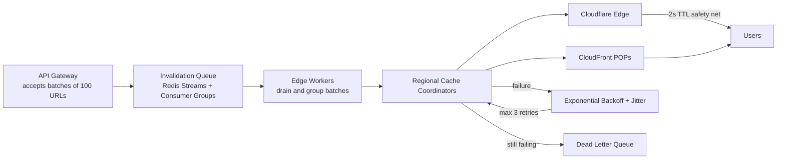

| Difficulty | Channel | Tags |
|---|---|---|
| intermediate | system-design | edge, caching, purging |

By 2022, Cloudflare was drowning in its own success: millions of cache purge API calls every day were pushing the centralized "Quicksilver" system to its write-throughput limits [1]. Their engineers did not just patch it — they rebuilt purge as a streaming fan-out pipeline that now propagates invalidations to 330+ cities in under 150 milliseconds, down from 1.5 seconds [1]. This is the same problem a tough system-design interview asks: how do you guarantee cache propagation within 5 seconds while absorbing 10,000 concurrent invalidations per second? The good news is that the answer is a playbook, not a puzzle. Here it is.

---

> ### Real-World Case — Cloudflare
>
> Cloudflare operates a CDN spanning 335+ cities in 120+ countries where popular assets are cached at every edge location. Every purge request had to propagate to all data centers caching that content, and by 2022 the centralized 'Quicksilver' system was buckling under scale — millions of purge API calls per day consumed huge amounts of storage and its spoke-hub replication was hitting write-throughput limits.
>
> | | |
> |---|---|
> | **Challenge** | Invalidate cached content globally in near-real-time at massive scale: purge requests must fan out to every data center, each of which must locate and invalidate matching cached objects (anything from one URL to a hostname or an entire site), while handling millions of API purges per day from thousands of customers without latency spikes or runaway storage costs. |
> | **Solution** | Cloudflare rebuilt the pipeline as 'coreless purge': purge requests now enter at the nearest data center, where Cloudflare Workers handle auth/filtering and Durable Objects queue and broadcast requests peer-to-peer (with Kafka queues and batching in front of the old Quicksilver to smooth spikes). They replaced lazy-purge with CacheDB, a Rust service on RocksDB running on every cache machine that actively indexes and purges files, and added a local queue checked on every cache HIT so a purge prevents serving stale content the moment it arrives, even before files are physically deleted. |
> | **Outcome** | Global cache purge propagation dropped from ~1.5 seconds (P50) to under 150 ms (P50) across all 330+ cities; storage requirements were reduced 10x by eliminating lazy-purge accumulation; and the throughput gains let Cloudflare open purge-by-tag/prefix/hostname to all customers, with rate limits like Enterprise at 5,000 keys/second (50 req/s, 100 keys/request). |
> | **Lesson** | Distributing invalidation authority to the edge (coreless/peer-to-peer) instead of routing through a central core is what unlocks both speed and scale — and indexing cache content locally (with queue-timestamp checks on read) turns a 'find everything matching this tag' problem into a fast, storage-efficient operation. |

---

## Hook — A stale price, a global panic

Picture this: a pricing bug ships at 2pm and you fix it at 2:01. The origin database is clean. But cached copies of that broken page are still sitting in hundreds of cities around the world — and the next visitor in São Paulo will still see the wrong price. For the next minutes — or hours, depending on your TTL — your reputation is hostage to an expired cache entry.

Every developer has had that moment: the deploy looks fine, the origin is perfect, and then a screenshot of the stale page lands in the #incident Slack channel. The stakes are real — a wrong price, a leaked credential caught in a cached response header, or a revoked API key can turn into a support tsunami in minutes. So the question is never "should we purge." It is "how fast can we purge — everywhere, at once, under load?" Many developers discover the uncomfortable truth quickly: propagation is not a single API call. It is a distributed consistency problem wearing a CDN's clothes.

## Problem — Why the brute-force purge doesn't scale

Here is the trap that most architects fall into: just call your CDN provider's purge endpoint for every changed URL. For a small site, that works flawlessly. Multiply it by 10,000 invalidations per second across every edge location that caches your content, and the naive approach collapses under three failure modes.

First, cost. Many CDNs bill per invalidation request, and per-URL fire-and-forget calls at that rate shred budgets within a week. Second, latency. A synchronous purge that fans out region by region can blow straight past a 5-second SLA — the propagation time is bounded by your slowest region, not your fastest. Third, the thundering herd. Ten thousand parallel purge calls arriving at the same instant from every service in your platform is a self-inflicted DDoS on your own infrastructure.

Consequently, the design question splits into two halves: throughput (absorbing 10K requests/sec without melting the front door) and propagation (making every edge forget within 5 seconds). Both halves demand an architecture, not a bigger hammer [8]. Moreover, they demand understanding how invalidation is actually delivered to every point of presence [2].

| Strategy | Propagation | Cost | Operational Risk |
|---|---|---|---|
| TTL-only (max-age=3600) | Slow — up to the TTL | ~zero | Stale-data window up to an hour |
| Synchronous per-URL purge | Fast but bounded by the slowest region | Very high per-call billing | Thundering herd + rate limits |
| Queue + edge fan-out + 2s TTL | <5s global, converges faster | Batch pricing, ~90% fewer calls | Needs DLQ + reconciliation |

The third row is the whole point of this article — and it is exactly the direction Cloudflare took [1].

## Real-World Case — Cloudflare

Cloudflare is the perfect war story because they lived every failure mode above at planetary scale. By 2022, the company operated a CDN spanning 335+ cities in 120+ countries, with popular assets cached at every edge location [1]. Every purge request had to propagate to all of the data centers caching that content — and the centralized "Quicksilver" system that handled those requests was buckling. Millions of purge API calls per day consumed enormous storage, and Quicksilver's spoke-hub replication was hitting hard write-throughput limits [1].

Their engineers responded by tearing up the centralized model and rebuilding purge as an edge-native, streaming fan-out — the same shape as the queue-plus-worker architecture you are about to see. The results are the kind of numbers you bring to a design review:

- P50 propagation dropped from ~1.5 seconds to under 150 ms across all 330+ cities [1]
- Storage requirements fell 10x by eliminating lazy-purge accumulation [1]
- The throughput headroom let Cloudflare open purge-by-tag, purge-by-prefix, and purge-by-hostname to every customer, with Enterprise limits at 5,000 keys/second (50 req/s × 100 keys/request) [1]

Consequently, the industry's mental model shifted: purging stopped being a maintenance chore and became a first-class product feature. However, none of this works by accident — it demands a deliberately designed pipeline, which is where the deep dive comes in.

## Deep Dive — The architecture that makes 5 seconds real

The core insight that unlocks everything: do not treat purge as a point-to-point call. Treat it as an event stream with fan-out. You accept the invalidation once, then let workers replicate it to every region in parallel.

Here is the shape of it. An API Gateway accepts invalidation requests — preferably batched, 100 URLs per call — and hands them to a queue backed by Redis Streams with consumer groups, which give you durable delivery plus the ability to have many workers consume without double-processing [4]. Edge workers in each region act as regional cache coordinators: they drain the stream, group URLs into batch purge calls, and push them to the right CDN provider. Both CloudFront and Cloudflare support pattern-based invalidation, so you can purge by path prefix rather than enumerating files [2][3].

Then comes the counterintuitive part — the plot twist that most interview answers miss: the 5-second SLA is not won by the purge; it is won by the TTL. If dynamic content carries a 2-second TTL with `Cache-Control: max-age=2, must-revalidate` [5], then even a lagging purge cannot serve stale content for more than a couple of seconds, because the cache is told to revalidate almost immediately anyway. For assets that tolerate some staleness, you can even layer `stale-while-revalidate` so the edge serves old content while fetching fresh in the background [6]. The purge and the TTL are a team: the TTL bounds the worst case, the purge collapses the typical case.

Now the failure modes. Network partitions will happen, so you plan for eventual consistency with a reconciliation job that periodically re-checks regional caches. Partial failures get a regional rollback mechanism. Circuit breakers fail fast after 5 consecutive CDN failures instead of piling retries onto a dying provider [9]. And retries use exponential backoff with jitter — the classic antidote to the thundering herd [7].

⚠️ Watch Out: the biggest mistake is making the queue synchronous. If the API call blocks until every region acknowledges, you have rebuilt the slowest-region problem — and a 99.99% availability goal becomes a chain of regional outages. Accept fast (202), converge async. This is the moment to zoom in on the end-to-end flow, because the magic is in the ordering of the steps.

## Workflow — From "changed" to "gone everywhere" in five steps

Building on the deep dive, here is the concrete pipeline that turns one API call into a global memory wipe. The diagram below is the story of a single invalidation's life: 

[System Flow Diagram]

1. Accept — the API Gateway receives a batch of up to 100 URLs and validates the auth token.
2. Queue — the batch lands in a Redis Stream; the client gets a 202 immediately. Nothing blocks [4].
3. Drain — edge workers in each region compete via consumer groups for stream entries, so exactly one worker owns each batch [4].
4. Fan out — the regional coordinator maps URLs to cache keys and issues batch purge calls to CloudFront and Cloudflare, using wildcards for prefix purges [2][3].
5. Converge — retries with exponential backoff and jitter handle transient failures; anything still failing after 3 attempts lands in a dead-letter queue for human review [7]. A reconciliation sweep periodically compares expected vs. actual purge state.

The result: propagation typically lands in milliseconds, and the 2-second TTL guarantees the worst case never exceeds the SLA [5]. A 202 was sent and the cleanup happened behind the scenes — that asymmetry is exactly how you hit 10K invalidations/sec without 10K threads.

💡 Insight: the "eureka" moment is the accept-fast-async pattern. The client never waits on geography. Now that you can see the whole pipeline, the only thing left is to actually build one layer of it — which is a perfect job for an edge worker.

## Code Example — An edge worker that drains the purge queue

Now that you can see the pipeline, here is the brain of the drain step: a Cloudflare Worker that pulls batches from the queue, purges the CDN, and treats failures seriously. This is production-shaped code — batch invalidation, capped retries with jitter, and a dead-letter queue for what cannot be saved.

[Code Block]

How it works, step by step:

- The `scheduled` handler runs on a Cron trigger, so no request ever blocks on purge work.
- The worker pulls up to `BATCH_SIZE` (100) entries in a single read — the batching that cuts API calls by roughly 90% [1].
- `purgeWithRetry` issues one POST containing all URLs in the batch, because batch invalidation is dramatically cheaper and faster than per-URL calls [2][3].
- On failure, it retries with `2^attempt × 100ms + jitter` — exponential backoff plus randomness to avoid the thundering herd [7] — up to `MAX_RETRIES`.
- Only after exhausting retries does it enqueue the entry into a dead-letter queue. Acknowledged entries are dropped; DLQ entries get eyeballs.

🎯 Key Point: the worker never blocks the client — the 202 was already sent at the gateway. This is the "accept fast, converge async" philosophy in action, and it is why one small worker can absorb load that would crush a synchronous fan-out.

## Lessons Learned — What Cloudflare's 10x story teaches you

Here is where the journey lands. The interview question is really three questions: how do you absorb 10K req/sec (batching plus a durable queue), how do you propagate in 5 seconds (edge fan-out plus a safety-net TTL), and how do you stay alive when things break (backoff, circuit breakers, DLQ, reconciliation)? Cloudflare's numbers — 1.5s → 150ms, 10x less storage, purge APIs opened to everyone [1] — prove the pattern holds at planetary scale.

Battle scars worth avoiding:

- ❌ Synchronous purging. The slowest region becomes your SLA. Accept fast, converge async.
- ❌ Huge TTLs with no revalidation. You cannot purge your way out of a 24-hour cache header. `max-age=2, must-revalidate` is your get-out-of-jail card [5].
- ❌ No dead-letter queue. Silent failures mean stale content with no trail. Every failed purge should be inspectable.
- ❌ Retrying without jitter. 10,000 simultaneous retries after an outage is a second outage, on purpose [7].

So what should you do tomorrow?

- Audit your cache headers — do you know your worst-case staleness window right now?
- If you rely on synchronous purging, sketch the queue-based version this weekend.
- Add observability for purge failures — a dead-letter queue with alerts beats discovering staleness in production.

🔥 Hot Take: the purge API is not the product — the TTL is. Cloudflare did not win with a faster endpoint; they won with an architecture that treats invalidation as an event stream with a safety net. Design for that, and your "5-second purge" becomes the boring, reliable part of your platform — exactly how it should be.

---

## Purge Propagation System Flow

<strong>Original Interview Question</strong>

**Q:** How would you design a multi-region CDN cache purging system that guarantees content propagation within 5 seconds while handling 10,000 concurrent invalidations per second?

**A:** Implement Cloudflare API + AWS CloudFront with distributed invalidation queue, edge compute coordination, and 2-second TTL. Use batch invalidation, exponential backoff, and regional cache headers for 5-second SLA.

## Conclusion

So the next time someone asks how to design a multi-region purge system — in an interview or a postmortem — the answer is a story: Cloudflare's Quicksilver buckled under millions of daily purge calls, and the fix was not a faster endpoint but a streaming fan-out with a 2-second TTL as a safety net [1]. You now have the playbook: accept fast, batch hard, fan out at the edge, retry with jitter, and treat every failure as inspectable. Start with your worst-case staleness window — measure it, shrink it, and put a queue behind your purge button. Because in a world where a single cached page can go viral for the wrong reason, the difference between 1.5 seconds and 150 milliseconds is not a number — it is trust.

---

## References

1. [Cloudflare incident report](https://blog.cloudflare.com/instant-purge/) — blog
2. [AWS CloudFront — Invalidating files](https://docs.aws.amazon.com/AmazonCloudFront/latest/DeveloperGuide/Invalidation.html) — documentation
3. [Cloudflare — Purge cache documentation](https://developers.cloudflare.com/cache/how-to/purge-cache/) — documentation
4. [Redis — Streams data type](https://redis.io/docs/latest/develop/data-types/streams/) — documentation
5. [MDN — Cache-Control HTTP header](https://developer.mozilla.org/en-US/docs/Web/HTTP/Reference/Headers/Cache-Control) — documentation
6. [RFC 5861 — stale-while-revalidate](https://datatracker.ietf.org/doc/html/rfc5861) — documentation
7. [AWS — Error retries and exponential backoff](https://docs.aws.amazon.com/general/latest/gr/api-retries.html) — documentation
8. [Wikipedia — Content delivery network](https://en.wikipedia.org/wiki/Content_delivery_network) — documentation
9. [Martin Fowler — CircuitBreaker](https://martinfowler.com/bliki/CircuitBreaker.html) — blog
10. [BullMQ — Redis-backed job queue for Node.js](https://github.com/taskforcesh/bullmq) — documentation

---

**Author:** Satishkumar Dhule — [GitHub](https://github.com/satishkumar-dhule) · [LinkedIn](https://linkedin.com/in/satishkumar-dhule) · [Website](https://satishkumar-dhule.github.io)
