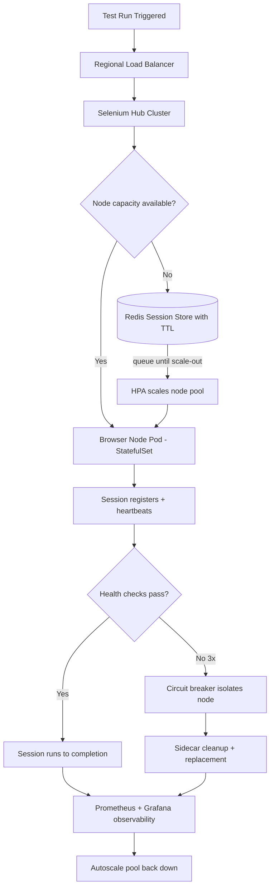

| Difficulty | Channel | Tags |
|---|---|---|
| advanced | system-design | selenium, webdriver, grid |

Until 2014, Expedia Group's ~9,000 UI automation tests were spread across 350+ Jenkins jobs, with browsers launched directly on build executors — and stale processes kept hanging those executors until they became unusable [1]. The suite took hours to finish, there was no real parallel execution, and the team set a goal that sounded like a joke: run the entire UI suite in the time of the slowest single test [1]. They pulled it off, and along the way uncovered the blueprint for a Selenium Grid that handles 10,000 concurrent sessions with 99.9% uptime and zero memory leaks. This is that journey — and what it means for your own test infrastructure.

---

> ### Real-World Case — Expedia Group
>
> Until 2014, Expedia ran ~9,000 UI automation tests across 350+ Jenkins jobs, opening browsers directly on the executors. Stale browsers kept hanging on the executors and making them unusable, there was no real parallel execution, and automation jobs took hours to finish. They set a bold goal: run the entire UI test suite in the time taken by the slowest single test.
>
> | | |
> |---|---|
> | **Challenge** | Scale a Selenium Grid to handle ~150,000+ tests daily across 90+ CI/CD pipelines owned by different teams, while eliminating stale/hung browser sessions (the memory-leak equivalent), avoiding idle infrastructure costs, and doing it without a dedicated grid-operations team. |
> | **Solution** | They built SeleniumGridScaler, a Selenium Grid plugin that drives the AWS EC2 API to autoscale nodes on demand: the hub starts exactly the number of EC2 nodes needed for a run's declared thread count, runs 15 Chrome/Firefox sessions per c5.xlarge node, terminates nodes as soon as tests finish or when idle time expires (respecting AWS hourly billing), and even shuts down the hub itself when unused. Later they evolved this into DA-Kube on Kubernetes/EKS with Docker, Helm, Traefik ingress, warm worker node pools, and Guaranteed QoS pod specs so nodes could be created/destroyed per branch and per browser version. |
> | **Outcome** | ~150,000 tests executed daily across 100+ hubs, with ~4,500 EC2 nodes created, used, and terminated on demand every day; the '1000 UI tests in 5 minutes' target was met versus hours before. The cost plot twist: a third-party cross-browser vendor would have charged roughly $350k for 120 parallel connections and up to $2.41 million for 1,000 connections — Expedia's own autoscaling grid runs for about $80,000 a year. |
> | **Lesson** | You cannot brute-force scale a bad architecture with more hardware. Making the grid ephemeral — provisioning nodes per test run and destroying them when idle — solves the stale-session/memory-degradation problem by design, keeps utilization near 100%, and slashes cost by an order of magnitude versus always-on commercial grids. |

---

## Hook — The grid that turned hours of tests into minutes

Picture this: 9,000 browser tests scattered across 350+ Jenkins jobs, every executor running Chrome processes it will never kill [1]. That was Expedia Group's reality until 2014 — browsers launched directly on the executors, stale processes hanging around until the machines were unusable [1]. Runs took hours. Real parallelism was a distant dream. So the team set a goal that sounded absurd: finish the entire UI suite in the time of the slowest single test [1].

Here is the plot twist — they met it. Today that same infrastructure executes roughly 150,000 tests a day across 100+ hubs, spinning up, using, and tearing down ~4,500 EC2 instances on demand [1]. The journey from grid-lock to grid-at-scale is packed with counterintuitive lessons, and this article walks through the architecture that made it possible: how to design a Selenium Grid for 10,000 concurrent sessions with 99.9% uptime and zero memory leaks. Buckle up — the hard parts are the interesting parts.

## Problem — The four joints where every grid breaks

Most teams hit the Selenium Grid ceiling long before 10,000 sessions. The classic hub-and-node setup hums along at a few hundred tests, and then the cracks appear. Four of them, specifically.

Memory leaks are the first. Every browser session leaks RAM — rendering engines, cached images, connection pools that never get returned. On a node with 2GB of heap, a hundred leaked sessions is a dead node. Many developers think throwing more nodes at the problem fixes it; it actually makes things worse, because each new node just becomes another home for zombies.

Isolation is the second. In a shared hub, one flaky node can poison the whole pool. A node that hangs on a slow selector stalls the queue, and without circuit breaking, the sickness spreads from session to session [7].

Observability is the third. Without metrics, memory creep stays invisible until nodes start dying mid-run. You might think the grid is healthy — until you look at the numbers and discover 60% of nodes are sitting at 95% memory [6].

Lifecycle is the fourth, and the sneakiest. Sessions that never end, Docker volumes that never get cleared, browsers that never quit. Each orphan is a tiny leak that compounds across 200 nodes.

Sound familiar? None of these are fun. But all of them are solvable — and the first team to prove it at genuinely terrifying scale was Expedia Group.

## Real-World Case — Expedia Group's 1,000-in-5-minutes bet

Expedia Group did not just want faster tests; they wanted the entire UI suite to finish in the time it takes the slowest single test [1]. It sounds impossible, which is exactly why it was worth pursuing. The rewrite touched everything: the runner, the grid, and the infrastructure underneath it.

The results are staggering. About 150,000 tests execute daily across 100+ hubs, with roughly 4,500 EC2 instances created, used, and terminated on demand every single day [1]. The 1,000-UI-tests-in-5-minutes target was met — where the old pipeline had burned hours [1].

Then came the cost plot twist. A third-party cross-browser vendor would have charged about $350,000 for 120 parallel connections — and up to $2.41 million for 1,000 [1]. Expedia's own autoscaling grid? Roughly $80,000 a year [1].

| Option | Scale | Cost |
| --- | --- | --- |
| Third-party vendor | 120 parallel connections | ~$350,000 / year |
| Third-party vendor | 1,000 parallel connections | up to $2.41M / year |
| Expedia self-hosted autoscaling grid | ~4,500 on-demand nodes daily | ~$80,000 / year |

🎯 Key Point: The lesson here is not “self-host everything.” It is that elastic infrastructure changes the economics of test automation entirely [9]. The catch — that $80,000 grid only works if every session has a clean, enforced lifecycle. Which leads directly to the deep dive.

## Deep Dive — The architecture behind 10,000 concurrent sessions

Building on Expedia's story, the architecture that makes 10,000 concurrent sessions feel boring is a blend of four disciplines: orchestration, session lifecycle, observability, and resilience [10]. Each one neutralizes one of the four failure modes from earlier.

**Orchestration: Kubernetes as the grid's operating system**
- Hub-node pattern: a central hub with browser nodes running as Kubernetes StatefulSets, spread across multiple availability zones [2][3]. StatefulSets give each node stable identity, so nodes can be drained, replaced, and scaled predictably.
- Resource allocation: per-pod limits of 2GB RAM and 1 CPU per browser node. That fixed budget is what makes the memory math predictable.
- Autoscaling: horizontal pod autoscaling driven by queue depth, not CPU — because a queue of waiting sessions is the real demand signal [4].

**The math that matters**
- 10,000 sessions ÷ 50 sessions per node = 200 nodes minimum.
- 200 nodes × 2GB = 400GB baseline, plus 30% headroom = ~520GB of cluster memory.
- P99 session initiation under 2 seconds, delivered through regional load balancing.
- 99.9% availability requires multi-AZ deployment and automatic failover.

**Session lifecycle: Redis as the memory firewall**
Every session registers in a Redis cluster with TTL-based expiration [5]. Heartbeats refresh the TTL; dead sessions expire automatically — no cleanup cron, no manual babysitting. Key expiration scans run every 5 minutes, and Kubernetes init containers clear stale Docker volumes on node startup.

**Observability: know before it burns**
Prometheus scrapes memory usage, session duration, and queue depth; Grafana turns them into dashboards [6]. Alert at 80% memory on any node. That threshold is not random — it gives you runway before a node hits the wall.

**Resilience: fail gracefully, not loudly**
- Health checks: HTTP /status polled every 10 seconds, node removed after 3 consecutive failures.
- Circuit breaker: Hystrix-style isolation gives a failing node a 30-second recovery window, so one bad node cannot cascade into a dark grid [7].
- Weighted round-robin routes sessions based on node capacity and response time.

🔥 Hot Take: The real tradeoff most interviews ignore is static vs elastic capacity:

| Approach | Pros | Cons |
| --- | --- | --- |
| Static node pool | Simple, predictable | Pays for idle capacity |
| StatefulSet + HPA | Elastic, matches demand | Needs queue-depth metrics and PDBs [4][8] |
| Serverless per-test containers | Maximum elasticity | Session state management gets harder |

**Edge cases — the parts nobody mentions in interviews**
- Network partitions: leader election prevents split-brain, so two hubs never claim the same session [3].
- Resource exhaustion: Pod Disruption Budgets guarantee a minimum 85% capacity during maintenance windows [8].
- Zero-day failures: canary deployments with traffic splitting let a new node image prove itself before it touches 100% of traffic.

That is the theory. But architecture without a workflow is just a wish — so here is how the pieces move together.

## Workflow — From test trigger to recycled node in seven steps

The diagram below tells the whole story in one picture: a test enters on the left, and by the right edge a node has been recycled and the pool scaled back down.

1. A test run triggers the pipeline; the regional load balancer routes to the closest hub.
2. The hub consults the Redis session store and checks available capacity [5].
3. If no node has capacity, the request is queued and the HPA reads queue depth to scale out the node pool [4].
4. A fresh browser node pod (StatefulSet) registers its /status health endpoint and advertises capacity [3].
5. The session starts with a TTL lease in Redis; the worker heartbeats every ~30 seconds to keep it alive [5].
6. Prometheus watches memory and session duration, while the circuit breaker watches for failures [6][7].
7. On completion or expiry, the sidecar cleans up, and autoscaling shrinks the pool back down [9].

⚠️ Watch Out: Step 3 is where most implementations cheat. If the HPA scales on CPU instead of queue depth, the grid reacts to symptoms after they happen — you get 200 hot nodes and a queue that is still hours long. Scale on the signal that actually predicts demand [4].

The Mermaid diagram below captures this entire loop at a glance.

## Code Example — TTL-based session lifecycle in practice

Enough theory — here is the pattern that turns “zero memory leaks” from a marketing claim into something you can actually ship. The core trick is elegant: give every session a lease on life, refresh it while it behaves, and let it die silently the moment it stops heartbeating. Below is a Python session-lifecycle module that implements exactly what the worker and sidecar run in production [5].

## Lessons Learned — What to steal from Expedia's playbook

The whole journey reduces to a handful of principles you can apply this week, whatever your grid size:

- Treat sessions as leases, not open handles. A TTL plus heartbeat turns memory management into a solved problem instead of a cleanup chore [5].
- Measure before you scale. Memory at 80% is a warning, 90% is a fire, 95% is the moment you lose nodes [6].
- Make failure cheap. Circuit breakers and canaries mean the worst case is one isolated node, not a dark grid [7].
- Autoscale on queue depth, not CPU. Demand-driven scaling is what made Expedia's ~4,500 daily EC2 instances economically sane [4][9].
- Rethink the cost of parallel connections. Expedia's $80k/year grid versus $2.41M from a vendor is the strongest argument for elastic infrastructure you will ever find [1].

**Battle scars** — the mistakes you will make anyway:
- Do not give a node a 30-minute timeout and call it lifecycle management. You will find out the hard way that 30 minutes of leaked RAM across 200 nodes is 12GB of dead weight.
- Skipping the Pod Disruption Budget is how you lose 30% of your grid during a routine rolling update [8].
- If this feels overwhelming, you are not alone — every team that scaled a grid past a few hundred sessions has been here. The difference is treating lifecycle management as a first-class engineering problem, not a fire drill.

The most memorable insight from this entire saga: memory leaks don't defeat grids — unmanaged lifecycles do. Fix the lifecycle, and the rest of the architecture quietly falls into place.

---

## Selenium Grid Session Lifecycle

<strong>Original Interview Question</strong>

**Q:** Design a scalable Selenium Grid architecture to handle 10,000 concurrent test sessions with 99.9% uptime, ensuring zero memory leaks through automatic session lifecycle management, real-time monitoring, and graceful node failure recovery across multiple data centers?

**A:** Deploy Kubernetes cluster with auto-scaling node pools, Redis session store with TTL policies, Prometheus metrics for memory monitoring, circuit breakers for node isolation, and sidecar containers for session cleanup. Implement health checks, resource quotas, and rolling updates.

## Conclusion

The journey that started with 9,000 tests hanging an executor in 2014 ends with ~150,000 tests a day running on demand — because Expedia Group treated session lifecycle as a first-class engineering problem, not a cleanup chore [1]. You do not need their scale to apply the lessons: every grid, from 5 nodes to 200, gets dramatically more stable the moment you give sessions a lease, watch their memory, and keep failures small. Tomorrow, do one thing: add a TTL to your session store and a health check to your nodes [5]. The 2 a.m. pager will thank you. And when someone asks why the grid needs that much engineering, you can tell them the plot twist — the grid that replaces a $2.41 million vendor bill for $80,000 a year pays for its own architecture many times over [1].

---

## References

1. [Expedia Group incident report](https://medium.com/expedia-group-tech/distributed-automation-how-to-run-1000-ui-automation-tests-in-5mins-cf9a84ca32d1) — article
2. [Selenium Grid documentation](https://www.selenium.dev/documentation/grid/) — documentation
3. [Kubernetes StatefulSets documentation](https://kubernetes.io/docs/concepts/workloads/controllers/statefulset/) — documentation
4. [Kubernetes Horizontal Pod Autoscaling documentation](https://kubernetes.io/docs/tasks/run-application/horizontal-pod-autoscale/) — documentation
5. [Redis EXPIRE command reference](https://redis.io/docs/latest/commands/expire/) — documentation
6. [Prometheus overview](https://prometheus.io/docs/introduction/overview/) — documentation
7. [Netflix Hystrix repository](https://github.com/Netflix/Hystrix) — documentation
8. [Kubernetes Pod Disruption Budgets documentation](https://kubernetes.io/docs/tasks/run-application/configure-pdb/) — documentation
9. [AWS EC2 Auto Scaling documentation](https://docs.aws.amazon.com/AWSEC2/latest/UserGuide/ec2-auto-scaling.html) — documentation
10. [An Introduction to Kubernetes (DigitalOcean)](https://www.digitalocean.com/community/tutorials/an-introduction-to-kubernetes) — documentation

---

**Author:** Satishkumar Dhule — [GitHub](https://github.com/satishkumar-dhule) · [LinkedIn](https://linkedin.com/in/satishkumar-dhule) · [Website](https://satishkumar-dhule.github.io)
