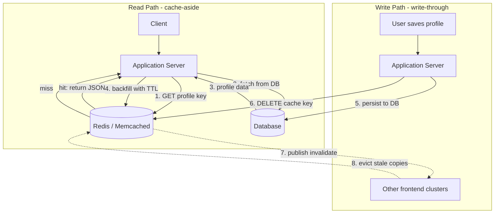

| Difficulty | Channel | Tags |
|---|---|---|
| beginner | backend | redis, memcached, cache-invalidation |

Ever wondered why the scariest line of code in a distributed system is often a single `DEL` command? Facebook (Meta) learned this the hard way: their social graph triggers hundreds of cache lookups per page view, which effectively turned Memcached into their de-facto storage system [1]. The naive "delete the key on write" approach didn't just degrade at their scale — it failed catastrophically across thousands of servers and multiple frontend clusters. This is the story of why cache invalidation is a systems problem, not a function call.

---

> ### Real-World Case — Facebook (Meta)
>
> Facebook's social graph generates hundreds of cache lookups per page view, making memcached effectively their de-facto storage system. When any user updated their profile, that cached data had to be invalidated consistently across thousands of memcached servers and multiple frontend clusters — and the naive approach of just 'delete the key on write' started failing catastrophically at scale.
>
> | | |
> |---|---|
> | **Challenge** | Cache invalidation on writes across a distributed fleet: delete-based invalidation had a race condition (the 'stale set' problem) where a slow miss handler could write an old value back after a newer one landed, and the repeated invalidation of hot profile keys triggered thundering herds that hammered MySQL. They also had to propagate invalidations across regions in a way that didn't expose stale data during database replication lag. |
> | **Solution** | They kept the cache-aside/delete-on-write path (UPDATE database, then delete key) but engineered distributed coordination that Memcached natively lacks: 64-bit 'lease' tokens verified by the cache server on SET (similar to load-link/store-conditional) to drop stale writes, rate-limited leases (one token per key per 10s) to collapse thundering herds into a single DB fetch, mcsqueal batching of deletes through MySQL's binlog so invalidations never arrive before the replicated write, and a Gutter pool with short TTLs to absorb server failures. Reads stay cache-aside with the invalidation stream guaranteeing ordering. |
> | **Outcome** | The fleet serves billions of requests per second and holds trillions of items for over a billion users. Leases cut peak database query rate from 17K/s to 1.3K/s on thundering-herd-prone keys, batching yielded an 18x improvement in median deletes per packet, and end-to-end p95 latency stayed in single-digit milliseconds despite a median fan-out of 24 keys per request. |
> | **Lesson** | The 'delete the key on update' strategy the textbook recommends is exactly what broke under concurrency — plain deletes have a stale-set race and a herd problem. Memcached's lack of built-in coordination isn't a dealbreaker; you can build leases/CAS-style invalidation on top of it, and its simplicity is why it scaled to billions of req/s. Redis's pub/sub is one option, but replication-ordered invalidation (deletes piggybacking on the binlog) is a more elegant way to keep invalidation consistent with the authoritative write. |

---

## Hook — The key that should never have existed

Picture this: a billion users, trillions of cached items, and a single delete command that needs to travel to thousands of servers without losing a single write. That was the everyday reality for Facebook (Meta)'s cache fleet, which serves billions of requests per second [1].

When a user edits their profile photo, every server that holds a stale copy of that profile becomes a liability. Miss one, and some friend somewhere sees yesterday's face. Miss a hundred, and your "fresh data" promise quietly evaporates.

You might think cache invalidation is a solved problem — Redis and Memcached have been around forever, right? Here is the thing though: the hard part was never the cache. The hard part is the coordination. And as you are about to see, one well-meaning `DEL` can set off a chain reaction that takes down your database.

## Problem — Two hard things in computer science, and cache invalidation is one of them

There is an old joke that there are only two hard things in computer science: cache invalidation and naming things. That joke exists for a reason — invalidating cached data correctly is genuinely harder than it sounds, because you are fighting a race between two competing truths [4].

The first truth: a read should be fast. Nobody wants a database round-trip on every page load. The second truth: a read should be correct. Nobody wants to serve stale data that silently contradicts what is in the database.

Every caching strategy is a negotiation between those two truths, and the negotiation breaks down at scale:

- **The stale-window problem** — you set a TTL of 10 minutes, and for 10 minutes you are serving possibly outdated profiles.
- **The thundering herd** — invalidate a popular key and suddenly a thousand requests pile onto the cache miss at once, all hitting the database simultaneously.
- **The multi-node problem** — with hundreds of cache servers spread across clusters, "deleting the key" means "coordinating a delete across a fleet."
- **The overwrite race** — if you write new data into the cache instead of deleting it, a slow, stale read can finish afterward and overwrite your fresh value with old data.

Sound familiar? If you have ever stared at a system serving duplicate or outdated data and wondered why the TTL didn't save you, you are not alone. The stakes scale with your traffic: the more popular your service, the more painful each of these four problems becomes.

## Real-World Case — Facebook (Meta): when the cache becomes the storage system

Here is where the story turns from theory into war story. Facebook (Meta)'s social graph generates hundreds of cache lookups per page view, which made Memcached effectively their de-facto storage system [1]. The fleet holds trillions of items for over a billion users and serves billions of requests per second [1].

At that scale, the naive "delete the key on write" approach broke down. Deleting a popular key triggered a thundering herd: thousands of concurrent reads flooded the backend database at once, pushing query rates to 17,000 per second on the worst keys. That is the moment the cache stopped protecting the database and started attacking it.

The team's fix was a mechanism called leases. Instead of handing a cache miss straight to the database, Memcached issued a lease — a token that lets exactly one client regenerate the value while everyone else waits briefly. The result: peak database query rate on thundering-herd-prone keys dropped from 17K/s to 1.3K/s [1].

But there was more. With thousands of servers, invalidations themselves became a network problem. By batching delete operations, Facebook's team got an 18x improvement in median deletes per packet [1]. And despite a median fan-out of 24 keys per request, end-to-end p95 latency stayed in single-digit milliseconds [1].

The lesson here is brutal and beautiful at once: at scale, cache invalidation is not about correct code — it is about coordination, backpressure, and batching. Your service may never serve a billion users, but the same failure modes are waiting for you at 1/100,000th of that scale.

## Deep Dive — Redis vs Memcached: the real trade-offs behind the tool choice

Building on that war story, the question becomes: which tool actually helps you invalidate well? The classic showdown is Redis versus Memcached, and most developers make the choice on reputation rather than on the invalidation story. Let's fix that.

Memcached was built for one thing: a pure, fast in-memory key-value cache with no persistence [2]. Redis is a full-featured data structure server with persistence, pub/sub messaging, and advanced data types like sorted sets and streams [3].

Here is the trade-off table you actually need:

| Capability | Memcached | Redis | Why it matters for invalidation |
|---|---|---|---|
| Distributed invalidation | Manual — you coordinate across nodes yourself | Pub/sub channels for automatic fan-out [6] | Redis turns "tell every node to delete" into a broadcast |
| Persistence | None — data is lost on restart [2] | Snapshots and append-only file [3] | Redis can survive a restart; Memcached re-warms from the database |
| Data structures | Plain key-value | Strings, hashes, lists, sets, streams [3] | You can cache compound objects without serialize-everything |
| Memory overhead | Lower, simpler slab allocation | Higher per key | Memcached wins on raw cache efficiency [7] |
| Horizontal scaling | Simple, consistent-hashing based sharding [5] | Cluster mode with hash slots | Both work; Memcached's model is simpler [7] |
| The invalidation payoff | Great pure cache, you build the coordination | Pub/sub + expiration give you coordination for free | This is the whole ballgame [6] |

💡 **Insight:** If your invalidation needs are "delete this key after a write," Memcached's simpler architecture will serve you beautifully. The moment you need to notify multiple clusters, coordinate evictions, or reconstruct state after a restart, Redis's pub/sub and persistence stop being features and start being survival tools.

🔥 **Hot take:** Choosing a cache purely for read latency is choosing with your eyes closed. The read path is 10% of the engineering. The invalidation path is the other 90%, and that is where Redis pulls ahead for most teams.

⚠️ **Watch Out:** Pub/sub is a fire-and-forget broadcast [6]. If no subscriber is listening at the moment you publish, the message is gone. Redis pub/sub works great for ephemeral "please refresh" signals, but it is not a durable queue — do not build your source-of-truth updates on it.

Moreover, both tools share the same fundamental architecture on top: distributed caching with consistent hashing to decide which node owns which key [5]. When a node joins or leaves, consistent hashing minimizes the number of keys that move — which means fewer forced cache misses, which means a gentler thundering herd.

## Workflow — The write-through invalidation playbook

Now that you know the trade-offs, here is the workflow that holds up in production. It combines a write-through pattern for writes, cache-aside reads, TTL expiration as a safety net, and — when you are running Redis — pub/sub for cross-cluster invalidation [4].

The diagram below (see "Cache Invalidation Flow") tells the story in one picture: reads go cache-first and backfill on miss, writes go database-first and delete the key, and every other cluster gets notified to evict its copy.

1. **Read request arrives** — look up the profile key in the cache.
2. **Cache hit** — return the JSON. Zero database round-trips.
3. **Cache miss** — fetch from the database, backfill the cache with a TTL, return.
4. **Profile update arrives** — write to the database first. It is the source of truth.
5. **Delete the cache key** — never overwrite it. Deletion avoids the stale-read race.
6. **Publish an invalidation event** — every frontend cluster drops its own copy immediately instead of waiting out the TTL.
7. **Monitor** — watch hit rates, eviction counts, and database query rates so the next thundering herd is visible before it is catastrophic.

Why delete and not overwrite? Because overwriting re-introduces the race: a concurrent read that got a miss just before your write can complete afterward and stamp your fresh value with stale data. Deleting forces the next read to fetch from the database, guaranteeing correctness.

This is exactly the pattern Facebook's team relied on, with two extra safety valves — leases to tame the herd and batching to tame the network [1]. Your TTL is the third valve: even if a notification is dropped, the TTL guarantees eventual consistency.

## Code Example — A production-style profile service with write-through invalidation

Let's turn the workflow into code. This is a realistic profile service using Redis for the cache and pub/sub for cross-cluster invalidation. The read path is cache-aside; the write path is write-through with a delete, not an overwrite.

```python
import json
from redis import Redis

cache = Redis(host='cache.internal', port=6379, decode_responses=True)
PROFILE_TTL = 600  # 10 minutes - inside the recommended 5-30 minute window
CHANNEL = 'profile:invalidate'

def get_profile(user_id: str) -> dict:
    # Read path: cache-aside with backfill on miss.
    key = f'profile:{user_id}'
    cached = cache.get(key)
    if cached is not None:
        return json.loads(cached)  # hit: zero database round-trips

    profile = fetch_from_db(user_id)  # miss: one slow read, then warm the cache
    cache.set(key, json.dumps(profile), ex=PROFILE_TTL)
    return profile

def update_profile(user_id: str, profile: dict) -> None:
    # Write path: write-through, then invalidate - never overwrite the cache.
    save_to_db(user_id, profile)  # 1. database is the source of truth

    # 2. Delete the key instead of overwriting it. If you SET new data here,
    # a concurrent stale read can race you and re-populate old data after.
    cache.delete(f'profile:{user_id}')

    # 3. Broadcast so every frontend cluster drops its own copy immediately,
    # instead of waiting out the TTL with stale data.
    cache.publish(CHANNEL, user_id)
```

Here is what is happening, line by line:

- **`get_profile`** implements cache-aside: it checks the cache first, and only on a miss does it touch the database. The backfill `set` includes an `ex` TTL, so even a dropped invalidation event self-heals within 10 minutes.
- **`update_profile`** implements write-through: the database write happens first, making the database the source of truth, and then the cache key is deleted.
- **The delete beats the overwrite** — the comment captures the race: a SET here would let a concurrent stale read overwrite your fresh value. A DEL forces the next reader to fetch clean data.
- **The publish** is the multi-node coordination. Each subscriber in every frontend cluster receives the event and evicts its local copy, which mirrors the batched-invalidation approach Facebook used to keep p95 latency in single-digit milliseconds [1].

One production caveat: redis-py's `publish` returns the number of subscribers that received the message. If it returns 0, no one was listening — which is the fire-and-forget risk of pub/sub mentioned earlier [6]. For durable delivery guarantees, pair this with a stream or a work queue as your safety net.

## Lessons Learned — What the thundering herd taught us

So what should you actually change tomorrow? If this article leaves you with one thing, let it be this: invalidation design, not cache throughput, is where systems are won and lost.

Here are the battle scars, collected so you don't have to earn them the hard way:

- **Never overwrite a cache key with new data after a write — delete it.** The overwrite race is the sneakiest source of stale data in modern backends.
- **Always set a TTL, even with active invalidation.** It is your eventual-consistency safety net when a notification gets dropped [4].
- **Tame the thundering herd before it exists.** Facebook's leases cut worst-key database load from 17K/s to 1.3K/s [1]; a per-key single-flight lock or a short random delay buys you most of that benefit.
- **Batch your invalidations.** Facebook got an 18x improvement in median deletes per packet by batching [1]. If you issue thousands of deletes, amortize them.
- **Pick your tool on the invalidation story, not the benchmark.** Memcached is leaner and faster for pure caching [7]; Redis gives you pub/sub, persistence, and richer structures when coordination matters [3][6].
- **Monitor the right metrics.** Cache hit rate alone lies. Track eviction counts, database query rate, and p95 latency — the three numbers that actually reveal a herd in progress.

And if you are running a single-process service and feel cache invalidation is overkill — Python's `functools.lru_cache` gives you the same mental model in 20 lines, TTL-free, with automatic eviction [8]. Start there, and graduate to Redis or Memcached when the second process appears.

This pattern works well because it treats the cache as a performance layer, not a truth layer. When you stop trusting the cache to be right and start trusting it to be fast, the whole design gets simpler.

---

## Cache Invalidation Flow



<details>
<summary><strong>Original Interview Question</strong></summary>

**Q:** You're building a user profile service that caches frequently accessed profiles. How would you implement cache invalidation when a user updates their profile, and what trade-offs would you consider between Redis and Memcached?

**A:** Implement write-through caching with TTL-based expiration. On profile update, invalidate the cache by deleting the key and writing new data to both the database and cache. Redis offers pub/sub for automatic distributed invalidation, while Memcached requires manual coordination across nodes.

</details>

## Conclusion

Every cache starts as a performance shortcut and ends as a coordination problem. Facebook's fleet taught the industry that the naive "delete on write" eventually breaks — and that the answer is a layered defense: write-through invalidation, TTL safety nets, lease-based herd protection, and batched, broadcast deletes [1]. Your profile service does not need billions of requests per second to hit these failure modes; it just needs popularity. Tomorrow, review your write path and ask one question: do you delete the key, or do you overwrite it? Because the memory to carry forward is this — the cache is where you trust the database's truth to travel fast, and the moment you try to make the cache the truth, you lose. Treat the cache as fast, not as right, and you will sleep through the next deployment.

---

## References

1. [Facebook (Meta) incident report](https://www.usenix.org/conference/nsdi13/technical-sessions/presentation/nishtala) — paper
2. [Memcached](https://en.wikipedia.org/wiki/Memcached) — documentation
3. [Redis](https://en.wikipedia.org/wiki/Redis) — documentation
4. [Cache invalidation](https://en.wikipedia.org/wiki/Cache_invalidation) — documentation
5. [Consistent hashing](https://en.wikipedia.org/wiki/Consistent_hashing) — documentation
6. [Publish-subscribe pattern](https://en.wikipedia.org/wiki/Publish%E2%80%93subscribe_pattern) — documentation
7. [AWS ElastiCache: Redis vs Memcached](https://docs.aws.amazon.com/AmazonElastiCache/latest/red-ug/SelectEngine.html) — documentation
8. [Python functools.lru_cache documentation](https://docs.python.org/3/library/functools.html) — documentation

---

**Author:** Satishkumar Dhule — [GitHub](https://github.com/satishkumar-dhule) · [LinkedIn](https://linkedin.com/in/satishkumar-dhule) · [Website](https://satishkumar-dhule.github.io)
