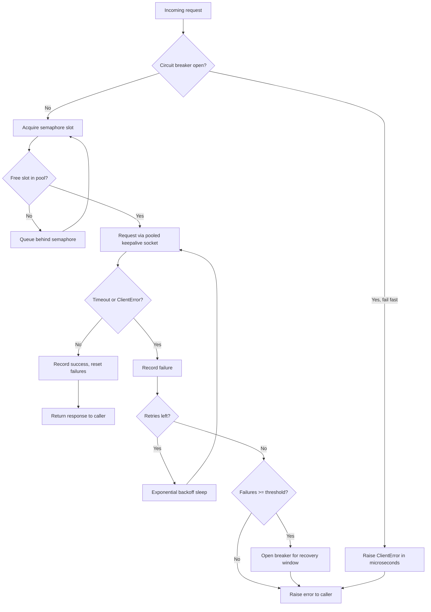

| Difficulty | Channel | Tags |
|---|---|---|
| advanced | backend | asyncio, aiohttp, concurrency |

By 2011-2012, Netflix's API was receiving over one billion incoming calls every single day — and each one fanned out to a 1:6 ratio of downstream dependencies [1]. One slow service could saturate every request thread in seconds and take down the entire platform. The sobering math: with 30 dependencies each at 99.99% uptime, combined uptime dropped to 99.7% — more than two hours of guaranteed downtime per month [1]. This article walks through the lessons from that saga and applies them to a problem every Python developer eventually faces: building an aiohttp connection pool that degrades gracefully instead of collapsing.

---

> ### Real-World Case — Netflix
>
> By 2011-2012 the Netflix API was receiving over 1 billion incoming calls per day that fanned out to several billion outgoing calls (a 1:6 ratio) to dozens of underlying microservices, with peaks above 100,000 dependency requests per second across thousands of EC2 instances. One slow or latent dependency could saturate every Tomcat request thread in seconds or sub-seconds, taking down the entire API — and with 30 dependencies each at 99.99% uptime, failure was mathematically guaranteed (99.7% combined uptime = 2+ hours of downtime per month).
>
> | | |
> |---|---|
> | **Challenge** | How to build a connection/concurrency manager that limits concurrent calls to downstream services, isolates failures, handles connection timeouts, and gracefully degrades instead of letting a single slow service cause a cascading, full-API outage. |
> | **Solution** | Netflix built DependencyCommand (the precursor to open-source Hystrix), combining exactly the patterns in this answer: per-dependency thread pools sized as bulkheads, semaphores (via non-blocking tryAcquire) to cap concurrent calls to cheap dependencies and untrusted fallbacks, aggressive network timeouts plus retries with exponential backoff, and a circuit breaker that tripped open at a ~50% error rate over a rolling 10-second window — rejecting requests immediately ('fail fast') until a health check succeeded. Every command had a fallback chain (cache → eventual-consistency queue → stubbed data → empty response) so users got degraded-but-working responses rather than errors. |
> | **Outcome** | Netflix processed tens of billions of thread-isolated and hundreds of billions of semaphore-isolated calls daily, kept the API up through dependency outages, and shed load on sick services in seconds instead of letting request threads pile up. The 2012 post cites a 'dramatic effect' on resilience — the pattern became the industry-standard Hystrix library (24.5k GitHub stars). |
> | **Lesson** | The plot twist: a dependency that is merely SLOW (not down) is the worst failure mode — it blocks threads and cascades. Fail fast + fallback beats wait-and-propagate. And the second twist: Hystrix's fixed thread pools eventually became hard to tune at extreme RPS, so Netflix deprecated it in 2018 in favor of adaptive concurrency limits (Vegas algorithm) that size pools from measured latency — proving even the canonical solution must evolve. |

---

## Hook — the dependency that took down everything at 2 a.m.

It's 2 a.m., and your pager hasn't stopped buzzing for ten minutes. Error rate: 100%. The dashboard shows one microservice — the same one that's been flaky for weeks — suddenly slow as molasses. Here is the crazy part: nothing else is down. One sluggish dependency is dragging your entire API into the mud, and every incoming request is piling up in a queue that will never drain.\n\nThis is the cascade failure nobody plans for. Your aiohttp service didn't run out of CPU, disk, or memory. It ran out of patience — sockets opened faster than they closed, retries multiplied into a self-inflicted stampede, and the event loop got buried under connections that were never going to succeed.\n\nHere is the uncomfortable truth: if your connection strategy is 'open a socket and hope for the best,' you are one slow upstream service away from a very bad night. The good news? This exact battlefield has been fought before — and the playbook is public.

## Problem — why naive connection handling collapses under real load

Building on the hook: most Python services start innocent. A single aiohttp.ClientSession, created once, reused forever, and all is well — until traffic ramps up. Then the cracks appear.\n\nThe first crack is unbounded concurrency. Every incoming request wants an outgoing connection, and aiohttp happily opens a new socket for each one. That works beautifully at 10 requests per second and falls apart at 10,000. Sockets are finite. File descriptors are finite. The OS will happily let you exhaust both. asyncio gives you a single event loop to share across everything, so every blocked connection is a slice of loop time stolen from healthy requests [2].\n\nThe second crack is the timeout that never happens. A default aiohttp session leaves effective timeouts generous to the point of danger. If a dependency stops answering, every waiting request lingers for the full window, occupying a socket and a chunk of event-loop time that healthy requests desperately need.\n\nThe third crack is retries with no discipline. Many developers discover that adding 'try again' makes things worse: when a service is down, retrying is just a more polite way of knocking on a burning building. Without backoff and a circuit breaker, retries turn one broken service into a denial-of-service attack — against your own platform.\n\nThe stakes are concrete. For a service doing 5,000 requests per second, a single dependency that latencies from 50ms to 5 seconds doesn't just feel slower. It consumes the entire connection budget, and every other feature in the API degrades or dies. Sound familiar?

## Real-World Case — Netflix and the 1:6 fan-out problem

Every developer has stared at a stuck dependency. Netflix stared at dozens of them, all at once. By 2011-2012, the Netflix API was receiving over one billion incoming calls per day that fanned out to several billion outgoing calls — a 1:6 ratio — across dozens of underlying microservices [1]. At peak, that meant more than 100,000 dependency requests per second spread over thousands of EC2 instances.\n\nThe math was brutal. With 30 dependencies each claiming 99.99% uptime, the combined uptime was just 99.7% — over two hours of downtime every single month, no matter how flawless each individual service was [1]. One slow or latent dependency could saturate every Tomcat request thread in seconds or sub-seconds, taking down the entire API. The 'independent' parts of the system weren't independent at all — they all shared one fragile pool of request threads.\n\nHere is the plot twist: Netflix's fix wasn't more threads, more machines, or faster services. It was isolation. They separated per-dependency thread pools and later semaphore isolation so a sick service could only exhaust its own quota, shed load on unhealthy dependencies in seconds, and let the rest of the API keep running. The pattern shipped as the Hystrix library, which went on to gather over 24,000 GitHub stars and became the industry template for fault tolerance [8].\n\nThat lesson — isolate, bound, and fail fast — transfers directly to aiohttp. Your asyncio event loop is the Tomcat request thread pool of 2012. Everything shares it. And whatever you give your connections, you can take away when they misbehave.

## Deep Dive — semaphores, backoff, and the circuit breaker

So how does the Netflix playbook translate into Python? Three tools do the heavy lifting, and each one maps to a specific failure mode.\n\nThe semaphore is your load shedder. asyncio.Semaphore caps how many concurrent connections your code will ever hold, no matter how many requests are in flight [3]. Requests beyond the cap queue politely instead of exhausting file descriptors. Consequently, saturation becomes a queueing problem with a bounded size — not a resource explosion. You are trading a slow but graceful queue for a fast but fatal crash, and that is a trade worth making.\n\nTimeouts are your second line of defense. aiohttp.ClientTimeout lets you set total, connect, and read limits independently [5]. A tight connect timeout means a dead service fails in milliseconds instead of hanging your event loop. However — and here is the counterintuitive part — a timeout alone isn't enough. A timed-out request still needs to be handled, and if every handler instantly retries, you have just amplified the failure.\n\nThat's where exponential backoff and the circuit breaker enter. Exponential backoff spaces out retries with increasing delays, giving a struggling service time to breathe [7]. The circuit breaker goes further: once failures cross a threshold, it stops sending requests entirely for a recovery window, failing fast so callers get a quick error instead of a slow one [6]. The breaker is the one pattern that actively protects the dependency from you.\n\nConnections, meanwhile, are too expensive to keep recreating. HTTP keepalive and a shared TCPConnector let aiohttp reuse sockets, skipping the TCP handshake on every request [9][4]. You might think a fresh connection per request is simpler — and it is, right up until the TLS handshake cost shows up on your latency budget.\n\n| Strategy | What it solves | The real trade-off |\n| --- | --- | --- |\n| Semaphore limit | Socket and file descriptor exhaustion under load | Requests queue when saturated — needs a sane pool size |\n| Tight timeouts | Slow or hung dependencies | Too tight = false failures on legitimately slow work |\n| Exponential backoff | Stampede amplification on retry | Adds latency to retried requests |\n| Circuit breaker | Cascade failure across dependencies | Requires tuning threshold + recovery window |\n| Connection reuse | TCP and TLS handshake overhead | Adds connection lifecycle management |\n\nThe punchline: no single tool is sufficient. A semaphore without a breaker still lets one service consume the whole pool. A breaker without a semaphore still lets concurrent requests flood a recovered service. They work as a system, not as a list of options.

## Workflow — from naive session to production pool, step by step

Building on the deep dive, here is the sequence that turns a bare aiohttp.ClientSession into a resilient pool. Figure 1 below walks the full request lifecycle; the steps below map to it.\n\n1. Size the pool. Pick max_connections based on measured concurrency, not guesswork. If your API does 5,000 requests per second and each takes 200ms, you need roughly 1,000 concurrent connections at steady state. Monitor, then adjust.\n2. Set timeouts before you need them. Connect, read, and total timeouts — each tuned to the dependency's real latency distribution.\n3. Acquire a semaphore slot on every request. This bounds concurrency at the door, before any socket is touched.\n4. Check the circuit breaker. If it's open, fail fast with a clear error instead of queueing work that will only time out.\n5. Send the request over a pooled, keepalive connection.\n6. On failure, record it and retry with exponential backoff — but only up to a fixed retry budget.\n7. When consecutive failures cross the threshold, trip the breaker and stop all traffic for the recovery window.\n8. On success, reset the failure counter so the breaker heals automatically.\n9. On shutdown, close the session and connector explicitly, or you will leak sockets and keep the process alive.\n\nFigure 1 shows the whole journey. Notice that the circuit breaker sits right after the semaphore: you never waste a semaphore slot on a request that's destined to fail.

## Code Example — a production-grade pool in about 70 lines

Now the practical part. The class below combines everything from the workflow into a single, reusable manager. It's built to be dropped into an existing async service: create it, call start() once at boot, use get() everywhere, and call close() on shutdown. The code is the payoff — every line maps back to a failure mode from the Netflix saga.

## Lessons Learned — what to change tomorrow

After the journey from naive session to hardened pool, here is what actually matters.\n\n• Bound everything, including your optimism. Semaphores, timeout budgets, retry budgets, and pool sizes are all levers that keep one bad dependency from consuming the whole system.\n• Fail fast beats fail slow. A quick, honest error that lets a caller react is better than a 30-second hang that ties up resources. Netflix shed load on sick services in seconds — not minutes [1].\n• Retries need backoff, and backoff needs a breaker. Without the breaker, retries are just distributed hammering.\n• Test the failure modes, not the happy path. Chaos-test the pool: kill the dependency, watch the breaker trip, watch it recover. A cascade failure should surprise you in staging, not at 2 a.m.\n• Clean up on shutdown. Connection leaks on restart are how 'temporary' incidents become recurring ones.\n\n⚠️ Watch Out: the three most common battle scars are setting no connect timeout (a dead host hangs you for the full total timeout), forgetting to close the session on shutdown (leaked sockets that keep the process alive), and sharing one pool across workloads with wildly different latency profiles (one slow workload starves the fast one).\n\nTomorrow, do this: wrap your existing session in a bounded pool, add a connect timeout of 1-2 seconds, and instrument failure counts. That is 90% of the resilience for 10% of the effort. The breaker and backoff are the polish — the semaphore and the timeout are the lifeboat. If this feels overwhelming, you are not alone: the pattern is dense because it has to be. Start with step one.

---

## Request Lifecycle with Circuit Breaker

<strong>Original Interview Question</strong>

**Q:** How would you implement a connection pool manager for aiohttp that handles graceful degradation under high load and connection timeouts?

**A:** Implement a connection pool manager for aiohttp using a semaphore to limit concurrent connections, exponential backoff for retrying failed requests, and circuit breaker pattern to gracefully degrade under high load and connection timeouts.

## Conclusion

The 2012 Netflix incident taught the industry something profound: in a distributed system, failure isn't a possibility, it's a certainty [1]. The only real design question is whether your system fails with a graceful queue and a closed circuit — or with a saturated pool and a 2 a.m. pager. You now have the pattern: a semaphore for load shedding, exponential backoff for disciplined retries, a circuit breaker for isolation, and a shared connector for efficiency. The next time a dependency starts misbehaving, your API won't just survive the storm — it will be the calm center of it. Start with the pool. Your future self, sleeping through the night, will thank you.

---

## References

1. [Netflix incident report](https://netflixtechblog.com/fault-tolerance-in-a-high-volume-distributed-system-91ab4faae74a) — article
2. [Python asyncio documentation](https://docs.python.org/3/library/asyncio.html) — documentation
3. [asyncio synchronization primitives (Semaphore)](https://docs.python.org/3/library/asyncio-sync.html) — documentation
4. [aiohttp client reference (TCPConnector)](https://docs.aiohttp.org/en/stable/client_reference.html) — documentation
5. [aiohttp documentation (ClientTimeout)](https://docs.aiohttp.org/en/stable/) — documentation
6. [Circuit breaker design pattern](https://en.wikipedia.org/wiki/Circuit_breaker_design_pattern) — documentation
7. [Exponential backoff](https://en.wikipedia.org/wiki/Exponential_backoff) — documentation
8. [Netflix Hystrix repository](https://github.com/Netflix/Hystrix) — documentation
9. [HTTP connection management in HTTP/1.x](https://developer.mozilla.org/en-US/docs/Web/HTTP/Connection_management_in_HTTP_1.x) — documentation

---

**Author:** Satishkumar Dhule — [GitHub](https://github.com/satishkumar-dhule) · [LinkedIn](https://linkedin.com/in/satishkumar-dhule) · [Website](https://satishkumar-dhule.github.io)
