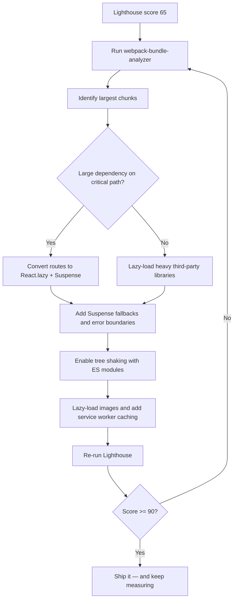

| Difficulty | Channel | Tags |
|---|---|---|
| intermediate | frontend | lighthouse, bundle, lazy-loading |

Picture this: a React app that must load its first meaningful screen in under five seconds, on a $50 Android phone, over a 2G connection that drops packets the way a sieve drops water. That is the challenge Twitter's engineering team faced when they built Twitter Lite for emerging markets like India and Indonesia [1]. Their answer — disciplined code splitting, lazy loading, and ruthless bundle analysis — cut main-bundle load time from roughly 5 seconds to 3 seconds on simulated 3G, and their story is a masterclass in taking a bloated React app from a 65 Lighthouse score to a 90+. The same playbook is exactly what you need when a stakeholder drops that other dreaded metric on your desk: Time to Interactive is 4.2 seconds and climbing.

---

> ### Real-World Case — Twitter
>
> Twitter wanted twitter.com to work for users in emerging markets like India and Indonesia, where most people accessed it on low-end Android devices over slow 2G/3G networks with expensive data. The main Twitter web app was too heavy, so they built Twitter Lite as a React-based Progressive Web App that had to start fast and stay fast under those harsh conditions.
>
> | | |
> |---|---|
> | **Challenge** | The initial JavaScript payload was several megabytes and the app took ~5 seconds to load on a simulated 3G connection, with terrible Time to Interactive. They needed to drastically cut the bytes and parse work sent on first load without losing the full Twitter experience. |
> | **Solution** | They applied route-based code splitting with webpack's CommonsChunkPlugin, breaking the app into runtime, vendor, shared, main, and i18n chunks plus roughly 40 lazy-loaded on-demand chunks using the PRPL pattern. They delayed Service Worker registration until after critical resources loaded, virtualized the timeline to avoid frame drops, and optimized images (progressive JPEGs, capped fidelity). They validated every change with Google's Lighthouse auditing tool on before/after builds. |
> | **Outcome** | Code splitting cut the main bundle load time from ~5s to ~3s on simulated 3G, and Time to Interactive was reduced to nearly half its previous value as measured in Lighthouse. Combined with image and rendering optimizations, the app could load useful content up to 90x faster on progressive JPEG first-scans for users in India and Indonesia, and stayed fast at Twitter's scale. |
> | **Lesson** | Splitting at route boundaries and separating vendor/shared chunks is the single highest-leverage move for initial JS payload — a single CommonsChunkPlugin configuration plus lazy-loaded on-demand chunks halved TTI. But small optimizations across many areas (service worker timing, image format, virtualization) compound, and you must measure every change with Lighthouse to prove the win. |

---

## Hook — The app that had to boot up on a shoestring phone

It is 2017, and a user in rural India taps the Twitter icon on a low-end Android device. Their connection is 2G. Their data plan is precious, measured in megabytes, and priced per kilobyte. The main Twitter web app — feature-rich, heavy, and built for powerful phones — would take agonizing seconds to respond, if it responded at all. Twitter could have shrugged and told these users to install the native app. Instead, they made a bet: build Twitter Lite, a React-based Progressive Web App engineered to start fast and stay fast under brutally harsh network conditions [1]. This is not a hypothetical scenario you can brush off with a shrug, because the exact same dynamic plays out on every team that ships a growing React bundle. Sound familiar? You merge a charting library here, a date-picker there, and one day you run Lighthouse, see the 65, and realize the monster you have been feeding. The stakes are real: every 100KB of JavaScript that ships translates into parse time, execution time, and a user who bounces before your hero image even renders.

## Problem — When 2.1MB of JavaScript meets a 4.2-second Time to Interactive

Here is the thing nobody warns you about: bundle size is not just a download problem. A 2.1MB bundle is roughly half a second of transfer time on a fast connection, but on a mid-range phone the real killer is what happens after the bytes arrive — parsing, evaluating, and executing all that JavaScript blocks the main thread and pushes Time to Interactive (TTI) to 4.2 seconds. Every millisecond you shave from TTI is a millisecond a user spends looking at your app instead of a blank white screen, and on slow devices the gap between 'page painted' and 'page interactive' is where users feel the pain most acutely. Consequently, most teams make the same three mistakes: they do not know what is actually inside their bundle (the 2.1MB might be one runaway dependency), they load everything on the critical path including features nobody uses on first visit, and they treat optimization as a one-time event instead of a loop. The pain compounds. The bundle grows, the Lighthouse score slides, and the refactor becomes a scary, all-hands project that keeps getting postponed. Therefore, the fix is not to rewrite the app — the fix is to change how it ships.

## Real-World Case — Twitter Lite, the React PWA built for the slowest connections

Twitter's situation was stark: India and Indonesia, where the majority of users reached the platform through low-end Android devices over slow 2G/3G networks with expensive data, needed twitter.com to work — not 'someday work', but start fast and stay fast. The main web app was too heavy, so the team rebuilt it as Twitter Lite, a React-based Progressive Web App [1]. The plot twist is that they did not invent exotic technology to pull it off. They leaned on familiar tools — code splitting, dynamic imports, and rendering and image optimizations — executed with uncommon discipline. The results were dramatic: code splitting alone cut the main bundle's load time from about 5 seconds to 3 seconds on simulated 3G, and Time to Interactive dropped to nearly half its previous value as measured in Lighthouse. Combined with progressive JPEG and rendering work, the app could deliver useful content up to 90x faster on first scans for users in those markets — all while staying fast at Twitter's global scale [1]. The lesson: you do not need a rewrite. You need a surgical, measurement-driven attack on the critical path.

## Deep Dive — Bundle analysis, code splitting, and the tree-shaking plot twist

Every serious optimization campaign starts the same way: measure before you cut. webpack-bundle-analyzer turns your mystery 2.1MB bundle into a visual map of chunks, revealing the honest truth — often a single misconfigured import of a date library, a charting package, or a polyfill chain accounts for a staggering share of the weight [2]. Once you can see the giants, you have to decide what to split. Route-based code splitting, using React.lazy with dynamic imports, delays whole views until a user actually navigates to them, which is almost always the highest-leverage move for first load [3][4]. Component-based splitting goes one level deeper, isolating heavy widgets like charts or editors behind their own chunks. However — and here is the plot twist — indiscriminate lazy loading can backfire. Every React.lazy call adds a network round-trip, and on 3G those round-trips are expensive. Splitting a 10KB component into its own chunk does not help; you are trading a fast waterfall for a slow one. Split the big stuff, keep the small stuff together, and always ship a Suspense fallback so the user sees progress, not emptiness [5]. Then there is the second plot twist: tree shaking. Many developers believe they are tree shaking when their bundler quietly keeps dead code alive because a library ships CommonJS modules that cannot be statically analyzed [6]. Switching to libraries that publish true ES modules — and importing named exports directly instead of pulling in the whole namespace — is what actually makes the dead-code eliminator work [7]. Add image lazy loading and a service worker caching strategy on top, and you have the complete Twitter Lite-style arsenal [8][9].

## Workflow — The five-step loop from 65 to 90+

Building on the deep dive, here is the repeatable workflow that moves a Lighthouse score from 65 to 90+ without a rewrite. Follow it in order, and treat step five as the doorway back to step one:

1. **Analyze** — Run webpack-bundle-analyzer and Lighthouse to capture a baseline. Write down the number. You cannot claim victory without it [2].
2. **Identify** — Rank your chunks by size. Flag anything over ~50KB that is not needed on the critical path as a split candidate.
3. **Split** — Convert route components to React.lazy with Suspense fallbacks, then lazily load heavy third-party libraries and non-critical widgets [3][5].
4. **Strip** — Audit imports for unused or duplicative dependencies, and verify the project ships ES modules so tree shaking can actually work [6][7].
5. **Verify and repeat** — Re-run Lighthouse, compare against the baseline, and keep optimizing until you hit 90+. The moment you stop measuring, the bundle starts growing again.

The diagram below maps this exact loop — note how every run of the cycle feeds back into analysis rather than assuming a one-shot fix.

## Code Example — Route-based splitting, error boundaries, and dynamic imports in practice

This is where the theory becomes a pull request. The pattern below mirrors what Twitter Lite relied on: heavy routes load only when a user navigates to them, the fallback keeps the UI honest while a chunk downloads, and an error boundary keeps a failed lazy load from nuking the whole app. Below the snippet, the code is broken down line by line.

## Lessons Learned — What the 90+ score really costs you

If this feels overwhelming, you are not alone — but the takeaway is smaller than it looks. **Measure first, cut second.** The single most common mistake is optimizing blind; webpack-bundle-analyzer and a Lighthouse baseline cost you ten minutes and save you days of guessing [2]. **Split routes, not everything.** Route-based splitting delivers the biggest win for the least complexity, and over-splitting small components only multiplies round-trips on exactly the slow networks you are trying to help [3][5]. **Respect tree shaking's prerequisites** — ES modules and named imports — because dead code elimination is not magic, it is a tool with requirements [6][7]. **Wrap every lazy boundary in Suspense and an error boundary**, or you trade a slow app for a fragile one. And finally, treat this as a loop, not a project: Twitter Lite stayed fast at Twitter's scale because optimization was continuous, not a one-time cleanup [1]. 

🎯 **Key Point:** You do not need a rewrite to move from 65 to 90+. You need analysis, surgical code splitting, and the discipline to re-measure after every change.

---

## Performance Optimization Loop

<strong>Original Interview Question</strong>

**Q:** You're tasked with improving a React app's Lighthouse performance score from 65 to 90+. The bundle size is 2.1MB and Time to Interactive is 4.2s. What specific steps would you take to optimize the bundle and implement lazy loading?

**A:** Implement code splitting with React.lazy() and Suspense, analyze bundle composition with webpack-bundle-analyzer to identify largest chunks, remove unused dependencies and optimize imports, add dynamic imports for heavy components and third-party libraries, implement route-based splitting for better initial load times, and utilize tree shaking with proper ES module configuration.

## Conclusion

Twitter Lite did not reinvent the web platform; it simply refused to ship everything at once, and that discipline is the whole story. For you, tomorrow's first step is embarrassingly cheap: run webpack-bundle-analyzer, record your Lighthouse baseline, and find the one dependency that is quietly eating your critical path. Split the routes, wrap them in Suspense, enable tree shaking with real ES modules, and re-measure until 90+ stops being a stretch goal and becomes the floor. Leave your team with this single insight to argue about over coffee: every kilobyte on the critical path is a user you have decided not to serve — and after reading about a 90x improvement on 2G networks, do you really want to be the one explaining why your charting library was worth that cost [1]?

---

## References

1. [Twitter incident report](https://medium.com/@paularmstrong/twitter-lite-and-high-performance-react-progressive-web-apps-at-scale-d28a00e780a3) — article
2. [webpack-bundle-analyzer](https://github.com/webpack-contrib/webpack-bundle-analyzer) — documentation
3. [React.lazy](https://react.dev/reference/react/lazy) — documentation
4. [Dynamic import() operator](https://developer.mozilla.org/en-US/docs/Web/JavaScript/Reference/Operators/import) — documentation
5. [React Suspense](https://react.dev/reference/react/Suspense) — documentation
6. [Tree shaking — MDN Glossary](https://developer.mozilla.org/en-US/docs/Glossary/Tree_shaking) — documentation
7. [JavaScript Tree Shaking](https://www.digitalocean.com/community/tutorials/javascript-tree-shaking) — blog
8. [Lazy loading — MDN](https://developer.mozilla.org/en-US/docs/Web/Performance/Lazy_loading) — documentation
9. [Service Worker API — MDN](https://developer.mozilla.org/en-US/docs/Web/API/Service_Worker_API) — documentation
10. [Progressive web apps — Wikipedia](https://en.wikipedia.org/wiki/Progressive_web_app) — documentation

---

**Author:** Satishkumar Dhule — [GitHub](https://github.com/satishkumar-dhule) · [LinkedIn](https://linkedin.com/in/satishkumar-dhule) · [Website](https://satishkumar-dhule.github.io)
