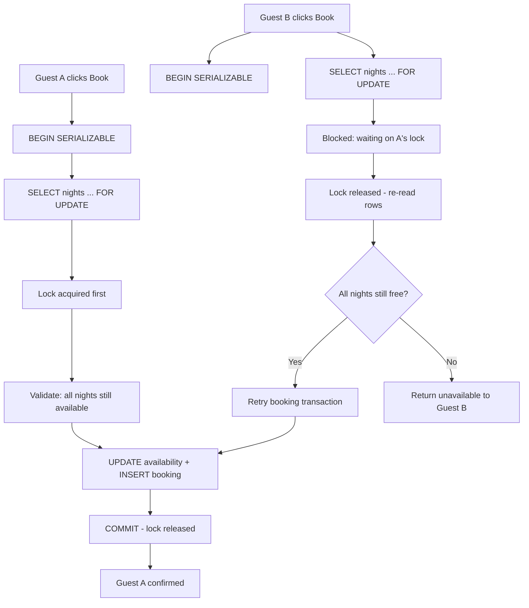

| Difficulty | Channel | Tags |
|---|---|---|
| intermediate | database | acid, isolation-levels, mvcc |

One network blip and a guest gets charged twice for the same Airbnb stay [1]. That was the reality Airbnb's payments team faced when they traded a Rails monolith for a service-oriented architecture and every booking became a distributed transaction. The same race condition that created phantom charges also creates double bookings — two guests reserving the same property on the same nights. This article walks through how to design transaction handling that kills both problems without sacrificing availability.

---

> ### Real-World Case — Airbnb
>
> As Airbnb migrated from its Rails monolith to a service-oriented architecture, every booking became a distributed transaction: one API call fanning out across multiple payment services, each changing state and each able to fail or time out mid-flight. A network drop between commit and response meant a guest who clicked 'Book' twice (or whose client retried aggressively) could be charged twice for the same stay.
>
> | | |
> |---|---|
> | **Challenge** | Guarantee exactly-once (at most once) processing of booking/payment requests across an unreliable distributed system, so that a retry or double-click could never result in double charges to guests or double payouts to hosts — without killing latency or availability. |
> | **Solution** | Airbnb built 'Orpheus', a general-purpose idempotency library embedded in every payments service. Every request carries an idempotency key, and concurrent duplicate requests are serialized by acquiring a database row-level lock (a lease) on that key. Requests are split into Pre-RPC / RPC / Post-RPC phases with every DB operation wrapped in a single atomic transaction and network calls strictly separated (a lesson learned the hard way via connection-pool exhaustion). Idempotency state is read and written only on a sharded master database — never replicas — with retries using exponential backoff and jitter, and errors classified retryable vs non-retryable. |
> | **Outcome** | Since Orpheus launched, Airbnb Payments achieved 99.999% (five nines) consistency while annual payment volume simultaneously doubled. |
> | **Lesson** | The counterintuitive twist: Airbnb deliberately rejected a standalone idempotency service because it would suffer the exact network failures it was built to solve — so the fix lives in a library, at the database layer, next to the business logic. And a few seconds of replica lag can turn a 'correct' idempotent retry into a real double charge, which is why idempotency state must live on the master, not replicas. |

---

## Hook — The click that landed twice

A guest finds the perfect apartment in Lisbon. They hit "Book," the payment fans out across half a dozen microservices, and mid-flight the network blinks. The client retries. The payment lands twice — two charges for one stay. Airbnb's engineering team has lived this exact failure, and they documented every painful detail [1]. Now scale that moment down a few layers: instead of two charges, imagine two guests clicking "Book" at the exact same millisecond for the same loft. One of them is about to arrive at a property that no longer has a bed for them. Sound familiar? You're staring at one of the hardest problems in distributed systems: coordinating concurrent writers without nuking throughput.

## Problem — Two guests, one property, zero rooms

The booking problem is a race condition wearing a business suit. Read the availability, check the calendar, insert the reservation — each step is fine in isolation, but between any two steps another request can slip through and overwrite what you just saw. Classic lost update. The stakes are brutally concrete: overbookings mean angry guests, refunds, and trust erosion that no feature ship can fix. But here is the tension — availability matters too. You could lock the entire property table and call it a day, but then every booking in the system serializes behind every other; latency explodes and hot properties become a distributed parking lot [5]. Therefore the design goal is surgical: serialize only the rows that actually conflict, and let everything else run in parallel. The question isn't whether to lock — it's exactly what, and for how long.

## Real-World Case — Airbnb's five nines of consistency

Here is the plot twist: the most instructive war story isn't about bookings at all. As Airbnb moved from its Rails monolith to a service-oriented architecture, every payment became a distributed transaction — one API call fanning out across multiple payment services, each changing state, each able to fail or time out mid-flight [1]. A network drop between commit and response meant a guest who clicked "Book" twice — or whose client retried aggressively — could be charged twice for the same stay [1]. Their fix was an orchestration layer that tracked every step of the pipeline, made every step idempotent, and could reconcile state after crashes. Since Orpheus launched, Airbnb Payments achieved 99.999% (five nines) consistency while annual payment volume simultaneously doubled [1]. Translation: strong consistency is possible at scale, but only when the transaction boundary is designed with intention — and booking systems can borrow that exact discipline.

## Deep Dive — SERIALIZABLE, MVCC, and the art of the lock

Building on the Airbnb story, the core question is: which isolation level actually prevents double bookings? Most developers default to READ COMMITTED, where each statement sees a fresh snapshot — great for reads, terrible for read-then-write races [2]. SERIALIZABLE is the heavyweight: in PostgreSQL it runs on Serialized Snapshot Isolation (SSI), which detects dangerous read-write patterns and aborts one of the conflicting transactions so the other can commit safely [2][8]. Here is the counterintuitive part: aborts are a feature, not a bug. Under MVCC, writers never block readers — readers keep seeing consistent old snapshots — so you get correctness without a global queue [4]. The job of application code is simply to turn those aborts into retries with exponential backoff.

Isolation levels are a spectrum, and each one has a price tag:

| Isolation level | Double-booking safe? | Concurrency cost | When to use it |
|---|---|---|---|
| READ COMMITTED | No — lost updates slip through [2] | Lowest | Dashboards, analytics, search |
| REPEATABLE READ | Partially — phantom rows still possible [2] | Medium | Reporting that needs a stable snapshot |
| SERIALIZABLE | Yes — conflicts force one writer to retry [8] | Highest | Bookings, payments, inventory decrements |

This leads to a deeper realization. SERIALIZABLE guarantees the outcome, but not the strategy. You still have to decide where locks live — row-level locks on a dedicated availability table are the sweet spot, because they block only the exact date range a booking touches [3]. Everything around that table — caching, read replicas, circuit breakers — is where the real engineering happens.

## Workflow — The five-step booking that can't double

Now that the isolation model is clear, the workflow falls out naturally. It all hinges on one principle: the availability calendar is the single source of truth, and it lives in its own table so it can be locked independently [3].

1. **Model availability as rows, not columns.** One row per property per night, with a boolean flag. Rows are lockable; ranges are not.
2. **Begin with SERIALIZABLE.** Every booking transaction starts at the strictest level, giving each request a consistent snapshot [2].
3. **Lock the exact rows you plan to write** with `SELECT ... FOR UPDATE` on the date range. A competing request blocks here and re-reads the world when the lock frees [7].
4. **Validate, then write.** Confirm every night is still available, then flip the flags and insert the booking row in the same transaction — atomicity from the ACID playbook [6].
5. **Handle the abort.** If a serialization conflict fires, back off exponentially with jitter and retry the whole unit of work — never a half-applied update.

The diagram below maps two guests racing for the same dates, and shows exactly where the lock arbitrates the fight:

[Diagram: Booking Race — Row Locking and Retry Flow]

Consequently, hot properties deserve extra armor: write-through caching with invalidation on successful bookings, read replicas for cheap availability previews, and circuit breakers so a popular calendar can't drag the whole cluster down. Cache aggressively, but always validate against the locked rows before you commit.

## Code Example — Locking rows in PostgreSQL with retry logic

Enough theory — here is the pattern in production form. This Python snippet uses psycopg2 against PostgreSQL to book a date range safely: `SELECT ... FOR UPDATE` acquires the row locks [7], SERIALIZABLE provides the snapshot [2], and the retry loop absorbs conflicts [3].

```python
import random
import time

import psycopg2

MAX_RETRIES = 5
BACKOFF_BASE_MS = 50

class BookingConflict(Exception):
    """Raised when dates are already taken or a serialization conflict occurs."""

def book_stay(conn, property_id, guest_id, start_date, end_date):
    for attempt in range(MAX_RETRIES):
        try:
            with conn.cursor() as cur:
                # 1. Snapshot isolation: every read sees one consistent view
                cur.execute("BEGIN TRANSACTION ISOLATION LEVEL SERIALIZABLE")

                # 2. Lock the exact rows you plan to write. A concurrent
                #    request on these dates blocks here, then re-reads the
                #    world once the lock is released.
                cur.execute(
                    """
                    SELECT bookable_date
                    FROM availability
                    WHERE property_id = %s
                      AND bookable_date BETWEEN %s AND %s
                      AND is_available = TRUE
                    FOR UPDATE
                    """,
                    (property_id, start_date, end_date),
                )

                nights = (end_date - start_date).days
                if cur.rowcount != nights:
                    conn.rollback()
                    raise BookingConflict("nights already reserved")

                # 3. Flip availability inside the same transaction
                cur.execute(
                    """
                    UPDATE availability
                    SET is_available = FALSE
                    WHERE property_id = %s
                      AND bookable_date BETWEEN %s AND %s
                      AND is_available = TRUE
                    """,
                    (property_id, start_date, end_date),
                )

                # 4. Insert the booking atomically with the availability flip
                cur.execute(
                    """
                    INSERT INTO bookings (guest_id, property_id, start_date, end_date)
                    VALUES (%s, %s, %s, %s)
                    """,
                    (guest_id, property_id, start_date, end_date),
                )
                conn.commit()
                return True

        except (psycopg2.errors.SerializationFailure,
                psycopg2.errors.DeadlockDetected):
            conn.rollback()
            # 5. A concurrent writer won the race -> back off and retry the
            #    whole unit of work, never a half-applied update
            delay = (BACKOFF_BASE_MS * (2 ** attempt)) / 1000
            time.sleep(delay + random.uniform(0, 0.05))

    return False  # out of retries; surface a friendly error to the guest
```

Here is how to read it. The transaction begins at SERIALIZABLE, so every statement inside sees one frozen snapshot of the database [2]. The `SELECT ... FOR UPDATE` is the heart of the trick: it acquires row-level locks on the exact nights you intend to write [7]. If Guest B arrives while Guest A holds those locks, Guest B blocks — and when the lock frees, B's snapshot is invalidated and PostgreSQL raises a serialization failure [2]. That exception is not an error; it is the database telling you that another transaction won the race. The except block rolls back cleanly, sleeps for an exponentially growing interval plus random jitter (to stop synchronized retry storms), and tries the entire unit again [3]. If every night is still free, the booking commits atomically with the availability flip, courtesy of ACID [6]. After `MAX_RETRIES` aborts, the request fails gracefully rather than overbooking.

## Lessons Learned — What works, what breaks, what to do tomorrow

The journey from phantom charge to locked row leaves a short list of hard-won rules worth taking to your codebase:

- **The availability calendar is the single source of truth.** Cache it, mirror it, but always validate against the locked rows before committing [3]. A stale cache write is how overbookings happen.
- **Exponential backoff with jitter beats fixed retries.** Fixed intervals cause thundering herds that turn one conflict into a thousand. Airbnb's orchestration discipline — track every step, make it idempotent, reconcile after crashes — is the same medicine [1].
- **SERIALIZABLE is not a license to skip application logic.** PostgreSQL's SSI aborts on dangerous patterns, but you still need your own guards — like the `rowcount != nights` check — to catch logical impossibilities the database can't see [8][2].
- **Read replicas for the preview, writes to the source of truth.** Availability checks can hit replicas; bookings must write through. Split the paths and both stay fast [2].
- **Circuit breakers for hot properties.** A celebrity listing under SERIALIZABLE is a contention magnet; add a per-property breaker so one calendar can't stall your cluster.

Watch out for the classic battle scar: calling `SELECT` without `FOR UPDATE` inside a SERIALIZABLE transaction and assuming safety. The snapshot alone won't stop the race — the lock is what arbitrates it [7]. If this feels like a lot, you're not alone; distributed consistency is where experienced engineers still get burned. Start with a single property table and one strict transaction, prove the pattern, then scale the caching around it.

---

## Booking Race: Row Locking and Retry Flow



<details>
<summary><strong>Original Interview Question</strong></summary>

**Q:** You're building a booking system for Airbnb where multiple users can reserve the same property simultaneously. How would you design the transaction handling to prevent double bookings while maintaining high availability?

**A:** Use SERIALIZABLE isolation with optimistic concurrency control. Implement row-level locks on property availability tables, use MVCC snapshot reads for checking availability, and apply application-level validation to ensure atomic booking operations.

</details>

## Conclusion

The journey started with a phantom charge inside a distributed payments system [1] and ended at a single locked row in an availability calendar. The thread connecting them: correctness is not the absence of locks — it is locks aimed with surgical precision. So tomorrow, don't rewrite your whole stack. Pick one write path, model availability as lockable rows, start every transaction at SERIALIZABLE, and let aborts be your guide to retry with exponential backoff [2][3]. Leave your team with this one insight: the database is already telling you who won each race — the only failure is ignoring the message.

---

## References

1. [Airbnb incident report](https://medium.com/airbnb-engineering/avoiding-double-payments-in-a-distributed-payments-system-2981f6b070bb) — article
2. [PostgreSQL documentation: Transaction Isolation](https://www.postgresql.org/docs/current/transaction-iso.html) — documentation
3. [PostgreSQL documentation: Explicit Locking](https://www.postgresql.org/docs/current/explicit-locking.html) — documentation
4. [Multiversion Concurrency Control](https://en.wikipedia.org/wiki/Multiversion_concurrency_control) — wikipedia
5. [Isolation (database systems)](https://en.wikipedia.org/wiki/Isolation_(database_systems)) — wikipedia
6. [ACID](https://en.wikipedia.org/wiki/ACID) — wikipedia
7. [PostgreSQL documentation: SELECT (FOR UPDATE)](https://www.postgresql.org/docs/current/sql-select.html) — documentation
8. [Serializable isolation](https://en.wikipedia.org/wiki/Serializable_isolation) — wikipedia

---

**Author:** Satishkumar Dhule — [GitHub](https://github.com/satishkumar-dhule) · [LinkedIn](https://linkedin.com/in/satishkumar-dhule) · [Website](https://satishkumar-dhule.github.io)
