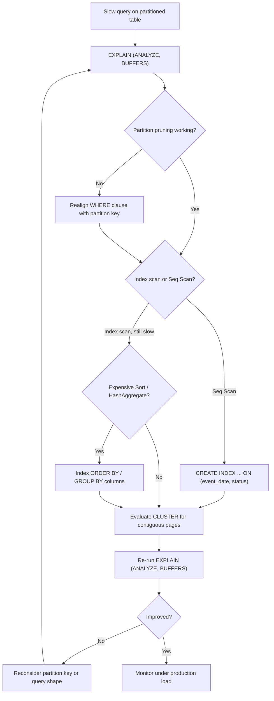

| Difficulty | Channel | Tags |
|---|---|---|
| intermediate | database | explain, query-plan, partitioning |

It was the kind of incident that starts quietly and ends with engineers refreshing Grafana at 3am. In June 2025, CoinGecko's API team hit a wall: a 1TB+ PostgreSQL table holding eight years of hourly crypto price data was taking more than 30 seconds per query, IOPS kept breaching the 24K provisioned limit, and Apdex scores were sliding toward SLO violations with uptime-sensitive customers [1]. Here is the twist — that table was already partitioned. The feature meant to save them was quietly working against them, and the real culprit was hiding in plain sight inside the EXPLAIN plan.

---

> ### Real-World Case — CoinGecko
>
> CoinGecko's API team ran a 1TB+ PostgreSQL table storing 8 years of hourly crypto price data (RDS). Queries were averaging over 30 seconds, IOPS kept breaching their 24K provisioned limit daily, request queues grew, and Apdex scores fell — threatening their SLO/SLA commitments to uptime-sensitive customers.
>
> | | |
> |---|---|
> | **Challenge** | Queries on a 1.2TB single table took 30+ seconds, index-based optimization failed (the WHERE clause filtered a JSONB column with per-currency keys, so an index would only help one app), and every fix risked replica lag and cold-cache downtime. They needed to make the table fast without downtime and without spiking IOPS during migration. |
> | **Solution** | They chose monthly range partitioning on the timestamp column (their query pattern already carried date ranges), built a partitioned copy via trigger + background migration, and used a dry run on a cloned prod DB to measure costs. When the copy proved too slow, they hot-fixed it with a Foreign Data Wrapper to read from a prewarmed staging DB into production. After switchover they analyzed EXPLAIN plans, found one query ('created_at > ?' with no upper bound) that scanned ALL partitions including empty future ones, rewrote it to bound the range, and dropped the pre-created 2025 partitions that were causing full scans. |
> | **Outcome** | p99 response time dropped from 4.13s to 578ms (86% reduction), IOPS fell 20% (multiplied across replicas for cost savings), replica lag disappeared, and the same queries ran 6-8x faster — except for the one unbound query that got worse until it was fixed, proving partitioning can regress queries that don't let the planner prune. |
> | **Lesson** | Partitioning only helps if the WHERE clause lets the planner prune — a query missing the partition key (or an upper/lower bound) silently scans every partition, including empty future ones, and can be slower than the unpartitioned table. Always verify with EXPLAIN ANALYZE which partitions are actually scanned after a partitioning rollout. |

---

## Hook — A 30-Second Query and a Pager That Would Not Stop

Sound familiar? Picture the scene: a monitoring dashboard glowing red, a queue of API requests backing up, and a database engineer staring at a single query that refuses to cooperate. For CoinGecko, the numbers were stark — over 30 seconds per query against 1TB+ of data, daily IOPS breaches, and an Apdex score drifting toward the danger zone where SLAs break and customers start asking hard questions [1]. The stakes go far beyond a slow dashboard. When your product is real-time market data, every millisecond of latency is a small betrayal of trust. And the most frustrating part? The team had done the 'right thing.' They had partitioned the table. It just was not enough. What follows is the exact detective work — the EXPLAIN plan forensics — that took those queries from 30 seconds to sub-second, and the one plot twist that could save you from the same 3am wake-up call.

## Problem — 100 Million Rows and a WHERE Clause That Did Not Care

Many developers believe partitioning is a performance fix-all: split a giant table by date, and slow queries will magically shrink. That belief survives until the day a date-filtered query on a 100M-row partitioned table still crawls. Partitioning only pays off if the planner actually prunes — that is, if it can prove most partitions are irrelevant to your query and scan just one or two [4]. When a query is slow despite partitioning, one of four things is usually wrong: the planner is not pruning (often because the WHERE clause does not align with the partition key), the query is doing a sequential scan instead of using an index, an expensive sort or hash aggregate is materializing far more rows than you need, or the existing indexes simply do not cover the filter columns [3]. Each of these failures leaves a fingerprint in the EXPLAIN output — you just need to know how to read it. But before you can diagnose anything, it helps to watch someone who lived through this exact scenario and lived to write about it.

## Real-World Case — CoinGecko and the Partitioning Plot Twist

CoinGecko's API team was running a 1TB+ PostgreSQL table on RDS holding eight years of hourly crypto price data. The symptoms arrived like a slow tide: queries averaging over 30 seconds, IOPS breaching the 24K provisioned limit every single day, request queues growing, and Apdex scores falling [1]. For a team with SLO/SLA commitments to uptime-sensitive customers, that is a business problem as much as a database problem. The team's response reads like a masterclass in Postgres tuning: they introduced partitioning to cut the data surface, retuned the instance, and reworked query access patterns. The results were dramatic. p99 response time dropped from 4.13 seconds to 578 milliseconds — an 86% reduction. IOPS fell 20%, and because that saving multiplied across replicas, it turned into real infrastructure cost savings. Replica lag disappeared. The same queries ran 6 to 8 times faster [1]. But here is the plot twist that should make every reader sit up: the one 'unbound' query — a query that did not let the planner prune — actually got worse until it was fixed. Partitioning is not a universal accelerator. It is a contract with the query planner, and the contract only works when queries respect it.

## Deep Dive — Reading the EXPLAIN Plan Like a Database Detective

Building on CoinGecko's story, the skills that matter are the four checks you run against the EXPLAIN output when a partitioned query is slow [2][3]. First, partition pruning: look at the Append node (or the partition counts) to see how many child partitions were actually scanned. If you filtered by event_date but the planner still touched every partition, the WHERE clause may be too opaque — for example, wrapping the partition column in a function, or comparing against a value the planner cannot fold to a constant [4]. Second, index utilization: a Seq Scan on a 100M-row partition is your clearest signal that the index does not exist, does not match the query, or the planner has decided the index is not selective enough [8]. Third, expensive operations: a Sort node or HashAggregate that processes hundreds of thousands of rows reveals a query shape — an ORDER BY, GROUP BY, or DISTINCT — that forces materialization, and those operations can dwarf the cost of the scan itself [3]. Fourth, the fix pattern: a composite index on (date, filtered_columns) turns a two-step dance of 'find rows, then filter' into a single ordered traversal, and because leading column order matters, the date column should come first when your query filters by it [5]. Finally, consider physical ordering. An index is a logical structure; CLUSTER physically reorders the table along that index, so sequential reads and index scans pull pages that are already adjacent — a real win when your query range overlaps large contiguous date windows [6]. The table below summarizes the fingerprint-to-fix mapping.

## Workflow — The Five-Step Query Rescue Protocol

This leads to a repeatable protocol you can apply the next time a partitioned query misbehaves. Step one, reproduce with evidence: run EXPLAIN (ANALYZE, BUFFERS) and never guess — BUFFERS tells you how many pages you actually touched [2]. Step two, confirm pruning: count the partitions the Append node visited. Step three, audit the scan type: an index scan means the planner found a usable path; a sequential scan means the index is missing or wrong [3]. Step four, apply the composite index: create it concurrently so production traffic is not blocked [5]. Step five, decide on physical ordering: if your queries sweep wide date ranges, CLUSTER the table and re-check. The diagram below maps this journey end to end — from slow query to verified fix — so you can see exactly where a query can derail and how each failure loops back to evidence rather than guesswork.

## Code Example — Diagnosing a Slow Query in the Field

Here is where the theory becomes muscle memory. The script below automates the first three steps of the protocol: it runs the query through EXPLAIN (ANALYZE, BUFFERS), walks the plan tree for red flags, and confirms whether partition pruning did its job. It is the kind of diagnostic harness a team leaves in the repo for the next incident — because there is always a next incident.

## Lessons Learned — What to Do Differently Tomorrow

By now the moral of CoinGecko's story is clear: partitioning is a tool, not a guarantee [1]. The moment you treat it as the final answer, you stop looking for the real problem. The battle scars tell the story. A common mistake is adding an index only on the filter column while the partition key leads the query — the planner can prune but still must scan. Another is skipping EXPLAIN (BUFFERS), so you optimize by guesswork instead of evidence [2]. A third is CLUSTER-ing before you confirm the query actually benefits from physical order, which locks the table and gains nothing [6]. The workflow that survives contact with production looks like this: prove pruning, check the scan type, add the composite index, verify with buffers, and only then touch physical layout. Key takeaways:
- Partitioning only helps queries the planner can prune — verify it with every new query shape
- EXPLAIN (ANALYZE, BUFFERS) is non-negotiable; evidence beats intuition
- Composite indexes should lead with the partition key when the WHERE clause filters by it
- CLUSTER is a deliberate tool for wide date-range sweeps, not a default habit
- An unbound query will regress, not improve, no matter how beautifully you partition [1]

---

## Query Rescue Flow

<strong>Original Interview Question</strong>

**Q:** You have a PostgreSQL table with 100M rows partitioned by date. A query filtering on a specific date range is still slow. What would you check in the EXPLAIN plan and how would you optimize it?

**A:** Check partition pruning effectiveness, index utilization patterns, and expensive sort operations. Create composite indexes on (date, filtered_columns) and evaluate clustering strategies for optimal data access.

## Conclusion

Eight years of hourly crypto data. A 1TB+ table. Queries that took 30 seconds and an Apdex score teetering on the edge of an SLO breach. CoinGecko's team turned that around by going back to first principles: reading the plan, respecting the partition key, and measuring with real numbers until p99 dropped from 4.13 seconds to 578 milliseconds [1]. The same journey awaits you. Next time a partitioned query is slow, do not reach for more hardware — reach for EXPLAIN (ANALYZE, BUFFERS), confirm the planner is actually pruning, and give it an index it can use. That is the difference between a table that merely holds your data and a table that delivers it. And the one insight worth sharing at standup tomorrow? Partitioning only helps the queries that let the planner prune — everything else is just organized slowness.

---

## References

1. [CoinGecko incident report](https://amree.dev/2025/06/13/scaling-postgresql-performance-with-table-partitioning/) — blog
2. [PostgreSQL: EXPLAIN](https://www.postgresql.org/docs/current/sql-explain.html) — documentation
3. [PostgreSQL: Using EXPLAIN](https://www.postgresql.org/docs/current/using-explain.html) — documentation
4. [PostgreSQL: Table Partitioning](https://www.postgresql.org/docs/current/ddl-partitioning.html) — documentation
5. [PostgreSQL: CREATE INDEX](https://www.postgresql.org/docs/current/sql-createindex.html) — documentation
6. [PostgreSQL: CLUSTER](https://www.postgresql.org/docs/current/sql-cluster.html) — documentation
7. [Wikipedia: Query optimization](https://en.wikipedia.org/wiki/Query_optimization) — article
8. [Wikipedia: Database index](https://en.wikipedia.org/wiki/Database_index) — article
9. [DigitalOcean: SQL Indexes Explained](https://www.digitalocean.com/community/tutorials/sql-indexes-explained) — documentation

---

**Author:** Satishkumar Dhule — [GitHub](https://github.com/satishkumar-dhule) · [LinkedIn](https://linkedin.com/in/satishkumar-dhule) · [Website](https://satishkumar-dhule.github.io)
