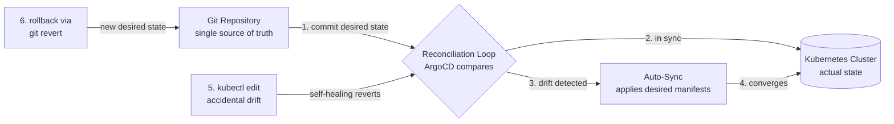

| Difficulty | Channel | Tags |
|---|---|---|
| beginner | devops | argocd, flux, declarative |

Four thousand developers. More than 3,000 applications. Roughly 130 Kubernetes clusters. That is the scale Intuit — the company behind TurboTax and QuickBooks — found itself managing during its migration to the public cloud [1]. The surprise? Moving to the cloud barely sped things up: teams still waited days or even weeks to release new software, nobody could say who changed what, and every rollback was a fire drill. The breakthrough came when Intuit stopped commanding its clusters and started describing them — a shift that now powers roughly 1,300 deployments every single day [1].

---

> ### Real-World Case — Intuit
>
> Intuit (maker of TurboTax and QuickBooks) was migrating to the public cloud but found that simply lifting and shifting services barely improved development velocity - teams still took days or weeks to release new software. With 4,000+ developers running thousands of microservices across 100+ Kubernetes clusters, imperative deployment was breaking down: nobody could track who changed what, config drifted between environments, and rollbacks were painful.
>
> | | |
> |---|---|
> | **Challenge** | They needed a way to deploy thousands of microservices across 130+ Kubernetes clusters in a controlled, auditable, and repeatable way - where the cluster state could never silently diverge from what the team intended, and where any change could be traced and rolled back. |
> | **Solution** | After acquiring Applatix (the startup behind Argo), Intuit built and open-sourced Argo CD - a declarative GitOps controller that treats Git as the single source of truth. They split CI from CD with a deliberate security boundary: Jenkins runs 12,000+ CI jobs per day but has ZERO access to Kubernetes; its only job is to commit new image tags to a Git deployment repo. Argo CD watches that repo and is the only component with cluster access, reconciling the live state to the declared state via auto-sync, self-healing, and drift detection across all clusters. |
> | **Outcome** | Intuit runs 3,000+ applications across 130+ Kubernetes clusters with ~1,300 deployments per day. The QuickBooks deployment cycle dropped from days to minutes, MTTR for rollback/roll-forward fell from 45 minutes to under 5 minutes, and build-test-deploy time went from over 60 minutes to under 10 minutes. Creating or upgrading a fully wired service (with CI/CD pipelines included) now takes less than 10 minutes. |
> | **Lesson** | The declarative vs imperative distinction is not academic: if your CI pipeline has cluster credentials and runs kubectl, you've created an unreviewable, un-auditable backdoor. Intuit's 'plot twist' is that the tool they built to solve their own GitOps problem became the de facto standard (CNCF graduated) - proving that removing imperatively-applied cluster changes in favor of Git-as-source-of-truth is what makes fleets of clusters manageable and auditable at scale. |

---

## Hook — The deploy looked fine. Then the pager went off.

Every deploy starts with a single commit. The problem is everything that happens after. You push, the pipeline runs, the pod comes up healthy — and then, three hours later, a mystery: production drifts. Someone "just tweaked" a Deployment with kubectl, someone else patched a ConfigMap from a terminal they forgot to close, and the configuration your team carefully reviewed in Git is now a work of fiction. Sound familiar? If it does, take a breath — you are not alone, and there is an exit. The story of how teams escape this mess begins with a company you bump into every tax season, and it ends with a cluster that heals itself.

## Problem — Imperative deployments: fast to type, painful to live with

Imperative management is how most developers learn Kubernetes: run kubectl apply, kubectl scale, kubectl set image, and the cluster obeys. It feels powerful — until you need to answer one simple question: who changed this, when, and why? Because nothing gets recorded in Git, the answers evaporate. What follows is configuration drift, the slow but relentless divergence between what you think is running and what is actually running. One environment gets an extra replica, another an old image tag, and suddenly "it works on my cluster" becomes a corporate strategy. Moreover, the bigger your platform grows, the more painful this gets: rollbacks turn into archaeology, audits become guesswork, and on-call engineers burn midnight hours chasing phantom diffs. Many developers discover that the breaking point is not a bad deploy — it is being unable to explain the last one.

## Real-World Case — Intuit: 4,000 developers, 130 clusters, one breaking point

Now meet Intuit, the company behind TurboTax and QuickBooks. Migrating to the public cloud looked like a slam dunk — more scale, more speed. Instead, teams found that lift-and-shift barely moved the needle on velocity; releasing a service still took days or weeks [1]. With 4,000+ developers running thousands of microservices across 100+ Kubernetes clusters, imperative deployment simply fell apart: nobody could track who changed what, configuration drifted between environments, and rollbacks were agonizing [1]. The turnaround came when Intuit committed to GitOps as a first-class practice, and the results are staggering. Intuit now runs 3,000+ applications across 130+ clusters with roughly 1,300 deployments per day [1]. The QuickBooks deployment cycle dropped from days to minutes, mean-time-to-recover for rollback and roll-forward fell from 45 minutes to under 5 minutes, and build-test-deploy time went from over 60 minutes to under 10 [1]. Creating or upgrading a fully wired service — CI/CD pipelines included — now takes less than 10 minutes [1]. The takeaway is almost unfair: they didn't hire more people. They changed how the system decides what is true.

## Deep Dive — Declarative vs imperative: the mindset shift hiding inside YAML

The secret to Intuit's turnaround isn't a tool — it's a mindset. Declarative management means you tell Kubernetes what you want the final state to be and let something else figure out how to get there; imperative management means you execute the steps yourself, one command at a time [5][6]. GitOps takes the declarative idea one step further: the desired state lives in Git — as YAML manifests, Helm charts, or Kustomize overlays — and an operator continuously reconciles the cluster with that declaration [8]. That operator is where ArgoCD enters the story. ArgoCD treats your Git repository as the single source of truth and runs a continuous reconciliation loop: it compares the live cluster state to the declared state, and when they differ, it syncs [2][3]. Enable auto-sync and ArgoCD applies changes automatically; enable self-healing and it also reverts any manual drift someone sneaks in with kubectl [4]. Here is the plot twist: many developers worry declarative means giving up control. In practice, it hands control back — every change becomes a reviewed commit, every rollback becomes a git revert, and the cluster becomes auditable, predictable, and boring. And boring, in infrastructure, is the highest compliment. Here is the real tradeoff:

| Aspect | Declarative (GitOps) | Imperative (kubectl) |
|---|---|---|
| Desired state | Defined in Git | Issued as commands |
| Audit trail | Every change is a commit | Whatever the shell history remembers |
| Drift | Auto-corrected by self-healing | Accumulates silently |
| Rollback | git revert, seconds | Manual archaeology, minutes to hours |
| Collaboration | Pull requests and reviews | Shared terminal access |
| Best for | Teams, scale, compliance | Experiments, throwaway clusters |

## Workflow — From Git commit to running pod in six steps

Building on the deep dive, here is how the pieces click together in practice. The reconciliation loop in the diagram below is the beating heart of GitOps. Step one: put the desired state in Git — your manifests, Helm charts, or Kustomize overlays, reviewed like code. Step two: point an ArgoCD Application at the repository; a single CRD connects a Git path to a cluster and namespace [3]. Step three: turn on auto-sync and self-healing, so ArgoCD applies changes and fights drift on its own [4]. Step four: let the reconciliation loop run — ArgoCD polls the repo, compares desired vs actual, and syncs on any mismatch. Step five: watch every developer change flow through pull requests instead of kubectl. Step six: when something breaks, roll back with git revert — the same way you would undo any other commit. Follow the loop in the diagram: a commit lands, ArgoCD compares, drift is detected or corrected, and the cluster settles into the state Git demands. That is the entire engine. The only skill left is writing good manifests.

## Code Example — Declaring your first ArgoCD Application

Consequently, the fastest way to feel this is to build it. The example below declares an ArgoCD Application — and notice the meta-twist: the Application itself is declarative YAML, so you can store it in Git and let GitOps manage the GitOps tool.

## Lessons Learned — Battle scars from 1,300 deployments a day

Every pattern has its sharp edges, and ArgoCD is no exception. Here are the lessons teams buy the hard way. First, self-healing without pruning leaves ghosts: enable prune so resources deleted from Git actually disappear — otherwise dead objects haunt your namespace forever [4]. Second, respect the source of truth: if you keep hand-rolling hotfixes with kubectl, ArgoCD will keep reverting them — and that fight is exactly as unproductive as it sounds. Third, protect the branch: auto-sync means a bad merge is a bad deployment, so branch protection and CI validation become mandatory, not optional. Fourth, secrets are the eternal special case — reach for Sealed Secrets or an external secrets operator instead of storing plaintext in Git. Finally, start small: pick one low-risk namespace, declare it, and watch the loop work before rolling it out platform-wide. If this feels like a lot, you are not alone — the payoff is that the system, once running, mostly runs itself. The infrastructure becomes a function of your repository: push a commit, and the world converges.

---

## GitOps Reconciliation Loop

<strong>Original Interview Question</strong>

**Q:** You're setting up GitOps for a microservices deployment. How would you configure ArgoCD to automatically sync changes from your Git repository to Kubernetes, and what's the difference between declarative and imperative approaches in this context?

**A:** I'd configure ArgoCD by setting up a Git repository containing Kubernetes manifests or Helm charts, creating an Application CRD that points to the Git repository, enabling auto-sync with a health check interval of 3 minutes, and implementing self-healing to automatically revert any manual changes. The declarative approach involves defining the desired state in Git through YAML manifests, Helm charts, or Kustomize configurations, where ArgoCD continuously reconciles the actual state with the desired state. In contrast, the imperative approach uses kubectl commands to make direct changes to the cluster, bypassing the Git repository as the single source of truth.

## Conclusion

The story comes full circle. Intuit's 4,000 developers didn't get faster by typing more commands; they got faster by typing fewer — by letting Git, not kubectl, be the source of truth [1]. What began as a cloud-migration headache ended as an operational superpower: 1,300 deployments a day, sub-5-minute recoveries, and 10-minute service creation. The invitation for you is smaller but no less real. Tomorrow, pick one service, write its desired state in Git, wire up ArgoCD, and let the loop run. The insight worth sharing with your team? Your Kubernetes cluster doesn't need more commands — it needs a contract. Git is that contract.

---

## References

1. [Intuit incident report](https://www.cncf.io/case-studies/intuit/) — article
2. [Argo CD Documentation](https://argo-cd.readthedocs.io/en/stable/) — documentation
3. [Argo CD Application Specification](https://argo-cd.readthedocs.io/en/stable/user-guide/application-specification/) — documentation
4. [Argo CD Auto-Sync and Self-Healing](https://argo-cd.readthedocs.io/en/stable/user-guide/auto_sync/) — documentation
5. [Kubernetes Declarative Management of Objects](https://kubernetes.io/docs/tasks/manage-kubernetes-objects/declarative-config/) — documentation
6. [Kubernetes Imperative Management of Objects](https://kubernetes.io/docs/tasks/manage-kubernetes-objects/imperative-config/) — documentation
7. [Kubernetes Working with Objects](https://kubernetes.io/docs/concepts/overview/working-with-objects/) — documentation
8. [OpenGitOps Principles](https://opengitops.dev/) — documentation
9. [Helm Documentation](https://helm.sh/docs/) — documentation
10. [Kustomize](https://kustomize.io/) — documentation
11. [Flux CD — GitOps for Kubernetes](https://fluxcd.io/) — documentation

---

**Author:** Satishkumar Dhule — [GitHub](https://github.com/satishkumar-dhule) · [LinkedIn](https://linkedin.com/in/satishkumar-dhule) · [Website](https://satishkumar-dhule.github.io)
