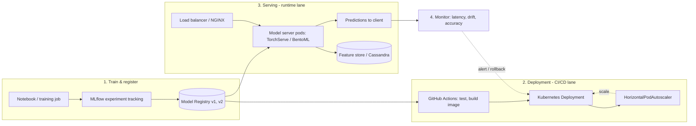

| Difficulty | Channel | Tags |
|---|---|---|
| beginner | devops | mlops, deployment |

Before 2016, Uber's machine learning operation was, by the company's own admission, chaos: data scientists trained models in R and scikit-learn on their laptops, and every model that needed to reach production required an engineering team to hand-build a bespoke serving container from scratch [1]. With no shared pipelines, no feature reuse, and no standard deployment path, ML impact was bottlenecked by whatever a handful of engineers could manually stitch together. Sound familiar? If you have ever trained a model that crushed the leaderboard in a notebook and then watched it stumble the instant it faced production traffic, you already know the real culprit. This is the story of the two disciplines everyone keeps conflating — model deployment and model serving — and why confusing them is how models go to die.

---

> ### Real-World Case — Uber
>
> Before 2016, Uber's ML practice was chaos: data scientists trained models in R and scikit-learn on laptops, and every time a model needed to reach production, a separate engineering team hand-built a bespoke serving container from scratch. With no shared pipelines, no feature reuse, and no standard deployment path, ML impact was bottlenecked by whatever a few engineers could manually cobble together — right as Uber was scaling to tens of millions of trips per day.
>
> | | |
> |---|---|
> | **Challenge** | Uber needed to separate two distinct problems that were being conflated: model deployment (the CI/CD infrastructure, versioning, and rollout of models into production) versus model serving (the low-latency runtime inference path that handles live request traffic). It had to scale from a handful of hand-rolled containers to thousands of models serving millions of latency-sensitive predictions per second (ETAs, rider-driver matching, surge, UberEATS delivery time) while guaranteeing reproducible pipelines and safe rollbacks. |
> | **Solution** | Uber built Michelangelo, an ML-as-a-service platform that explicitly decouples the deployment plane from the serving plane. Deployment: models are packaged as a ZIP of artifacts (metadata, parameters, compiled DSL transforms) and shipped to servers using standard code-deployment infrastructure, with a versioned model repository in Cassandra that tracks who trained each model, on what data, and when. Serving: models are loaded into a stateless online prediction service cluster of hundreds of machines behind a load balancer, addressable by UUID or tag so multiple versions can coexist for side-by-side A/B testing and gradual traffic shifting without client code changes. Because models are stateless and share nothing, horizontal scaling is just 'add more hosts and let the load balancer spread the load' — with Cassandra-backed feature store lookups adding latency only when needed. Later (2025), Uber added shadow deployment, gradual rollout with auto-rollback, and a deployment safety scoring system on top of the same platform. |
> | **Outcome** | Michelangelo became Uber's de-facto ML platform: the highest-traffic models serve 250,000+ predictions per second with P95 latency under 5ms (no feature lookups) and under 10ms (with Cassandra feature store access), on hundreds of machines per service. By 2025 the same architecture had grown to 400+ active use cases, 20,000+ training jobs/month, and 15+ million real-time predictions/second at peak — with regressions that once lingered for days now surfacing within hours thanks to the deployment safety layer. |
> | **Lesson** | Deployment and serving are fundamentally different engineering problems and must be built as separate planes: deployment is a control-plane CI/CD problem (versioned artifacts, staged rollout, monitoring, rollback), while serving is a data-plane runtime problem (request routing, model loading, latency budgets, autoscaling). Also counterintuitive: stateless ML models are trivially horizontally scalable — the hard part isn't inference throughput but the safety of shipping probabilistic, data-coupled code that can fail silently under data drift even when it passes offline tests. |

---

## Hook — The model that was perfect in the notebook

Ever wondered why a model with a 0.98 AUC in your training notebook gets quietly retired two weeks after launch? It is rarely the algorithm's fault. The model never learned to be wrong — the system around it did. Think about what actually happens between "the metrics look great" and "the dashboard shows predictions going sideways": somebody has to ship the artifact, wire it into infrastructure, stand up a way for real traffic to reach it, keep it alive under load, and detect the moment it starts lying. Most teams collapse all of that into a single vague word: "deployment." That collapse is the trap. Deployment and serving are two different jobs with two different toolchains, two different failure modes, and — critically — two different people who should own them. By the end of this walkthrough, you will be able to name the boundary precisely, pick the right technology for each side, and sketch a pipeline that actually survives contact with production.

## Problem — Two words, one giant conflation

Here is the mental model many developers carry around: training a model, then "putting it in the cloud," is one continuous task. That single assumption is responsible for more flaky ML systems than any data problem. Deployment is the act of getting an artifact into an environment — it covers CI/CD pipelines, infrastructure setup, monitoring, and rollback strategies, and it leans on tools like Kubernetes, MLflow, and SageMaker [4][7]. Serving, on the other hand, is what happens at request time: the model is loaded into memory, inbound requests are routed to the right version, features are fetched, and answers come back in milliseconds — think TensorFlow Serving, TorchServe, or BentoML [2][3][9]. They share a moment in the lifecycle, but their objectives diverge immediately. Deployment asks "Is the new model reachable and healthy?" Serving asks "Is every request answered fast enough, correctly enough, and by the right version?" Consequently, the failure modes are opposites. Deployment failures are loud: a pod crash-loops, a rollout stalls, an alert fires at 2am. Serving failures are quiet and insidious: P95 latency drifts upward by 40ms, a stale version keeps answering 5% of traffic after a rollback, cold starts make the first request of the day painfully slow. Which brings up the uncomfortable question: how many of your "model problems" are actually just an identity crisis between these two disciplines?

## Real-World Case — Uber, before and after Michelangelo

Uber lived this exact confusion at industrial scale, and the post-mortem is worth studying [1]. Before Michelangelo, Uber's ML practice had no common platform: data scientists used a grab bag of R, scikit-learn, and custom algorithms, while separate engineering teams built bespoke one-off serving containers for each model that needed to ship. There were no reliable, reproducible pipelines, no standard place to store experiments, and — most importantly — no established path from notebook to production [1]. The impact was precisely what you would predict: ML at Uber was limited to what a few data scientists and engineers could cobble together in a short time frame, even as the company scaled toward tens of millions of trips per day. The fix was a platform that treated the two disciplines as distinct. Michelangelo standardized the workflow — manage data, train, evaluate, deploy, predict, monitor — and gave every model the same serving container path. The numbers tell the story: the highest-traffic models now serve more than 250,000 predictions per second with P95 latency under 5ms when no feature lookup is needed, and under 10ms when the Cassandra feature store is involved [1]. By 2025, that same architecture had grown to 400+ active use cases, 20,000+ training jobs per month, and 15+ million real-time predictions per second at peak — with regressions that once lingered for days surfacing within hours thanks to the deployment safety layer [1]. The plot twist: Uber's models are not dramatically better algorithms than they were in 2015. What changed is that deployment and serving finally had defined lanes, shared infrastructure, and safety rails. You can get most of that win without building a Michelangelo — but only if you respect the boundary this story makes obvious.

## Deep Dive — Latency, throughput, batching, and the cold-start trap

Building on Uber's experience, let's zoom into the serving side, where most of the interesting trade-offs actually live. The first trade-off is latency versus throughput, and you can think of it as a budget you are always negotiating. Real-time inference — a ride estimate while the user stares at the screen — typically needs to land well under 100ms end-to-end; batch inference, like scoring last night's transactions, can happily take a second or more [7]. That one number dictates your architecture: real-time implies warm pods, in-memory feature access, and persistent connections, while batch implies queues, chunked processing, and entirely different autoscaling. The second trade-off is a favorite interview trap: batch versus real-time. TensorFlow Serving, for example, runs a scheduler that groups individual inference requests into batches for joint GPU execution with configurable latency controls [2]. Dynamic batching lets you raise throughput without raising latency to absurd levels — but it only works if your model server supports it, which is exactly why people pick TorchServe or BentoML over a hand-rolled FastAPI endpoint [3][9]. The third trap is cold starts, and it is the one that humbles teams with fresh eyes. Loading a model artifact, initializing the graph or the tokenizer, and warming JIT caches can take anywhere from a second to half a minute. The first request that hits a freshly scaled-up pod pays that tax, which is why production serving setups pre-warm models, keep a minimum replica floor, and expose readiness probes so orchestrators never route traffic to a pod that is still yawning [5][6]. Here is where it gets counterintuitive: many developers assume scaling is about bigger machines. In practice, because ML models are stateless and share nothing, horizontal scaling — more pods behind a load balancer — is almost always the right lever, with Kubernetes' HorizontalPodAutoscaler turning raw CPU or custom metrics into replica counts [6]. Vertical scaling matters only when you have a specific wall, like GPU memory or a single model that needs more cores than one instance can give. A quick field guide to the two sides:

## Workflow — From notebook to 10K QPS in six moves

So how do you actually wire this together? The workflow below is the distilled version of the pattern Uber shipped, minus the data centers. First, every training run writes its parameters, config, and metrics to a model registry so versions become first-class objects, not filenames [4]. Second, a CI pipeline builds a container image from the artifact — this is the deployment half, and it should run tests on the image itself, not just the notebook. Third, that image rolls out to Kubernetes as a Deployment; a readiness probe gates traffic until the model is warm, and the HorizontalPodAutoscaler grows or shrinks the pod count based on latency or throughput metrics [5][6]. Fourth, the serving layer exposes a versioned endpoint; clients pin a tag like "prod" or a UUID, and canary traffic splits let you A/B test a new model on 5% of requests before full cutover — exactly the mechanism Uber uses to transition between models without client changes [1]. Fifth, a load balancer and a feature store sit in front of the model pods: the balancer spreads requests, and the feature store keeps low-latency features out of the model's critical path [1]. Sixth, and most often skipped, you monitor predictions themselves — sampling outputs and joining them to labels later to detect drift and silent accuracy regressions. The diagram below shows the full picture, with the deployment lane on top and the serving lane underneath.

## Code Example — A versioned, warm-started serving endpoint

To make the boundary concrete, here is a minimal-but-production-shaped serving service. It demonstrates the three things that separate a serving layer from a toy endpoint: explicit model versioning, warm start, and a readiness gate. The predictor is a stand-in for whatever artifact your registry gives you.

## Lessons Learned — What the war story teaches us

After the journey from Uber's chaos to its 15M-predictions-per-second present, a few lessons stand out, and they apply whether you run a two-pod cluster or a platform team. First, separate the concerns on purpose. If your deployment checklist and your serving design live in the same document, split them — they have different owners, different SLAs, and different toolchains. Second, make versions immutable and explicit. The ability to say "roll every request back to v2" in seconds, rather than digging through Docker tags, is what turns a bad release from a production incident into a non-event [1]. Third, never let autoscaling surprise you: warm every pod before it receives traffic, keep a minimum floor, and treat cold start as a latency feature you must design around, not an inconvenience [6]. Fourth, monitor the model, not just the infrastructure. Uber's safety layer catches regressions within hours because it samples predictions and compares them to outcomes — instrument that from day one [1]. And fifth, remember the hidden-debt warning that predates all of this: the code you actually wrote is usually the smallest part of an ML system; the infrastructure, data dependencies, and glue around it accumulate the real cost [10]. Here is what you need to know, compressed:

---

## Model Lifecycle: Deployment Lane vs. Serving Lane

<strong>Original Interview Question</strong>

**Q:** Explain the key differences between model serving and model deployment in ML systems, including specific technologies, scaling considerations, and real-world implementation patterns?

**A:** Deployment encompasses CI/CD pipelines, infrastructure setup, and monitoring using tools like Kubernetes, MLflow, and SageMaker. Serving focuses on runtime inference APIs with frameworks like TensorFlow Serving, TorchServe, or BentoML, handling request routing, model versioning, and autoscaling. Key trade-offs include latency vs throughput, batch vs real-time inference, and cold start optimization.

## Conclusion

The next time a model underperforms in production, ask yourself the two questions this story is built on: Was it a deployment problem — did the artifact even make it out of the pipeline cleanly? Or a serving problem — is the right version warm, reachable, and fast? Uber did not reinvent machine learning when it built Michelangelo; it built lanes, guardrails, and feedback loops around the two disciplines, and 250,000 predictions per second followed [1]. You do not need a platform team to get the payoff. Tomorrow, do three things: split your deployment checklist from your serving design, make model versions immutable and pinnable, and add a readiness gate plus a latency metric to your existing endpoint. Then, when a model starts lying, you will know exactly which half of the system to blame — and so will your pager.

---

## References

1. [Uber incident report](https://www.uber.com/blog/michelangelo-machine-learning-platform/) — article
2. [TensorFlow Serving](https://github.com/tensorflow/serving) — documentation
3. [TorchServe](https://github.com/pytorch/serve) — documentation
4. [MLflow Documentation](https://mlflow.org/docs/latest/) — documentation
5. [Kubernetes Cluster Architecture](https://kubernetes.io/docs/concepts/architecture/) — documentation
6. [Horizontal Pod Autoscaling](https://kubernetes.io/docs/tasks/run-application/horizontal-pod-autoscale/) — documentation
7. [Amazon SageMaker - Deploy models for inference](https://docs.aws.amazon.com/sagemaker/latest/dg/deploy-model.html) — documentation
8. [gRPC - Wikipedia](https://en.wikipedia.org/wiki/GRPC) — documentation
9. [BentoML](https://github.com/bentoml/BentoML) — documentation
10. [Hidden Technical Debt in Machine Learning Systems](https://papers.neurips.cc/paper/5656-hidden-technical-debt-in-machine-learning-systems.pdf) — paper

---

**Author:** Satishkumar Dhule — [GitHub](https://github.com/satishkumar-dhule) · [LinkedIn](https://linkedin.com/in/satishkumar-dhule) · [Website](https://satishkumar-dhule.github.io)
