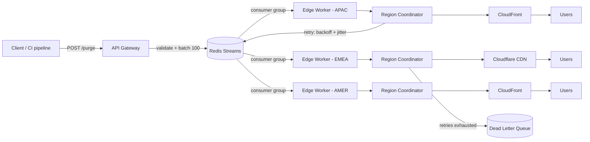

| Difficulty | Channel | Tags |
|---|---|---|
| intermediate | system-design | edge, caching, purging |

After more than a decade, Cloudflare quietly hit a wall: its cache purge system had outgrown itself. Every invalidation had to be backhauled from an edge data center to a core data center, then fanned out to every location — and the storage needed to hold millions of daily purge keys was eating into cache disk space [1]. The rebuild cut global purge latency by 90%, to under 150ms on average across 330 cities and 120+ countries [1]. That story is the perfect gateway to a question every developer eventually faces: how do you guarantee stale content dies within 5 seconds, everywhere, while absorbing 10,000 concurrent invalidations per second?

---

> ### Real-World Case — Cloudflare
>
> After more than a decade, Cloudflare had outgrown its original cache purge system. Flexible purges relied on Quicksilver's spoke-hub distribution: a purge request had to be backhauled from an edge data center to a core data center, then fanned out to every other location. As customers grew, the storage needed to hold millions of daily purge keys grew in lockstep with throughput demand, eating into cache disk space and capping how fast and how often customers could purge.
>
> | | |
> |---|---|
> | **Challenge** | Guarantee fast, consistent purge propagation across a global network of 330+ cities in 120+ countries. The hub-and-spoke model had a hard throughput ceiling, added latency, and coupled storage cost directly to purge volume — the more customers purged, the less room there was to cache. |
> | **Solution** | Rather than scaling the old pipeline, Cloudflare flipped the architecture 'on its head' and rebuilt it as 'Coreless Purge': peer-to-peer distribution so a purge can enter any data center and propagate directly to peers, a purpose-built new storage system (CacheDB, built on RocksDB) to replace Quicksilver, and a shift from lazy purging to actively deleting cached content — which also reclaimed disk and raised cache retention. |
> | **Outcome** | Global purge latency for purge-by-tag, hostname, and prefix dropped to under 150ms on average (P50) — a 90% improvement since May 2022 — across all 330 cities and 120+ countries; single-file purge runs at ~250ms P50. Decoupling storage/throughput from usage also let Cloudflare ship purge-by-prefix/hostname to every plan and raise Enterprise rate limits. |
> | **Lesson** | The plot twist: you don't hit a 150ms global propagation SLA by making the hub-and-spoke replication faster — you remove the hub entirely. Peer-to-peer distribution plus a purpose-built key store, and actively deleting content instead of lazily invalidating, gives near-instant consistency while also cutting storage cost. |

---

## Hook — The 3am Cache Nightmare

Picture this: it's 3am, and you just shipped a hotfix for a pricing bug. You watch the deploy pipeline go green, take a breath, and then — your users are still seeing the old price. Because your CDN is serving yesterday, and yesterday won't die. Sound familiar? Every developer has stared at a cache serving stale content and thought of it as "the thing that makes production lie." The gap between deployed and live-everywhere is where trust goes to die, and in e-commerce, a stale price isn't a glitch — it's a PR disaster waiting for screenshots. This is why cache invalidation is a first-class systems problem, not an afterthought. And as you're about to see, even a company that runs one of the largest networks on earth spent a decade fighting it.

## Problem — The Two-Faced Beast: Cache Performance vs. Cache Freshness

Caches are a paradox. The longer content lives in the cache, the faster and cheaper your origin becomes — but the more likely users are served yesterday's data [3]. Strip the problem down and three constraints emerge, each pulling in a different direction:

- **Propagation:** stale content must die globally in under 5 seconds
- **Throughput:** the system must absorb 10,000 invalidations per second
- **Consistency:** no region should ever disagree about what's fresh

Any two of those sound achievable. All three together collide, because strong consistency across regions while maintaining 99.99% availability is precisely the trade-off the CAP theorem warns about [5]. Most teams try to brute-force the problem with a giant fan-out: push every invalidation to every edge, immediately. That works right up until it doesn't. When a single purge fans out to thousands of points of presence, latency explodes, API rate limits become the real enemy [4], and the storage layer quietly becomes the bottleneck. The twist: the problem isn't really purging. It's coordinating purges across a planet — and the naive approach breaks exactly when you need it most.

## Real-World Case — Cloudflare

Cloudflare lived this exact problem for over a decade [1]. Its original purge system ran on Quicksilver, a spoke-hub architecture: a purge request had to be backhauled from an edge data center to a core data center, then fanned out to every other location on the network [1]. As customers grew, storage for daily purge keys grew in lockstep with throughput demand, eating into cache disk space and capping how fast and how often customers could purge [1]. In other words, every new customer made the purge system slower for everyone.

Therefore, Cloudflare's fix was architectural rather than incremental: it decoupled storage and throughput from usage entirely, spreading storage across edge data centers instead of funneling everything through a core [1]. The results speak for themselves:

- Purge-by-tag, hostname, and prefix latency dropped to under 150ms on average (P50) — a 90% improvement since May 2022 [1]
- Single-file purges now run at roughly 250ms P50 [1]
- The new system covers all 330 cities and 120+ countries [1]

But here's the plot twist. By decoupling storage from usage, Cloudflare could ship purge-by-prefix and purge-by-hostname to every single plan and raise Enterprise rate limits [1]. Fixing the bottleneck didn't just improve latency — it unlocked product features that had been impossible under the old model. The lesson: cache invalidation isn't plumbing. It's growth infrastructure in disguise.

## Deep Dive — The Anatomy of a 5-Second Purge

Building on Cloudflare's insight, what does a 5-second purge system actually look like? The architecture separates ingestion, coordination, and execution so no single component carries the world:

- **Ingestion — invalidation queue:** Redis Streams with consumer groups give you a durable, replayable buffer where multiple workers split the load without double-processing [8].
- **Coordination — edge workers:** Cloudflare Workers deployed across regions receive batches and route them to local CDN providers [9]. Coordination stays close to the edge instead of round-tripping through a core.
- **Execution — CDN providers:** Both Cloudflare and AWS CloudFront support wildcard-based invalidation, so you purge `/products/*` in one call instead of every URL individually [4][2].

Now the counterintuitive part: the 2-second TTL. You might think a purge system wants long TTLs so the cache is used as much as possible. Actually, a short TTL of 2 seconds — set via `Cache-Control: max-age=2, must-revalidate` [2] — turns the TTL into a safety net. Even if an invalidation is delayed, users are served fresh content within 2 seconds anyway. This is the same philosophy as RFC 5861's stale-while-revalidate, where you serve slightly stale content while fetching the freshest version in the background [7].

The real trade-off is a spectrum, not a binary:

| Strategy | Typical latency | Origin load | Consistency | Best for |
|---|---|---|---|---|
| Short TTL only | ~2s worst case | High | Eventual [5] | Dynamic, fast-changing content |
| Long TTL + purge | <150ms when purge succeeds | Lowest | Strong, purge-dependent | Static assets |
| Hybrid (2s TTL + purge) | ~150ms typical, 2s worst case | Moderate | Strong with a parachute | Most production systems |

The hybrid wins because it embraces Murphy's law: purges will occasionally fail, and the TTL is the parachute that keeps users out of the blast radius.

Consequently, failure handling gets first-class treatment:

- **Circuit breaker:** after 5 consecutive failures, fail fast and stop hammering the provider [6]
- **Dead letter queue:** exhausted retries land in a DLQ for manual reconciliation
- **Reconciliation:** during a network partition, eventual consistency with background re-push keeps regions converging [5]

Here's a battle scar worth memorizing: teams that skip the DLQ discover that a dropped invalidation is a bug you can't reproduce on demand — the worst kind. The DLQ turns a mystery into a ticket.

## Workflow — From Request to Global Purge in Six Steps

Here's the full journey of a single invalidation, from request to global propagation. Every step protects the one after it:

1. **Accept** — the API Gateway validates the request and normalizes patterns like `/products/*`
2. **Batch** — up to 100 invalidations per API call, cutting API costs by roughly 90% [4]
3. **Enqueue** — writes to a Redis Stream; consumer groups guarantee each message is processed exactly once [8]
4. **Coordinate** — edge workers pull batches and route them to the relevant regions
5. **Execute** — regional coordinators call CloudFront and Cloudflare purge APIs with wildcards [4][2]
6. **Reconcile** — failures retry with exponential backoff plus jitter (max 3 attempts), then fall into the DLQ [6]

Here is what that looks like as a flow — follow a purge from the client all the way to the users who should stop seeing stale content:

[diagram: Global Purge Flow]

The diagram tells the story of resilience: note that failed purges loop back to the queue for a bounded number of retries, and only then flow into the dead letter queue. That loop is the difference between a transient hiccup and a silent outage.

## Code Example — A Production-Grade Purge Worker in JavaScript

Enough theory. The heart of this system is the consumer that drains the queue, purges the CDN in batches, and refuses to melt down when the provider sneezes. This worker is production-shaped: it uses a circuit breaker, exponential backoff with jitter, and only acknowledges messages after the purge actually succeeds.

The flow is deliberate. First, the `purgeBatch` function checks the circuit breaker and fails fast when the provider is unhealthy — piling more requests onto a dying CDN only extends the outage. Then it builds one `CreateInvalidationCommand` for up to 100 wildcard patterns; note the `CallerReference`, an idempotency key so CloudFront won't process the same batch twice if a request is retried [4]. On failure, the retry loop uses `500 * 2 ** attempt` with random jitter, capped at 8 seconds — jitter is what stops a fleet of workers from all retrying at the exact same moment and turning a hiccup into a thundering herd [6]. After `MAX_RETRIES` are exhausted, the message isn't silently dropped; it goes to a dead letter queue so a human can reconcile it. Meanwhile, the consumer uses `XACK` only after a successful purge, so Redis Streams consumer groups guarantee no message is lost even if the worker crashes mid-flight [8].

## Lessons Learned — Battle Scars and the Five-Second Rule

So, after tracing the whole journey — from Cloudflare's decade of pain to a 150ms fix [1] — what should you take back to your team tomorrow?

- **Decouple storage from throughput** — it was Cloudflare's single biggest unlock, and it applies at any scale [1]
- **Batch everything** — 100 invalidations per call cut API costs by ~90% and slash rate-limit pressure [4]
- **Treat the TTL as a parachute** — a 2-second TTL means a failed purge degrades to fresh-within-2-seconds, not stale-for-hours [2]
- **Always add jitter to backoff** — synchronized retries are how purge storms are born [6]
- **Never ship without a DLQ** — a dropped invalidation is a mystery; a queued one is a ticket
- **Know your provider's limits** — CloudFront caps invalidation frequency and batch size, so design your batches around the contract, not around hope [4]

The deeper insight is simpler than the architecture, though: cache invalidation is invisible when it works and deafening when it doesn't. The teams that win design for the failure case first — the circuit breaker, the DLQ, the reconciliation loop — because they know the purge pipeline will break, and the only question is whether the users ever notice.

---

## Global Purge Flow

<strong>Original Interview Question</strong>

**Q:** How would you design a multi-region CDN cache purging system that guarantees content propagation within 5 seconds while handling 10,000 concurrent invalidations per second?

**A:** Implement Cloudflare API + AWS CloudFront with distributed invalidation queue, edge compute coordination, and 2-second TTL. Use batch invalidation, exponential backoff, and regional cache headers for 5-second SLA.

## Conclusion

The story comes full circle. Cloudflare spent a decade watching its purge system slow down under its own success, then rebuilt it so storage and throughput stopped fighting for the same disk space — and cut global purge latency by 90% [1]. That's the same journey your cache strategy is on, whether you manage three CDN nodes or three hundred. Start small: add a batching layer, a consumer-group queue, a DLQ, and a short TTL that acts as a parachute. Do that, and the memorable lesson is this — the best cache invalidation is the one your users never notice. Build for the failure you can't see coming, and the 5-second SLA stops being a promise and starts being an assumption.

---

## References

1. [Cloudflare incident report](https://blog.cloudflare.com/instant-purge/) — blog
2. [MDN Web Docs — Cache-Control HTTP header](https://developer.mozilla.org/en-US/docs/Web/HTTP/Headers/Cache-Control) — documentation
3. [MDN Web Docs — HTTP caching](https://developer.mozilla.org/en-US/docs/Web/HTTP/Caching) — documentation
4. [AWS documentation — Invalidating files](https://docs.aws.amazon.com/AmazonCloudFront/latest/DeveloperGuide/Invalidation.html) — documentation
5. [Wikipedia — CAP theorem](https://en.wikipedia.org/wiki/CAP_theorem) — documentation
6. [Wikipedia — Exponential backoff](https://en.wikipedia.org/wiki/Exponential_backoff) — documentation
7. [RFC 5861 — HTTP Cache-Control extensions for stale content](https://datatracker.ietf.org/doc/html/rfc5861) — paper
8. [DigitalOcean — How to use Redis Streams](https://www.digitalocean.com/community/tutorials/how-to-use-redis-streams) — blog
9. [Cloudflare Workers documentation](https://developers.cloudflare.com/workers/) — documentation

---

**Author:** Satishkumar Dhule — [GitHub](https://github.com/satishkumar-dhule) · [LinkedIn](https://linkedin.com/in/satishkumar-dhule) · [Website](https://satishkumar-dhule.github.io)
