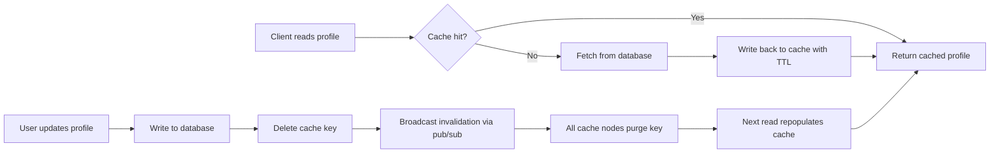

| Difficulty | Channel | Tags |
|---|---|---|
| beginner | backend | redis, memcached, cache-invalidation |

Back in 2005, Facebook bet its entire user experience on Memcached — and for years, it worked brilliantly. Then the social graph exploded past a billion users, and the simple look-aside cache that carried them so far began breaking in spectacular ways: popular keys triggered thundering herds that crushed the database, and stale profiles flickered across regions when writes lagged behind [1]. The fix wasn't more hardware — it was fundamentally smarter cache invalidation. This is the story of how Facebook survived its own cache, and what it means for the profile service you are building today.

---

> ### Real-World Case — Facebook (Meta)
>
> Facebook built its entire user experience on Memcached starting in 2005, but as the social graph grew past a billion users, its simple look-aside cache began breaking in spectacular ways. Popular keys (celebrity profiles, viral photos) caused thundering herds that hammered the database, server failures cascaded, and stale cached profiles appeared when writes lagged across regions.
>
> | | |
> |---|---|
> | **Challenge** | How to keep user profile and content caches consistent at massive scale: invalidating entries across thousands of Memcached servers when the underlying MySQL data changes, without collapsing under the resulting read load or serving stale profile data. |
> | **Solution** | Facebook invented a suite of coordinated cache-invalidation techniques. A daemon called McSqueal runs on each MySQL server, watches the commit log, extracts the affected cache keys, and broadcasts batched invalidation deletes to mcrouter proxies in every frontend cluster. To prevent thundering herds after a delete, they added 64-bit lease tokens so only one client can refill a key while others wait briefly, and they added 'gutter' pools of spare servers to absorb traffic when a Memcached node dies. Cross-region staleness was solved with remote markers that route reads for just-updated keys back to the master region. |
> | **Outcome** | Facebook's Memcached infrastructure now handles billions of requests per second holding trillions of items for over a billion users. Leases reduced the peak database query rate on hot keys from 17,000 req/s to 1,300 req/s (over 90% reduction), and McSqueal's batched invalidations improved packet efficiency 18x. UDP for reads and TCP for writes/deletes cut latency while preserving consistency. |
> | **Lesson** | Cache invalidation (deleting a key) looks trivial but is the hardest part of distributed caching: at scale, a delete can trigger a thundering herd, so you must pair invalidation with mechanisms like leases, gutters, and batching. Also, keep cache servers 'dumb' and push coordination logic (leases, routing, batching) into clients and sidecar daemons. |

---

## Hook — The Pager Is About to Go Off

It was 3 a.m. when the pager went off — and the alert had nothing to do with your code.

Picture this: your user profile service just launched, and traffic is finally pouring in. A celebrity with eight million followers updates their bio, and the next eight million profile views slam into your API. Sounds like a good problem to have — until the cache serves yesterday's bio for hours, the database melts under the load, and the pager lights up like a Christmas tree in the dark.

That moment — the gap between "the cache works" and "the cache works, until it doesn't" — is exactly where this story begins. Because here is the uncomfortable truth: caching is the easiest performance win in the backend world, and cache invalidation is the easiest way to sabotage an entire service. Every profile read served from stale data is a lie your system tells a real user.

The journey ahead mirrors what Facebook (Meta) lived through at global scale [1]: building a cache, watching it break, and learning the hard way how invalidation actually works. Sound familiar? Good. Grab a coffee.

## Problem — Caching Is Easy. Invalidation Is a Nightmare.

There is a famous joke — "there are only two hard things in computer science: cache invalidation and naming things." It is a joke. It is also not a joke.

At small scale, caching feels almost too easy. You slap Memcached or Redis in front of your profile database, watch p95 latency drop from 80 ms to 2 ms, and feel like a genius. Then the service starts handling real users, and three demons crawl out of the machine:

1. **Stale data.** A user updates their profile, but reads keep hitting the old cached copy. The update and the invalidation raced — and the invalidation lost.
2. **Thundering herds.** A popular profile's cache entry expires, and suddenly every concurrent read stampedes to the database at once. The cache that was supposed to save your database now attacks it.
3. **Distributed drift.** Your service runs on many nodes. Node A invalidates a key, but Node B still holds the stale copy. Now you have two truths about one user.

Many developers discover this the same way: not from a textbook, but from a 2 a.m. incident post-mortem. The core challenge is that invalidation has to be correct *and* fast *and* cheap — and the moment you optimize for one, you often sacrifice another.

Moreover, the choice of cache engine changes the whole game. Memcached and Redis look similar on the surface — both are in-memory key-value stores [2][3] — but they diverge sharply when you ask, "how do I invalidate this across every node?" That divergence is the heart of this article.

## Real-World Case — Facebook (Meta)

Facebook didn't read about these problems in a blog post. It lived them at planetary scale.

In 2005, Facebook bet its entire user experience on Memcached — a simple, threadless, in-memory key-value store [2]. For years, a look-aside cache pattern carried the load beautifully. But as the social graph grew past one billion users, the simple architecture began breaking in spectacular ways. Celebrity profiles and viral photos created super-popular keys, and when those keys expired, thundering herds of requests slammed the database. Server failures cascaded. And across regions, writes lagged so badly that users occasionally saw stale profiles — their own face looking a year older [1].

Here is the plot twist: Facebook did not abandon Memcached. It engineered the pain away with three surgical fixes [1]:

- **Leases.** Before a client can repopulate a hot key, it must acquire a lease token. This collapses concurrent stampedes into a single database query. Leases cut the peak database query rate on hot keys from **17,000 req/s to 1,300 req/s** — a reduction of more than 90%.
- **McSqueal.** Instead of every invalidation firing a separate packet, the team batched invalidations — improving packet efficiency by **18x**.
- **Protocol split.** Reads used UDP for speed; writes and deletes used TCP for reliability. Consistency was preserved without giving up latency.

Today, Facebook's Memcached infrastructure serves **billions of requests per second** and holds **trillions of items** for over a billion users [1]. The lesson is uncomfortable: the tool wasn't the problem. The invalidation strategy was. And the strategy that saved Facebook's cache is the same one you can apply to your profile service — starting with a decision you make before you write a single line of cache code: Redis or Memcached?

## Deep Dive — Write-Through, Cache-Aside, and the Redis vs Memcached Showdown

Building on the Facebook story, the first decision is which pattern describes your reads and writes. Every cache strategy boils down to two questions: what happens on a read, and what happens on a write? The two dominant answers are [4]:

- **Cache-aside (look-aside):** Reads check the cache first and fall back to the database on a miss; writes go straight to the database, and the cache entry is invalidated. It is simple, battle-tested, and what Facebook used for years [1]. The catch: between a write and the next read, the cache is empty — and popular keys are exposed to stampedes.
- **Write-through:** Writes go to the database *and* the cache together. The cache never holds data the database doesn't have. The trade-off: every write pays a latency cost, and if the cache write fails, you need a strategy that doesn't corrupt your write path.
- **Write-back:** Writes land in the cache first and are flushed to the database asynchronously. Great throughput. Terrifying consistency. Not the tool for profiles where a user should never see their bio vanish.

For a profile service, the strongest play is **write-through for writes and cache-aside for reads** — with a TTL of 5–30 minutes as the safety net that guarantees eventual consistency even when something goes wrong. The idea isn't new: HTTP caching has run on explicit freshness windows for decades, formalized in RFC 7234 [10] and explained thoroughly on MDN [9].

Now the fork in the road — Redis vs Memcached. They look like twins until you squint:

| Capability | Redis | Memcached |
|---|---|---|
| Data structures | Rich: hashes, sorted sets, streams [3] | Flat key-value only [2] |
| Persistence | Built-in snapshots / AOF | None (pure cache) [2] |
| Distributed invalidation | Pub/sub keyspace notifications [5] | Manual coordination across nodes |
| Eviction control | maxmemory policies, LRU/LFU tuning [6] | LRU, simpler knobs |
| Memory overhead | Higher per item | Lower per item [8] |
| Scaling | Clustered, more moving parts | Horizontal scaling is dead simple [8] |

For complex invalidation patterns and durability, Redis wins — you can subscribe to key expiry or deletion events and purge related entries automatically [5]. For a pure, fast, memory-efficient cache, Memcached wins — lower overhead and simpler horizontal scaling [8].

🔥 **Hot Take:** Choosing Memcached isn't a cop-out. Choosing Memcached *without* a plan for cross-node invalidation is. If your service runs on more than one node, you now own the coordination — CAS tokens and manual purges [7] — whether you want to or not.

## Workflow — The Invalidation Playbook, Step by Step

With the pattern chosen, the invalidation workflow becomes a repeatable playbook. Figure 1 shows the full journey a profile takes through your system:

Follow the steps in practice:

1. **Reads go cache-first (cache-aside).** Every profile read checks the cache. On a miss, fetch from the database and populate the cache with a TTL. This delivers the latency win you signed up for.
2. **Writes go database-first, then invalidate.** On a profile update, write to the database, delete the cache key, then write the fresh value. Deleting *before* writing closes the window where a reader could pick up stale data.
3. **Set a TTL as a parachute.** Even perfect invalidation can't cover process crashes or missed events. A 5–30 minute TTL guarantees the lie has a deadline.
4. **Broadcast invalidation (distributed systems).** With Redis, publish an invalidation event over pub/sub and have every node subscribe [5]. With Memcached, you implement the coordination yourself — this is exactly the manual work Facebook automated with McSqueal [1].
5. **Watch the dashboard.** Track cache hit rate, evictions, and p95 latency. A hit rate that slides downward is your early warning that an invalidation is too aggressive — or too absent.

⚠️ **Watch Out:** the order in step 2 is non-negotiable. Database first, then cache. Flip it, and a failed database write leaves your cache promoting fiction as fact.

## Code Example — Making It Real in Python

Here is where the strategy becomes code. A user profile service in Python, using the write-through + cache-aside hybrid that carried Facebook through the billion-user mark:

## Lessons Learned — Battle Scars From the Cache Wars

By now the story has come full circle — from a pager at 3 a.m. to Facebook's billion-user infrastructure [1]. The takeaways are short enough to write on a sticky note above your keyboard:

- **Invalidation is a feature, not a side effect.** Budget design time for it, or it will budget incident time for you.
- **Order matters: database, delete, then write.** The tiny window between delete and set is your insurance policy against stale reads.
- **TTL is your parachute, not your strategy.** Rely on explicit invalidation; treat expiry as a fallback, not a plan.
- **Distributed caches need coordination.** Redis gives it to you with pub/sub [5]; Memcached makes you earn it [7]. Neither is wrong — unaware is.
- **Monitor the lie.** Hit rate, evictions, and p95 are the instruments that tell you whether your cache is helping or lying. Facebook watches these numbers at a scale where every percentage point is a fleet of servers [1].

💡 **Insight:** The goal of invalidation is not zero stale reads. It is stale reads with a bounded lifetime and a graceful recovery path. Perfection is expensive; convergence is free.

The practical next step: audit one service you own today. Find the cache. Ask three questions — what happens on a write, how does a TTL save you, and who purges the stale key across every node? The answers will tell you exactly how close you are to the 3 a.m. pager.

---

## Write-Through Cache Invalidation Flow

<strong>Original Interview Question</strong>

**Q:** You're building a user profile service that caches frequently accessed profiles. How would you implement cache invalidation when a user updates their profile, and what trade-offs would you consider between Redis and Memcached?

**A:** Implement write-through caching with TTL-based expiration. On profile update, invalidate the cache by deleting the key and writing new data to both the database and cache. Redis offers pub/sub for automatic distributed invalidation, while Memcached requires manual coordination across nodes.

## Conclusion

The moral of this story isn't "use Redis" or "use Memcached" — it is that Facebook's near-death experience with its own cache came down to invalidation, not infrastructure [1]. Leases, batched invalidations, and a protocol split turned a failing cache into a machine serving billions of requests per second. Your profile service can skip the decade of pain: write through to the database, delete before you write, lean on a TTL, and — if you run more than one node — make the coordination explicit. Tomorrow, walk through the invalidation flow of the one cache you trust the most. If you can't explain it in five minutes, you've found your first bug.

---

## References

1. [Facebook (Meta) incident report](https://engineering.fb.com/2013/04/15/core-infra/scaling-memcache-at-facebook) — article
2. [Memcached — Wikipedia](https://en.wikipedia.org/wiki/Memcached) — documentation
3. [Redis — Wikipedia](https://en.wikipedia.org/wiki/Redis) — documentation
4. [AWS ElastiCache: Caching Strategies and Best Practices](https://docs.aws.amazon.com/AmazonElastiCache/latest/memcached/Strategies.html) — documentation
5. [Redis Keyspace Notifications (pub/sub invalidation)](https://redis.io/docs/latest/develop/guides/keyspace-notifications/) — documentation
6. [Redis Eviction Policies](https://redis.io/docs/latest/develop/reference/eviction/) — documentation
7. [memcached GitHub repository](https://github.com/memcached/memcached) — documentation
8. [Redis vs Memcached: Differences and Use Cases — DigitalOcean](https://www.digitalocean.com/community/tutorials/redis-vs-memcached) — documentation
9. [HTTP Caching — MDN Web Docs](https://developer.mozilla.org/en-US/docs/Web/HTTP/Caching) — documentation
10. [RFC 7234: Hypertext Transfer Protocol (HTTP/1.1): Caching](https://datatracker.ietf.org/doc/html/rfc7234) — documentation

---

**Author:** Satishkumar Dhule — [GitHub](https://github.com/satishkumar-dhule) · [LinkedIn](https://linkedin.com/in/satishkumar-dhule) · [Website](https://satishkumar-dhule.github.io)
