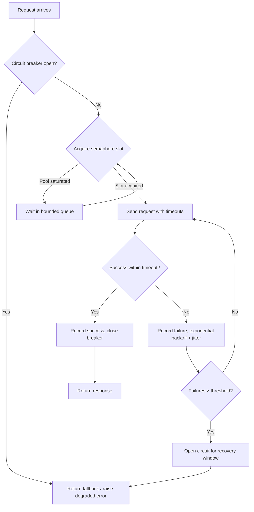

| Difficulty | Channel | Tags |
|---|---|---|
| advanced | backend | asyncio, aiohttp, concurrency |

By 2012, a single video-play request on Netflix's streaming API fanned out to dozens of internal services — recommendations, licensing, profiles, billing — and one of them did not need to fail to cause a catastrophe [1]. A dependency only has to be slow, not failing, to saturate a connection pool within seconds and drag an entire edge API down with it. When the recovery window passed, the symptom reversed and the outage cascaded across playback for millions of users. That nightmare is why resilience engineering exists — and it is the reason your aiohttp pool needs the same protection.

---

> ### Real-World Case — Netflix
>
> By 2012, a single video-play request on Netflix's streaming API fanned out to dozens of internal microservices (recommendations, licensing, profiles, billing). A dependency only needs to be 'slow, not failing' — during a production incident, one latent backend saturated the API's connection pool and thread pool within seconds, and when the recovery window passed the symptom reversed, cascading the failure across the whole edge API and degrading playback for users.
>
> | | |
> |---|---|
> | **Challenge** | Netflix's API depended on 30+ services with different teams, opaque client libraries, and changing performance characteristics. With each dependency having 99.99% uptime, the aggregate failure rate was still ~3% of user requests — and a single slow or misbehaving dependency could exhaust shared connection/thread pools, turning one incident into a company-wide streaming outage. |
> | **Solution** | Netflix built Hystrix, which wraps every dependency call in a command that combines exactly the patterns in this aiohttp pool manager: (1) a circuit breaker that trips when error rate exceeds ~50% over a rolling 10-second window, short-circuiting requests to the failing service and failing fast; (2) semaphore or per-dependency thread-pool isolation to limit concurrent connections/executions per service (bulkhead pattern); (3) per-command timeouts (default 1000ms); (4) fallbacks that serve cached/static data so the user gets graceful degradation instead of an error; and (5) a half-open recovery state that lets a single test request through after a sleep window before closing the circuit again. |
> | **Outcome** | Hystrix became the reference implementation for resilient connection management and graceful degradation. At peak, the Netflix API processed 10+ billion thread-isolated and 200+ billion semaphore-isolated Hystrix command executions per day, with each API instance running 40+ thread pools of 5–20 threads. During real dependency-failure incidents captured in their operations wiki, circuits tripped so most traffic short-circuited instantly (returning fallbacks) while unaffected circuits kept serving 200s — users received degraded-but-working responses instead of 500s, and the failing service got time to recover instead of being hammered into deeper failure. |
> | **Lesson** | Fail fast and shed load beats 'wait and propagate': a slow dependency holding connections is worse than a failed one. Semaphore/connection-pool limiting plus circuit breakers + fallbacks turns a cascading outage into a graceful degradation — and even the pool limit itself must be tuned, because if a semaphore-isolated dependency goes latent, the blocked caller threads can't walk away until the underlying HTTP timeout fires. |

---

## Hook — Slow dependencies are silent killers

Ever watched a request hang for 30 seconds while the service behind it quietly drowns? That is the moment every infrastructure team fears: not a clean crash, not an obvious outage, but a dependency that is merely slow. Slow eats connection pools. Slow eats thread pools. Slow eats your pager battery at 2am while a wall of 500s scrolls past. The stakes could not be higher — a single latent backend can take down an entire API in seconds, and by the time the alarms fire, the damage is already done. This article walks through exactly how that happens, how Netflix built the toolkit that became the industry standard for surviving it, and how you can build the same protection into your aiohttp stack.

## Problem — Why connection pools die under load

Connection pooling sounds mundane. You open a handful of sockets, reuse them, and move on. The trouble starts when demand outpaces supply. aiohttp keeps an internal pool of connections, and your application layers its own concurrency on top — so without explicit limits, a flood of traffic becomes a flood of open sockets [6]. Here is the part that surprises many developers: the failure is rarely in the pooling itself. It is in the queue. When every request grabs a connection and waits, and every one of those connections is stuck on a downstream service that will not answer, the pool fills up, new requests pile up behind it, and memory grows while throughput collapses [2]. The problem compounds with every service you touch, because a single slow dependency now owns a slice of every request's critical path. Sound familiar? It should — this is precisely the cascade Netflix hit in 2012 [1].

## Real-World Case — Netflix: slow beats down

Netflix's story begins with a deceptively small trigger: one backend that was slow, not down. During a production incident, a single latent service saturated the API's connection pool and thread pool within seconds, and when the recovery window passed, the failure reversed and rippled across the whole edge API — degrading playback for users who had done nothing wrong [1]. Netflix's response became the blueprint for modern resilience: Hystrix, a library that gave every dependency call its own thread pool or semaphore, a circuit breaker, and a fallback path [1]. The numbers are staggering. At peak, the Netflix API processed over 10 billion thread-isolated and 200 billion semaphore-isolated Hystrix command executions per day, with each API instance running more than 40 thread pools of 5–20 threads [1]. When real dependency failures struck, circuits tripped and most traffic short-circuited instantly, returning fallbacks, while unaffected circuits kept serving 200s — users got degraded-but-working responses instead of hard 500s, and the failing service finally got room to recover instead of being hammered into deeper failure [1]. That is the transformation graceful degradation buys: the outage stops being an outage.

## Deep Dive — The four pillars of graceful degradation

So what exactly makes a pool resilient? Four pillars hold the structure up, and skipping any one lets the whole thing collapse. First, explicit concurrency limits: a semaphore caps how many requests fly at once, so load flattens instead of exploding [3]. Second, timeouts everywhere: a connect timeout, a socket-read timeout, and a total timeout keep a dead socket from holding a slot hostage forever [4]. Third, retries with exponential backoff: retry fast failures immediately, then double the wait each time, so recovery does not become a thundering herd. Fourth, the circuit breaker: once failures cross a threshold, stop sending requests to that dependency entirely for a recovery window [1].

This leads to the plot twist most developers discover late: retries and circuit breakers are opposites that must be tuned together. Aggressive retries against a failing service is a distributed denial-of-service you are running against your own backend. The breaker exists to make the retry loop stop, so the backoff curve and the trip threshold have to be designed as one unit.

The original interview answer also mentions health checks and queue management, and both deserve attention. Health checks let you prune dead connections before a request ever waits on them. Queue management buffers overflow when the pool is saturated — but a bounded queue with fast-fail beats an unbounded queue every time, because unbounded queues are just leaked memory wearing a different name.

There is a real trade-off in how you isolate dependencies, and Hystrix made it famous: thread pools versus semaphores [1].

| Strategy | Thread pool isolation | Semaphore isolation |
|---|---|---|
| How it works | Each dependency gets its own threads; blocking one never starves others | A counter caps concurrent calls; overflow fails fast |
| Best for | Slow, blocking dependencies with timeouts you trust | Quick calls with tight timeouts; massive call volumes |
| Cost | A thread per in-flight call — expensive at scale | Nearly free — an atomic counter |
| Example | Third-party APIs, legacy HTTP services | High-throughput internal lookups |

Netflix ran both — 40+ thread pools plus semaphore paths — because the two solve different problems [1]. For aiohttp, an asyncio library with no threads in the hot path, the semaphore model maps naturally onto the event loop [2] and scales to the kinds of volumes Netflix saw [1].

## Workflow — The resilience pipeline: from request to fallback

Building on the design decisions above, here is the resilience pipeline that ties it together — a state machine every request walks through. The flowchart below, "Connection Pool Request Flow," shows the complete journey from arrival to fallback.

1. Arrival — a request enters the pool. First question: is the circuit breaker open?
2. Fail fast or queue — if the breaker is open, return a fallback immediately. Waiting is pointless.
3. Semaphore gate — if closed, acquire a slot; if the pool is saturated, wait in a bounded queue.
4. Send with timeouts — the request goes out with explicit connect, read, and total timeouts [4].
5. Success — record success, close the breaker if it was half-open, return the response.
6. Failure — record a failure, back off exponentially, and retry up to the configured limit [8].
7. Trip — once consecutive failures pass the threshold, open the breaker for a recovery window and start returning fallbacks [1].

This is the same pattern Netflix used: degrade, don't die. Most traffic short-circuits instantly, unaffected circuits keep serving 200s, and the failing service gets a quiet window to recover [1].

## Code Example — A production-shaped resilient pool

You have seen the theory and the pipeline; now it is time to make it concrete. The implementation below turns the original interview sketch into a production-shaped pool: a semaphore for concurrency, exponential backoff, a real circuit breaker, explicit timeouts, and clean shutdown — the five pieces that cover the common pitfalls from the interview answer. The design decision that matters most is where the semaphore sits. Many developers place it around individual requests, which serializes everything and kills throughput. Putting it at the pool boundary, with the connector's own limits underneath, lets the pool absorb bursts while the breaker protects the downstream service [3].

## Lessons Learned — What actually matters at 2am

After watching this pattern in production and studying the failure modes, here is what actually matters.

- Set timeouts you can defend. A request without a timeout is a connection leak wearing a trench coat. Measure your p95 and set sock_connect accordingly [4].
- Tune the retry budget and the circuit threshold together. If you retry five times with exponential backoff but never trip the breaker, you have built a five-armed hammer for your own foot [1].
- Prefer fail-fast to fail-later. A bounded queue with an immediate fallback beats an unbounded queue that quietly becomes a memory leak [2].
- Close everything. Missing session cleanup on shutdown is one of the most common pool bugs, and it leaks sockets one restart at a time [5].
- Degrade with intent. Decide ahead of time what a degraded response looks like — stale cache, partial data, a polite error — so the fallback path is a feature, not a panic [1].

⚠️ Watch Out — The thundering herd: when you retry with backoff, add jitter. Otherwise, a wave of synchronized retries will hit the recovering service like a stampede at the exact moment it starts breathing again [7].

🎯 Key Point — Circuit breakers are not about the requests you save; they are about the service you save. Stop hammering a struggling dependency and it will forgive you.

---

## Connection Pool Request Flow

<strong>Original Interview Question</strong>

**Q:** How would you implement a connection pool manager for aiohttp that handles graceful degradation under high load and connection timeouts?

**A:** Implement a connection pool manager for aiohttp using a semaphore to limit concurrent connections, exponential backoff for retrying failed requests, and circuit breaker pattern to gracefully degrade under high load and connection timeouts.

## Conclusion

Netflix learned the hard way that a dependency only needs to be slow to take down an entire edge API [1]. The countermeasure — semaphores, timeouts, exponential backoff, and circuit breakers — is not exotic infrastructure; it is a few dozen lines of Python on top of aiohttp. Tomorrow, start smaller than you think: add explicit timeouts to your session, wrap one dependency in a semaphore, and set a failure threshold. The goal is not a pool that never fails. It is a pool that fails softly — returning degraded-but-working responses while the struggling service gets the quiet window it needs to recover. When the 2am page finally goes off, you will want the fallback path already tested, the numbers already measured, and the circuit already drawn.

---

## References

1. [Netflix incident report](https://github.com/Netflix/Hystrix/wiki/How-it-Works) — article
2. [asyncio — Asynchronous I/O in Python](https://docs.python.org/3/library/asyncio.html) — documentation
3. [asyncio synchronization primitives (Semaphore)](https://docs.python.org/3/library/asyncio-sync.html) — documentation
4. [asyncio task timeouts](https://docs.python.org/3/library/asyncio-task.html) — documentation
5. [aiohttp ClientSession quickstart](https://docs.aiohttp.org/en/stable/client_quickstart.html) — documentation
6. [aiohttp advanced client usage (timeouts, limits)](https://docs.aiohttp.org/en/stable/client_advanced.html) — documentation
7. [RFC 9110 — HTTP Semantics](https://datatracker.ietf.org/doc/html/rfc9110) — documentation
8. [DigitalOcean — Async programming in Python with asyncio](https://www.digitalocean.com/community/tutorials/how-to-do-async-programming-in-python-using-the-asyncio-package) — blog

---

**Author:** Satishkumar Dhule — [GitHub](https://github.com/satishkumar-dhule) · [LinkedIn](https://linkedin.com/in/satishkumar-dhule) · [Website](https://satishkumar-dhule.github.io)
