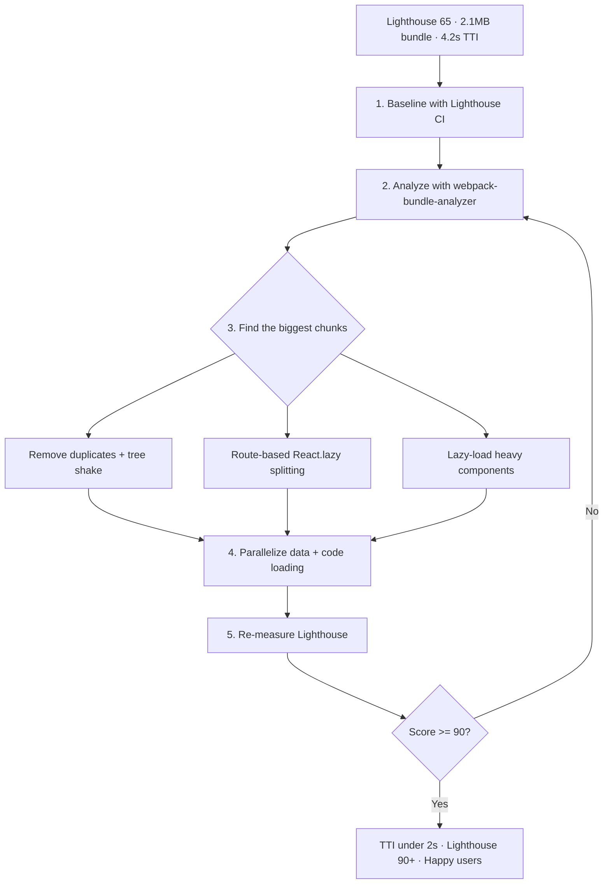

| Difficulty | Channel | Tags |
|---|---|---|
| intermediate | frontend | lighthouse, bundle, lazy-loading |

Shopify's Admin serves 67 million daily page views, yet merchants were staring at a sequential "code first, then data" waterfall that made every click feel like a dial-up relic [1]. The fix wasn't more servers—it was rethinking how code and data reach the browser. The same principle that cut Shopify's perceived load times by 30% applies to the React app on your desk, sitting at a Lighthouse score of 65 with a 2.1MB bundle and a 4.2-second Time to Interactive [1]. Here's how to climb from 65 to 90+, one split chunk at a time.

---

> ### Real-World Case — Shopify
>
> Shopify's Admin (admin.shopify.com) is one of the largest React single-page apps in the world, supporting 67 million daily page views and 101 teams shipping ~350 pull requests daily into a single codebase that ballooned to 3.18 million lines of TypeScript. Merchants suffered from inconsistent loading states, duplicate data requests, and slow page loads caused by a monolithic runtime `getRoutes.tsx` file and a sequential 'code first, then data' waterfall.
>
> | | |
> |---|---|
> | **Challenge** | Reduce page load times in a React app where the component bundle for a single route (the Product Index) was 914KB, but developers couldn't easily fix it because routes were defined in unwieldy runtime files, teams built divergent loading patterns, and several systems (Search, Sidekick) each kept their own 'source of truth' for routes. |
> | **Solution** | Replaced the runtime route tree with statically-known, typed route manifests co-located with component code and auto-globbed by Vite, enabling true route-based code splitting across all 1,017 routes. Migrated to Remix loaders so a tiny loader file (just 3.2KB for Product Index) is fetched first and data loading begins immediately, while the heavy 914KB component bundle loads in parallel. Used browser-idle time to prefetch just the small loaders (not component bundles) to warm the Apollo cache, plus persistent IndexedDB caching so frequently-visited pages render instantly. |
> | **Outcome** | 30% improvement in perceived load times for the Admin; route metadata for all 1,017 routes is now statically known; data fetching no longer waits on component code (3.2KB loader runs in parallel with a 914KB bundle); prefetched/persisted pages render immediately on navigation. |
> | **Lesson** | The biggest win isn't just code splitting — it's splitting data loading from code loading. By shipping tiny loader files in parallel with lazy-loaded component bundles and prefetching them during idle time, you eliminate the waterfall where data waits for code, which is what actually dominates perceived performance in a large React app. |

---

## Hook — Four seconds of silence and the cost of a slow bundle

The deploy looked fine. Every pull request passed, every test was green—and then a merchant tapped "View Orders" and stared at a spinner for four agonizing seconds. Sound familiar? That four seconds is Time to Interactive, and when a React bundle weighs 2.1MB, you are not shipping an app; you are shipping a very slow download that happens to render a UI. The stakes run deeper than a vanity metric: Lighthouse exists because real users abandon apps that feel sluggish, and 90+ is the bar teams chase to win that trust back [8]. This is the story of how one of the largest React codebases in existence escaped its own weight—and how you can drag your 2.1MB bundle up the same mountain.

## Problem — The silent bloat that hides behind green tests

Here is the uncomfortable truth about most React applications: the bundle grows one dependency at a time, and nobody notices until Lighthouse runs the numbers. A 2.1MB JavaScript payload means the browser must download, parse, and execute every byte before the first meaningful interaction can happen [8]. With Time to Interactive stuck at 4.2 seconds, users experience what engineers call a waterfall—a chain of sequential requests where component code must arrive before data can even be requested, and data must arrive before the UI renders. The cruelest part? Every route in your app pays the price for the heaviest route. Consequently, a dashboard you rarely visit taxes the login screen, and an analytics chart seen twice a month inflates the critical path for everyone [5]. What makes this insidious is that it is invisible day to day: teams measure feature velocity and test coverage, never bytes shipped, so the bundle bloats silently until a performance review forces the issue.

## Real-World Case — Shopify

No team has fought this battle at a more brutal scale than Shopify, whose Admin—admin.shopify.com—is one of the largest React single-page apps on the planet. The numbers are staggering: 3.18 million lines of TypeScript, 1,017 routes, and 101 teams shipping roughly 350 pull requests per day into a single codebase [1]. Merchants suffered from inconsistent loading states, duplicate data requests, and slow page loads, all rooted in a monolithic runtime file called getRoutes.tsx and a sequential "code first, then data" waterfall [1]. Here is the plot twist: the fix was not a smaller bundle. Shopify decoupled route metadata from component code so the browser could know what a route needed before any of it arrived. A tiny 3.2KB loader now fetches route data in parallel with a 914KB bundle, and prefetched, persisted pages render immediately on navigation [1]. The result was a 30% improvement in perceived load times, and all 1,017 routes now have statically known metadata [1]. That, in one paragraph, is the difference between optimizing what you ship and rethinking how you ship it.

## Deep Dive — Code splitting, tree shaking, and the trade-offs most guides skip

Building on Shopify's example, the winning playbook is a disciplined application of three techniques you can apply at any scale. First, code splitting breaks one giant bundle into many smaller chunks that load on demand [5]. Second, tree shaking eliminates unused exports at build time—but it only works when your modules use ES module syntax, because CommonJS imports defeat it entirely [4]. Third, route-based splitting ensures the user pays only for the code of the page they are visiting, not the entire application [2]. But here is the trap most developers walk straight into: they split everything, and performance gets worse. Every React.lazy call adds a network round trip, so an eager 800KB bundle can outperform ten lazy chunks that each need their own request [3]. The real skill is knowing what to load eagerly—shell, navigation, critical content—versus what to defer: charts, editors, rarely used admin panels [7]. Moreover, Shopify surfaced a second enemy hiding behind bundle size: the data waterfall. Even a perfectly split bundle still waits for component code before firing data requests [1]. Parallelizing a lightweight loader with the heavy chunk is worth more than shaving kilobytes, because the critical path shrinks in time, not just bytes. Here is the honest comparison most guides skip:

| Strategy | What it costs | What it buys you | Best when |
|---|---|---|---|
| Route-level splitting | One extra request per route | Users load only the page they visit | Multi-page dashboards |
| Component-level splitting | Extra round trips if overused | Heavy widgets don't block first paint | One heavy widget per screen |
| Eager bundle + preload | Larger initial parse | Fewer network round trips | Small apps, fast connections |
| Data/code parallelism | Requires an architecture change | Biggest perceived speedup | Apps with slow APIs |

That last row is the one to circle. 🎯 Key Point: When you optimize the waterfall instead of just the bytes, perceived load time improves out of proportion to the megabytes you remove [1].

## Workflow — Seven steps from 65 to 90+, measured at every turn

The Deep Dive gave you the levers; now here is the exact workflow that moves a score from 65 to 90+, with every step grounded in measurement. This is the sequence Shopify's engineers effectively followed, distilled for a codebase of any size.

Step 1 — Baseline it. Run Lighthouse on your slowest representative route and record the score. Better yet, wire it into CI with Lighthouse CI so any regression fails the build [8].
Step 2 — Analyze, don't guess. Generate a webpack-bundle-analyzer report and find the largest chunks. Nine times out of ten, the offenders are a charting library, a date library, or a UI kit [3].
Step 3 — Hunt duplicates. Two copies of the same utility, or a legacy library sitting next to its modern replacement, is free weight. Consolidating can drop hundreds of kilobytes without touching a single feature.
Step 4 — Split by route. Wrap each route in React.lazy, add a Suspense fallback, and measure again. Using webpack's dynamic import syntax makes each page its own independently cached chunk [6].
Step 5 — Defer the heavy hitters. Push charting and other rare components into named chunks so you can track them in the analyzer [3].
Step 6 — Enable tree shaking. Verify your build uses ES modules and dead-code elimination, then guard against CommonJS sneaking back in [4].
Step 7 — Re-measure and loop. If you are not at 90+, return to analysis. The Bundle Optimization Workflow diagram below shows this feedback loop—the same loop Shopify ran at planetary scale, and the one that keeps scores from decaying.

## Code Example — Lazy loading done right, with error boundaries

Now the practical payoff. The snippet below is the production pattern that combines route-based splitting, Suspense fallbacks, and an error boundary so a failed chunk download never renders a white screen [2][7][9]. Notice what is deliberately missing: no lazy loading for tiny components, no Suspense wrapping the entire app, and every heavy chunk carries a named webpack chunk so it shows up legibly in your bundle report.

## Lessons Learned — Battle scars, pro tips, and what to do differently tomorrow

If the journey feels familiar, here are the battle scars worth remembering. First, measure before you optimize: a Lighthouse score without CI enforcement drifts back to mediocrity within weeks, because every dependency addition nudges it down one silent point at a time [8]. Second, split by value, not by volume: lazy loading a 4KB component to feel productive just adds a network request that costs more than it saves [3]. Third, attack the waterfall before the megabytes: Shopify's biggest win came from running a 3.2KB loader in parallel with a 914KB bundle, not from shrinking the bundle itself [1]. 💡 Insight: Performance is a process, not a patch. The teams that sustain 90+ scores bake measurement into CI and review bundle diffs in every pull request [8]. ⚠️ Watch Out: React.lazy without an error boundary is a single network hiccup away from crashing the app—ship the boundary before you ship the lazy import [7]. The version you can act on tomorrow: pick your heaviest route, open webpack-bundle-analyzer, and split the single worst offender [3]. Then enforce the score with Lighthouse CI before anyone adds another dependency. Consider a service worker to cache your chunks so repeat visits skip the network entirely [10]—and watch TTI collapse on the second load. That is how a 65 becomes a 90+ and stays there.

---

## Bundle Optimization Workflow

<strong>Original Interview Question</strong>

**Q:** You're tasked with improving a React app's Lighthouse performance score from 65 to 90+. The bundle size is 2.1MB and Time to Interactive is 4.2s. What specific steps would you take to optimize the bundle and implement lazy loading?

**A:** Implement code splitting with React.lazy() and Suspense, analyze bundle composition with webpack-bundle-analyzer to identify largest chunks, remove unused dependencies and optimize imports, add dynamic imports for heavy components and third-party libraries, implement route-based splitting for better initial load times, and utilize tree shaking with proper ES module configuration.

## Conclusion

Back at that merchant and the four-second spinner: Shopify proved the download was never the real enemy—the order of operations was [1]. When code and data travel in parallel, pages appear instantly, and a 90+ Lighthouse score stops being a benchmark and becomes a user experience you can feel. The hero of this story is not Shopify's scale; it is the boring, repeatable discipline of measuring, splitting, and verifying. And here is the satisfying part: that same discipline works on your 2.1MB bundle just as it worked on 3.18 million lines of TypeScript [1]. Run the analyzer today, split your heaviest route tomorrow, and let the number do the talking.

---

## References

1. [Shopify incident report](https://shopify.engineering/remixing-admin) — article
2. [React lazy reference](https://react.dev/reference/react/lazy) — documentation
3. [webpack-bundle-analyzer](https://github.com/webpack-contrib/webpack-bundle-analyzer) — documentation
4. [Tree shaking glossary](https://developer.mozilla.org/en-US/docs/Glossary/Tree_shaking) — documentation
5. [Code splitting glossary](https://developer.mozilla.org/en-US/docs/Glossary/Code_splitting) — documentation
6. [Webpack code splitting guide](https://webpack.js.org/guides/code-splitting/) — documentation
7. [Lazy loading web performance](https://developer.mozilla.org/en-US/docs/Web/Performance/Lazy_loading) — documentation
8. [Lighthouse performance audits](https://developer.chrome.com/docs/lighthouse/performance/) — documentation
9. [React Suspense reference](https://react.dev/reference/react/Suspense) — documentation
10. [Service Worker API](https://developer.mozilla.org/en-US/docs/Web/API/Service_Worker_API) — documentation

---

**Author:** Satishkumar Dhule — [GitHub](https://github.com/satishkumar-dhule) · [LinkedIn](https://linkedin.com/in/satishkumar-dhule) · [Website](https://satishkumar-dhule.github.io)
